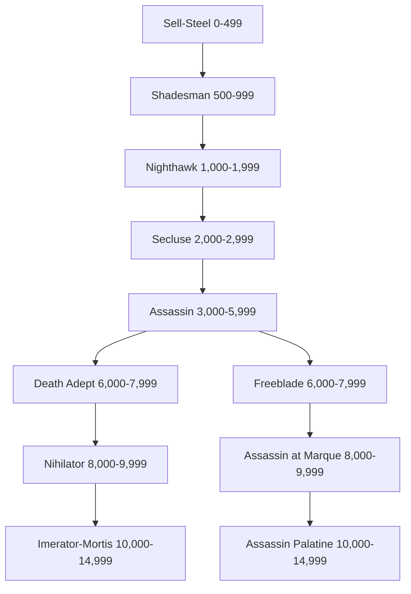

*"When I kill, it is beautiful—an art form older than any painting or sculpture."*

— Lyra Trix, Malfian Noble House Assassin.

In the Imperium assassination is a valued tool and it is used by all, from the agencies of the Adepta down to petty crime lords of the underhives—a professional killer is always in demand. Such individuals can range from freelancers, who are self-taught, to members of Assassin Orders and Guilds.

Assassins come in all shapes and guises, and it is often the person a potential target least expects that is their killer. These can range from unsubtle brutes, who will crush every bone in the target's body, to mundane-looking everymen who practise the use of potions and poisons, and are able to slip a deadly concoction into the unsuspecting target's next meal.

There are many Orders, Guilds and Death Cults that thrive in the Imperium. Though there will be an element of penitence to the Emperor, in the duties they perform the Orders are either a functioning off-shoot of some monolithic Adepta or may even have a commercial interest, so some sort funding or tithe would be required to gain their services. Unbeknownst to even the aspirants that belong to these semilegal organisations and cults most, if not all, are fronts for the Assassin Temples that form the highly secretive Officio Assassinorum, for this is where the Temple Masters recruit and induct the most promising individuals.

The Assassins of such Orders are highly trained killers capable of feats far and above that of mere humans. Whether a Death Cultist or member of an Assassin Order, they are experts in exotic weaponry but they also have intimate knowledge of other lethal crafts, such as the use of poisons and the creation of fatal booby traps. The methods, demeanour and personality of an Assassin can vary as much as there are ways to kill, though this will be heavily influenced by the teachings and training, be it from a Death Cult or Order.

If an Assassin survives long enough into his career and his superiors deem him worthy, he will be unknowingly tested. The trials are likely extremely lethal, and so those who are found lacking are unlikely to survive. The few who do successfully make it through the trials become initiates in one of the Assassin Temples, although the Assassin is unaware of this even at this stage, such is the secrecy surrounding the Officio Assassinorum.

| Table 2-4: Assassin Characteristic Advances |        |              |         |        |  |
|---------------------------------------------|--------|--------------|---------|--------|--|
| Characteristic                              | Simple | Intermediate | Trained | Expert |  |
| Weapon Skill                                | 100    | 250          | 500     | 750    |  |
| Ballistic Skill                             | 100    | 250          | 500     | 750    |  |
| Strength                                    | 500    | 750          | 1,000   | 2,500  |  |
| Toughness                                   | 250    | 500          | 750     | 1,000  |  |
| Agility                                     | 100    | 250          | 500     | 500    |  |
| Intelligence                                | 250    | 500          | 750     | 1,000  |  |
| Perception                                  | 250    | 500          | 750     | 1,000  |  |
| Willpower                                   | 250    | 500          | 750     | 1,000  |  |
| Fellowship                                  | 500    | 750          | 1,000   | 2,500  |  |
|                                             |        |              |         |        |  |

#### **Sell - Steel Advances**

*"Two in the head makes sure they're dead."*

The Imperium is rife with killers, men and women who promise murder for a fee. Some even have the skills to deliver.

| Advance                                                     | Cost     | Type     | Prerequisites |
|-------------------------------------------------------------|----------|----------|---------------|
| Climb                                                       | 100      | S        | —             |
| Drive (Ground Vehicle)                                      | 100      | S        | —             |
| Inquiry                                                     | 100      | S        | —             |
| Pilot (Civilian Craft)                                      | 100      | S        | —             |
| Silent Move                                                 | 100      | S        | —             |
| Swim                                                        | 100      | S        | —             |
| Basic Weapon Training (Las)                                 | 100      | T        | —             |
| Basic Weapon Training (Primitive)                           | 100      | T        | —             |
| Basic Weapon Training (SP)                                  | 100      | T        | —             |
| Catfall                                                     | 100      | T        | Ag 30         |
| Heightened Senses (Sight)                                   | 100      | T        | —             |
| Pistol Training (Las)                                       | 100      | T        | —             |
| Pistol Training (Primitive)                                 | 100      | T        | —             |
| Pistol Training (SP)                                        | 100      | T        | —             |
| Sound Constitution†                                     | 100      | T        | —             |
| Thrown Weapon Training (Primitive)                          | 100      | T        | —             |
| Literacy                                                    | 200      | S        | —             |
| †You may take this Talent up to two times at this Rank. |          |          |               |

#### **Shadesman Advances**

*"Killed 'em all with a single round: no waste, no fuss, then melted back into the shadows like he was never there."*

Shadesmen are talented mur derers whose skills extend beyond those of mere killers. They seek to turn their kill ing into an art form, honing their bloodletting skills and turning their minds to a pas sionless pursuit of death.

| Advance                         | Cost     | Type     | Prerequisites               |
|---------------------------------|----------|----------|-----------------------------|
| Acrobatics                      | 100      | S        | —                           |
| Ciphers (Acolyte)               | 100      | S        | —                           |
| Common Lore (Underworld)        | 100      | S        | —                           |
| Drive (Ground Vehicle) +10      | 100      | S        | Drive (Ground Vehicle)      |
| Drive (Hover Vehicle)           | 100      | S        | —                           |
| Navigation (Surface)            | 100      | S        | —                           |
| Pilot (Civilian Craft) +10      | 100      | S        | Pilot (Civilian Craft)      |
| Security                        | 100      | S        | —                           |
| Shadowing                       | 100      | S        | —                           |
| Swim +10                        | 100      | S        | Swim                    |
| Tracking                        | 100      | S        | —                           |
| Heightened Senses (Hearing)     | 100      | T        | —                           |
| Berserk Charge                  | 100      | T        | —                           |
| Furious Assault                 | 100      | T        | WS 35                       |
| Sound Constitution              | 100      | T        | —                           |
| Speak Language (Low Gothic) +10 | 200      | S        | Speak Language (Low Gothic) |
| Wrangling                       | 200      | S        | —                           |
| Sprint                          | 200      | T        | —                           |
| Sure Strike                     | 200      | T        | WS 30                       |

# **Nighthawk Advances**

*"Never seen the sun, nor mercy neither. Figure a murderer like her ain't got much need for either."*

Many cultures fear the night, and these killers are just one of the reasons why. Striking from darkness, with maximum effect, the Nighthawk leaves behind not only death, but fear also.

| Advance                          | Cost | Type | Prerequisites              |
|----------------------------------|------|------|----------------------------|
| Chem-Use                         | 100  | S    | —                          |
| Ciphers (War Cant)               | 100  | S    | —                          |
| Climb +10                        | 100  | S    | Climb                      |
| Common Lore (Imperial Creed)     | 100  | S    | —                          |
| Common Lore (Underworld) +10     | 100  | S    | Common Lore (Underworld)   |
| Common Lore (War)                | 100  | S    | —                          |
| Concealment                      | 100  | S    | —                          |
| Dodge +10                        | 100  | S    | Dodge                      |
| Drive (Ground Vehicle) +20       | 100  | S    | Drive (Ground Vehicle) +10 |
| Pilot (Civilian Craft) +20       | 100  | S    | Pilot (Civilian Craft) +10 |
| Secret Tongue (Acolyte)          | 100  | S    | —                          |
| Silent Move +10                  | 100  | S    | Silent Move                |
| Swim +20                         | 100  | S    | Swim +10                   |
| Crack Shot                       | 100  | T    | BS 40                      |
| Heightened Senses (Smell)        | 100  | T    | —                          |
| Jaded                            | 100  | T    | WP 30                      |
| Pistol Training (Flame)          | 100  | T    | —                          |
| Rapid Reload                     | 100  | T    | —                          |
| Sleight of Hand                  | 200  | S    | —                          |
| Survival                         | 200  | S    | —                          |
| Basic Weapon Training (Flame)    | 200  | T    | —                          |
| Basic Weapon Training (Launcher) | 200  | T    | —                          |
| Heavy Weapon Training (SP)       | 200  | T    | —                          |
| Melee Weapon Training (Shock)    | 200  | T    | —                          |
| Mighty Shot                      | 200  | T    | BS 40                      |
| Sound Constitution               | 200  | T    | —                          |
| Swift Attack                     | 200  | T    | WS 35                      |
| Two-Weapon Wielder (Ballistic)   | 200  | T    | BS 35, Ag 35               |
| Two-Weapon Wielder (Melee)       | 200  | T    | WS 35, Ag 35               |

# **Secluse Advances**

*"We didn't even know he was there until the screams started, of course by then it was far too late…"*

Accustomed to working alone, the Secluse is skilled at infiltration and stealth, able to go where others can't and willing to do what others won't.

| Advance                                | Cost | Type | Prerequisites                         |
|----------------------------------------|------|------|---------------------------------------|
| Acrobatics +10                         | 100  | S    | Acrobatics                            |
| Awareness +10                          | 100  | S    | Awareness                             |
| Chem-Use +10                           | 100  | S    | Chem-Use                              |
| Ciphers (War Cant) +10                 | 100  | S    | Ciphers (War Cant)                    |
| Common Lore (Underworld) +20           | 100  | S    | Common Lore (Underworld) +10          |
| Drive (Hover Vehicle) +10              | 100  | S    | Drive (Hover Vehicle)                 |
| Inquiry +10                            | 100  | S    | Inquiry                               |
| Scholastic Lore (Imperial Creed)       | 100  | S    | —                                     |
| Scrutiny                               | 100  | S    | —                                     |
| Search                                 | 100  | S    | —                                     |
| Security +10                           | 100  | S    | Security                              |
| Tracking +10                           | 100  | S    | Tracking                              |
| Basic Weapon Training (Bolt)           | 100  | T    | —                                     |
| Heightened Senses (Taste)              | 100  | T    | —                                     |
| Lightning Reflexes                     | 100  | T    | —                                     |
| Melee Weapon Training (Chain)          | 100  | T    | —                                     |
| Pistol Training (Bolt)                 | 100  | T    | —                                     |
| Quick Draw                             | 100  | T    | —                                     |
| Common Lore (Ecclesiarchy)             | 200  | S    | —                                     |
| Lip Reading                            | 200  | S    | —                                     |
| Speak Language (High Gothic)           | 200  | S    | —                                     |
| Tech-Use                               | 200  | S    | —                                     |
| Deadeye Shot                           | 200  | T    | BS 30                                 |
| Dual Shot                              | 200  | T    | Ag 40, Two-Weapon Wielder (Ballistic) |
| Exotic Weapon Training (Needle Pistol) | 200  | T    | —                                     |
| Exotic Weapon Training (Web Pistol)    | 200  | T    | —                                     |
| Heavy Weapon Training (Flame)          | 200  | T    | —                                     |
| Hip Shooting                           | 200  | T    | BS 40, Ag 40                          |
| Sound Constitution                     | 200  | T    | —                                     |
| Thrown Weapon Training (Shock)         | 200  | T    | —                                     |

# **Assassin Advances**

*"I think Lord Varcus needs to be reminded of his place; perhaps it is time he was introduced to our mutual friend."*

Assassination is a constant throughout the Imperium and an accepted political tool on countless worlds. The absolute rule of many planetary governors is often enforced at the tip of an assassin's blade.

| Advance                               | Cost     | Type     | Prerequisites                            |
|---------------------------------------|----------|----------|------------------------------------------|
| Contortionist                         | 100      | S        | —                                        |
| Disguise                              | 100      | S        | —                                        |
| Dodge +20                             | 100      | S        | Dodge +10                                |
| Inquiry +20                           | 100      | S        | Inquiry +10                              |
| Interrogation                         | 100      | S        | —                                        |
| Intimidate                            | 100      | S        | —                                        |
| Search +10                            | 100      | S        | Search                                   |
| Ciphers (Acolyte) +10                 | 100      | S        | Ciphers (Acolyte)                        |
| Security +20                          | 100      | S        | Security +10                             |
| Shadowing +10                         | 100      | S        | Shadowing                                |
| Tracking +20                          | 100      | S        | Tracking +10                             |
| Heightened Senses (Touch)             | 100      | T        | —                                        |
| Leap Up                               | 100      | T        | Ag 30                                    |
| Melee Weapon Training (Power)         | 100      | T        | —                                        |
| Rapid Reaction                        | 100      | T        | Ag 40                                    |
| Chem-Use +20                          | 200      | S        | Chem-Use +10                             |
| Ciphers (Underworld)                  | 200      | S        | —                                        |
| Medicae                               | 200      | S        | —                                        |
| Scholastic Lore (Chymistry)           | 200      | S        | —                                        |
| Scholastic Lore (Heraldry)            | 200      | S        | —                                        |
| Tech-Use +10                          | 200      | S        | Tech-Use                                 |
| Wrangling +10                         | 200      | S        | Wrangling                                |
| Lightning Attack                      | 200      | T        | Swift Attack                             |
| Marksman                              | 200      | T        | BS 35                                    |
| Sound Constitution                    | 200      | T        | —                                        |
| Thrown Weapon Training (Chain)        | 200      | T        | —                                        |
| Basic Weapon Training (Plasma)        | 200      | T        | —                                        |
| Blademaster                           | 200      | T        | WS 30, Melee Weapon Training (Primitive) |
| Exotic Weapon Training (Needle Rifle) | 200      | T        | —                                        |
| Exotic Weapon Training (Webber)       | 200      | T        | —                                        |
| Heavy Weapon Training (Launcher)      | 200      | T        | —                                        |
| Heavy Weapon Training (Primitive)     | 200      | T        | —                                        |
| Pistol Training (Plasma)              | 200      | T        | —                                        |
| Sharpshooter                          | 200      | T        | BS 40, Deadeye Shot                      |

#### **Death Adept Advances**

*"Your screams are as music, and your blood is as wine to me."*

The Death Adept pursues killing as an art form, training themselves into a perfection of martial grace and death. Many Death Adepts no longer kill for money or on the whim of their masters, but rather to indulge in the purity of death itself.

| Advance                      | Cost | Type | Prerequisites                     |
| ---------------------------- | ---- | ---- | --------------------------------- |
| Ciphers (War Cant) +20       | 100  | S    | Ciphers (War Cant) +10            |
| Climb +20                    | 100  | S    | Climb +10                         |
| Concealment +10              | 100  | S    | Concealment                       |
| Contortionist +10            | 100  | S    | Contortionist                     |
| Drive (Walker)               | 100  | S    | —                                 |
| Intimidate +10               | 100  | S    | Intimidate                        |
| Silent Move +20              | 100  | S    | Silent Move +10                   |
| Survival +10                 | 100  | S    | Survival                          |
| Assassin Strike              | 100  | T    | Ag 40, Acrobatics                 |
| Double Team                  | 100  | T    | —                                 |
| Blind Fighting               | 200  | T    | Per 30                            |
| Counter Attack               | 200  | T    | WS 40                             |
| Dual Strike                  | 200  | T    | Ag 40, Two-Weapon Wielder (Melee) |
| Frenzy                       | 200  | T    | —                                 |
| Heavy Weapon Training (Bolt) | 200  | T    | —                                 |
| Heavy Weapon Training (Las)  | 200  | T    | —                                 |
| Nerves of Steel              | 200  | T    | —                                 |
| Pistol Training (Melta)      | 200  | T    | —                                 |
| Sound Constitution           | 200  | T    | —                                 |
| Step Aside                   | 200  | T    | Ag 40, Dodge                      |

# **Freeblade Advances**

*"I thought it was Ferstin coming to relieve us, at least until he shot Jyanus in the face. Turned out Ferstin had been dead for days."*

A Freeblade is an infiltrator, skilled in disguise and deception. His tactics include confusing his enemies and leaving them jumping at shadows while he closes in for the kill.

# **Nihilator Advances**

*"He killed and killed and killed, and all the time the bastard had that blood-soaked grin on his face."*

A Nihilator takes the philosophy of the Death Adept a step further, embracing the act of murder, the almost religious moment when they wrest the life from their victims. Only the extinguishing of another's life fills the Nihilator with purpose, stirring his spirit and touching his soul.

# **Imperator-Mortis Advances**

*"I am death incarnate."*

The Imperator-Mortis is an embodiment of graceful slaughter, an angel of death with few peers.

| Advance                     | Cost | Type | Prerequisites           |
| --------------------------- | ---- | ---- | ----------------------- |
| Disguise +10                | 100  | S    | Disguise                |
| Light Sleeper               | 100  | T    | Per 30                  |
| Resistance (Poisons)        | 100  | T    | —                       |
| Blather                     | 200  | S    | —                       |
| Charm                       | 200  | S    | —                       |
| Deceive                     | 200  | S    | —                       |
| Demolition                  | 200  | S    | —                       |
| Scrutiny +10                | 200  | S    | Scrutiny                |
| Secret Tongue (Acolyte) +10 | 200  | S    | Secret Tongue (Acolyte) |
| Talented (Charm)            | 200  | T    | Charm                   |
| Talented (Inquiry)          | 200  | T    | Inquiry                 |
| Talented (Shadowing)        | 200  | T    | Shadowing               |
| Gamble                      | 300  | S    | —                       |
| Ciphers (Secret Society)    | 300  | S    | —                       |
| Peer (Underworld)           | 300  | T    | Fel 30                  |
| Sound Constitution          | 300  | T    | —                       |

| Advance                        | Cost | Type | Prerequisites          |
|--------------------------------|------|------|------------------------|
| Awareness +20                  | 100  | S    | Awareness +10          |
| Contortionist +20              | 100  | S    | Contortionist +10      |
| Shadowing +20                  | 100  | S    | Shadowing +10          |
| Survival +20                   | 100  | S    | Survival +10           |
| Pilot (Military Craft)         | 100  | S    | Pilot (Civilian Craft) |
| Disarm                         | 100  | T    | Ag 30                  |
| Combat Master                  | 200  | T    | WS 30                  |
| Crippling Strike               | 200  | T    | WS 50                  |
| Hard Target                    | 200  | T    | Ag 40                  |
| Precise Blow                   | 200  | T    | WS 40, Sure Strike     |
| Heavy Weapon Training (Melta)  | 200  | T    | —                      |
| Heavy Weapon Training (Plasma) | 200  | T    | —                      |
| Sound Constitution             | 200  | T    | —                      |
| Thrown Weapon Training (Power) | 200  | T    | —                      |

| Advance                    | Cost | Type | Prerequisites                          |
|----------------------------|------|------|----------------------------------------|
| Acrobatics +20             | 100  | S    | Acrobatics +10                         |
| Concealment +20            | 100  | S    | Concealment +10                        |
| Intimidate +20             | 100  | S    | Intimidate +10                         |
| Pilot (Military Craft) +10 | 200  | S    | Pilot (Military Craft)                 |
| Sleight of Hand +10        | 200  | S    | Sleight of Hand                        |
| Battle Rage                | 200  | T    | Frenzy                                 |
| Deflect Shot               | 200  | T    | Ag 50                                  |
| Sound Constitution         | 200  | T    | —                                      |
| Wall of Steel              | 200  | T    | Ag 35                                  |
| Arms Master                | 300  | T    | BS 30, Basic Weapon Training (any two) |
| Fearless                   | 300  | T    | —                                      |

#### **Assassin at Marque Advances**

*"Don't let her finery fool you. She looks like a delicate lady of the high house but for enough coin she'd have your heart on that dainty little fork she's holding."*

Assassins at Marque move among the upper echelons of Imperial society, taking contracts and settling dis putes between power groups. They work both in and out of the shadows, equally at home in the ballrooms of the high spires as they are in the hab gutters.

# **Assassin Palatine Advances**

*"He is the master, the lord, the very god of assassins. When he says kill, you'd damn well better."*

Where there are assassins, so too is there the Assassin Palatine. Often in control of vast guilds of killers, Assassins Palatine are both charismatic leaders and cold-blooded killers.

| Advance                  | Cost     | Type     | Prerequisites                         |
|--------------------------|----------|----------|---------------------------------------|
| Search +20               | 100      | S        | Search +10                            |
| Resistance (Fear)        | 100      | T        | —                                     |
| Charm +10                | 200      | S        | Charm                                 |
| Deceive +10              | 200      | S        | Deceive                               |
| Demolition +10           | 200      | S        | Demolition                            |
| Interrogation +10        | 200      | S        | Interrogation                         |
| Lip Reading +10          | 200      | S        | Lip Reading                           |
| Gunslinger               | 200      | T        | BS 40, Two-Weapon Wielder (Ballistic) |
| Independent Targeting    | 200      | T        | BS 40                                 |
| Talented (Chem-Use)      | 200      | T        | Chem-Use                              |
| Talented (Deceive)       | 200      | T        | Deceive                               |
| Talented (Interrogation) | 200      | T        | Interrogation                         |
| Command                  | 300      | S        | —                                     |
| Scholastic Lore (Legend) | 300      | S        | —                                     |
| Sound Constitution       | 300      | T        | —                                     |
|                          |          |          |                                       |

| Advance                          | Cost     | Type     | Prerequisites                |
|----------------------------------|----------|----------|------------------------------|
| Disguise +20                     | 100      | S        | Disguise +10                 |
| Blather +10                      | 200      | S        | Blather                      |
| Carouse                          | 200      | S        | —                            |
| Deceive +10                      | 200      | S        | Deceive                      |
| Speak Language (High Gothic) +10 | 200      | S        | Speak Language (High Gothic) |
| Talented (Blather)               | 200      | T        | Blather                      |
| Talented (Disguise)              | 200      | T        | Disguise                     |
| Talented (Scrutiny)              | 200      | T        | Scrutiny                     |
| Forbidden Lore (Cults)           | 300      | S        | —                            |
| Forbidden Lore (Psykers)         | 300      | S        | —                            |
| Logic                            | 300      | S        | —                            |
| Pistol Training (Melta)          | 300      | T        | —                            |
| Resistance (Psychic Powers)      | 300      | T        | —                            |
| Sound Constitution               | 300      | T        | —                            |
