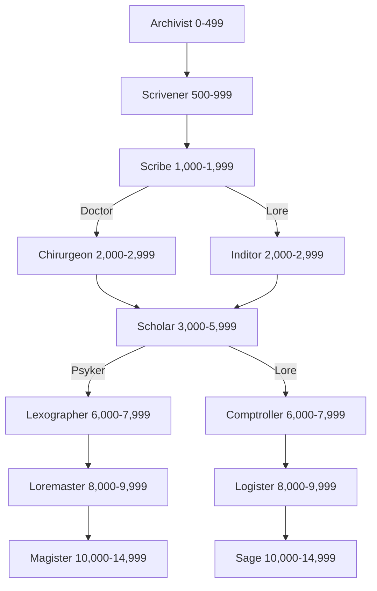

*"It's simple really. If we place the signifier here in this position, the rest of the cipher solves itself."*

— Scholar Gabel Troken, Librarium Centris, Scintilla.

Adepts are wise and learned scholars, or at least they hope to be one day. As members of the educated class they are skilled with languages, knowledge, and often act as the brains of any group. As a social class that focuses on practical skills and the acquisition of knowledge they typically make for mediocre fighters, and depending on the Adept’s particular specialties may not have much in the way of “people skills” either. When it comes to the realm of the mind however, they leave everyone else for dust.

### Table: Adept Characteristic Advances

| **Characteristic** | **Simple** | **Intermediate** | **Trained** | **Expert** |
| ------------------ | :--------: | :--------------: | :---------: | :--------: |
| Weapon Skill       |    500     |       750        |    1,000    |   2,500    |
| Ballistic Skill    |    250     |       500        |     750     |   1,000    |
| Strength           |    500     |       750        |    1,000    |   2,500    |
| Toughness          |    500     |       750        |    1,000    |   2,500    |
| Agility            |    250     |       500        |     750     |   1,000    |
| Intelligence       |    100     |       250        |     500     |    750     |
| Perception         |    100     |       250        |     500     |    750     |
| Willpower          |    100     |       250        |     500     |    750     |
| Fellowship         |    250     |       500        |     750     |   1,000    |
# Advancement Tree

## **Archivist Advances**

*"Throne blind you boy, fetch those books before I use your hide for a binding!"*

Archivists keep manuscripts and tend the needs of Sages, scurrying between tottering bookshelves and datacrypts, ever with an eye to escaping their servitude.

| Advance                                                                 | Cost | Type | Prerequisites |
| ----------------------------------------------------------------------- | :--: | :--: | :-----------: |
| [Common Lore (Imperium)](Skills.md#common-lore)                         | 100  |  S   |       —       |
| [Common Lore (Tech)](Skills.md#common-lore)                             | 100  |  S   |       —       |
| [Drive (Ground Vehicle)](skills.md#drive)                               | 100  |  S   |       —       |
| [Drive (Hover Vehicle)](skills.md#drive)                                | 100  |  S   |       —       |
| [Literacy](skills.md#literacy)                                          | 100  |  S   |       —       |
| [Pilot (Civilian Craft)](skills.md#pilot)                               | 100  |  S   |       —       |
| [Scholastic Lore (Legend)](Skills.md#scholastic-lore)                   | 100  |  S   |       —       |
| [Trade (Cook)](skills.md#trade)                                         | 100  |  S   |       —       |
| [Trade (Copyist)](skills.md#trade)                                      | 100  |  S   |       —       |
| [Trade (Valet)](skills.md#trade)                                        | 100  |  S   |       —       |
| [Light Sleeper](talents.md#light-sleeper)                               | 100  |  T   |       —       |
| [Resistance (Cold)](talents.md#resistance)                              | 100  |  T   |       —       |
| [Sound Constitution](talents.md#sound-constitution)                     | 100  |  T   |       —       |
| [Sprint](talents.md#sprint)                                             | 100  |  T   |       —       |
| [Unremarkable](talents.md#unremarkable)                                 | 100  |  T   |       —       |
| [Swim](skills.md#swim)                                                  | 200  |  S   |       —       |
| [Melee Weapon Training (Primitive)](Talents.md#melee-weapon-training)   | 200  |  T   |       —       |
| [Pistol Training (Primitive)](Talents.md#pistol-training)               | 200  |  T   |       —       |
| [Pistol Training (Las)](Talents.md#pistol-training)                     | 200  |  T   |       —       |
| [Pistol Training (SP)](Talents.md#pistol-training)                      | 200  |  T   |       —       |
| [Thrown Weapon Training (Primitive)](Talents.md#thrown-weapon-training) | 200  |  T   |       —       |

## **Scrivener Advances**

*"Dharkins, your illuminations are positively Rabeliean. You'll do well; just not here."*

Scriveners have wormed their way into a position of trust, whence they may actually deal with scrolls, books and data-slates directly. Of course, they are the primary oppressors of Archivists, as is only right and proper.

| Advance                                                               | Cost | Type |      Prerequisites       |
| --------------------------------------------------------------------- | :--: | :--: | :----------------------: |
| [Awareness](skills.md#awareness)                                      | 100  |  S   |            —             |
| [Ciphers (Acolyte)](skills.md#ciphers)                                | 100  |  S   |            —             |
| [Common Lore (Administratum)](Skills.md#common-lore)                  | 100  |  S   |            —             |
| [Common Lore (Imperium) +10](Skills.md#common-lore)                   | 100  |  S   |  Common Lore (Imperium)  |
| [Drive (Ground Vehicle) +10](skills.md#drive)                         | 100  |  S   |  Drive (Ground Vehicle)  |
| [Drive (Hover Vehicle) +10](skills.md#drive)                          | 100  |  S   |  Drive (Hover Vehicle)   |
| [Forbidden Lore (Cults)](Skills.md#forbidden-lore)                    | 100  |  S   |            —             |
| [Inquiry](Skills.md#inquiry)                                          | 100  |  S   |            —             |
| [Literacy +10](Skills.md#literacy)                                    | 100  |  S   |         Literacy         |
| [Logic](Skills.md#logic)                                              | 100  |  S   |            —             |
| [Pilot (Civilian Craft) +10](Skills.md#pilot)                         | 100  |  S   |  Pilot (Civilian Craft)  |
| [Scholastic Lore (Legend) +10](Skills.md#scholastic-lore)             | 100  |  S   | Scholastic Lore (Legend) |
| [Speak Language (High Gothic)](Skills.md#speak-language)              | 100  |  S   |            —             |
| [Trade (Artist)](Skills.md#trade)                                     | 100  |  S   |            —             |
| [Trade (Cartographer)](Skills.md#trade)                               | 100  |  S   |            —             |
| [Basic Weapon Training (Primitive)](Talents.md#basic-weapon-training) | 100  |  T   |            —             |
| [Peer (Academics)](Talents.md#peer)                                   | 100  |  T   |          Fel 30          |
| [Blather](Skills.md#blather)                                          | 200  |  S   |            —             |
| [Peer (Administratum)](Talents.md#peer)                               | 200  |  T   |          Fel 30          |

## **Scribe Advances**

*"A scribe is always useful. Knowledge can make the difference between life and death, particularly if you send the scribe in first…"*

Scribes are vessels of knowledge, skilled in the byzantine art of extracting information from all manner of sources. Many secretly fear they will never rise further within the ranks of the Administratum, hence they are naturally keen to take risks to get ahead.

| Advance                                                         | Cost | Type |        Prerequisites         |
| --------------------------------------------------------------- | :--: | :--: | :--------------------------: |
| [Awareness +10](skills.md#awareness)                            | 100  |  S   |          Awareness           |
| [Ciphers (Acolyte) +10](skills.md#ciphers)                      | 100  |  S   |      Ciphers (Acolyte)       |
| [Common Lore (Administratum) +10](Skills.md#common-lore)        | 100  |  S   | Common Lore (Administratum)  |
| [Common Lore (Ecclesiarchy)](Skills.md#common-lore)             | 100  |  S   |              —               |
| [Common Lore (Imperium) +20](Skills.md#common-lore)             | 100  |  S   |  Common Lore (Imperium) +10  |
| [Drive (Ground Vehicle) +20](skills.md#drive)                   | 100  |  S   |  Drive (Ground Vehicle) +10  |
| [Drive (Hover Vehicle) +20](skills.md#drive)                    | 100  |  S   |  Drive (Hover Vehicle) +10   |
| [Forbidden Lore (Cults) +10](Skills.md#forbidden-lore)          | 100  |  S   |    Forbidden Lore (Cults)    |
| [Forbidden Lore (Heresy)](Skills.md#forbidden-lore)             | 100  |  S   |              —               |
| [Literacy +20](Skills.md#literacy)                              | 100  |  S   |         Literacy +10         |
| [Pilot (Civilian Craft) +20](Skills.md#pilot)                   | 100  |  S   |  Pilot (Civilian Craft) +10  |
| [Scholastic Lore (Bureaucracy)](Skills.md#scholastic-lore)      | 100  |  S   |              —               |
| [Scholastic Lore (Legend) +20](Skills.md#scholastic-lore)       | 100  |  S   | Scholastic Lore (Legend) +10 |
| [Scholastic Lore (Occult)](Skills.md#scholastic-lore)           | 100  |  S   |              —               |
| [Secret Tongue (Acolyte)](Skills.md#secret-tongue)              | 100  |  S   |              —               |
| [Secret Tongue (Administratum)](Skills.md#secret-tongue)        | 100  |  S   |              —               |
| [Basic Weapon Training (Las)](Talents.md#basic-weapon-training) | 100  |  T   |              —               |
| [Basic Weapon Training (SP)](Talents.md#basic-weapon-training)  | 100  |  T   |              —               |
| [Flagellant](Talents.md#flagellant)                             | 100  |  T   |              —               |
| [Resistance (Poisons)](Talents.md#resistance)                   | 100  |  T   |              —               |
| [Blather +10](Skills.md#blather)                                | 200  |  S   |           Blather            |
| [Trade (Technomat)](Skills.md#trade)                            | 200  |  S   |              —               |
| [Electro Graft Use](Talents.md#electro-graft-use)               | 200  |  T   |              —               |
| [Sound Constitution](Talents.md#sound-constitution)             | 200  |  T   |              —               |
| [Ambidextrous](Talents.md#ambidextrous)                         | 300  |  T   |            Ag 30             |

## **Inditor Advances**

*"If you've a mind to dig to the bottom of something, an inditor is invaluable. If they don't know it, they can find it out for you. If they can't find it… well, you're probably not meant to know it anyway."*

Inditors are trusted members of the Administratum, having been initiated into some of its deeper secrets. Even the lore of other Adepta is not beyond their scrutinising gaze.

| Advance                                                           | Cost | Type |             Prerequisites             |
| ----------------------------------------------------------------- | :--: | :--: | :-----------------------------------: |
| [Awareness +20](skills.md#awareness)                              | 100  |  S   |             Awareness +10             |
| [Common Lore (Tech) +10](Skills.md#common-lore)                   | 100  |  S   |          Common Lore (Tech)           |
| [Common Lore (Machine Cult)](Skills.md#common-lore)               | 100  |  S   |                   —                   |
| [Evaluate](Skills.md#evaluate)                                    | 100  |  S   |                   —                   |
| [Forbidden Lore (Mutants)](Skills.md#forbidden-lore)              | 100  |  S   |                   —                   |
| [Forbidden Lore (Inquisition)](Skills.md#forbidden-lore)          | 100  |  S   |                   —                   |
| [Inquiry +10](Skills.md#inquiry)                                  | 100  |  S   |                Inquiry                |
| [Logic +10](Skills.md#logic)                                      | 100  |  S   |                 Logic                 |
| [Scholastic Lore (Chymistry)](Skills.md#scholastic-lore)          | 100  |  S   |                   —                   |
| [Scholastic Lore (Numerology)](Skills.md#scholastic-lore)         | 100  |  S   |                   —                   |
| [Scholastic Lore (Occult) +10](Skills.md#scholastic-lore)         | 100  |  S   |       Scholastic Lore (Occult)        |
| [Secret Tongue (Acolyte) +10](Skills.md#secret-tongue)            | 100  |  S   |        Secret Tongue (Acolyte)        |
| [Secret Tongue (Administratum) +10](Skills.md#secret-tongue)      | 100  |  S   |     Secret Tongue (Administratum)     |
| [Tech-Use](Skills.md#tech-use)                                    | 100  |  S   |                   —                   |
| [Total Recall](Talents.md#total-recall)                           | 100  |  T   |                Int 30                 |
| [Swift Attack](Talents.md#swift-attack)                           | 100  |  T   |                 WS 35                 |
| [Barter](Skills.md#barter)                                        | 200  |  S   |                   —                   |
| [Blather +20](Talents.md#resistance)                              | 200  |  S   |              Blather +10              |
| [Navigation (Stellar)](Skills.md#navigation)                      | 200  |  S   |                   —                   |
| [Melee Weapon Training (Shock)](Talents.md#melee-weapon-training) | 200  |  T   |                   —                   |
| [Arms Master](Talents.md#arms-master)                             | 200  |  T   | BS 30 Basic Weapon Training (any two) |
| [Marksman](Talents.md#marksman)                                   | 300  |  T   |                 BS 35                 |

## **Chirurgeon Advances**

*"Them chirurgeons issa odd bunch. Watch it if they offers ta cut ya fer free. Iss the way they looks at yer as they're rummagin' in yer guts. Kinda like yera cross 'tween an essperiment anna pork lunch."*

Chirurgeons investigate the secrets of the human form, studying the cryptic chambers of the heart, the enigmas of flesh and bone, and, of course, the moist grey mysteries of the brain.

| Advance                                                           | Cost | Type |        Prerequisites        |
| ----------------------------------------------------------------- | :--: | :--: | :-------------------------: |
| [Awareness +20](skills.md#awareness)                              | 100  |  S   |        Awareness +10        |
| [Common Lore (Imperial Creed)](Skills.md#common-lore)             | 100  |  S   |              —              |
| [Deceive](Skills.md#deceive)                                      | 100  |  S   |              —              |
| [Forbidden Lore (Mutants)](Skills.md#forbidden-lore)              | 100  |  S   |              —              |
| [Forbidden Lore (Inquisition)](Skills.md#forbidden-lore)          | 100  |  S   |              —              |
| [Inquiry +10](Skills.md#inquiry)                                  | 100  |  S   |           Inquiry           |
| [Medicae](Skills.md#medicae)                                      | 100  |  S   |              —              |
| [Medicae +10](Skills.md#medicae)                                  | 100  |  S   |           Medicae           |
| [Secret Tongue (Acolyte) +20](Skills.md#secret-tongue)            | 100  |  S   | Secret Tongue (Acolyte) +10 |
| [Master Chirurgeon](Talents.md#master-chirurgeon)                 | 100  |  T   |         Medicae +10         |
| [Talented (Blather)](Talents.md#talented)                         | 100  |  T   |           Blather           |
| [Talented (Medicae)](Talents.md#talented)                         | 100  |  T   |           Medicae           |
| [Peer (the Insane)](Talents.md#peer)                              | 100  |  T   |           Fel 30            |
| [Carouse](Skills.md#carouse)                                      | 200  |  S   |              —              |
| [Carouse +10](Skills.md#carouse)                                  | 200  |  S   |           Carouse           |
| [Decadence](Talents.md#decadence)                                 | 200  |  T   |            T 30             |
| [Heightened Senses (Sight)](Talents.md#heightened-senses)         | 200  |  T   |              —              |
| [Heightened Senses (Smell)](Talents.md#heightened-senses)         | 200  |  T   |              —              |
| [Heightened Senses (Touch)](Talents.md#heightened-senses)         | 200  |  T   |              —              |
| [Melee Weapon Training (Chain)](Talents.md#melee-weapon-training) | 200  |  T   |              —              |
| [Charm](Skills.md#charm)                                          | 300  |  S   |              —              |
| [Sleight of Hand](Skills.md#sleight-of-hand)                      | 300  |  S   |              —              |

## **Scholar Advances**

*"Scholar Dharkins passes bow your head! He cured the Seeping Cough and the Dread-Pox. Whisper has it he advises the hive council. 'Twernt for him, Throne knows where we'd be!"*

A Scholar is in full bloom of his powers, wise, learned and skilled in getting results from the almighty machine that is the Administratum. Should they avoid peevish theoretical debate and infighting, Scholars become respected and mighty indeed.

| Advance                                                          | Cost | Type |          Prerequisites          |
| ---------------------------------------------------------------- | :--: | :--: | :-----------------------------: |
| [Common Lore (Adeptus Arbites)](Skills.md#common-lore)           | 100  |  S   |                —                |
| [Common Lore (Administratum) +20](Skills.md#common-lore)         | 100  |  S   | Common Lore (Administratum) +10 |
| [Common Lore (Ecclesiarchy) +10](Skills.md#common-lore)          | 100  |  S   |   Common Lore (Ecclesiarchy)    |
| [Common Lore (Tech) +20](Skills.md#common-lore)                  | 100  |  S   |     Common Lore (Tech) +10      |
| [Deceive](Skills.md#deceive)                                     | 100  |  S   |                —                |
| [Dodge](Skills.md#dodge)                                         | 100  |  S   |                —                |
| [Drive (Walker)](skills.md#drive)                                | 100  |  S   |                —                |
| [Forbidden Lore (Heresy) +10](Skills.md#forbidden-lore)          | 100  |  S   |     Forbidden Lore (Heresy)     |
| [Forbidden Lore (Inquisition) +10](Skills.md#forbidden-lore)     | 100  |  S   |  Forbidden Lore (Inquisition)   |
| [Forbidden Lore (Mutants) +10](Skills.md#forbidden-lore)         | 100  |  S   |    Forbidden Lore (Mutants)     |
| [Forbidden Lore (The Black Library)](Skills.md#forbidden-lore)   | 100  |  S   |                —                |
| [Scholastic Lore (Astromancy)](Skills.md#scholastic-lore)        | 100  |  S   |                —                |
| [Scholastic Lore (Bureaucracy) +10](Skills.md#scholastic-lore)   | 100  |  S   |  Scholastic Lore (Bureaucracy)  |
| [Scholastic Lore (Heraldry)](Skills.md#scholastic-lore)          | 100  |  S   |                —                |
| [Scholastic Lore (Imperial Creed)](Skills.md#scholastic-lore)    | 100  |  S   |                —                |
| [Scrutiny](Skills.md#scrutiny)                                   | 100  |  S   |                —                |
| [Speak Language (High Gothic) +10](Skills.md#speak-language)     | 100  |  S   |                —                |
| [Armour of Contempt](Talents.md#armour-of-contempt)              | 100  |  T   |              WP 40              |
| [Binary Chatter](Talents.md#binary-chatter)                      | 100  |  T   |                —                |
| [Navigation (Stellar) +10](Skills.md#navigation)                 | 200  |  S   |      Navigation (Stellar)       |
| [Basic Weapon Training (Bolt)](Talents.md#basic-weapon-training) | 200  |  T   |                —                |
| [Die Hard](Talents.md#die-hard)                                  | 200  |  T   |              WP 40              |
| [Pistol Training (Bolt)](Talents.md#pistol-training)             | 200  |  T   |                —                |
| [Sound Constitution](Talents.md#sound-constitution)              | 200  |  T   |                —                |
| [Step Aside](Talents.md#step-aside)                              | 200  |  T   |          Ag 40, Dodge           |

## **Lexographer Advances**

*"Lexographers is so smart, dey get ta make up words an' no one says they's inedukated."*

All the knowledge of the Imperium is hidden within the spidery High Gothic script of temples, shrines and archives. The Lexographer is the guardian and keeper of these sacred words.

| Advance                                                       | Cost | Type |          Prerequisites           |
| ------------------------------------------------------------- | :--: | :--: | :------------------------------: |
| [Ciphers (Acolyte) +20](skills.md#ciphers)                    | 100  |  S   |      Ciphers (Acolyte) +10       |
| [Forbidden Lore (Cults) +20](Skills.md#forbidden-lore)        | 100  |  S   |    Forbidden Lore (Cults) +10    |
| [Forbidden Lore (Heresy) +20](Skills.md#forbidden-lore)       | 100  |  S   |   Forbidden Lore (Heresy) +10    |
| [Forbidden Lore (Inquisition) +20](Skills.md#forbidden-lore)  | 100  |  S   | Forbidden Lore (Inquisition) +10 |
| [Forbidden Lore (Mutants) +20](Skills.md#forbidden-lore)      | 100  |  S   |   Forbidden Lore (Mutants) +10   |
| [Secret Tongue (Acolyte) +20](Skills.md#secret-tongue)        | 100  |  S   |   Secret Tongue (Acolyte) +10    |
| [Speak Language (High Gothic) +20](Skills.md#speak-language)  | 100  |  S   | Speak Language (High Gothic) +10 |
| [Resistance (Fear)](Talents.md#resistance)                    | 100  |  T   |                —                 |
| [Paranoia](Talents.md#paranoia)                               | 100  |  T   |                —                 |
| [Blind Fighting](Talents.md#blind-fighting)                   | 200  |  T   |              Per 30              |
| [Good Reputation (Administratum)](Talents.md#good-reputation) | 200  |  T   |   Fel 50, Peer (Administratum)   |
| [Pistol Training (Flame)](Talents.md#pistol-training)         | 200  |  T   |                —                 |
| [Quick Draw](Talents.md#quick-draw)                           | 200  |  T   |                —                 |
| [Lip Reading](Skills.md#lip-reading)                          | 300  |  S   |                —                 |

## **Loremaster Advances**

*"When you understand the secrets of the universe, you will understand yourself."*

Loremasters have reached such a level of knowledge of the galaxy that they have now turned their attentions inward, looking into the very mysteries of the human soul.

| Advance                                                                     | Cost | Type |      Prerequisites       |
| --------------------------------------------------------------------------- | :--: | :--: | :----------------------: |
| [Scholastic Lore (Occult) +10](Skills.md#scholastic-lore)                   | 100  |  S   | Scholastic Lore (Occult) |
| [Lip Reading +10](Skills.md#lip-reading)                                    | 200  |  S   |       Lip Reading        |
| [Minor Psychic Power†](Talents.md#minor-psychic-power)                      | 200  |  T   |            —             |
| [Peer (Astropaths)](Talents.md#peer)                                        | 200  |  T   |          Fel 30          |
| [Rapid Reload](Talents.md#rapid-reload)                                     | 200  |  T   |            —             |
| [Sound Constitution](Talents.md#sound-constitution)                         | 200  |  T   |            —             |
| [Psyniscience](Skills.md#psyniscience)                                      | 300  |  S   |       Psy Rating 1       |
| [Exotic Weapon Training (Needle Pistol)](Talents.md#exotic-weapon-training) | 300  |  T   |            —             |
| [Peer (Inquisition)](Talents.md#peer)                                       | 300  |  T   |          Fel 30          |
| [Psy Rating 1](Talents.md#psy-rating-1)                                     | 300  |  T   |            —             |
| [Unshakeable Faith](Talents.md#unshakeable-faith)                           | 300  |  T   |            —             |
| [Pistol Training (Plasma)](Talents.md#pistol-training)                      | 400  |  T   |            —             |
| †*You may take this Talent up to three times at this Rank.*                 |      |      |                          |
##### **The Question of Psychic Adepts**
Through certain Advances a Loremaster Adept may become a psyker in the middle of a campaign. These Advances are intended to represent these characters gaining psychic ability through studying occult mysteries and forbidden lore. It does, however, raise the question of whether these psychic adepts are sanctioned and where their power comes from. Three options for handling this vexing matter are presented here:

* **Sorcery:** The psychic powers open to Loremasters and Magisters are in fact knowledge of sorcery gained through forbidden research. Swap the Loremaster’s Psy-Rating 1 Advance for Sorcery and add in Forbidden Lore (Warp) (Int) and Forbidden Lore (Warp) (Int) +10 as two advances for 100 points each. In the Magister rank, remove the Minor Psychic Power and Psy Rating 2 Advances and swap the Psy Rating 3 Advance for Master Sorcerer.
* **Sanctionite:** When the Adept takes the Loremaster Psy Rating 1 Advance, they are trained and sanctioned as a psyker using the formal process of the Scholastica Psykana. It can be assumed that Inquisitorial influence “expedites” this process quite a bit, but the character will likely need to be removed from play for about a year or so to accommodate this exhaustive ordeal. The character returns to play with the Sanctioned Psyker Trait from the Imperial Psyker Career.
* **Rogue Psyker:** Instead of gaining Psy Rating 1, an Adept who passes through the Loremaster Rank may instead receive the Nascent Psyker Elite Advance Package. If the psychic power involved is suitably ‘discreet,’ the character may not even be aware that he possesses it, (although of course the player does!), and wields it subconsciously, simply believing it to be a ‘knack’ or good fortune, at least at the beginning…
## **Comptroller Advances**

*"Stop staring, lad. It's not for the likes of archivists like you to look upon Comptrollers. Of course, he has an extra brain. You would too, if you had to work like that."*

Comptrollers direct the ebb and flow of information that passes through the Administratum, plucking seemingly unconnected facts from the sea of knowledge to construct masterful solutions and cunning plans of attack.

| Advance                                                           | Cost | Type |           Prerequisites           |
| ----------------------------------------------------------------- | :--: | :--: | :-------------------------------: |
| [Command](Skills.md#command)                                      | 100  |  S   |                 —                 |
| [Common Lore (Machine Cult)](Skills.md#common-lore)               | 100  |  S   |                 —                 |
| [Common Lore (Machine Cult) +10](Skills.md#common-lore)           | 100  |  S   |    Common Lore (Machine Cult)     |
| [Deceive +10](Skills.md#deceive)                                  | 100  |  S   |              Deceive              |
| [Evaluate](Skills.md#evaluate)                                    | 100  |  S   |                 —                 |
| [Evaluate +10](Skills.md#evaluate)                                | 100  |  S   |             Evaluate              |
| [Inquiry +20](Skills.md#inquiry)                                  | 100  |  S   |            Inquiry +10            |
| [Scholastic Lore (Astromancy) +10](Skills.md#scholastic-lore)     | 100  |  S   |   Scholastic Lore (Astromancy)    |
| [Scholastic Lore (Bureaucracy) +20](Skills.md#scholastic-lore)    | 100  |  S   |   Scholastic Lore (Bureaucracy)   |
| [Scholastic Lore (Chymistry)](Skills.md#scholastic-lore)          | 100  |  S   |                 —                 |
| [Scholastic Lore (Chymistry) +10](Skills.md#scholastic-lore)      | 100  |  S   |    Scholastic Lore (Chymistry)    |
| [Scholastic Lore (Cryptology)](Skills.md#scholastic-lore)         | 100  |  S   |                 —                 |
| [Scholastic Lore (Heraldry) +10](Skills.md#scholastic-lore)       | 100  |  S   |    Scholastic Lore (Heraldry)     |
| [Scholastic Lore (Imperial Creed) +10](Skills.md#scholastic-lore) | 100  |  S   | Scholastic Lore (Imperial Creed)  |
| [Scholastic Lore (Judgement)](Skills.md#scholastic-lore)          | 100  |  S   |                 —                 |
| [Scholastic Lore (Numerology)](Skills.md#scholastic-lore)         | 100  |  S   |                 —                 |
| [Scholastic Lore (Numerology) +10](Skills.md#scholastic-lore)     | 100  |  S   |   Scholastic Lore (Numerology)    |
| [Scholastic Lore (Tactica Imperialis)](Skills.md#scholastic-lore) | 100  |  S   |                 —                 |
| [Search](Skills.md#search)                                        | 100  |  S   |                 —                 |
| [Secret Tongue (Acolyte) +20](Skills.md#secret-tongue)            | 100  |  S   |    Secret Tongue (Acolyte) +10    |
| [Secret Tongue (Administratum) +10](Skills.md#secret-tongue)      | 100  |  S   |   Secret Tongue (Administratum)   |
| [Secret Tongue (Administratum) +20](Skills.md#secret-tongue)      | 100  |  S   | Secret Tongue (Administratum) +10 |
| [Chem Geld](Talents.md#chem-geld)                                 | 100  |  T   |                 —                 |
| [Disturbing Voice](Talents.md#disturbing-voice)                   | 100  |  T   |                 —                 |
| [Resistance (Psychic Powers)](Talents.md#resistance)              | 100  |  T   |                 —                 |
| [Interrogation](Skills.md#interrogation)                          | 200  |  S   |                 —                 |
| [Tech-Use](Skills.md#tech-use)                                    | 200  |  S   |                 —                 |
| [Tech-Use +10](Skills.md#tech-use)                                | 200  |  S   |             Tech-Use              |
| [Blind Fighting](Talents.md#blind-fighting)                       | 200  |  T   |              Per 30               |
| [Deadeye Shot](Talents.md#deadeye-shot)                           | 200  |  T   |               BS 30               |
| [Jaded](Talents.md#jaded)                                         | 300  |  T   |               WP 30               |

## **Logister Advances**

*"The cogitation of Logister Veritas is that the city be razed. This solves both the crime and industry problems most elegantly. What? No, I'm afraid his plan is already in action. You did say you wanted a swift solution…"*

Logisters apply their phenomenal powers of reasoning and logic to the toughest of problems, slicing through quandaries with the keen scalpel of their intellect.

| Advance                                                               | Cost | Type |            Prerequisites             |
| --------------------------------------------------------------------- | :--: | :--: | :----------------------------------: |
| [Common Lore (Adeptus Arbites) +10](Skills.md#common-lore)            | 100  |  S   |    Common Lore (Adeptus Arbites)     |
| [Common Lore (Ecclesiarchy) +20](Skills.md#common-lore)               | 100  |  S   |    Common Lore (Ecclesiarchy) +10    |
| [Logic +10](Skills.md#logic)                                          | 100  |  S   |                Logic                 |
| [Logic +20](Skills.md#logic)                                          | 100  |  S   |              Logic +10               |
| [Scholastic Lore (Cryptology) +10](Skills.md#scholastic-lore)         | 100  |  S   |     Scholastic Lore (Cryptology)     |
| [Scholastic Lore (Imperial Creed) +20](Skills.md#scholastic-lore)     | 100  |  S   | Scholastic Lore (Imperial Creed) +10 |
| [Scholastic Lore (Judgement) +10](Skills.md#scholastic-lore)          | 100  |  S   |     Scholastic Lore (Judgement)      |
| [Scholastic Lore (Tactica Imperialis) +10](Skills.md#scholastic-lore) | 100  |  S   | Scholastic Lore (Tactica Imperialis) |
| [Search +10](Skills.md#search)                                        | 100  |  S   |                Search                |
| [Air of Authority](Talents.md#air-of-authority)                       | 100  |  T   |                Fel 30                |
| [Orthoproxy](Talents.md#orthoproxy)                                   | 100  |  T   |                  —                   |
| [Peer (Government)](Talents.md#peer)                                  | 100  |  T   |                Fel 30                |
| [Pistol Training (Flame)](Talents.md#pistol-training)                 | 100  |  T   |                  —                   |
| [Resistance (Fear)](Talents.md#resistance)                            | 100  |  T   |                  —                   |
| [Strong Minded](Talents.md#strong-minded)                             | 100  |  T   |  WP 30, Resistance (Psychic Powers)  |
| [Talented (Logic)](Talents.md#talented)                               | 100  |  T   |                Logic                 |
| [Command +10](Skills.md#command)                                      | 200  |  S   |               Command                |
| [Interrogation +10](Skills.md#interrogation)                          | 200  |  S   |            Interrogation             |
| [Tech-Use +20](Skills.md#tech-use)                                    | 200  |  S   |             Tech-Use +10             |
| [Peer (Inquisition)](Talents.md#peer)                                 | 200  |  T   |                Fel 30                |
| [Forbidden Lore (Archeotech)](Skills.md#forbidden-lore)               | 300  |  S   |             Tech-Use +20             |
| [Nerves of Steel](Talents.md#nerves-of-steel)                         | 300  |  T   |                  —                   |
| [Peer (Adeptus Mechanicus)](Talents.md#peer)                          | 300  |  T   |                Fel 30                |
| [Peer (Ecclesiarchy)](Talents.md#peer)                                | 300  |  T   |                Fel 30                |
| [Sound Constitution](Talents.md#sound-constitution)                   | 300  |  T   |                  —                   |

## **Magister Advances**

*"If there's one thing worse than a psyker, it's a psyker that knows everything."*

Magisters possess an implicit understanding of the nature of the galaxy, and man's place within it. Through the study of this forbidden knowledge they unlock hidden powers.

| Advance                                                                    | Cost | Type | Prerequisites |
| -------------------------------------------------------------------------- | :--: | :--: | :-----------: |
| [Catfall](Talents.md#catfall)                                              | 100  |  T   |     Ag 30     |
| [Interrogation](Skills.md#interrogation)                                   | 200  |  S   |       —       |
| [Psyniscience +10](Skills.md#psyniscience)                                 | 200  |  S   | Psyniscience  |
| [Tech-Use +10](Skills.md#tech-use)                                         | 200  |  S   |   Tech-Use    |
| [Exotic Weapon Training (Needle Rifle)](Talents.md#exotic-weapon-training) | 200  |  T   |       —       |
| [Minor Psychic Power†](Talents.md#minor-psychic-power)                     | 200  |  T   |       —       |
| [Sound Constitution](Talents.md#sound-constitution)                        | 200  |  T   |       —       |
| [Psy Rating 2](Talents.md#psy-rating-2)                                    | 300  |  T   | Psy Rating 1  |
| [Melee Weapon Training (Power)](Talents.md#melee-weapon-training)          | 400  |  T   |       —       |
| [Pistol Training (Melta)](Talents.md#pistol-training)                      | 400  |  T   |       —       |
| [Psy Rating 3](Talents.md#psy-rating-3)                                    | 500  |  T   | Psy Rating 2  |
| †*You may take this Talent up to three times at this Rank.*                |      |      |               |

## **Sage Advances**

*"They say even the mysteries of the Tyrant Star are not beyond the mind of a sage."*

Few secrets remain hidden from the mind of a sage.

| Advance                                                                  | Cost | Type |              Prerequisites               |
| ------------------------------------------------------------------------ | :--: | :--: | :--------------------------------------: |
| [Common Lore (Adeptus Arbites) +20](Skills.md#common-lore)               | 100  |  S   |    Common Lore (Adeptus Arbites) +20     |
| [Forbidden Lore (Cults) +20](Skills.md#forbidden-lore)                   | 100  |  S   |        Forbidden Lore (Cults) +10        |
| [Forbidden Lore (Heresy) +20](Skills.md#forbidden-lore)                  | 100  |  S   |       Forbidden Lore (Heresy) +10        |
| [Forbidden Lore (Inquisition) +20](Skills.md#forbidden-lore)             | 100  |  S   |     Forbidden Lore (Inquisition) +10     |
| [Forbidden Lore (Mutants) +20](Skills.md#forbidden-lore)                 | 100  |  S   |       Forbidden Lore (Mutants) +10       |
| [Scholastic Lore (Tactica Imperialis) +20](Skills.md#scholastic-lore)    | 100  |  S   | Scholastic Lore (Tactica Imperialis) +10 |
| [Mental Fortress](Talents.md#mental-fortress)                            | 100  |  T   |           WP 50, Strong Minded           |
| [Peer (Nobility)](Talents.md#peer)                                       | 100  |  T   |                  Fel 30                  |
| [Command +20](Skills.md#command)                                         | 200  |  S   |               Command +10                |
| [Exotic Weapon Training (Web Pistol)](Talents.md#exotic-weapon-training) | 200  |  T   |                    —                     |
| [Quick Draw](Talents.md#quick-draw)                                      | 200  |  T   |                    —                     |
| [Rapid Reload](Talents.md#rapid-reload)                                  | 200  |  T   |                    —                     |
| [Talented (Command)](Talents.md#talented)                                | 200  |  T   |                 Command                  |
| [Concealment](Skills.md#concealment)                                     | 300  |  S   |                    —                     |
| [Forbidden Lore (Archeotech) +10](Skills.md#forbidden-lore)              | 300  |  S   |       Forbidden Lore (Archeotech)        |
| [Forbidden Lore (The Black Library) +10](Skills.md#forbidden-lore)       | 300  |  S   |    Forbidden Lore (The Black Library)    |
| [Peer (Adeptus Arbites)](Talents.md#peer)                                | 300  |  T   |                  Fel 30                  |
| [Sound Constitution](Talents.md#sound-constitution)                      | 300  |  T   |                    —                     |
| Unnatural Intelligence (2)                                               | 500  |  —   |                    —                     |
##### **Trait: Unnatural Intelligence (X)**
Years of focused study alongside some of the Imperium's sharpest minds has given you intellectual acuity far greater than even most scholars. Add the number indicated after the Unnatural Intelligence Trait to your Intelligence Bonus. Additionally, each time you succeed on an Intelligence-based Test, you gain a number of bonus degrees of success equal to half your Unnatural Intelligence Trait. 

For example, if you have an Intelligence of 51, the Unnatural Intelligence (2) Trait would increase your Intelligence Bonus to 7 (5+2), and you would gain 1 additional degree of success on any successful Skill or Characteristic Test using your Intelligence.