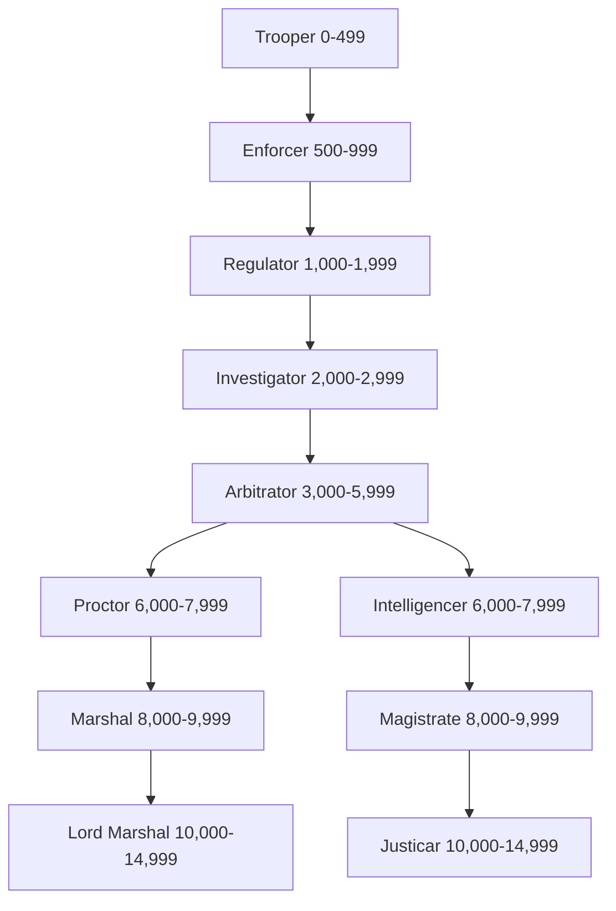

*"He demands? The demands of the law come first, even in Hive Tarsus."*

— Regulator Hanz Rikennan, IVth Precinct, Hive Tarsus

Arbitrators are tough law-keepers and judges. They ensure that the Imperium’s laws are maintained, whilst also acting as executioners for rebels, seditionists and trouble-makers. Arbitrators do not serve on any local planetary police force, rather they are members of a higher organisation: the Adeptus Arbites. Arbitrators are good in a fight, and while their combat prowess is somewhat below that of a Guardsman’s, they also possess a “sufficient” range of social graces to investigate and track down their targets. Any group could also benefit from an Arbitrator’s dogged toughness, broad range of useful skills, and knowledge of Imperial law.
### Table: Arbitrator Characteristic Advances
| Characteristic  | Simple | Intermediate | Trained | Expert |
| --------------- | :----: | :----------: | :-----: | :----: |
| Weapon Skill    |  250   |     500      |   750   | 1,000  |
| Ballistic Skill |  100   |     250      |   500   |  750   |
| Strength        |  500   |     750      |  1,000  | 2,500  |
| Toughness       |  100   |     250      |   500   |  750   |
| Agility         |  500   |     750      |  1,000  | 2,500  |
| Intelligence    |  100   |     250      |   500   |  750   |
| Perception      |  250   |     500      |   750   | 1,000  |
| Willpower       |  250   |     500      |   750   | 1,000  |
| Fellowship      |  250   |     500      |   750   | 1,000  |
## Advancement Tree

```mermaid
graph TD
A[Trooper 0-499] --> B[Enforcer 500-999]
B --> C[Regulator 1,000-1,999]
C --> D[Investigator 2,000-2,999]
D --> E[Arbitrator 3,000-5,999]
E --> F[Proctor 6,000-7,999]
F --> G[Marshal 8,000-9,999]
G --> H[Lord Marshal 10,000-14,999]
E --> I[Intelligencer 6,000-7,999]
I --> J[Magistrate 8,000-9,999]
J --> K[Justicar 10,000-14,999]
```
## **Trooper Advances**

*"Call yourself an arbitrator? You're not fit to wear the uniform."*

A Trooper is drilled in combat and his duties to the Imperium: he is stout of heart and eager to enforce the Emperor's law.

| Advance                                                                   | Cost |  Type  | Prerequisites                 |
| ------------------------------------------------------------------------- | :--: | :----: | :---------------------------- |
| [Awareness](Skills.md#awareness)                                          | 100  | Skill  | —                             |
| [Common Lore (Adeptus Arbites)](Skills.md#common%20lore)                  | 100  | Skill  | —                             |
| [Common Lore (Adeptus Arbites) +10](Skills.md#common%20lore)              | 100  | Skill  | Common Lore (Adeptus Arbites) |
| [Common Lore (Imperium)](Skills.md#common%20lore)                         | 100  | Skill  | —                             |
| [Drive (Ground Vehicle)](Skills.md#drive)                                 | 100  | Skill  | —                             |
| [Drive (Hover Vehicle)](Skills.md#drive)                                  | 100  | Skill  | —                             |
| [Inquiry](Skills.md#inquiry)                                              | 100  | Skill  | —                             |
| [Inquiry +10](Skills.md#inquiry)                                          | 100  | Skill  | Inquiry                       |
| [Literacy](Skills.md#literacy)                                            | 100  | Skill  | —                             |
| [Scrutiny](Skills.md#scrutiny)                                            | 100  | Skill  | —                             |
| [Swim](Skills.md#swim)                                                    | 100  | Skill  | —                             |
| [Basic Weapon Training (Primitive)](Talents.md#basic%20weapon%20training) | 100  | Talent | —                             |
| [Basic Weapon Training (SP)](Talents.md#basic%20weapon%20training)        | 100  | Talent | —                             |
| [Melee Weapon Training (Primitive)](Talents.md#melee%20weapon%20training) | 100  | Talent | —                             |
| [Pistol Training (Las)](Talents.md#pistol%20training)                     | 100  | Talent | —                             |
| [Pistol Training (Primitive)](Talents.md#pistol%20training)               | 100  | Talent | —                             |
| [Pistol Training (SP)](Talents.md#pistol%20training)                      | 100  | Talent | —                             |
| [Quick Draw](Talents.md#quick%20draw)                                     | 100  | Talent | —                             |
| [Rapid Reload](Talents.md#rapid%20reload)                                 | 100  | Talent | —                             |
| [Sound Constitution](Talents.md#sound%20constitution)†                    | 100  | Talent | —                             |
| [Thrown Weapon Training (Primitive)](Talents.md#thrown-weapon-training)   | 100  | Talent | —                             |
†*You may take select this Talent up to three times at this Rank.*
## **Enforcer Advances**

*"Stand to, men, we'll break these scum on our shields and shock mauls."*

An Enforcer is taught how to keep order in the most desperate situations, standing shoulder to shoulder with his fellow Arbitrators.

| Advance                                                               | Cost |  Type  | Prerequisites                     |
| --------------------------------------------------------------------- | :--: | :----: | :-------------------------------- |
| [Common Lore (Adeptus Arbites) +20](Skills.md#common%20lore)          | 100  | Skill  | Common Lore (Adeptus Arbites) +10 |
| [Common Lore (Underworld)](Skills.md#common%20lore)                   | 100  | Skill  | —                                 |
| [Drive (Ground Vehicle) +10](Skills.md#drive)                         | 100  | Skill  | Drive (Ground Vehicle)            |
| [Intimidate](Skills.md#intimidate)                                    | 100  | Skill  | —                                 |
| [Security](Skills.md#security)                                        | 100  | Skill  | —                                 |
| [Tracking](Skills.md#tracking)                                        | 100  | Skill  | —                                 |
| [Basic Weapon Training (Las)](Talents.md#basic%20weapon%20training)   | 100  | Talent | —                                 |
| [Disarm](Talents.md#disarm)                                           | 100  | Talent | Ag 30                             |
| [Double Team](Talents.md#double%20team)                               | 100  | Talent | —                                 |
| [Leap Up](Talents.md#leap%20up)                                       | 100  | Talent | Ag 30                             |
| [Light Sleeper](Talents.md#light%20sleeper)                           | 100  | Talent | Per 30                            |
| [Melee Weapon Training (Shock)](Talents.md#melee%20weapon%20training) | 100  | Talent | —                                 |
| [Peer (Adeptus Arbites)](Talents.md#peer)                             | 100  | Talent | Fel 30                            |
| [Resistance (Cold)](Talents.md#resistance)                            | 100  | Talent | —                                 |
| [Resistance (Heat)](Talents.md#resistance)                            | 100  | Talent | —                                 |
| [Sound Constitution](Talents.md#sound%20constitution)                 | 100  | Talent | —                                 |
| [Takedown](Talents.md#takedown)                                       | 100  | Talent | —                                 |
| [Barter](Skills.md#barter)                                            | 200  | Skill  | —                                 |
| [Ciphers (Acolyte)](Skills.md#ciphers)                                | 200  | Skill  | —                                 |
| [Tech-Use](Skills.md#tech-use)                                        | 200  | Skill  | —                                 |
## **Regulator Advances**

*"I want you to hunt them down like the dogs they are."*

Regulators take the law to the underworld, holding their own against any who challenge the Emperor's law.

| Advance                                                                  | Cost |  Type  | Prerequisites |
| ------------------------------------------------------------------------ | :--: | :----: | :------------ |
| [Awareness +10](Skills.md#awareness)                                     | 100  | Skill  | Awareness     |
| [Ciphers (Underworld)](Skills.md#ciphers)                                | 100  | Skill  | —             |
| [Dodge](Skills.md#dodge)                                                 | 100  | Skill  | —             |
| [Drive (Ground Vehicle) +20](Skills.md#drive)                            | 100  | Skill  |               |
| [Interrogation](Skills.md#interrogation)                                 | 100  | Skill  | —             |
| [Scholastic Lore (Judgement)](Skills.md#scholastic%20lore)               | 100  | Skill  | —             |
| [Search](Skills.md#search)                                               | 100  | Skill  | —             |
| [Die Hard](Talents.md#die%20hard)                                        | 100  | Talent | WP 40         |
| [Sound Constitution](Talents.md#sound%20constitution)                    | 100  | Talent | —             |
| [Climb](Skills.md#climb)                                                 | 200  | Skill  | —             |
| [Secret Tongue (Acolyte)](Skills.md#secret%20tongue)                     | 200  | Skill  | —             |
| [Silent Move](Skills.md#silent%20move)                                   | 200  | Skill  | —             |
| [Basic Weapon Training (Flame)](Talents.md#basic%20weapon%20training)    | 200  | Talent | —             |
| [Basic Weapon Training (Launcher)](Talents.md#basic%20weapon%20training) | 200  | Talent | —             |
| [Heavy Weapon Training (SP)](Talents.md#heavy%20weapon%20training)           | 200  | Talent | —             |
| [Pistol Training (Flame)](Talents.md#pistol%20training)                  | 200  | Talent | —             |
| [Sprint](Talents.md#sprint)                                              | 200  | Talent | —             |
| [Street Fighting](Talents.md#street%20fighting)                          | 200  | Talent | —             |
| [Two-Weapon Wielder (Ballistic)](Talents.md#two-weapon%20wielder)        | 200  | Talent | BS 35, Ag 35  |
| [Two-Weapon Wielder (Melee)](Talents.md#two-weapon%20wielder)            | 200  | Talent | WS 35, Ag 35  |
| [Survival](Skills.md#survival)                                           | 300  | Skill  | —             |
| [Crushing Blow](Talents.md#crushing%20blow)                              | 300  | Talent | S 40          |
## **Investigator Advances**

*"This is a tough one. Hit the hab-block, find out what people know."*

Investigators learn the arts of inquiry, using contacts, charm and dirty tactics to uncover the truth.

| Advance                                                              | Cost |  Type  | Prerequisites |
| -------------------------------------------------------------------- | :--: | :----: | :------------ |
| [Charm](Skills.md#charm)                                             | 100  | Skill  | —             |
| [Common Lore (Administratum)](Skills.md#common%20lore)               | 100  | Skill  | —             |
| [Deceive](Skills.md#deceive)                                         | 100  | Skill  | —             |
| [Inquiry +20](Skills.md#inquiry)                                     | 100  | Skill  | Inquiry +10   |
| [Search +10](Skills.md#search)                                       | 100  | Skill  | Search        |
| [Security +10](Skills.md#security)                                   | 100  | Skill  | Security      |
| [Tracking +10](Skills.md#tracking)                                   | 100  | Skill  | Tracking      |
| [Basic Weapon Training (Bolt)](Talents.md#basic%20weapon%20training) | 100  | Talent | —             |
| [Decadence](Talents.md#decadence)                                    | 100  | Talent | T 30          |
| [Hard Target](Talents.md#hard%20target)                              | 100  | Talent | Ag 40         |
| [Heightened Senses (Hearing)](Talents.md#heightened%20senses)        | 100  | Talent | —             |
| [Heightened Senses (Sight)](Talents.md#heightened%20senses)          | 100  | Talent | —             |
| [Iron Jaw](Talents.md#iron%20jaw)                                    | 100  | Talent | T 40          |
| [Peer (Underworld)](Talents.md#peer)                                 | 100  | Talent | Fel 30        |
| [Pistol Training (Bolt)](Talents.md#pistol%20training)               | 100  | Talent | —             |
| [Rapid Reaction](Talents.md#rapid%20reaction)                        | 100  | Talent | Ag 40         |
| [Blather](Skills.md#blather)                                         | 200  | Skill  | —             |
| [Carouse](Skills.md#carouse)                                         | 200  | Skill  | —             |
| [Evaluate](Skills.md#evaluate)                                       | 200  | Skill  | —             |
| [Secret Tongue (Acolyte) +10](Skills.md#secret%20tongue)             | 200  | Skill  | —             |
| [Sound Constitution](Talents.md#sound%20constitution)                | 200  | Talent | —             |
| [Tech-Use +10](Skills.md#tech-use)                                   | 300  | Skill  | Tech-Use      |
## **Arbitrator Advances**

*"Took sixteen slugs to the gut, but he still got his man. Now, there's a real arbitrator for you…"*

Arbitrators are guardians of order and the rule of law within the Imperium. Implacable, unrelenting, and nigh-on impossible to kill; they are the Emperor's justice, manifest.

| Advance                                                                      | Cost |  Type  | Prerequisites            |
| ---------------------------------------------------------------------------- | :--: | :----: | :----------------------- |
| [Awareness +20](Skills.md#awareness)                                         | 100  | Skill  | Awareness +10            |
| [Charm +10](Skills.md#charm)                                                 | 100  | Skill  | Charm                    |
| [Climb +10](Skills.md#climb)                                                 | 100  | Skill  | Climb                    |
| [Common Lore (Underworld) +10](Skills.md#common%20lore)                      | 100  | Skill  | Common Lore (Underworld) |
| [Concealment](Skills.md#concealment)                                         | 100  | Skill  | —                        |
| [Dodge +10](Skills.md#dodge)                                                 | 100  | Skill  | Dodge                    |
| [Interrogation +10](Skills.md#interrogation)                                 | 100  | Skill  | Interrogation            |
| [Intimidation +10](Skills.md#intimidate)                                     | 100  | Skill  | Intimidation             |
| [Scholastic Lore (Tactica Imperialis)](Skills.md#scholastic%20lore)          | 100  | Skill  | —                        |
| [Scrutiny +10](Skills.md#scrutiny)                                           | 100  | Skill  | Scrutiny                 |
| [Secret Tongue (Gutter)](Skills.md#secret%20tongue)                          | 100  | Skill  | —                        |
| [Ambidextrous](Talents.md#ambidextrous)                                      | 100  | Talent | Ag 30                    |
| [Hardy](Talents.md#hardy)                                                    | 100  | Talent | T 40                     |
| [Nerves of Steel](Talents.md#nerves%20of%20steel)                            | 100  | Talent | —                        |
| [Peer (Government)](Talents.md#peer)                                         | 100  | Talent | Fel 30                   |
| [Sure Strike](Talents.md#sure%20strike)                                      | 100  | Talent | WS 30                    |
| [Step Aside](Talents.md#step%20aside)                                        | 100  | Talent | Ag 40, Dodge             |
| [True Grit](Talents.md#true%20grit)                                          | 100  | Talent | T 40                     |
| [Forbidden Lore (Cults)](Skills.md#forbidden%20lore)                         | 200  | Skill  | —                        |
| [Forbidden Lore (Mutants)](Skills.md#forbidden%20lore)                       | 200  | Skill  | —                        |
| [Logic](Skills.md#logic)                                                     | 200  | Skill  | —                        |
| [Scholastic Lore (Occult)](Skills.md#scholastic%20lore)                      | 200  | Skill  | —                        |
| [Shadowing](Skills.md#shadowing)                                             | 200  | Skill  | —                        |
| [Silent Move +10](Skills.md#silent%20move)                                   | 200  | Skill  | Silent Move              |
| [Sleight of Hand](Skills.md#sleight%20of%20hand)                             | 200  | Skill  | —                        |
| [Basic Weapon Training (Plasma)](Talents.md#basic%20weapon%20training)       | 200  | Talent | —                        |
| [Combat Master](Talents.md#combat%20master)                                  | 200  | Talent | WS 30                    |
| [Deadeye Shot](Talents.md#deadeye%20shot)                                    | 200  | Talent | BS 30                    |
| [Heavy Weapon Training (Flame)](Talents.md#heavy%20weapon%20training)        | 200  | Talent | —                        |
| [Melee Weapon Training (Chain)](Talents.md#melee%20weapon%20training)        | 200  | Talent | —                        |
| [Pistol Training (Plasma)](Talents.md#pistol%20training)                     | 200  | Talent | —                        |
| [Sound Constitution](Talents.md#sound%20constitution)†                       | 200  | Talent | —                        |
| [Exotic Weapon Training (Web Pistol)](Talents.md#exotic%20weapon%20training) | 300  | Talent | —                        |
| [Exotic Weapon Training (Webber)](Talents.md#exotic%20weapon%20training)     | 300  | Talent | —                        |
| [Swift Attack](Talents.md#swift%20attack)                                    | 300  | Talent | WS 35                    |
†*You may select this Talent up to three times at this Rank.*
## **Intelligencer Advances**

*"There's low cunning, then there's Intelligencers. Saints help the scum if those boys are on the trail…"*

Intelligencers are spymasters, tacticians and forensic experts. Their powerful intellect is matched only by their dedication to the Imperium.

| Advance                                                               | Cost |  Type  | Prerequisites                                  |
| --------------------------------------------------------------------- | :--: | :----: | :--------------------------------------------- |
| [Common Lore (Administratum) +10](Skills.md#common%20lore)            | 100  | Skill  | Common Lore (Administratum)                    |
| [Interrogation +20](Skills.md#interrogation)                          | 100  | Skill  | Interrogation +10                              |
| [Search +20](Skills.md#search)                                        | 100  | Skill  | Search +10                                     |
| [Security +20](Skills.md#security)                                    | 100  | Skill  | Security +10                                   |
| [Shadowing +10](Skills.md#shadowing)                                  | 100  | Skill  | Shadowing                                      |
| [Speak Language (High Gothic)](Skills.md#speak%20language)            | 100  | Skill  | —                                              |
| [Tracking +20](Skills.md#tracking)                                    | 100  | Skill  | Tracking +10                                   |
| [Resistance (Insanity)](Talents.md#resistance)                        | 100  | Talent | —                                              |
| [Strong Minded](Talents.md#strong%20minded)                           | 100  | Talent | WP 30, Resistance (Psychic Powers)             |
| [Total Recall](Talents.md#total%20recall)                             | 100  | Talent | Int 30                                         |
| [Disguise](Skills.md#disguise)                                        | 200  | Skill  | —                                              |
| [Lip Reading](Skills.md#lip%20reading)                                | 200  | Skill  | —                                              |
| [Scholastic Lore (Bureaucracy)](Skills.md#scholastic%20lore)          | 200  | Skill  | —                                              |
| [Scholastic Lore (Cryptology)](Skills.md#scholastic%20lore)           | 200  | Skill  | —                                              |
| [Melee Weapon Training (Power)](Talents.md#melee%20weapon%20training) | 200  | Talent | —                                              |
| [Blademaster](Talents.md#blademaster)                                 | 200  | Talent | WS 30, Melee Weapon Training (any one)         |
| [Sound Constitution](Talents.md#sound%20constitution)                 | 200  | Talent | —                                              |
| [Talented (Inquiry)](Talents.md#talented)                             | 200  | Talent | Inquiry                                        |
| [Talented (Logic)](Talents.md#talented)                               | 200  | Talent | Logic                                          |
| [Talented (Shadowing)](Talents.md#talented)                           | 200  | Talent | Shadowing                                      |
| [Scholastic Lore (Chymistry)](Skills.md#scholastic%20lore)            | 300  | Skill  | —                                              |
| [Secret Tongue (Administratum)](Skills.md#secret%20tongue)            | 300  | Skill  | Common Lore (Administratum), Peer (Government) |
| [Counter Attack](Talents.md#counter%20attack)                         | 300  | Talent | WS 40                                          |
| [Crippling Strike](Talents.md#crippling%20strike)                     | 300  | Talent | WS 50                                          |
| [Resistance (Psychic Powers)](Talents.md#resistance)                  | 300  | Talent | —                                              |
## **Magistrate Advances**

*"Every crime has its price, and the magistrate collects that debt."*

Magistrates rule upon intricate cases of heresy and sedition. By dispensing death, they keep the soul of the Imperium alive.

| Advance                                                          | Cost |  Type  | Prerequisites                          |
| ---------------------------------------------------------------- | :--: | :----: | :------------------------------------- |
| [Charm +20](Skills.md#charm)                                     | 100  | Skill  | Charm +10                              |
| [Common Lore (Ecclesiarchy)](Skills.md#common%20lore)            | 100  | Skill  | —                                      |
| [Common Lore (Imperial Creed)](Skills.md#common%20lore)          | 100  | Skill  | —                                      |
| [Literacy +10](Skills.md#literacy)                               | 100  | Skill  | Literacy                               |
| [Scholastic Lore (Bureaucracy) +10](Skills.md#scholastic%20lore) | 100  | Skill  | Scholastic Lore (Bureaucracy)          |
| [Scholastic Lore (Cryptology) +10](Skills.md#scholastic%20lore)  | 100  | Skill  | Scholastic Lore (Cryptology)           |
| [Scholastic Lore (Judgement) +10](Skills.md#scholastic%20lore)   | 100  | Skill  | Scholastic Lore (Judgement)            |
| [Scholastic Lore (Occult) +10](Skills.md#scholastic%20lore)      | 100  | Skill  | Scholastic Lore (Occult)               |
| [Scholastic Lore (Philosophy)](Skills.md#scholastic%20lore)      | 100  | Skill  | —                                      |
| [Speak Language (High Gothic) +10](Skills.md#speak%20language)   | 100  | Skill  | Speak Language (High Gothic)           |
| [Blind Fighting](Talents.md#blind%20fighting)                    | 100  | Talent | Per 30                                 |
| [Lightning Reflexes](Talents.md#lightning%20reflexes)            | 100  | Talent | —                                      |
| [Precise Blow](Talents.md#precise%20blow)                        | 100  | Talent | WS 40, Sure Strike                     |
| [Resistance (Fear)](Talents.md#resistance)                       | 100  | Talent | —                                      |
| [Command](Skills.md#command)                                     | 200  | Skill  | —                                      |
| [Forbidden Lore (Heresy)](Skills.md#forbidden%20lore)            | 200  | Skill  | —                                      |
| [Air of Authority](Talents.md#air%20of%20authority)              | 200  | Talent | Fel 30                                 |
| [Arms Master](Talents.md#arms%20master)                          | 200  | Talent | BS 30, Basic Weapon Training (any two) |
| [Peer (Inquisition)](Talents.md#peer)                            | 200  | Talent | Fel 30                                 |
| [Sound Constitution](Talents.md#sound%20constitution)†           | 200  | Talent | —                                      |
| [Forbidden Lore (Psykers)](Skills.md#forbidden%20lore)           | 300  | Skill  | —                                      |
| [Furious Assault](Talents.md#furious%20assault)                  | 300  | Talent | WS 35                                  |
†*You may select this Talent twice at this Rank.*
## **Justicar Advances**

*"Where Justicar tread, nobles tremble."*

The Justicar brings the light of the Emperor's judgement to decadent nobles, corrupt officials and worlds brought low by dark worship.

| Advance                                                                 | Cost |  Type  | Prerequisites                         |
| ----------------------------------------------------------------------- | :--: | :----: | :------------------------------------ |
| [Literacy +20](Skills.md#literacy)                                      | 100  | Skill  | Literacy +10                          |
| [Scholastic Lore (Judgement) +20](Skills.md#scholastic%20lore)          | 100  | Skill  | Scholastic Lore (Judgement) +10       |
| [Scholastic Lore (Tactica Imperialis) +10](Skills.md#scholastic%20lore) | 100  | Skill  | Scholastic Lore (Tactica Imperialis)  |
| [Forbidden Lore (Cults) +10](Skills.md#forbidden%20lore)                | 200  | Skill  | Forbidden Lore (Cults)                |
| [Forbidden Lore (Heresy) +10](Skills.md#forbidden%20lore)               | 200  | Skill  | Forbidden Lore (Heresy)               |
| [Forbidden Lore (Mutants) +10](Skills.md#forbidden%20lore)              | 200  | Skill  | Forbidden Lore (Mutants)              |
| [Forbidden Lore (Psykers) +10](Skills.md#forbidden%20lore)              | 200  | Skill  | Forbidden Lore (Psykers)              |
| [Scrutiny +20](Skills.md#scrutiny)                                      | 200  | Skill  | Scrutiny +10                          |
| [Basic Weapon Training (Melta)](Talents.md#basic%20weapon%20training)   | 200  | Talent | —                                     |
| [Dual Shot](Talents.md#dual%20shot)                                     | 200  | Talent | Ag 40, Two-Weapon Wielder (Ballistic) |
| [Dual Strike](Talents.md#dual%20strike)                                 | 200  | Talent | Ag 40, Two-Weapon Wielder (Melee)     |
| [Heavy Weapon Training (Bolt)](Talents.md#heavy%20weapon%20training)    | 200  | Talent | —                                     |
| [Hip Shooting](Talents.md#hip%20shooting)                               | 200  | Talent | BS 40, Ag 40                          |
| [Independent Targeting](Talents.md#independent%20targeting)             | 200  | Talent | BS 40                                 |
| [Iron Discipline](Talents.md#iron%20discipline)                         | 200  | Talent | WP 30, Command                        |
| [Peer (Nobility)](Talents.md#**peer**)                                  | 200  | Talent | Fel 30                                |
| [Pistol Training (Melta)](Talents.md#pistol%20training)                 | 200  | Talent | —                                     |
| [Talented (Command)](Talents.md#talented)                               | 200  | Talent | Command                               |
| [Wall of Steel](Talents.md#wall%20of%20steel)                           | 200  | Talent | Ag 35                                 |
| [Forbidden Lore (Inquisition)](Skills.md#forbidden%20lore)              | 300  | Skill  | —                                     |
| [Crack Shot](Talents.md#crack%20shot)                                   | 300  | Talent | BS 40                                 |
| [Lightning Attack](Talents.md#lightning%20attack)                       | 300  | Talent | Swift Attack                          |
| [Sound Constitution](Talents.md#sound%20constitution)†                  | 300  | Talent | —                                     |
†*You may select this Talent twice at this Rank.*
## **Proctor Advances**

*"Open fire!"*

Proctors lead Adeptes Arbites riot squads and suppression forces against highly armed, and highly foolish, criminals.

| Advance                                                                   | Cost |  Typ   | Prerequisites                          |
| ------------------------------------------------------------------------- | :--: | :----: | :------------------------------------- |
| [Climb +20](Skills.md#climb)                                              | 100  | Skill  | Climb +10                              |
| [Command](Skills.md#command)                                              | 100  | Skill  | —                                      |
| [Interrogation +20](Skills.md#interrogation)                              | 100  | Skill  | Interrogation +10                      |
| [Intimidation +20](Skills.md#intimidate)                                  | 100  | Skill  | Intimidation +10                       |
| [Survival +10](Skills.md#survival)                                        | 100  | Skill  | Survival                               |
| [Tracking +20](Skills.md#tracking)                                        | 100  | Skill  | Tracking +10                           |
| [Arms Master](Talents.md#arms%20master)                                   | 100  | Talent | BS 30, Basic Weapon Training (any two) |
| [Hip Shooting](Talents.md#hip%20shooting)                                 | 100  | Talent | BS 40, Ag 40                           |
| [Ciphers (War Cant)](Skills.md#ciphers)                                   | 200  | Skill  | —                                      |
| [Evaluate +10](Skills.md#evaluate)                                        | 200  | Skill  | Evaluate                               |
| [Secret Tongue (Military)](Skills.md#secret%20tongue)                     | 200  | Skill  | —                                      |
| [Basic Weapon Training (Melta)](Talents.md#basic%20weapon%20training)     | 200  | Talent | —                                      |
| [Blind Fighting](Talents.md#blind%20fighting)                             | 200  | Talent | Per 30                                 |
| [Heavy Weapon Training (Bolt)](Talents.md#heavy%20weapon%20training)      | 200  | Talent | —                                      |
| [Heavy Weapon Training (Las)](Talents.md#heavy%20weapon%20training)       | 200  | Talent | —                                      |
| [Heavy Weapon Training (Launcher)](Talents.md#heavy%20weapon%20training)  | 200  | Talent | —                                      |
| [Heavy Weapon Training (Primitive)](Talents.md#heavy%20weapon%20training) | 200  | Talent | —                                      |
| [Marksman](Talents.md#marksman)                                           | 200  | Talent | BS 35                                  |
| [Melee Weapon Training (Power)](Talents.md#melee%20weapon%20training)     | 200  | Talent | —                                      |
| [Pistol Training (Melta)](Talents.md#pistol%20training)                   | 200  | Talent | —                                      |
| [Lightning Attack](Talents.md#lightning%20attack)                         | 300  | Talent | Swift Attack                           |
| [Sound Constitution](Talents.md#sound%20constitution)                     | 300  | Talent | —                                      |
## **Marshal Advances**

*"When a Marshal arrives, blood and gun smoke follow."*

Marshals take the rule of law to the darkest dens of scum and depravity, dispensing justice in a bright arc of muzzle flare.

| Advance                                                                 | Cost |  Type  | Prerequisites                         |
| ----------------------------------------------------------------------- | :--: | :----: | :------------------------------------ |
| [Command +10](Skills.md#command)                                        | 100  | Skill  | Command                               |
| [Scholastic Lore (Tactica Imperialis) +10](Skills.md#scholastic%20lore) | 100  | Skill  | Scholastic Lore (Tactica Imperialis)  |
| [Security +20](Skills.md#security)                                      | 100  | Skill  | Security +10                          |
| [Bulging Biceps](Talents.md#bulging%20biceps)                           | 100  | Talent | S 45                                  |
| [Dual Shot](Talents.md#dual%20shot)                                     | 100  | Talent | Ag 40, Two-Weapon Wielder (Ballistic) |
| [Independent Targeting](Talents.md#independent%20targeting)             | 100  | Talent | BS 40                                 |
| [Iron Discipline](Talents.md#iron%20discipline)                         | 100  | Talent | WP 30, Command                        |
| [Resistance (Poisons)](Talents.md#resistance)                           | 100  | Talent | —                                     |
| [Common Lore (War)](Skills.md#common%20lore)                            | 200  | Skill  | —                                     |
| [Gunslinger](Talents.md#gunslinger)                                     | 200  | Talent | BS 40, Two-Weapon Wielder (Ballistic) |
| [Heavy Weapon Training (Plasma)](Talents.md#heavy%20weapon%20training)  | 200  | Talent | —                                     |
| [Peer (Inquisition)](Talents.md#peer)                                   | 200  | Talent | Fel 30                                |
| [Peer (Military)](Talents.md#peer)                                      | 200  | Talent | Fel 30                                |
| [Crack Shot](Talents.md#crack%20shot)                                   | 300  | Talent | BS 40                                 |
| [Last Man Standing](Talents.md#last%20man%20standing)                   | 300  | Talent | Nerves of Steel                       |
| [Sound Constitution](Talents.md#sound%20constitution)†                  | 300  | Talent | —                                     |
†*You may select this Talent twice at this Rank.*
## **Lord Marshal Advances**

*"Such men are beyond mere mercy."*

As the Imperium is mighty, so too is the Lord Marshal. His will is not blunted by the petty whims of circumstance. The cold rule of law is his only measure, and woe betide those that fall short.

| Advance                                                                 | Cost |  Type  | Prerequisites                            |
| ----------------------------------------------------------------------- | :--: | :----: | :--------------------------------------- |
| [Command +20](Skills.md#command)                                        | 100  | Skill  | Command +10                              |
| [Scholastic Lore (Judgement) +10](Skills.md#scholastic%20lore)          | 100  | Skill  | Scholastic Lore (Judgement)              |
| [Scholastic Lore (Judgement) +20](Skills.md#scholastic%20lore)          | 100  | Skill  | Scholastic Lore (Judgement) +10          |
| [Scholastic Lore (Tactica Imperialis) +20](Skills.md#scholastic%20lore) | 100  | Skill  | Scholastic Lore (Tactica Imperialis) +10 |
| [Speak Language (High Gothic)](Skills.md#speak%20language)              | 100  | Skill  | —                                        |
| [Into the Jaws of Hell](Talents.md#into%20the%20jaws%20of%20hell)       | 100  | Talent | Iron Discipline                          |
| [Common Lore (Administratum) +10](Skills.md#common%20lore)              | 200  | Skill  | Common Lore (Administratum)              |
| [Common Lore (War) +10](Skills.md#common%20lore)                        | 200  | Skill  | Common Lore (War)                        |
| [Literacy +10](Skills.md#literacy)                                      | 200  | Skill  | Literacy                                 |
| [Scholastic Lore (Bureaucracy)](Skills.md#scholastic%20lore)            | 200  | Skill  | —                                        |
| [Scholastic Lore (Philosophy)](Skills.md#scholastic%20lore)             | 200  | Skill  | —                                        |
| [Cleanse and Purify](Talents.md#cleanse%20and%20purify)                 | 200  | Talent | Basic Weapon Training (Flame)            |
| [Counter Attack](Talents.md#counter%20attack)                           | 300  | Talent | WS 40                                    |
| [Crippling Strike](Talents.md#crippling%20strike)                       | 300  | Talent | WS 50                                    |
| [Dual Strike](Talents.md#dual%20strike)                                 | 300  | Talent | Ag 40, Two-Weapon Wielder (Melee)        |
| [Duty Unto Death](Talents.md#duty%20unto%20death)                       | 300  | Talent | WP 45                                    |
| [Heavy Weapon Training (Melta)](Talents.md#heavy%20weapon%20training)   | 200  | Talent | —                                        |
| [Mighty Shot](Talents.md#mighty%20shot)                                 | 300  | Talent | BS 40                                    |
| [Sound Constitution](Talents.md#sound%20constitution)†                  | 300  | Talent | —                                        |
†*You may select this Talent twice at this Rank.*