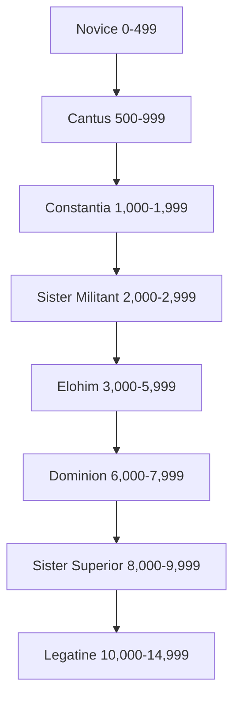

*"With Faith and Fire."*

— First Maxim of the Soroitas

The Militant Orders of the Adepta Sororitas are composed of women whose dedication to the Imperial Creed is above suspicion. The Orders Militant are filled with the Sisters of Battle, who as a whole comprise the sole standing force of arms the Ecclesiarchy is permitted to maintain. In combat, forces of the Sisters of Battle have few peers, able to turn back armies of Orks or renegade Imperial Guardsmen. As servants of the Ecclesiarchy, Inquisitors often request their talents as part of a cell of Acolytes, serving as a tactical weapon of faith. Indeed, the Sisters of Battle form the Chamber Militant of the Ordo Hereticus, and Hereticus Inquisitors find them especially useful, as their faith in the God-Emperor of Mankind makes them perfect tools for use against the enemy within. Inquisitors of other Holy Ordos will use Sisters of Battle from time to time to join their Acolyte cells both to root out the heretic but also to maintain the faith of a those in the Inquisitor’s employ.

The Sisters of Battle train extensively with the weapons of the Emperor, and only the Space Marines of the Adeptus Astartes can claim greater mastery with the boltgun. So honed is their tactical expertise and so resolute is their faith in the Master of Mankind that a Sister of Battle can stand firm in the face of things that would make even veteran Guardsmen blanch, while her power armour protects her body from all matters of infantry weapons. Although a Battle Sister's wargear is some of the best money can buy, her most powerful weapon and strongest shield is her faith—she is no mere soldier, but a living icon of the Imperial Creed.

The origins of the Sisters of Battle lie in the dark days of the Age of Apostasy, when the renegade High Lord of Terra Goge Vandire co-opted the Daughters of the Emperor into his personal bodyguard. Once feared and reviled as Vandire's most loyal and ruthless enforcers, their betrayal of the mad High Lord came at a critical moment that guaranteed the ascension of the reformist Sebastian Thor, who would go on to lead the shattered Imperium out of the 70-year internecine slaughter of the Reign of Blood. Their modern form, reorganised as the militant arm of the Adepta Soroitas, took shape as part of Thor's reformations that ended the wars of religious schism and, not coincidentally, gave birth to the Ordo Hereticus of the Inquisition. They owe their power in no small part to Thor's Decree Passive that prevents the Ministorum from raising permanent bodies of "men under arms", a harsh rebuke for the Ecclesiarchy's duplicity with Vandire's Reign of Blood. With the Ecclesiarchy's standing armies of Frateris Templars and fleets of warships disbanded, the Soroitas were given the task of defending the much-reduced organisation, and by association the Imperial faith itself, from direct threat.

Bound by harsh and restrictive religious oaths and ingrained zealotry from years spent in fortress-like convents, Battle Sisters are some of the finest warriors in the entire Imperium. Any group would be honoured to have such a pillar of faith and martial prowess among them, although some Sisters may have a harder time with the more subtle aspects of the Inquisition’s holy works. If assigned to an Acolyte cell, a Battle Sister's presence may reduce their ability to travel incognito. Any Imperial citizens who recognise her singular provenance are likely to ask for advice in matters of faith or minor blessings, which while righteous and good, could be quite troublesome if her cell was trying to maintain a low profile.
### Table: Battle Sister Characteristic Advances
| Characteristic  | Simple | Intermediate | Trained | Expert |
| --------------- | :----: | :----------: | :-----: | :----: |
| Weapon Skill    |  250   |     500      |   750   | 1,000  |
| Ballistic Skill |  100   |     250      |   500   |  750   |
| Strength        |  250   |     500      |   750   | 1,000  |
| Toughness       |  500   |     750      |  1,000  | 2,500  |
| Agility         |  250   |     500      |   750   | 1,000  |
| Intelligence    |  500   |     750      |  1,000  | 2,500  |
| Perception      |  250   |     500      |   750   | 1,000  |
| Willpower       |  100   |     250      |   500   |  750   |
| Fellowship      |  250   |     500      |   750   | 1,000  |
### Weapon Requisition

Sisters of Battle are servants of the Ecclesiarchy in the truest sense. They do not receive a monthly income from the Adeptus Ministorum, and as a Battle Sister cares little for personal wealth, any largess from an Inquisitor would likely be donated to her fellow Acolytes or the nearest church.
Battle Sisters in service to the Inquisition have their equipment provided for them as they require
it, drawn from the reserves of the Ecclesiarchy's voluminously deep coffers. A Battle Sister may replenish her weapons and ammunition any time she is able to visit an Order Militant convent or any other well-stocked bastion of an Imperial Adepta—given the admirable reputation of the Soroitas, few pursers would begrudge sending one off with some munitions to aid her holy work.

A Sister of Battle is expected to return equipment she is not regularly using, and rarely carries more than two weapons at any time. As she ascends in rank and authority within the Sisterhood she is granted access to more specialised and destructive weapons, and certain [Alternate Career Ranks](battle%20sister.md#battle%20sister%20alternate%20career%20ranks) increase the type and number of weapons she may requisition as well. All weapon requisitions include two reloads of ammunition unless otherwise stated.

* At Rank 1 she may requisition a Godwyn-De'az boltgun, three frag or krak grenades, or any "lesser" weapon she has the appropriate training Talent with, such as a lasgun or hunting rifle. This may be of particular utility for Sisters serving as Inquisitorial Acolytes.
* At Rank 2 she may requisition a Godwyn-De'az bolt pistol, a flamer, or a Best craftsmanship sword.
* At Rank 3 she may requisition a hand flamer or a chainsword.
* At Rank 4 she may requisition a meltagun or three thermal grenades.
* At Rank 5 she may requisition a power sword.
* At Rank 6 she may requisition a Godwyn-De'az storm bolter.
* At Rank 7 she may requisition a plasma pistol. If desired, she may "upgrade" her Godwyn-De'az boltgun into a combi-flamer.
## Battle Sister Ranks

## **Novice Advances**

*"It is not enough to serve the Emperor, or even to love Him. You must give to Him all you have had, all that you ever shall have. To give over utterly and entirely to His divine will and become a vessel of that will. Only then is your sacrifice fitting."*

— excerpt from the *Rule of Soroitas*

The Rule is harsh and a novice sister must endure many hardships during her training. Self-denial, rigid discipline, and introspective religious contemplation are indivisible parts of their nature. They are armed not only with the skills needed to defend the Ministorum, but also with training that teaches them to fan the flames of faith to a roaring blaze.

| Advance                                                             | Cost |  Type  | Prerequisites |
| ------------------------------------------------------------------- | :--: | :----: | :------------ |
| [Awareness](Skills.md#awareness)                                    | 100  | Skill  | —             |
| [Climb](Skills.md#climb)                                            | 100  | Skill  | —             |
| [Common Lore (Ecclesiarchy)](Skills.md#common%20lore)               | 100  | Skill  | —             |
| [Common Lore (Imperial Creed)](Skills.md#common%20lore)             | 100  | Skill  | —             |
| [Performer (Singer)](Skills.md#performer)                           | 100  | Skill  | —             |
| [Trade (Copyist)](Skills.md#trade)                                  | 100  | Skill  | —             |
| [Basic Weapon Training (Las)](Talents.md#basic%20weapon%20training) | 100  | Talent | —             |
| [Basic Weapon Training (SP)](Talents.md#basic%20weapon%20training)  | 100  | Talent | —             |
| [Forbidden Lore (Heresy)](Skills.md#forbidden%20lore)               | 200  | Skill  | —             |
| [Flagellant](Talents.md#flagellant)                                 | 200  | Talent | —             |
| [Pistol Training (Las)](Talents.md#pistol%20training)               | 200  | Talent | —             |
| [Pistol Training (SP)](Talents.md#pistol%20training)                | 200  | Talent | —             |
| [Sound Constitution](Talents.md#sound%20constitution)†              | 200  | Talent | —             |
| [Faith Talent](the%20power%20of%20faith.md#faith%20talents)†        | 300  | Talent | Varies        |
†*You may select this Talent twice at this Rank.*
## **Cantus Advances**

*"It is not our place to forgive the heretic, but we are obligated to pray for his soul as his ashes ascend from the pyre."*

— excerpt from the *Book of Castigations*

A sister's noviciate may last a year or longer, during which she continues to hone her skill at arms and focus her faith on destroying the enemies of Mankind. Although she has already been chosen to serve in the Orders Militant, the Adepta demands she still know at least the fundamentals of the other Orders as well, so as to make her a better tool in the Emperor's hand.

| Advance                                                               | Cost |  Type  | Prerequisites      |
| --------------------------------------------------------------------- | :--: | :----: | :----------------- |
| [Intimidate](Skills.md#intimidate)                                    | 100  | Skill  | —                  |
| [Performer (Singer) +10](Skills.md#performer)                         | 100  | Skill  | Performer (Singer) |
| [Tech-Use](Skills.md#tech-use)                                        | 100  | Skill  | —                  |
| [Trade (Copyist)](Skills.md#trade)                                    | 100  | Skill  | —                  |
| [Pistol Training (Bolt)](Talents.md#pistol%20training)                | 100  | Talent | —                  |
| [Quick Draw](Talents.md#quick%20draw)                                 | 100  | Talent | —                  |
| [Forbidden Lore (Ordo Hereticus)](Skills.md#forbidden%20lore)         | 200  | Skill  | —                  |
| [Scrutiny](Skills.md#scrutiny)                                        | 200  | Skill  | —                  |
| [Secret Tongue (Soroitas War Cant)](Skills.md#secret%20tongue)        | 200  | Skill  | —                  |
| [Scholastic Lore (Archaic)](Skills.md#scholastic%20lore)              | 200  | Skill  | —                  |
| [Scholastic Lore (Philosophy)](Skills.md#scholastic%20lore)           | 200  | Skill  | —                  |
| [Basic Weapon Training (Flame)](Talents.md#basic%20weapon%20training) | 200  | Talent | —                  |
| [Hatred (Heretics)](Talents.md#hatred)                                | 200  | Talent | —                  |
| [Hatred (Mutants)](Talents.md#hatred)                                 | 200  | Talent | —                  |
| [Hatred (Psykers)](Talents.md#hatred)                                 | 200  | Talent | —                  |
| [Sound Constitution](Talents.md#sound%20constitution)                 | 200  | Talent | —                  |
| [Thrown Weapon Training](Talents.md#thrown%20weapon%20training)       | 200  | Talent | —                  |
| [Faith Talent](the%20power%20of%20faith.md#faith%20talents)           | 300  | Talent | Varies             |
## **Constantia Advances**

*"The Emperor is our father, our guardian, but we must also guard him."*

— Saint Alicia Dominica

As the Battle Sister prepares to end her noviciate she fully develops her manual of arms before studying the basics of squad-based combat manoeuvres, beginning down the path of one who will issue orders instead of only obey them. She also confirms her complete devotion to the Imperial Creed in the eyes of her superiors, for going forward there can be no doubts.

| Advance                                                               | Cost |  Type  | Prerequisites                |
| --------------------------------------------------------------------- | :--: | :----: | :--------------------------- |
| [Common Lore (Ecclesiarchy) +10](Skills.md#common%20lore)             | 100  | Skill  | Common Lore (Ecclesiarchy)   |
| [Common Lore (Imperial Creed) +10](Skills.md#common%20lore)           | 100  | Skill  | Common Lore (Imperial Creed) |
| [Dodge](Skills.md#dodge)                                              | 100  | Skill  | —                            |
| [Drive (Ground Vehicle)](Skills.md#drive)                             | 100  | Skill  | —                            |
| [Melee Weapon Training (Chain)](Talents.md#melee%20weapon%20training) | 100  | Talent | —                            |
| [Awareness +10](Skills.md#awareness)                                  | 200  | Skill  | Awareness                    |
| [Search](Skills.md#search)                                            | 200  | Skill  | —                            |
| [Ambidextrous](Talents.md#ambidextrous)                               | 200  | Talent | Ag 30                        |
| [Hatred (Abhumans)](Talents.md#hatred)                                | 200  | Talent | —                            |
| [Hatred (Radical Inquisitors)](Talents.md#hatred)                     | 200  | Talent | —                            |
| [Hatred (Xenos)](Talents.md#hatred)                                   | 200  | Talent | —                            |
| [Meditation](Talents.md#meditation)                                   | 200  | Talent | —                            |
| [Mighty Shot](Talents.md#mighty%20shot)                               | 200  | Talent | BS 40                        |
| [Pistol Training (Flame)](Talents.md#pistol%20training)               | 200  | Talent | —                            |
| [Rapid Reload](Talents.md#rapid%20reload)                             | 200  | Talent | —                            |
| [Sound Constitution](Talents.md#sound%20constitution)                 | 200  | Talent | —                            |
| [Unshakeable Faith](Talents.md#unshakeable%20faith)                   | 200  | Talent | —                            |
| [Faith Talent](the%20power%20of%20faith.md#faith%20talents)           | 300  | Talent | Varies                       |
| [Heavy Weapon Training (Bolt)](Talents.md#heavy%20weapon%20training)  | 300  | Talent | —                            |
| [Resistance (Psychic Powers)](Talents.md#resistance)                  | 300  | Talent | —                            |
## **Sister Militant Advances**

*"Heretics crave the cleansing fire of absolution. They need not fear that we shan't deliver."*

— Axiom First, attributed to Canoness Helflax of the Order of the Argent Shroud

Now a fully vested Sister of Battle, her noviciate is completed, and she takes to the field with a fireteam of new novices under her wing so that they may learn from her just as she has learned from her betters. Sister Militants form the main fighting force of Soroitas preceptories deployed to aid the Ecclesiarchy's wars of faith or when prosecuting an Inquisitorial purge, and those who develop particular affinities for certain aspects of warfare will go on to join elite units to more fully specialise in the art of destruction.

| Advance                                                               | Cost |  Type  | Prerequisites                          |
| --------------------------------------------------------------------- | :--: | :----: | :------------------------------------- |
| [Climb +10](Skills.md#climb)                                          | 100  | Skill  | Climb                                  |
| [Common Lore (Imperuim)](Skills.md#common%20lore)                     | 100  | Skill  | —                                      |
| [Common Lore (War)](Skills.md#common%20lore)                          | 100  | Skill  | —                                      |
| [Literacy +10](Skills.md#literacy)                                    | 100  | Skill  | Literacy                               |
| [Command](Skills.md#command)                                          | 200  | Skill  | —                                      |
| [Crack Shot](Talents.md#crack%20shot)                                 | 200  | Skill  | BS 40                                  |
| [Forbidden Lore (Heresy) +10](Skills.md#forbidden%20lore)             | 200  | Skill  | Forbidden Lore (Heresy)                |
| [Forbidden Lore (Psykers)](Skills.md#forbidden%20lore)                | 200  | Skill  | —                                      |
| [Basic Weapon Training (Melta)](Talents.md#basic%20weapon%20training) | 200  | Talent | —                                      |
| [Cleanse and Purify](Talents.md#cleanse%20and%20purify)               | 200  | Talent | Basic Weapon Training (Flame)          |
| [Sound Constitution](Talents.md#sound%20constitution)                 | 200  | Talent | —                                      |
| [Armour of Contempt](Talents.md#armour%20of%20contempt)               | 300  | Talent | WP 40                                  |
| [Arms Master](Talents.md#arms%20master)                               | 300  | Talent | BS 30, Basic Weapon Training (any two) |
| [Faith Talent](the%20power%20of%20faith.md#faith%20talents)           | 300  | Talent | Varies                                 |
| [Heavy Weapon Training (Flame)](Talents.md#heavy%20weapon%20training) | 300  | Talent | —                                      |
| **Litany of Battle**                                                  | 300  | Talent | Fel 30                                 |
| [Hardy](Talents.md#hardy)                                             | 400  | Talent | —                                      |
#### **Talent: Litany of Battle**
**Prerequisites:** Fellowship 30

The Battle Sister knows hundreds of litanies and always recites exactly the most appropriate verse in battle, bolstering her allies with the wisdom of saints. The Sister of Battle may spend a Fate Point to allow an ally who can hear her to re-roll a failed Weapon Skill or Ballistic skill Test. Characters may still only re-roll a Test once.
## **Elohiem Advances**

*"There can be no remorse or relent in the war for men's souls."*

— ancient Terran proverb

Sister Militants who have honourably shed blood in the Emperor's name are granted the honorific mark of Elohiem, a further demonstration of her piety and faith in the Master of Mankind. Now a veteran combatant, the Sister of Battle brings a steely determination to her trade, and her fellow Sister Militants look to her for guidance on cunning battlefield manoeuvres and greater proficiency at arms.

| Advance                                                               | Cost |  Type  | Prerequisites                    |
| --------------------------------------------------------------------- | :--: | :----: | :------------------------------- |
| [Common Lore (Ecclesiarchy) +20](Skills.md#common%20lore)             | 100  | Skill  | Common Lore (Ecclesiarchy) +10   |
| [Common Lore (Imperial Creed) +20](Skills.md#common%20lore)           | 100  | Skill  | Common Lore (Imperial Creed) +10 |
| [Dodge +10](Skills.md#dodge)                                          | 100  | Skill  | Dodge                            |
| [Literacy +20](Skills.md#literacy)                                    | 100  | Skill  | Literacy +10                     |
| [Nerves of Steel](Talents.md#nerves%20of%20steel)                     | 100  | Talent | —                                |
| [Awareness +20](Skills.md#awareness)                                  | 200  | Skill  | Awareness +10                    |
| [Common Lore (War) +10](Skills.md#common%20lore)                      | 200  | Skill  | Common Lore (War)                |
| [Drive (Hover Vehicle)](Skills.md#drive)                              | 200  | Skill  | —                                |
| [Scrutiny +10](Skills.md#scrutiny)                                    | 200  | Skill  | Scrutiny                         |
| [Search +10](Skills.md#search)                                        | 200  | Skill  | Search                           |
| [Silent Move](Skills.md#silent%20move)                                | 200  | Skill  | —                                |
| [Tech-Use +10](Skills.md#tech-use)                                    | 200  | Skill  | Tech-Use                         |
| [Hip Shooting](Talents.md#hip%20shooting)                             | 200  | Talent | BS 40, Ag 40                     |
| [Jaded](Talents.md#jaded)                                             | 200  | Talent | WP 30                            |
| [Melee Weapon Training (Power)](Talents.md#melee%20weapon%20training) | 200  | Talent | —                                |
| [Sound Constitution](Talents.md#sound%20constitution)                 | 200  | Talent | —                                |
| [Die Hard](Talents.md#die%20hard)                                     | 300  | Talent | WP 40                            |
| [Faith Talent](the%20power%20of%20faith.md#faith%20talent)†           | 300  | Talent | Varies                           |
| [Marksman](Talents.md#marksman)                                       | 300  | Talent | BS 35                            |
†*You may select this Talent twice at this Rank.*
## **Dominion Advances**

*"In fury, faith; in hatred, purpose; in battle, honour; in death, a martyr's end."*

— excerpt from the *Book of Indoctrinations*

Sister Militants who excel with the holy bolter and the Soroitas fireteam tactics, settling in to a comfortable mastery of the manual of arms, are likely to become specialist Dominions. Squads of these highly talented and proficient warriors are equipped with the most powerful infantry weapons the Adepta possesses and are sent into battle as breakthrough units, where their concentrated firepower can inflict maximum damage on weakening enemy positions.

| Advance                                                               | Cost |  Type  | Prerequisites               |
| --------------------------------------------------------------------- | :--: | :----: | :-------------------------- |
| [Heightened Senses (Hearing)](Talents.md#heightened%20senses)         | 100  | Talent | —                           |
| [Heightened Senses (Sight)](Talents.md#heightened%20senses)           | 100  | Talent | —                           |
| [Insanely Faithful](Talents.md#insanely%20faithful)                   | 100  | Talent | —                           |
| [Ciphers (Soroitas War Cant) +10](Skills.md#ciphers)                  | 200  | Skill  | Ciphers (Soroitas War Cant) |
| [Command +10](Skills.md#command)                                      | 200  | Skill  | Command                     |
| [Drive (Ground Vehicle) +10](Skills.md#drive)                         | 200  | Skill  | Drive (Ground Vehicle)      |
| [Scholastic Lore (Imperial Creed)](Skills.md#scholastic%20lore)       | 200  | Skill  | —                           |
| [Scholastic Lore (Tactica Imperialis)](Skills.md#scholastic%20lore)   | 200  | Skill  | —                           |
| [Deadeye Shot](Talents.md#deadeye%20shot)                             | 200  | Talent | BS 30                       |
| [Light Sleeper](Talents.md#light%20sleeper)                           | 200  | Talent | Per 30                      |
| [Peer (Adepta Soroitas)](Talents.md#peer)                             | 200  | Talent | Fel 30                      |
| [Sound Constitution](Talents.md#sound%20constitution)                 | 200  | Talent | —                           |
| [Search +20](Skills.md#search)                                        | 300  | Skill  | Search +10                  |
| [Faith Talent](the%20power%20of%20faith.md#faith%20talents)†          | 300  | Talent | Varies                      |
| [Heavy Weapon Training (Melta)](Talents.md#heavy%20weapon%20training) | 300  | Talent | —                           |
| [Litany of Hate](Talents.md#litany%20of%20hate)                       | 300  | Talent | Hatred                      |
| **Tests of Faith**                                                    | 300  | Talent | WP 30                       |
†*You may select this Talent twice at this Rank.*
#### **Talent: Tests of Faith**
**Prerequisites:** Willpower 30

The Battle Sister’s faith has been repeatedly tested in the fires of combat and emerged tempered
and sharpened. Once per game session the Battle Sister may activate an Emperor’s Wrath Faith Talent without spending a Fate Point. The effect activates as normal as if the character had spent a Fate Point. The Fate Point is still lost if she burns it, however.
## **Sister Superior Advances**

*"Come sisters, rejoice and be glad, for before this day ends we shall be at our Father's side."*

— Sister Superior Lucrezia Bask at the last stand on Gallowglass

Becoming a Sister Superior is not only a high honour within the Adepta Soroitas, but a firm recognition of a Battle Sister's ability to lead and inspire those who answer to her. The Superiors form the lower cadre of the Adepta's officer class. In combat, a Sister Superior commands full squads of Militants, Seraphims, and Retributors in battle, leading by example and driving furious assaults against the God-Emperor's enemies. At the convent, the Sister Superior is a spiritual leader, enforcing obedience to the Rule and providing counsel to those whose faith shows any signs of wavering.

| Advance                                                                  | Cost |  Type  | Prerequisites                 |
| ------------------------------------------------------------------------ | :--: | :----: | :---------------------------- |
| [Climb +20](Skills.md#climb)                                             | 100  | Skill  | Climb +10                     |
| [Command +20](Skills.md#command)                                         | 100  | Skill  | Command +10                   |
| [Charm](Skills.md#charm)                                                 | 200  | Skill  | —                             |
| [Scholastic Lore (Archaic) +10](Skills.md#scholastic%20lore)             | 100  | Skill  | Scholastic Lore (Archaic)     |
| [Scholastic Lore (Bureaucracy)](Skills.md#scholastic%20lore)             | 200  | Skill  | —                             |
| [Scholastic Lore (Imperial Creed) +10](Skills.md#scholastic%20lore)      | 200  | Skill  | S. Lore (Imperial Creed)      |
| [Scholastic Lore (Tactical Imperialis) +10](Skills.md#scholastic%20lore) | 200  | Skill  | S. Lore (Tactical Imperialis) |
| [Scrutiny +20](Skills.md#scrutiny)                                       | 200  | Skill  | Scrutiny +10                  |
| [Search +20](Skills.md#search)                                           | 200  | Skill  | Search +10                    |
| [Tech-Use +10](Skills.md#tech-use)                                       | 200  | Skill  | Tech-Use                      |
| [Counter-attack](Talents.md#counter-attack)                              | 200  | Talent | WS 40                         |
| [Fearless](Talents.md#fearless)                                          | 200  | Talent | —                             |
| [Nerves of Steel](Talents.md#nerves%20of%20steel)                        | 200  | Talent | —                             |
| [Sharpshooter](Talents.md#sharpshooter)                                  | 200  | Talent | —                             |
| [Sound Constitution](Talents.md#sound%20constitution)                    | 200  | Talent | —                             |
| [Air of Authority](Talents.md#air%20of%20authority)                      | 300  | Talent | Fel 30                        |
| [Faith Talent](the%20power%20of%20faith.md#faith%20talents)              | 300  | Talent | Varies                        |
| [Iron Discipline](Talents.md#iron%20discipline)                          | 300  | Talent | WP 30, Command                |
## **Legatine Advances**

*"Though doubts assail you, though the storms of war engulf you, though all your past certainties be proved empty lies, take strength and fear not. He is with us—the Emperor, our God! Against Him no army shall stand, no tyrant shall endure, and no heresy shall go unpunished. Fear not because we stand with you, His daughters of cleansing fire and unyielding adamant, the bearers of His sacred wrath!"*

— Canoness Jocasta Vail's Sermon Extremis, at the Second Siege of Vaxanide

Sister Superiors who show exceptional battlefield leadership are likely to be given the honorific title of Legatine. These Sisters act as the direct liaisons of their Order's Canonesses, seeing to it that their commands are carried out by the Sister Militants and maintaining battlefield order and discipline. If a detachment is cut off from the main force of the preceptory the Legatine is expected to assume command, and those who show consistent merit almost always become Palatines in time.

| Advance                                                                  | Cost |  Type  | Prerequisites                     |
| ------------------------------------------------------------------------ | :--: | :----: | :-------------------------------- |
| [Common Lore (War) +20](Skills.md#common%20lore)                         | 100  | Skill  | Common Lore (War) +10             |
| [Scholastic Lore (Tactical Imperialis) +20](Skills.md#scholastic%20lore) | 100  | Skill  | S. Lore (Tactical Imperialis) +10 |
| [Scholastic Lore (Archaic) +20](Skills.md#scholastic%20lore)             | 100  | Skill  | Scholastic Lore (Archaic) +10     |
| [Scholastic Lore (Bureaucracy) +10](Skills.md#scholastic%20lore)         | 200  | Skill  | Scholastic Lore (Bureaucracy)     |
| [Scholastic Lore (Imperial Creed) +20](Skills.md#scholastic%20lore)      | 200  | Skill  | S. Lore (Imperial Creed) +10      |
| [Blind Fighting](Talents.md#blind%20fighting)                            | 200  | Talent | Per 30                            |
| [Foresight](Talents.md#foresight)                                        | 200  | Talent | Int 30                            |
| [Sound Constitution](Talents.md#sound%20constitution)†                   | 200  | Talent | —                                 |
| [Drive (Ground Vehicle) +20](Skills.md#drive)                            | 300  | Skill  | Drive (Ground Vehicle) +10        |
| [Forbidden Lore (Psykers) +10](Skills.md#forbidden%20lore)               | 300  | Skill  | Forbidden Lore (Psykers)          |
| [Faith Talent](the%20power%20of%20faith.md#faith%20talents)              | 300  | Talent | Varies                            |
| [Into the Jaws of Hell](Talents.md#into%20the%20jaws%20of%20hell)        | 300  | Talent | Iron Discipline                   |
| [Peer (Ecclesiarchy)](Talents.md#peer)                                   | 300  | Talent | Fel 30                            |
| **Miraculous Survival**                                                  | 400  | Talent | —                                 |
†*You may select this Talent twice at this Rank.*
#### **Talent: Miraculous Survival**

The Sister of Battle is not merely protected by her faith in the Emperor—it is clear to all that He has plans for her and she will not die until He ordains it. When the Sister of Battle burns a Fate Point to avoid death, she stands up (or climbs her way out of the rubble, etc.) at the beginning of her next action completely unharmed in any way. She has full Wounds, no Fatigue, and is cured of any Critical Effects that she has sustained, even if the damage was incurred before the event that would have caused her death.
# **Battle Sister Alternate Career Ranks**

The following Alternate Career Ranks may be selected by Battle Sisters.
#### **Table: Battle Sister Alternate Career Ranks**
| Name                                                                    | Minimum Rank |
| ----------------------------------------------------------------------- | :----------: |
| [Agent of Reliquary 26](battle%20sister.md#agent%20of%20reliquary%2026) |      4       |
| [Celestian](battle%20sister.md#celestian)                               |      5       |
| [Ordo Sicarius Initiate](battle%20sister.md#ordo%20sicarius%20initiate) |      4       |
| [Retributor](battle%20sister.md#retributor)                             |      5       |
| [Seraphim](battle%20sister.md#seraphim)                                 |      5       |
| [Sister Repentia](battle%20sister.md#sister%20repentia)                 |      4       |
| [Slate-Agent](battle%20sister.md#slate-agent)                           |      6       |
## **Agent of Reliquary 26**

*“Ours is not an easy task. We gather those most important relics, those symbols of the culture of Mankind. We dare the darkness and travel across the stars clinging to rumour and legend as our guide.”*

— Marcius Dans, Agent of Reliquary 26
### **Background**
Entombed more than a hundred metres beneath the Inquisition's majestic if imposing Tricorn Palace is the Grand Reliquarium, a series of vaults that are home to many artefacts and powerful relics of the Calixis Sector. In these hallowed halls rest hundreds of items of power, from crafted trinkets of the Dark Age of Technology to the blessed weapons of venerable martyrs or even saints. Each of these vaults, of which reliable sources claim there at at least one hundred, are heavily guarded, monitored, and tended to by the Custodiatrix, a small organisation of curator-assassins, each charged with the safety of the artefacts and assigned to one of the vaults. Reliquary 26 contains the relics of the Scholariate at Arms.

In addition to housing artefacts, Reliquary 26 also employs a great number of Agents, men and women who scour the Calixian worlds in search of more items of renown to add to the vaunted collection. Whether through negotiation, deception, or violence, the goal of these Agents is a simple one: ensure the safety and survival of the relics of Man. To do so, they must first identify such items of power, decide whether or not the current ownership is valid, and reclaim the item in question, by force if necessary. Often, Agents act alone or in pairs, though it is not uncommon for an entire cadre of mercenaries to be hired if an acquisition proves particularly difficult. It is rumoured that that the Scholariate at Arms once hired an entire house of assassins to reclaim a relic from the blessed armour of Saint Drusus, though the veracity of such a rumour could never be proven.

As one might expect, Agents of Reliquary 26 are very well outfitted. Although they are relatively unknown as an organisation, members often find themselves at odds with Calixian nobles, Ecclesastical prelates, Rogue Traders, and mercantile magnates—individuals who often value their possessions and do not wish to part with them simply because the Inquisition asks nicely. As a result, many Agents have at least one or two enemies in the upper echelons of Imperial society. Though the agency does attempt to reimburse the owners of the relics they acquire, it is not uncommon for them to have to pry the artefact in question from the lifeless fingers of some greedy soul that simply couldn't part with it for any amount of compensation.

Reliquary 26 works quite closely with the larger Ordos of the Inquisition. Often, Inquisitors find themselves with items of interest left over from an investigation. In exchange for the safe return of any relics or artefacts found by an Inquisitor in the course of his duties, Reliquary 26 will often return the favour by loaning out an item of great power. Many Inquisitors are quite content to employ Agents of Reliquary 26 in their Acolyte cells, profiting from the Agents' access to rare and often powerful devices while maintaining a mutually-beneficial relationship with the Custodiatrix. 
### **Becoming an Agent of Reliquary 26**
An experienced servant of Reliquary 26 is an indispensable resource to an Acolyte cell. When dealing with nobility or other well-to-do types, or in areas where ancient or xenos technology may
be encountered, an Inquisitor would be well served by requisitioning an Agent of Reliquary 26's services. Such Agents usually only serve the Inquisitor the duration of the investigation at hand. Inquisitors who must regularly navigate such treacherous situations have been known to second a trusted Acolyte to the Custodiatrix to be trained in their ways, effectively gaining a permanent "representative" to Reliquary 26's hallowed armoury. As the point of contact between the Grand Reliquarium and the often covetous owners of the sought-after artefacts, most Agents become quite adept at negotiation and tradecraft. Such skills can be invaluable to an Acolyte cell, especially in situations where a hostile acquisition could be more troublesome than normal.

**Required Career:** Any Career
**Alternate Rank:** Rank 4 or higher (2,000 xp)
**Other Requirements:** Must have acquired one item of Near Unique Availability or rarer, and turned it over to his Inquisitor or directly to the Grand Reliquarium.
**Aggrieved Parties:** Even if the character has not personally wronged them, at least one group of well-heeled individuals gravely dislikes Reliquary 26. The character gains the [Rival (Ecclesiarchy), (Nobility), or (Rogue Trader)](talents.md#rival) Talent at the GM's discretion.
**Reliquary Loan:** The Grand Reliquarium has resources that include ancient and exotic equipment that is sometimes entrusted to Acolytes serving an Inquisitor. At the beginning of each mission the character gains one valuable item determined by the GM. Unless the character receives some special dispensation, the item must be returned after the mission, with grave consequences for those who try to deprive the Reliquarium of their property. The GM should choose an item that they feel is appropriate to the Acolyte's mission.
#### **Table: Agent of Reliquary 26 Advances**
| Advance                                                                        | Cost |  Type  | Prerequisites  |
| ------------------------------------------------------------------------------ | :--: | :----: | -------------- |
| [Barter](skills.md#barter)                                                     | 100  | Skill  | —              |
| [Barter +10](skills.md#barter)                                                 | 100  | Skill  | Barter         |
| [Charm](skills.md#charm)                                                       | 100  | Skill  | —              |
| [Chem-Use](skills.md#chem-use)                                                 | 100  | Skill  | —              |
| [Chem-Use +10](skills.md#chem-use)                                             | 100  | Skill  | Chem-Use       |
| [Deceive](skills.md#deceive)                                                   | 100  | Skill  | —              |
| [Deceive +10](skills.md#deceive)                                               | 100  | Skill  | Deceive        |
| [Evaluate](skills.md#evaluate)                                                 | 100  | Skill  | —              |
| [Evaluate +10](skills.md#evaluate)                                             | 100  | Skill  | Evaluate       |
| [Inquiry](skills.md#inquiry)                                                   | 100  | Skill  | —              |
| [Inquiry +10](skills.md#inquiry)                                               | 100  | Skill  | Inquiry        |
| [Scholastic Lore (Archaic)](skills.md#scholastic%20lore)                       | 100  | Skill  | —              |
| [Scrutiny](skills.md#scrutiny)                                                 | 100  | Skill  | —              |
| [Search](skills.md#search)                                                     | 100  | Skill  | —              |
| [Search +10](skills.md#search)                                                 | 100  | Skill  | —              |
| [Trade (Technomat)](skills.md#trade)                                           | 100  | Skill  | —              |
| [Air of Authority](talents.md#air%20of%20authority)                            | 100  | Talent | —              |
| [Chem Geld](talents.md#chem%20geld)                                            | 100  | Talent | —              |
| [Exotic Weapon Training *(choose one)*](talents.md#exotic%20weapon%20training) | 100  | Talent | —              |
| [Command](skills.md#command)                                                   | 200  | Skill  | —              |
| [Forbidden Lore (Archeotech)](skills.md#forbidden%20lore)                      | 200  | Skill  | —              |
| [Intimidate](skills.md#intimidate)                                             | 200  | Skill  | —              |
| [Tech-Use](skills.md#tech-use)                                                 | 200  | Skill  | —              |
| [Foresight](talents.md#foresight)                                              | 200  | Talent | —              |
| [Iron Discipline](talents.md#iron%20discipline)                                | 200  | Talent | WP 30, Command |
## **Celestian**

*“Malefic I name thee, oh serpent under mine heel. Scorn I give thee. My spite I pour on thee and with my hate I stab at thee—burn now Daemon in my sight!”*

— Chietwynd-Machen Antiphony, Chamber Militant Rites of Exorcism
### **Background**
Battle Sisters who have proven themselves to have exceptional battlefield prowess and bravery are often rewarded with the title of Celestian, an appellation that denotes honourable service above even the high expectations of the Adepta Soroitas. Using training and techniques that have been passed down for millennia and honed by generations of Battle Sisters, a Celestian is among the Adepta's most dangerous and capable warriors. Celestians are ferocious fighters whose burning hatred of the Emperor’s enemies makes them formidable foes in combat. They are fervent adherents to the Imperial Creed and skilled practitioners of the martial disciplines of the Daughters of the Emperor of old.

A Celestian is not set aside from her sisters by the wargear she carries, but by her sheer dedication to the goals of her Order and the zeal with which she persecutes her enemies. When committed to battle, the Celestian dispenses with restraint and stoicism and unleashes her rage against her foes along with her bullets, bolts, and blades—with terrifyingly efficient results. When a preceptory of the Sisters of Battle takes to the field Celestian squads will typically be called upon to areas of the greatest need, counter-attacking flank assaults or plugging breaches in the preceptory's positions. This often places Celestians in great peril, and numerous martyrs of the Orders Militant—including all of the Seventeen Martyrs of Gallowglass—were Celestians in life.

To be a Celestian is no mere title or award, but to become a revered figure by the Sisterhood, someone who is believed to be genuinely touched by the Emperor and destined to serve some great purpose in His name. It is commonly believed that the Emperor's hand guides their blows and helps them stand their ground when others would falter and run. Outside of battle Celestians are looked to for spiritual guidance in times of weakness of faith, and they are typically afforded the same level of honour and respect as a Palatine of their Order.

If the stories and rumours are true, Celestians have accomplished many of the more miraculous events in the history of the Sisterhood in the Calixis Sector. From the Last Stand on Gallowglass to the Purifying of Lind, stories of the Celestians are found everywhere, each one telling nigh impossible tales of divine feats of bravery and irreproachable honour in service. In more recent times, Calixian Celestians of the Order of the Valorous Heart have performed inexplicable feats of heroism during the conflicts on Protasia and 47 Kapella, with the Canoness Constance holding them in especially high regard for turning the tide of several pitched battles.
### **Becoming a Celestian**
Any Battle Sister who conducts herself with great zeal in combat could be considered by the mistresses of her Order as a potential Celestian. Those who receive the title must show absolute fealty to the Imperial Creed, not out of a sense of obligation or duty, but because they know the supremacy of the Master of Mankind deep in their hearts. This zealotry burns in the Celestian's very soul, compelling her to take the fight to the God-Emperor's enemies wherever they may lurk. In a Celestian's eyes the heretic, alien, and witch must perish to atone for its crimes—this is the absolute will of the Emperor Himself.

Celestians receive further training in close combat and more aggressively offensive tactics, some of which were once used by Daughters of the Emperor millennia ago. This style of combat, though archaic by the standards of the Sisters of Battle, is well suited for the Celestian's unyielding hate and desire to punish the Emperor's foes as harshly as possible.

Upon becoming a Celestian, the Battle Sister gains the **Holy Hatred Talent**.

**Required Career:** Battle Sister
**Alternate Rank:** Rank 5 or higher (3,000 xp)
**Other Requirements:** WS 35, BS 30, Hatred Talent (any two)
**Holy Armoury:** The Celestian may requisition an inferno pistol or a power axe at Rank 6 and a power longsword at Rank 7. 
#### **Table: Celestian Advances**
| Advance                                                               | Cost |  Type  | Prerequisites                     |
| --------------------------------------------------------------------- | :--: | :----: | --------------------------------- |
| [Common Lore (War) +10](Skills.md#common%20lore)                      | 100  | Skill  | Common Lore (War)                 |
| [Dodge +10](Skills.md#dodge)                                          | 100  | Skill  | Dodge                             |
| [Nerves of Steel](Talents.md#nerves%20of%20steel)                     | 100  | Talent |                                   |
| [Two-Weapon Wielder (Ballistic)](Talents.md#two-weapon%20wielder)     | 100  | Talent | BS 35, Ag 35                      |
| [Two-Weapon Wielder (Melee)](Talents.md#two-weapon%20wielder)         | 100  | Talent | WS 35, Ag 35                      |
| [Berserk Charge](Talents.md#berserk%20charge)                         | 200  | Talent |                                   |
| [Combat Master](Talents.md#combat%20master)                           | 200  | Talent |                                   |
| [Furious Assault](Talents.md#furious%20assault)                       | 200  | Talent | WS 35                             |
| [Melee Weapon Training (Power)](Talents.md#melee%20weapon%20training) | 200  | Talent |                                   |
| [Pistol Training (Melta)](Talents.md#pistol%20training)               | 200  | Talent |                                   |
| [Sound Constitution](Talents.md#sound%20constitution)                 | 200  | Talent |                                   |
| [Strong Minded](Talents.md#strong%20minded)                           | 200  | Talent | Resistance (Psychic Powers)       |
| [Command +10](Skills.md#command)                                      | 300  | Skill  | Command                           |
| [Air of Authority](Talents.md#air%20of%20authority)                   | 300  | Talent | Fel 30                            |
| [Blind Fighting](Talents.md#blind%20fighting)                         | 300  | Talent | Per 30                            |
| [Dual Strike](Talents.md#dual%20strike)                               | 300  | Talent | Ag 40, Two-Weapon Wielder (Melee) |
| [Faith Talent](the%20power%20of%20faith.md#faith%20talents)           | 300  | Talent | Varies                            |
| [Intimidate +10](Skills.md#intimidate)                                | 400  | Skill  | Intimidate                        |
| [Counter-attack](Talents.md#counter-attack)                           | 400  | Talent | WS 40                             |
#### **Talent: Holy Hatred**

Celestians know that those who do not serve the Emperor with the entirety of their existence are merely heretics, mutants, or worse, waiting to happen. Against any target that is not a true servant of the Imperium of Mankind (this should be adjudicated by the GM) the Celestian is treated as having the [Hatred](talents.md#hatred) Talent. If the Celestian has a Hatred Talent appropriate to the target she gains an additional +5 to Weapon Skill Tests to hit the target. This Talent cannot be shared by the effects of the Litany of Hate Talent.
## **Ordo Sicarius Initiate**

"Some may be able to avoid the Judges of the Adeptus Arbites. Fewer may be able to face off against the Imperial Guard, and perhaps even the Adeptus Astartes. None can stand against the Officio Assassinorum."

— Tarik Ziz, Callidus Director Secundus
### **Background**
At the end of the Age of Apostasy and Goge Vandire’s despotic rule came a shadow conflict few have heard of and many participants did not survive: the Wars of Vindication within the Officio Assassinorum. The Officio had become riddled with corruption, and the Grand Master of Assassins was forced to kill many of its members in order to fully eliminate those still loyal to the deposed High Lord or who had fallen into irredeemable degeneracy during his rule. The Officio’s hierarchy was utterly shattered and needed to be rebuilt from the ground up, and for a time there was some discussion amongst the new High Lords that the Officio itself might be dissolved. 

As fellows of clandestine warfare, the Inquisition came to the Officio Assassinorum's aid during this moment of great peril. Following a thorough investigation and taking of accounts, Inquisitor Jaeger of the Ordo Hereticus deemed that a special order of the Inquisition would be created to help rebuild the Officio, and subsequently monitor and control some of its functions much more
closely than had occurred before. His proposal was accepted, and the Ordo Sicarius was created, with Jeager as its first Lord Inquisitor. As the Officio Assassinorum is a highly secretive branch of the Imperial hierarchy, Jeager and his henchmen understood that maintaining a typical hierarchy of control was out of the question. To preserve the Officio's ability to rive seamlessly through Imperial society the Ordo Sicarius would not maintain any formal structures outside it, instead fulfilling their duty by planting Assassin-Acolytes and, indeed, a few Inquisitors within their ranks. 

The masters of the Assassinorum know of the existence of these Ordo Sicarius agents, but not their number, postings, or individual identities. The Assassinorum and Sicarius follow an informal set of guidelines toward their unusual arrangement. Officially, the Officio Assassinorum does not attempt to expose or identify Sicarius agents, but those who are identified are marked and reported as such to their masters, who will withdraw and reassign the "made" agent. In return, if a Sicarius agent does uncover heresy or some dire conspiracy within the Assassinorum, the Ordo Sicarius will work in cooperation with the rest of the Officio to excise the malignant element with an absolute minimum disruption to their operations. Once a Sicarius agent is "made", his time secreted within the Officio Assassinorum is over, but the Inquisition has a great many other tasks that an expert at deception and guile could turn their hands to.

One notable example of the Ordo Sicarius' work dates from the early years of the 39th Millennium. Praetor Golgenna Angevin, a well-connected noble of the Terran Court, was raised to the rank of Lord Militant and granted a writ to prosecute a crusade to liberate and return the worlds of the Calyx Expanse to the Imperial fold. Among a cadre of Angevin's trusted counsellors and chamberlains was a man by the name of Dario Vereschagin. Unknown to Angevin or any of the others at the time, this servant was in actuality one Inquisitor Treyus Godan of the Ordo Sicarius. Inquisitor Godan's purpose was to monitor Angevin's crusade and to determine, on behalf of the Inquisition, whether or not such a singularly powerful individual was still loyal to the Imperium and faithfully executing the duties he was charged with. If he was not, then it was Godan's duty to eliminate him before Angevin turned the vast forces of the Crusade towards his own ends. A number of members of the Inquisition were openly serving in the forces of the Crusade, and could ostensibly fulfil the same purpose as Godan, but if the Lord Militant did betray the Imperium these badge-wearing agents and Inquisitors could conceivably be eliminated, or worse, co-opted. Godan, then, could serve as an additional measure to guarantee Angevin's loyalty. 

As the Crusade entered its third and final stage, Godan personally witnessed Angevin's acclaimed General Drusus slain by a rogue assassin. When Drusus rose from the dead, Godan was one of the first of the Crusade's leaders to recognise him as a living saint, a sure sign that the God-Emperor had blessed the Crusade's success with His divinity. Capitalising on this moment, Godan "revealed" himself as an Inquisitor of the Ordo Malleus and officially (albeit without any sort of formal authorisation) declared the Inquisition's support of the new living saint. Reinvigorated by this moment of holy righteousness (and significant resources diverted by Inquisitorial forces) the Crusade barrelled ahead with newfound vigour, and most of the remaining worlds of Calyx were returned to the God-Emperor's light not long thereafter. Critically, by making the resurrection of Drusus a matter of Inquisitorial import, the conspirators who had him assassinated were outed, and the possibility of a religious schism over whether Drusus was truly a living saint or not was quickly put to rest before it could threaten the Crusade's revitalised momentum.

Godan, for his part, was censured for impersonating an Inquisitor, but received clemency in light of the undeniable results of his duplicity, and disappeared from the record shortly thereafter. Only a few within the Inquisition ever knew Godan was a member of the Ordo Sicarius, much less had been clandestinely monitoring the Crusade's progress and guiding the hands of its leaders the entire time. To this day, even many within the Holy Ordos are only vaguely aware of the existence of the Sicarius in the first place, but few would doubt their capability at deception and the crafting of cover identities for deep infiltration. Inquisitors whose work entails delicate and surreptitious investigation are often pleased to have an initiate of the Ordo Sicarius in their service, although some might give pause to the notion that the Sicarius-trained Acolyte could be keeping tabs on them at the same time...
### **Becoming an Ordo Sicarius Initiate**
Becoming an initiate of the Ordo Sicarius is no simple feat. The Acolyte in question must be both a skilled warrior and very capable at subterfuge. The vast majority of its members were chosen for induction by Assassin-Inquisitors of the Ordo Sicarius itself, the prospective initiates merely given a dataslate with the name of a target, and a stated goal of "Interrogation and Extermination required" written underneath. How, or even if, the prospect goes about this mission is his decision. Assuming the assignment is successfully completed, and the work is judged to be adequate, the prospect is clandestinely taken to the Ordo Sicarius' main temple and begins his training in the ways of the Assassin-Inquisitors.

**Required Career:** Any
**Alternate Rank:** Rank 4 or higher (2,000 xp)
#### **Table: Ordo Sicarius Initiate Advances**
| Advance                                                                 | Cost |  Type  | Prerequisites                  |
| ----------------------------------------------------------------------- | :--: | :----: | ------------------------------ |
| [Ciphers (Underworld)](skills.md#ciphers)                               | 100  | Skill  | —                              |
| [Deceive](skills.md#deceive)                                            | 100  | Skill  | —                              |
| [Deceive +10](skills.md#deceive)                                        | 100  | Skill  | Deceive                        |
| [Disguise](skills.md#disguise)                                          | 100  | Skill  | —                              |
| [Disguise +10](skills.md#disguise)                                      | 100  | Skill  | Disguise                       |
| [Forbidden Lore (Cults)](skills.md#forbidden%20lore)                    | 100  | Skill  | —                              |
| [Forbidden Lore (Officio Assassinorum)](skills.md#forbidden%20lore)     | 100  | Skill  | —                              |
| [Interrogation](skills.md#interrogation)                                | 100  | Skill  | —                              |
| [Concealment](skills.md#concealment)                                    | 200  | Skill  | —                              |
| [Concealment +10](skills.md#concealment)                                | 200  | Skill  | Concealment                    |
| [Forbidden Lore (Cults) +10](skills.md#forbidden%20lore)                | 200  | Skill  | F. Lore (Cults)                |
| [Forbidden Lore (Officio Assassinorum) +10](skills.md#forbidden%20lore) | 200  | Skill  | F. Lore (Officio Assassinorum) |
| [Inquiry](skills.md#inquiry)                                            | 200  | Skill  | —                              |
| [Shadowing](skills.md#shadowing)                                        | 200  | Skill  | —                              |
| [Shadowing +10](skills.md#shadowing)                                    | 200  | Skill  | Shadowing                      |
| [Hip Shooting](talents.md#hip%20shooting)                               | 200  | Talent | BS 40, Ag 40                   |
| [Resistance (Fear)](talents.md#resistance)                              | 200  | Talent | —                              |
| [Resistance (Psychic Powers)](talents.md#resistance)                    | 200  | Talent | —                              |
| **Sicarius Training**†                                                  | 200  | Talent | Special                        |
†*You may select this Talent up to three times for this Alternate Rank.*
#### **Talent: Sicarius Training**
The time an Acolyte spends among the most ruthless and efficient agents of stealth, deception, and murder can manifest itself in all matters of ways. Acolytes who study with agents of the Callidus Temple learn the ways of deep infiltration and flawless disguise, whilst those who spend their time among the Vindicare become highly proficient lurkers and shadesmen who can slip through security like water through a sieve. Each time you purchase this Talent select one of the following benefits:

* **Arms Aficionado:** At some point you developed a particular interest in an unusual weapon, and the Ordo Sicarius has had you study with a master of that device to further your deadly ambitions. You gain an [Exotic Weapon Training](talents.md#exotic%20weapon%20training) Talent of your choice.
* **Blackjack:** Months of working alongside the most resolute killers in Calixis has taught you how to unnerve even the most hardened adversaries with your baleful presence alone. You gain the [Disturbing Voice](talents.md#disturbing%20voice) Talent.
* **Blade Dancer:** Many Assassins are inclined to take their quarry up close, preferring the tactile certainty of the sword and dagger over a gun or bomb. You've come to see their way of thinking. You gain your choice of either the [Sure Strike](talents.md#sure%20strike) or [Swift Attack](talents.md#swift%20attack) Talent.
* **Demanding Tutelage:** Your training has ruthlessly tested the limitations of what your body can endure, but your masters were thoughtful and wise enough to only bring you the edge of what you can recuperate from. You gain the [Sound Constitution](talents.md#sound%20constitution) Talent.
* **Logical Liar:** You have memorised a staggering number of reasonable responses to common inquiries and can craft rationally believable falsehoods on-the-fly. You may substitute your Intelligence Characteristic in place of Fellowship when making Deceive Tests.
* **Part of the Scenery:** Your tutors have taught you to remain motionless for hours and possibly even days on end, your exact position monitored by unblinking servitors for even the slightest twitch. You gain the [Talented (Concealment)](talents.md#talented) Talent. If you already possess this Talent, its bonus increases to +15 instead of the usual +10.
* **Thought Mapping:** Infiltrator-savants of the Sicarius have taught you the science of predicting lines of questioning, and through logistaristic formulae you can often predict the path of a conversation well ahead of those you're speaking with. You may substitute your Intelligence Characteristic in place of Fellowship when making Inquiry Tests.
* **Well Connected:** A myriad of false identities, pulled strings, and brazen yet surprisingly convincing lies has created a persona with contacts in a useful organisation or social group. You gain a [Peer](talents.md#peer) Talent of your choice.
* **Wraith:** You have spent countless hours tracking masters of the art of stealth, honing an ability to think ahead and predict your prey's clandestine movements. You gain the [Talented (Shadowing)](talents.md#talented) Talent. If you already possess this Talent, its bonus increases to +15 instead of the usual +10.

Note that if a benefit of this Talent grants you another Talent you must still be able to meet the prerequisites, if any, for that Talent in order to accept it.
## **Retributor**

*“Praise be the Emperor and pass the ammunition, for what one doesn't cure the other surely will.”*

— common Adepta Soroitas proverb
### **Background**
The Sisters of Battle have a hard-earned reputation as a ferocious offensive force, making sweeping advances as disciplined boltgun fire cuts down any enemy that dares expose themselves. Although well known for favouring the assault and fairly short-range combat, the Orders Militant are not so prideful as to neglect the powerful tactical boons of suppressing fire and mobile heavy weapons. These are borne into battle by the Retributors, the finest shots of any Soroitas preceptory.

For a Sister of Battle to become a Retributor she must be level-headed in combat, imperturbable under pressure, and bloodily determined to stand fast as bolts and bullets fly. As her sisters sweep forward to draw the enemy into enfilading fire and within range of the holy flamer, the Retributor's duty is to stand back, providing targeted fire support to aid the assault. A Retributor's greatest asset, far beyond those of the heavy ordnance she drags into the field, is her expert eye for target prioritisation, identifying enemy weak points and optimising firing solutions to bring her devastating weapons to bear where they'll have maximal effect against her enemies.

Retributors are chosen from the ranks of the Sister Militants who display a high level of marksmanship, but more importantly those whose hatred of the alien and the heretic manifests as ice cold disgust more than burning fury. A Retributor knows that the God-Emperor guides her aim, but also that He expects her to be logical and calm, not indulging in the emotional catharsis that accompanies purging one's foes with flame and blade. It is the Retributor's duty to preside over the battlefield with an austere demeanour, delivering her attacks with precision to those foes who most deserve it and weathering the inevitable return fire with serene grace. 
### **Becoming a Retributor**
Battle Sisters rarely seek to become Retributors, rather it is a calling that comes to them when their Superiors take note of the Sister's excellence in weapons handling and fire control. Training to assume the Retributor's mantle can be a shock for some—gone are the shouted litanies of castigation and aggressive forward manoeuvres as the newly-minted Retributor learns to trust in her targeter and dispassionately annihilate her foes for the benefit of her sisters. 

For the more blooded Battle Sisters, the path of the Retributor is one of stifling self-restraint, refraining from the ecstasy of purging her enemies in favour of suppressing fire to aid the advance and carefully selecting where her attacks will have the most benefit for her preceptory. Others fall into their new role quite naturally, their heavy weapons merely a more efficient way of dispatching the Emperor's enemies quickly. These Soroitas are the most respected and honoured, their divine aim and cool detachment from the fires of battle seen as a form of selflessness or propitiation for their sisters. 

Upon becoming a Retributor, the Battle Sister gains the [Heavy Weapon Training (Bolt)](talents.md#heavy%20weapon%20training), [Heavy Weapon Training (Flame)](talents.md#heavy%20weapon%20training), and **Stalwart Defiance** Talents.

**Required Career:** Battle Sister
**Alternate Rank:** Rank 5 or higher (3,000 xp)
**Other Requirements:** BS 40, [Crack Shot](talents.md#crack%20shot) and [Mighty Shot](talents.md#mighty%20shot) Talents
**Holy Armoury:** Upon becoming a Retributor the Battle Sister may requisition one additional weapon. The Retributor may requisition a heavy bolter or heavy flamer at Rank 5, a multi-melta at Rank 6, and a plasma cannon or missile launcher at Rank 7. At Rank 7 the Retributor may equip any of her requisitioned heavy weapons with suspensors if she so desires.
#### **Table: Retributor Advances**
| Advance                                                                  | Cost |  Type  | Prerequisites                 |
| ------------------------------------------------------------------------ | :--: | :----: | ----------------------------- |
| [Common Lore (War) +10](Skills.md#common%20lore)                         | 100  | Skill  | Common Lore (War)             |
| [Scholastic Lore (Tactica Imperialis)](Skills.md#scholastic%20lore)      | 100  | Skill  | —                             |
| [Deadeye Shot](Talents.md#deadeye%20shot)                                | 100  | Talent | BS 30                         |
| [Heavy Weapon Training (Melta)](Talents.md#heavy%20weapon%20training)    | 100  | Talent | —                             |
| [Heavy Weapon Training (SP)](Talents.md#heavy%20weapon%20training)       | 100  | Talent | —                             |
| [Sharpshooter](Talents.md#sharpshooter)                                  | 100  | Talent | BS 40, Deadeye Shot           |
| [Common Lore (War) +20](Skills.md#common%20lore)                         | 200  | Skill  | Common Lore (War) +10         |
| [Scholastic Lore (Tactica Imperialis) +10](Skills.md#scholastic%20lore)  | 200  | Skill  | S. Lore (Tactical Imperialis) |
| [Bulging Biceps](Talents.md#bulging%20biceps)                            | 200  | Talent | S 45                          |
| [Heavy Weapon Training (Launcher)](Talents.md#heavy%20weapon%20training) | 200  | Talent | —                             |
| [Heavy Weapon Training (Plasma)](Talents.md#heavy%20weapon%20training)   | 200  | Talent | —                             |
| [Marksman](Talents.md#marksman)                                          | 200  | Talent | BS 35                         |
| [Sound Constitution](Talents.md#sound%20constitution)†                   | 200  | Talent | —                             |
| [Last Man Standing](Talents.md#last%20man%20standing)                    | 300  | Talent | Nerves of Steel               |
| [Faith Talent](the%20power%20of%20faith.md#faith%20talents)†             | 300  | Talent | Varies                        |
| **Target Selection**                                                     | 300  | Talent | BS 50                         |
| **Eye of Vengeance**                                                     | 400  | Talent | BS 50                         |
†*You may select this Talent twice at this Alternate Rank.*
#### **Talent: Eye of Vengeance**
**Prerequisites:** Ballistic Skill 50

The Retributor's ability to focus her aim for maximum effect is legendary, leaving many to believe their bolts and bullets are guided by the will of the God-Emperor Himself. After making an Aim Action, the Sister may declare she is using this Talent before making a ranged attack. If the attack hits it inflicts 1 additional Damage for every degree of success on her Ballistic Skill Test. If a 10 is rolled for Damage it automatically inflicts Righteous Fury without the need for a second Ballistic Skill Test to confirm the hit. 

This Talent may be used in conjunction with Semi and Full-Auto Bursts, but only the first hit gains additional Damage, and any remaining hits inflict Damage normally. Blast weapons do not gain any additional Damage unless a target was hit directly by the attack—for example, an individual enemy hit struck by a frag missile may suffer extra Damage, but none of the other enemies caught up within the Blast area will.
#### **Talent: Stalwart Defiance**

Planting her feet down, the Sister stands indomitable, becoming an immovable edifice of rock and iron against which incoming fire is deflected like water against a cliff. As a Full Action, the Sister may declare she is adopting Stalwart Defiance. While adopting this condition the Sister may not move from where she stands, although she may Dodge or Parry. As long as the Sister remains stationary and on her feet all Damage she suffers from enemy attacks is reduced by –2. If wielding a heavy weapon, the Sister is also assumed to be braced while under the effect of Stalwart Defiance. These effects last until the Sister moves from her initial position (voluntarily or otherwise).
#### **Talent: Target Selection**
**Prerequisites:** Ballistic Skill 50

The Sister's dread gaze marks out her chosen victim, and not even the riotous confusion of close combat will save him from her wrath. The Sister may [shoot into melee](combat.md#shooting%20into%20melee) without suffering the usual –20 penalty, although a miss by one degree of failure or less may still hit a different target in the melee as usual.
## **Seraphim**

*“From on high we descend, with faith and fury we deliver His light. Behold, the Seraphim's searing judgement!”*

— Seraphim Superior Esme at the assault on Bastion Gallus, 47 Kapella
### **Background**
Amongst the highly devoted warriors of the Orders Militant there are those Battle Sisters whose faith shines so brightly that it appears as if the Emperor Himself guides their actions. At the moment of greatest need He grants them raging fury to smite His foes, and the next moment graceful serenity to withdraw from the fray, assess the battlefield, and then plunge in once more where they're most needed. Sisters who bear this level of clarity of faith and purpose are likely to become Seraphim, the renowned fast attack force of the Soroitas.

Equipped with jump packs and mainly short-range weapons, Seraphim form elite squads of hit-and-run specialists, crashing down from the heavens to assault their enemies where they can inflict the most harm before quickly launching skyward once more to seek out other targets of opportunity. Once a Soroitas preceptory has engaged with an opposing force and the battle lines are drawn the Seraphim can begin their holy work of degrading the enemy, their superior mobility allowing them to strike just about anywhere on the battlefield. As their sisters advance on foot the Seraphim exterminate commanders, destroy emplacements and vital infrastructure, disrupt lines of communication, and launch devastating flank assaults. When their foes' order of battle begins to crumble into disorganised rabble the Seraphim become predatory hunters, cutting off those who retreat and pursuing survivors until none remain.

To the heretics, a Seraphim is a reaving executioner, whose strike can come at any moment with only the briefest notice of screaming jump pack turbines to herald their arrival before the dying begins. To their sisters, the Seraphim are honoured as battlefield saviours, heroically descending upon fortified enemy positions to rend them apart from within or relieving a beleaguered force by striking their foes' flanks and savaging their crucial assets. Indeed, there are many tales of separatist and rebel generals, not to mention marauding xenos chieftains, confidently presiding over an army poised to envelope a Soroitas preceptory. As victory appears assured, their forces suddenly yet systematically become isolated and dismantled by lightning-fast Seraphim attacks, leaving just enough time to contemplate the terrible error of taking up arms against the Imperium before the Emperor's avenging angels crash through their headquarters.

Battle Sisters who accept the path of the Seraphim become experts with pistols and melee weapons, the prudent tools of their fast-moving combat doctrine. Able to drop into battle where they please, the Seraphim attack with furious intensity, crippling enemy positions before withdrawing once again when their ammunition is expended or reinforcements are drawn to their position. A Seraphim must have exceptional discipline and combat awareness, even compared to the other Sister Militants. Most of her sisters would eagerly plant their feet, fully committed to the fight until not a single heretic or alien draws breath, but a Seraphim cannot indulge in such ecstatic destruction, for as soon as the damage is done her attentions will surely be needed at another critical location on the battlefield. She trusts that her sisters can take care of the rest and selflessly takes flight to bring the Emperor's judgement where it is most dearly needed.

By virtue of shrewdly repositioning during combat, only lingering in any one area long enough to disrupt or cripple an enemy-held position, a commandery of Seraphim can seem to be everywhere at once—a powerful morale-boosting presence for their allies and a nightmarish disaster for their enemies. On Tranch, several Pale Throng offensives were badly blunted by the timely appearance of Seraphim, their meteoric descent from above throwing the mutant armies into disarray as voxnets were shattered and Shroud Masters cut down by bolt and blade. To the battered Imperial Guard forces, their arrival was taken as a small miracle, these angelic warriors on fiery wings clearly sent by the Emperor Himself to aid them. Reinvigorated by this inspiring sight, the Guardsmen and their local auxiliaries threw themselves back against the reeling mutant hordes and ultimately carried the day.
### **Becoming a Seraphim**
Battle Sisters whose faith comes to them in purposeful ways, cognisant that they must fulfil a role that the God-Emperor has planned for them, are often drawn to the path of the Seraphim. A candidate must still demonstrate both a high level of skill at arms and spatial awareness before they would be considered for induction into such a challenging role, however. To become a Seraphim the Sister Militant must become intimately familiar with the operation of the jump pack and its tactical applications whilst cultivating excellent hand-eye coordination and fire control so she may wield her pistols deadly efficiency. 

For a Seraphim, knowing when and where to strike is vital, but when to withdraw is arguably even more-so. The ability to close with the enemy at a moment's notice appeals to the younger and more zealous of the Soroitas, but these urges must be tempered with purpose and clarity—the Seraphim does not wildly charge into the fray, but chooses where to strike to inflict the greatest damage on her foes, so that her sisters may prevail.

**Required Career:** Battle Sister
**Alternate Rank:** Rank 5 or higher (3,000 xp)
**Other Requirements:** BS 35, WS 35, [Ambidextrous](talents.md#ambidextrous) Talent
**By Wings of Fire:** Upon becoming a Seraphim the the Battle Sister gains the [Pilot (Jump Pack)](skills.md#pilot) Skill and may requisition a Seraphim Jump Pack in addition to her other wargear. At Rank 6 a Seraphim may requisition a Seraphim Hand Flamer, and at Rank 7 she may requisition a Seraphim Inferno Pistol. Finally, when requisitioning any pistol, if she so desires a Seraphim may receive two of the same pistol and two reloads for each—this only counts as a single weapon for the purposes of how many she is allowed to requisition.
#### **Table: Seraphim Advances**
| Advance                                                               | Cost |  Type  | Prerequisites             |
| --------------------------------------------------------------------- | :--: | :----: | ------------------------- |
| [Navigation (Surface)](Skills.md#navigation)                          | 100  | Skill  | —                         |
| [Two-Weapon Wielder (Ballistic)](Talents.md#two-weapon%20wielder)     | 100  | Talent | BS 35, Ag 35              |
| [Two-Weapon Wielder (Melee)](Talents.md#two-weapon%20wielder)         | 100  | Talent | WS 35, Ag 35              |
| [Dodge +10](Skills.md#dodge)                                          | 200  | Skill  | Dodge                     |
| [Navigation (Surface) +10](Skills.md#navigation)                      | 200  | Skill  | Navigation (Surface)      |
| [Pilot (Jump Pack) +10](Skills.md#pilot)                              | 200  | Skill  | Pilot (Jump Pack)         |
| **Hit and Run**                                                       | 200  | Talent | Pilot (Jump Pack)         |
| [Leap Up](Talents.md#leap%20up)                                       | 200  | Talent | Ag 30                     |
| [Melee Weapon Training (Power)](Talents.md#melee%20weapon%20training) | 200  | Talent | —                         |
| [Pistol Training (Melta)](Talents.md#pistol%20training)               | 200  | Talent | —                         |
| [Dual Shot](Talents.md#dual%20shot)                                   | 300  | Talent | Ag 40, Two-Weapon Wielder |
| [Faith Talent](the%20power%20of%20faith.md#faith%20talents)           | 300  | Talent | Varies                    |
| [Gunslinger](Talents.md#gunslinger)                                   | 300  | Talent | BS 40, Two-Weapon Wielder |
| [Lightning Reflexes](Talents.md#lightning%20reflexes)                 | 300  | Talent | —                         |
| [Pilot (Jump Pack) +20](Skills.md#pilot)                              | 400  | Skill  | Pilot (Jump Pack) +10     |
| **Death From Above**                                                  | 400  | Talent | Pilot (Jump Pack)         |
| [Independent Targeting](Talents.md#independent%20targeting)           | 400  | Talent | BS 40                     |
| **Tests of Faith**                                                    | 400  | Talent | WP 40                     |
#### **Talent: Death From Above**
**Prerequisites:** Pilot (Jump Pack) Skill

Those uncommon Seraphim with a penchant for melee combat know they can become a true angel of death, descending on trails of fire to bring spectacular ruin to any who stand before them. When a Seraphim makes a [Charge Action](combat.md#charge%20%28full%20action%29) using her jump pack her melee attack inflicts an additional 1d10 Damage for every two degrees of success to a maximum of an extra 2d10.

Note that the Seraphim must be wearing her power armour to use this Talent—the extra mass and augmented strength it provides are vital components of this meteoric attack.
#### **Talent: Hit and Run**
**Prerequisites:** Pilot (Jump Pack) Skill

Seraphim are masters of battlefield mobility, and those of a contemplative mind understand that rapid response and the ability to strike where needed is one of their greatest assets. A Seraphim
with this Talent may use her jump pack to make a [Disengage Action](combat.md#disengage%20%28full%20action%29) as a Half Action, boosting away from her foes before they can retaliate. The Seraphim may choose to take a Full Action to
Disengage as normal, if so she may move up to her jump pack's [Flyer](traits.md#flyer) Trait (12 metres for a typical Seraphim Jump Pack) instead of her usual Half Move rate.
#### **Talent: Tests of Faith**
**Prerequisites:** Willpower 30

The Battle Sister’s faith has been repeatedly tested in the fires of combat and emerged tempered
and sharpened. Once per game session the Battle Sister may activate an Emperor’s Wrath Faith Talent without spending a Fate Point. The effect activates as normal as if the character had spent a Fate Point. The Fate Point is still lost if she burns it, however.
## **Sister Repentia**

*“Should any Sister, in her deeds or thoughts, sin, she should willingly and immediately make her fault known to her Superior, and amend with a pure heart. If she does not usually fail in this manner, or if her sin is minor, let her penance as shall be appropriate for the severity and frequency of her misdeed. But if her sin is great, let her go apart from the company of her Sisters, so that she may not sit at table with them, nor kneel in prayer at their side. Let her go alone, submitting herself to the will of the almighty God-Emperor of Mankind. Let her don the hood of the penitent and take up the ceremonial blade, and seek her redemption upon the field of battle.”*

— excerpt from the *Rule of Soroitas*
### **Background**
The Adepta Sororitas are known to be some of the most ardent followers of the Imperial Creed. Their faith in the God-Emperor and their willingness to smite the foes of the Imperium is legendary, and countless saints and martyrs come from their Orders. Over time, however, the vilest foes of the Imperium may yet soil the souls of even the most devout followers of the Master of Mankind. For most within the Imperium this begins the treacherous slide towards heresy.
For a Soroitas, the great majority will choose to arrest their descent into corruption by taking the oath of the Repentia.

The Sisters Repentia are those Sororitas who have felt the cold hands of doubt or heresy inside of them and cannot purge themselves of it through any act of contrition, including extensive fasting, long periods of meditation, and corporeal mortification so severe that it borders on maiming. These sisters, knowing their souls are irreparably fouled but still holding tightly to their faith in the God-Emperor, seek the ultimate form of absolution: to die in battle in His name, their deaths amid a heap of heretic corpses purging them of sin and allowing their purified soul to stand aside the Golden Throne forevermore.

The oath of the Repentia is a personal vow. The contents of the Repentia's vows are private, known only to her and the Emperor, but they can only be attained in death. For a sister to take up this dire path she must advise her mistress, be it a Superior, Palatine, or Canoness, that her burden is unbearable by any other means, and generally the elder of her Order must concur with the sister's view for her to be permitted to take the oath. From time to time those of an especially pious heart and zealous spirit may insist upon taking the oath for minor or even imaginary sins, and it falls to the would-be Repentia's mistress to talk her down from this extreme, if utterly devoted, course. The oath of the Repentia is a greatly serious matter, and is only to be undertaken by those whose conviction is absolute.

Becoming a Sister Repentia is a self-imposed death sentence, but it is one of unknowable length. Heavily armed and fanatical in combat, a Sister Repentia may survive many battles by virtue of her combat prowess, in some cases dragging her atonement out for months or years. The Repentia do not cheaply sell their lives by throwing their bodies into minefields or under the treads of a tank—one must die plunging their blade through a heretic's chest or with their hands wrapped around a heretic's throat, or at least endeavouring to do so. Even if they are functionally outcasts, separated from their sisters and partaking of no communal acts, Sisters Repentia are revered and honoured by their Order. It may be a failing of moral or spiritual strength which has brought her to this path, but a Repentia's faith in unquestioned, and those of her Order find great admiration and reverence for someone whose belief remains inviolate even as they seek final absolution.

While the Repentia are almost exclusively drawn from the ranks of the Orders Militant, the Rule of Soroitas does not preclude other members of the Adepta from taking the oath. If faced with a failing of spectacular import or coming into truly profane knowledge they cannot hope to cleanse themselves of, a sister of a Non-militant Order could take up the oath of the Repentia. Likewise, a truly devoted sister could conceivably claim the sin of another—perhaps a relative, an infamous ancestor, or even a fellow sister who by some circumstance cannot atone for herself—and redeem their soul by virtue of her own self-sacrifice.

To the lay observer the Sisters Repentia could be seen as something of the Soroitas' analogue of a penal legion, where death in battle is desired as a form of punishment. Nothing could be further from the truth. The vast majority of Repentia take up the fell oath entirely willingly, as a matter of personal congress with the God-Emperor. Although it is not completely unheard of for a tainted sister to need some "encouragement" from her Superior to do the honourable thing, such instances are uncommon in the extreme. Furthermore, the oath is an instrument of righteous oblation, and the truly corrupt—strikingly rare among the Soroitas though they may be—would not be allowed to avail themselves of something so pure and holy.
### **Becoming a Sister Repentia**
The exact process for taking an oath varies from order to order, but in all cases must be underpinned by the sister's honest and unflagging belief in her own spiritual corruption. Among the Calixian Soroitas, tradition holds that once the sister declares her intention to take the oath, and her mistress deems it appropriate to do so, she is formally removed from the Sisterhood and taken to the sanctum of her Order's chapel. In the presence of the ranking mistress-in-attendance, along with the sisters closest to her, the eldest heroine of her Order removes the petitioner's armaments, gear, and clothing before shaving her head in a dignified and solemn ritual. The vestments of the Soroitas are replaced with meagre rag-castings often festooned with purity seals and votive scrips. These barely protect the Repentia's modesty, much less her body from weapons fire. The chapel is then cleared of all others save for the Repentia and the elder heroine, where the latter leads her through a series of litanies and rites she will need to steel herself for the vicious and painful journey towards absolution.

Sisters Repentia are often used as a devastating assault force when deployed as part of a preceptory, their fatalistic rage carrying them through withering fire so they may unleash their great chainswords upon the enemy. Many, however, find service among militantly-minded Inquisitors of the Ordo Hereticus, who would gladly accept a warrior of utterly unfailing faith into their retinues. A Repentia is not just willing to lay her life down for the Emperor but actively seeks to do so, and an Inquisitor who favours the brute force approach to quashing heresy will have no shortage of foes to unleash her disconsolate fury upon.

Upon becoming a Sister Repentia, the Soroita gains the **Oath of Penance Trait**.

**Required Career:** Battle Sister, Order Dialogous, Order Famulous, or Order Hospitaller
**Alternate Rank:** Rank 4 or higher (2,000 xp)
**Other Requirements:** 15+ Corruption Points
**Penitent's Tools:** Upon becoming a Sister Repentia the Soroita must relinquish all equipment and personal effects. She is provided a Best craftsmanship Eviscerator and Repentia rag-castings (Poor craftsmanship clothing), both of which are festooned with purity seals, and may requisition an Exterminator or Exterminator Cartridge if she so desires.
#### **Trait: Oath of Penance**
A Sister Repentia's oath is the central pillar of her purpose, something she holds tightly to so she may absolve herself of sin and stand with the God-Emperor in death. The vows she makes can vary considerably, but all are ultimately fatal—perhaps to die by drawing gunfire meant for her sisters, or to relentlessly persecute an arch-heretic or Chaos champion and give her life to guarantee the end of his. Regardless of how she seeks to end her life in His name, the Repentia devotes herself fully to this task.

Other than that which she is provided with, the Repentia is expected not to carry any other possessions, although a fellow Acolyte could temporarily provide her with gear or equipment that circumstances may demand (for example, loaning a gas mask to traverse a tunnel filled with toxic fumes would not be unreasonable).

Importantly, a Sister Repentia may no longer spend experience points for Skills or Talents that are not on **Table: Sister Repentia Advances**. She is effectively locked to this course, unable to proceed in Rank, and death in battle is her only future.
##### **Oathbreaker**
Although quite rare, it is not impossible for a Soroita who commits herself to the path of the Sister Repentia to abandon that oath at a later time. It may be that new information comes to light which would acquit the Repentia of the misdeed that caused her to take up the Eviscerator in the first place, or she may avenge herself against a foe for whom battle was supposed to be fatal, but in the Emperor's provenance she managed to survive. Of course, whether by virtue of simple human imperfection, the beguiling touch of Chaos, or the rakish influence of a radical Inquisitor, she may decide her life, tainted as it is, is worth living after all.

A Repentia who gives up the Oath of Penance is a troublesome matter whose specifics must be adjudicated by the GM. The circumstances of her annulling her vows will dictate much of the consequences she will face. For example, should such revelations occur that the Repentia's original sin was not valid, and she had unwittingly taken up the oath under false pretences, the Canoness of her Order may allow her to return to her sisters as one who has atoned in life—a truly blessed outcome. In this case, the Soroita would be able to begin progressing in Rank again, although she could no longer select Advances from the Sister Repentia's Advance table. 

On the other hand, a Repentia who reneges on her vows for more personal or unscrupulous reasons is likely to become absolutely despised by her Order. The [Denounced and Expelled](background%20packages.md#denounced%20and%20expelled) Background Package would be a good place to start, although the particular facets of her abnegation could possibly result in far worse hostility than that.
#### **Table: Sister Repentia Advances**
| Advance                                                | Cost |  Type  | Prerequisites                      |
| ------------------------------------------------------ | :--: | :----: | ---------------------------------- |
| [Dodge](Skills.md#dodge)                               | 100  | Skill  | —                                  |
| [Intimidate](Skills.md#intimidate)                     | 100  | Skill  | —                                  |
| [Fearless](Talents.md#fearless)                        | 100  | Talent | —                                  |
| [Hatred (Heretics)](Talents.md#hatred)                 | 100  | Talent | —                                  |
| [Hatred (Mutants)](Talents.md#hatred)                  | 100  | Talent | —                                  |
| [Hatred (Psykers)](Talents.md#hatred)                  | 100  | Talent | —                                  |
| [Hatred (Radical Inquisitors)](Talents.md#hatred)      | 100  | Talent | —                                  |
| [Hatred (Xenos)](Talents.md#hatred)                    | 100  | Talent | —                                  |
| [Dodge +10](Skills.md#dodge)                           | 200  | Skill  | Dodge                              |
| [Battle Rage](Talents.md#battle%20rage)                | 200  | Talent | Frenzy                             |
| [Berserk Charge](Talents.md#berserk%20charge)          | 200  | Talent | —                                  |
| [Combat Master](Talents.md#combat%20master)            | 200  | Talent | WS 30                              |
| [Crushing Blow](Talents.md#crushing%20blow)            | 200  | Talent | S 40                               |
| [Furious Assault](Talents.md#furious%20assault)        | 200  | Talent | WS 35                              |
| [Sound Constitution](Talents.md#sound%20constitution)† | 200  | Talent | —                                  |
| [Dodge +20](Skills.md#dodge)                           | 300  | Skill  | Dodge +10                          |
| [Blademaster](Talents.md#blademaster)                  | 300  | Talent | WS 30, Melee Weapon Training (any) |
| [Blind Fighting](Talents.md#blind%20fighting)          | 300  | Talent | Per 30                             |
| [Hard Target](Talents.md#hard%20target)                | 300  | Talent | Ag 40                              |
| [Lightning Attack](Talents.md#lightning%20attack)      | 300  | Talent | Swift Attack                       |
| **Only In Death Does Duty End**                        | 300  | Talent | WP 40, 40+ Corruption Points       |
| [Swift Attack](Talents.md#swift%20attack)              | 300  | Talent | WS 35                              |
| [Step Aside](Talents.md#step%20aside)                  | 400  | Talent | Ag 40, Dodge                       |
†*You may select this Talent any number of times up until you have a maximum of 15 Wounds.*
#### **Talent: Only In Death Does Duty End**
**Prerequisites:** Willpower 40, 40+ Corruption Points

For a Repentia whose soul has been deeply soiled by the insidious touch of Chaos the burgeoning rot within her can be used as a powerful weapon in and of itself. Focusing on her unwavering dedication to the Emperor, the Repentia's faith channels the growing taint in her soul to empower her attack, righteously smiting the foe and speeding her closer to absolution. Once per Round the Repentia may add an additional 1d10 Damage to any successful melee attack as the corrosive strength of the Ruinous Powers surges forth. Drawing this power from her body inflicts 1d5 Damage on herself that is not reduced by Armour or Toughness Bonus. This is just as well, as the Repentia longs to die in battle before the defiling influence of Chaos claims her wholly.
## **Slate-Agent**

*"And who am I to be this year, hmm? A wealthy functionary in a dubious merchant guild? No? Hmm, perhaps a pampered Ecclesiastic keeping watch for detestable heresy within a suspect sect? Still no, eh? Well then, can I spend the majority of this mission indoors at least? Another Imperial Guard unit? How do heretics keep managing to sneak into those! Well at least I won't remember any of it after retrieval..."*

— a Slate-Agent, currently named Cavel Posdanik
### **Background**
On the planet of Malfi, a place often considered the "second capital" of the Calixis Sector, the men and women of the ruling class play a vicious game of politics and favour. This game is played not on any game-board, but in every palace, mansion, and villa. It is not played with pieces, but with the livelihood of their dynasties. The strategy of this game lies with political manoeuvring and favourable alliances. The stakes of this game are neither bragging rights nor pride, they are the very existence of the noble family, and the rights of rulership. The greatest advantage in this game of political infighting is information, preferably that which could shame and discredit a rival. In the pursuit of this sort of information the noble houses of Malfi have each developed methods particular to their own dynasty. It was for this purpose that the first Slate-Agents were trained. The Malfian house which first created the Slate-Agents is long forgotten, whether fallen to obscurity or risen to heights beyond all recognition, none can say. What is well known, however, is the efficacy of the Slate-Agent as a spy and operative. The secrets of creating a Slate-Agent escaped the Malfian backstabber-lords over a century ago, and other powerful organisations in Calixis—namely the Inquisition and the Adeptus Arbites—are known to employ these unique savant-moles for deep undercover work.

Masters of subterfuge and disguise, each Slate-Agent is a perfect operative of infiltration and observation. It is the gruelling process of their creation which makes a Slate-Agent so optimally crafted for their intended job. The first stage of a Slate-Agent's conditioning is aimed at wholly annihilating any sense of self possessed by the recruit, reducing them to little more than a biological machine in the service of their masters. It is from this state that Slate-Agents receive  heir moniker, as from this point forward, each Agent is a "blank-slate" on which new identities can be written. To achieve this, recruits are deprived of sleep, food, water, and dignity, as well as forced to endure horrific psychological torments, all the while they are watched for signs of opposition or rebelliousness. Once the recruit has been reduced to an entirely pliant and workable state, the trainers begin the slow process of rebuilding their charge. Using incredibly complex and methodical hypno-indoctrination techniques they prepare the recruit's mind to take shape around cover-identities, each of which includes skills, history, profession, and contacts, as well as personality and mannerisms, all combined to provide a flawless cover for the Slate-Agent. The trainers use psycho-conditioning to thread the recruit's psyche with triggers and fail-safes, in order to reset the conditioning once their mission is complete. Oft-times the conditioning of Slate-Agents is so complete that during their missions they are wholly unaware of their true identity until their loyalty is tested, at which point, deep-planted hypno-barriers close off the mind to any possibility of traitorous or mutinous thoughts.

Gathering information about one's target is the primary directive of each Agent. Infiltrating a targeted organisation, gaining access to its members' most heavily guarded secrets, and leaving no doubt as to their unfaltering loyalty to their target, these are the core objectives of each Slate- Agent's mission. The specifics may change depending on the Slate-Agent's controller and his targeted organisation, but information is the primary stock and trade of the Slate-Agent. For Malfian agents, having an ally so flawlessly inserted into an enemy's ranks often proves a dangerous temptation, for it is a simple thing to include a kill-order alongside the multitude of mundane orders during the templating process. This form of assassination is harshly frowned upon by the Malfian courts, although only because it would swiftly become a form of mutually assured destruction were this practice to become accepted. For Slate-Agents employed by other organisations, of course, there's often far less hesitation to deploy such an operative for both intelligence-gathering and murder should the opportunity arise.

Malfian Slate-Agents are often considered to be costly but ultimately disposable tools of espionage, meant to be deeply secreted within a rival house to feed information to their masters for as long as possible. Given the ever-changing nature of Inquisitorial work, those Slate-Agents who have been conditioned for use by agents of the Inquisition are often more aware of their true identity, at least subconsciously, and have even been known to have been templated with a multitude of identities at the same time. Slate-Agents in the employ of an Inquisitor can be seen as more of a deck of cards, able to flawlessly shift into a different cover identity as the needs of the mission dictate. This makes them an exceptional weapon to infiltrate corrupt organisations and heretical cults, and unlike the Malfian power-players, the Inquisition is absolutely not above utilising a Slate-Agent to terminate key members of a group they've been secreted into.
### **Becoming a Slate-Agent**
There is no set procedure by which men and women are chosen to become Slate-Agents. Functionally a softer form of mind-cleansing, the process is still painful and harrowing, and only the most absolutely devoted, penitent, or deranged would wholly volunteer to undergo the templating. Many Slate-Agents are coerced into the role by their masters, while others are all but forced to be "slated" as a form of penance for a severe failure. Inquisitors with a more whimsical idea of justice have been known to compel spies who have been caught infiltrating Inquisitorial properties or organisations to accept becoming a Slate-Agent. This allows the outsider to turn their existing talents at subterfuge to the Inquisition's benefit while giving a very effective guarantee of their loyalty to their new masters.

Upon becoming a Slate-Agent, the character gains the **Blank Slate Trait**.

**Required Career**: Any
**Alternate Rank:** Rank 6 or higher (6,000 xp)
**Other Requirements:** [Unremarkable](talents.md#unremarkable) Talent
#### **Trait: Blank Slate**
The Acolyte is imprinted with several psychic triggers, known only to his handler. These triggers serve as prompts for the Slate-Agent’s identity programming. One trigger wipes the Slate-Agent’s mind clean of previous imprinting. Another prepares the Agent’s mind for re-programming. When a Slate-Agent is imprinted, the GM and the player may choose three [Common Lore](skills.md#common%20lore), [Forbidden Lore](skills.md#forbidden%20lore), [Scholastic Lore](skills.md#scholastic%20lore), or [Trade](skills.md#trade) Skills appropriate for the Acolyte’s cover identity. Until the Agent’s imprinting is wiped clean, the Slate-Agent is considered to possess all chosen Skills, and gains a +10 bonus on related Tests.

While an Acolyte's cover identity is "active" the Acolyte completely and totally believes himself to be that person, and even successful [Interrogation](skills.md#interrogation) will only reveal details about the Acolyte's templated persona. Psychic Powers such as [Mind Scan](telepathy.md#mind%20scan) will still reveal the Acolyte's actual identity and the fact that he's had a different identity templated onto him, however. The Acolyte loses all memories of his time under the active cover identity once the trigger is given to wipe his templating, so it is absolutely essential to fully debrief the Slate-Agent before attempting to prepare a new cover identity.

The triggers used to prepare and wipe a Slate-Agent's persona templates must remain absolutely secret, known only to the controller. Should the triggers become known to anyone else that party could implant their own template onto the Slate-Agent, possibly turning him against his masters or to some other no-doubt nefarious purpose. 
#### **Table: Slate-Agent Advances**
| Advance                                              | Cost |  Type  | Prerequisites                      |
| ---------------------------------------------------- | :--: | :----: | ---------------------------------- |
| [Deceive](skills.md#deceive)                         | 100  | Skill  | —                                  |
| [Deceive +10](skills.md#deceive)                     | 100  | Skill  | Deceive                            |
| [Deceive +20](skills.md#deceive)                     | 100  | Skill  | Deceive +10                        |
| [Scrutiny](skills.md#scrutiny)                       | 100  | Skill  | —                                  |
| [Scrutiny +10](skills.md#scrutiny)                   | 100  | Skill  | Scrutiny                           |
| [Scrutiny +20](skills.md#scrutiny)                   | 100  | Skill  | Scrutiny +10                       |
| [Search](skills.md#search)                           | 100  | Skill  | —                                  |
| [Search +10](skills.md#search)                       | 100  | Skill  | Search                             |
| [Search +20](skills.md#search)                       | 100  | Skill  | Search +10                         |
| [Security](skills.md#security)                       | 100  | Skill  | —                                  |
| [Security +10](skills.md#security)                   | 100  | Skill  | Security                           |
| [Jaded](talents.md#jaded)                            | 100  | Talent | WP 30                              |
| [Paranoia](talents.md#paranoia)                      | 100  | Talent | —                                  |
| [Resistance (Psychic Powers)](talents.md#resistance) | 100  | Talent | —                                  |
| [Light Sleeper](talents.md#light%20sleeper)          | 100  | Talent | Per 30                             |
| [Strong Minded](talents.md#strong%20minded)          | 200  | Talent | WP 30, Resistance (Psychic Powers) |
| [Total Recall](talents.md#total%20recall)            | 200  | Talent | Int 30                             |
| [Mental Fortress](talents.md#mental%20fortress)      | 300  | Talent | WP 50, Strong Minded               |
