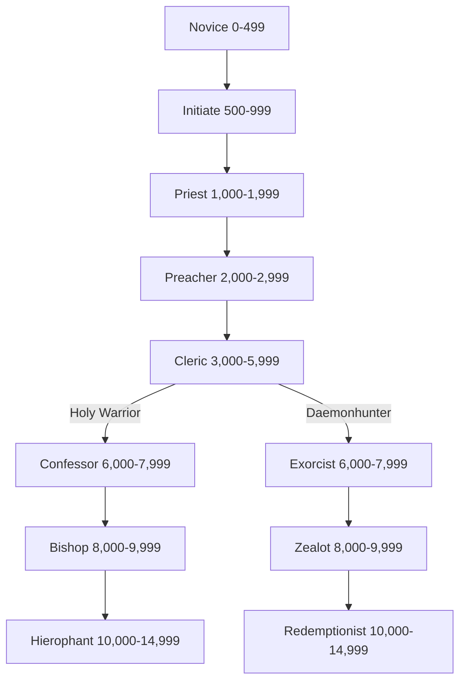

*"By the Saints and the Sigillite himself! If you don't move, I'll take this hammer to your head!"*

— Preacher Silon Constantine, Fenksworld.

Clerics are the priests of the Emperor, members of the Adeptus Ministorum, better known as the
Ecclesiarchy. As benefactors of this vast and powerful organisation, clerics are a diverse lot and can turn their hand to just about anything. A capable combatant that can hold their own in a fight, a shrewd leader who inspires their fellows to great acts of piety and bravery, or an introspective scholar of the Imperial Cult and its place in society, the only constant between clerics is their unwavering faith in the Master of Mankind.

### Table: Cleric Characteristic Advances

| **Characteristic**                    | **Simple** | **Intermediate** | **Trained** | **Expert** |
| ------------------------------------- | :--------: | :--------------: | :---------: | :--------: |
| Weapon Skill                          |    250     |       500        |     750     |   1,000    |
| Ballistic Skill                       |    100     |       250        |     500     |    750     |
| Strength                              |    250     |       500        |     750     |   1,000    |
| Toughness                             |    250     |       500        |     750     |   1,000    |
| Agility                               |    250     |       500        |     750     |   1,000    |
| Intelligence                          |    250     |       500        |     750     |   1,000    |
| Perception                            |    250     |       500        |     750     |   1,000    |
| Willpower                             |    100     |       250        |     500     |    750     |
| Fellowship                            |    100     |       250        |     500     |    750     |

# Advancement Tree

## **Novice Advances**

*"Do you think Saint Thrastus complained when he was strung up by his petard? No! Not one word! That's piety. Now get on with your work, you little ingrate."*

Novices serve the Ecclesiarchy body and soul, looking to the examples of the Imperial saints to inspire acts of greatness. They also serve those higher than them selves in the Ecclesiarchy (which is quite a few people indeed).

| Advance                                                                     | Cost | Type | Prerequisites |
| --------------------------------------------------------------------------- | :--: | :--: | :-----------: |
| [Awareness](Skills.md#awareness)                                            | 100  |  S   |       —       |
| [Common Lore (Ecclesiarchy)](Skills.md#common%20lore)                       | 100  |  S   |       —       |
| [Common Lore (Imperial Creed)](Skills.md#common%20lore)                     | 100  |  S   |       —       |
| [Drive (Ground Vehicle)](Skills.md#drive)                                   | 100  |  S   |       —       |
| [Inquiry](Skills.md#inquiry)                                                | 100  |  S   |       —       |
| [Literacy](Skills.md#literacy)                                              | 100  |  S   |       —       |
| [Pilot (Civilian Craft)](Skills.md#pilot)                                   | 100  |  S   |       —       |
| [Swim](Skills.md#swim)                                                      | 100  |  S   |       —       |
| [Trade (Cook)](Skills.md#trade)                                             | 100  |  S   |       —       |
| [Trade (Copyist)](Skills.md#trade)                                          | 100  |  S   |       —       |
| [Trade (Valet)](Skills.md#trade)                                            | 100  |  S   |       —       |
| [Basic Weapon Training (Primitive)](Talents.md#basic%20weapon%20training)   | 100  |  T   |       —       |
| [Melee Weapon Training (Primitive)](Talents.md#melee%20weapon%20training)   | 100  |  T   |       —       |
| [Pistol Training (Las)](Talents.md#pistol%20training)                       | 100  |  T   |       —       |
| [Pistol Training (Primitive)](Talents.md#pistol%20training)                 | 100  |  T   |       —       |
| [Pistol Training (SP)](Talents.md#pistol%20training)                        | 100  |  T   |       —       |
| [Resistance (Cold)](Talents.md#resistance)                                  | 100  |  T   |       —       |
| [Resistance (Heat)](Talents.md#resistance)                                  | 100  |  T   |       —       |
| [Sound Constitution](Talents.md#sound%20constitution)†                      | 100  |  T   |       —       |
| [Performer (Singer)](Skills.md#performer)                                   | 200  |  S   |       —       |
| [Thrown Weapon Training (Primitive)](Talents.md#thrown%20weapon%20training) | 200  |  T   |       —       |
| †*You may take this Talent up to three times at this Rank.*                 |      |      |               |

## **Initiate Advances**

*"Even the lowly initiate may become a martyr, if his will be strong enough."*

Initiates are instructed to defend the Cult of the Emperor with more than simple words, so that the Emperor's light may be brought to the ignorant and truculent.

| Advance                                                             | Cost | Type |       Prerequisites        |
| ------------------------------------------------------------------- | :--: | :--: | :------------------------: |
| [Barter](Skills.md#barter)                                          | 100  |  S   |             —              |
| [Climb](Skills.md#climb)                                            | 100  |  S   |             —              |
| [Common Lore (Ecclesiarchy) +10](Skills.md#common%20lore)           | 100  |  S   | Common Lore (Ecclesiarchy) |
| [Common Lore (Imperium)](Skills.md#common%20lore)                   | 100  |  S   |             —              |
| [Deceive](Skills.md#deceive)                                        | 100  |  S   |             —              |
| [Literacy +10](Skills.md#literacy)                                  | 100  |  S   |          Literacy          |
| [Performer (Singer) +10](Skills.md#performer)                       | 100  |  S   |     Performer (Singer)     |
| [Swim +10](Skills.md#swim)                                          | 100  |  S   |            Swim            |
| [Basic Weapon Training (Las)](Talents.md#basic%20weapon%20training) | 100  |  T   |             —              |
| [Basic Weapon Training (SP)](Talents.md#basic%20weapon%20training)  | 100  |  T   |             —              |
| [Die Hard](Talents.md#die%20hard)                                   | 100  |  T   |           WP 40            |
| [Flagellant](Talents.md#flagellant)                                 | 100  |  T   |             —              |
| [Hatred (Mutants)](Talents.md#hatred)                               | 100  |  T   |             —              |
| [Peer (Ecclesiarchy)](Talents.md#peer)                              | 100  |  T   |           Fel 30           |
| [Sound Constitution](Talents.md#sound%20constitution)†              | 100  |  T   |             —              |
| [Ciphers (Acolyte)](Skills.md#ciphers)                              | 200  |  S   |             —              |
| [Performer (Musician)](Skills.md#performer)                         | 200  |  S   |             —              |
| [Rapid Reload](Talents.md#rapid%20reload)                           | 200  |  T   |             —              |
| [Heightened Senses (Hearing)](Talents.md#heightened%20senses)       | 200  |  T   |             —              |
| †*You may take this Talent up to two times at this Rank.*           |      |      |                            |

## **Priest Advances**

*"Emperor's teeth! You halfwitted fools wouldn't know a heretic from a hairy Grox!"*

A Priest learns more of the things that seek to undo the Emperor's works, and the methods whereby such enemies may themselves be undone.

| Advance                                                               | Cost | Type |        Prerequisites         |
| --------------------------------------------------------------------- | :--: | :--: | :--------------------------: |
| [Awareness +10](Skills.md#awareness)                                  | 100  |  S   |          Awareness           |
| [Blather](Skills.md#blather)                                          | 100  |  S   |              —               |
| [Charm](Skills.md#charm)                                              | 100  |  S   |              —               |
| [Common Lore (Imperial Creed) +10](Skills.md#common%20lore)           | 100  |  S   | Common Lore (Imperial Creed) |
| [Common Lore (Imperium) +10](Skills.md#common%20lore)                 | 100  |  S   |    Common Lore (Imperium)    |
| [Dodge](Skills.md#dodge)                                              | 100  |  S   |              —               |
| [Drive (Ground Vehicle) +10](Skills.md#drive)                         | 100  |  S   |    Drive (Ground Vehicle)    |
| [Forbidden Lore (Heresy)](Skills.md#forbidden%20lore)                 | 100  |  S   |              —               |
| [Inquiry +10](Skills.md#inquiry)                                      | 100  |  S   |           Inquiry            |
| [Performer (Musician) +10](Skills.md#performer)                       | 100  |  S   |     Performer (Musician)     |
| [Performer (Singer) +20](Skills.md#performer)                         | 100  |  S   |    Performer (Singer) +10    |
| [Scholastic Lore (Imperial Creed)](Skills.md#scholastic%20lore)       | 100  |  S   |              —               |
| [Scholastic Lore (Legend)](Skills.md#scholastic%20lore)               | 100  |  S   |              —               |
| [Scrutiny](Skills.md#scrutiny)                                        | 100  |  S   |              —               |
| [Secret Tongue (Acolyte)](Skills.md#secret%20tongue)                  | 100  |  S   |              —               |
| [Secret Tongue (Ecclesiarchy)](Skills.md#secret%20tongue)             | 100  |  S   |              —               |
| [Swim +20](Skills.md#swim)                                            | 100  |  S   |           Swim +10           |
| [Disarm](Talents.md#disarm)                                           | 100  |  T   |            Ag 30             |
| [Hatred (Criminals)](Talents.md#hatred)                               | 100  |  T   |              —               |
| [Peer (Workers)](Talents.md#peer)                                     | 100  |  T   |            Fel 30            |
| [Sprint](Talents.md#sprint)                                           | 100  |  T   |              —               |
| [Sound Constitution](Talents.md#sound%20constitution)                 | 100  |  T   |              —               |
| [Tech-Use](Skills.md#tech-use)                                        | 200  |  S   |              —               |
| [Hard Target](Talents.md#hard%20target)                               | 200  |  T   |            Ag 40             |
| [Heightened Senses (Sight)](Talents.md#heightened%20senses)           | 200  |  T   |              —               |
| [Quick Draw](Talents.md#quick%20draw)                                 | 200  |  T   |              —               |
| [Melee Weapon Training (Shock)](Talents.md#melee%20weapon%20training) | 300  |  T   |              —               |
## **Preacher Advances**

*"You hold within you the Emperor's own truth! Never forget we are right and they are wrong!"*

A Preacher learns to lead men, to inspire and guide mankind, and to drive the word of the Ecclesiarchy home—upon the teeth of an eviscerator if need be.

| Advance                                                                  | Cost | Type |           Prerequisites            |
| ------------------------------------------------------------------------ | :--: | :--: | :--------------------------------: |
| [Barter +10](Skills.md#barter)                                           | 100  |  S   |               Barter               |
| [Blather +10](Skills.md#blather)                                         | 100  |  S   |              Blather               |
| [Carouse](Skills.md#carouse)                                             | 100  |  S   |                 —                  |
| [Command](Skills.md#command)                                             | 100  |  S   |                 —                  |
| [Common Lore (Imperial Creed) +20](Skills.md#common%20lore)              | 100  |  S   |  Common Lore (Imperial Creed) +10  |
| [Deceive +10](Skills.md#deceive)                                         | 100  |  S   |              Deceive               |
| [Forbidden Lore (Cults)](Skills.md#forbidden%20lore)                     | 100  |  S   |                 —                  |
| [Performer (Storyteller)](Skills.md#performer)                           | 100  |  S   |                 —                  |
| [Pilot (Civilian Craft) +10](Skills.md#pilot)                            | 100  |  S   |       Pilot (Civilian Craft)       |
| [Scholastic Lore (Legend) +10](Skills.md#scholastic%20lore)              | 100  |  S   |      Scholastic Lore (Legend)      |
| [Scholastic Lore (Occult)](Skills.md#scholastic%20lore)                  | 100  |  S   |                 —                  |
| [Secret Tongue (Acolyte) +10](Skills.md#secret%20tongue)                 | 100  |  S   |      Secret Tongue (Acolyte)       |
| [Speak Language (High Gothic)](Skills.md#speak%20language)               | 100  |  S   |                 —                  |
| [Basic Weapon Training (Bolt)](Talents.md#basic%20weapon%20training)     | 100  |  T   |                 —                  |
| [Basic Weapon Training (Flame)](Talents.md#basic%20weapon%20training)    | 100  |  T   |                 —                  |
| [Basic Weapon Training (Launcher)](Talents.md#basic%20weapon%20training) | 100  |  T   |                 —                  |
| [Blademaster](Talents.md#blademaster)                                    | 100  |  T   | WS 30, Melee Weapon Training (any) |
| [Decadence](Talents.md#decadence)                                        | 100  |  T   |                T 30                |
| [Hatred (Xeno—*choose one*)](Talents.md#hatred)                          | 100  |  T   |                 —                  |
| [Inspire Wrath](Talents.md#inspire%20wrath)                              | 100  |  T   |               Fel 30               |
| [Master Orator](Talents.md#master%20orator)                              | 100  |  T   |               Fel 30               |
| [Melee Weapon Training (Chain)](Talents.md#melee%20weapon%20training)    | 100  |  T   |                 —                  |
| [Peer (Middle Classes)](Talents.md#peer)                                 | 100  |  T   |               Fel 30               |
| [Unshakeable Faith](Talents.md#unshakeable%20faith)                      | 100  |  T   |                 —                  |
| [Sound Constitution](Talents.md#sound%20constitution)†                   | 100  |  T   |                 —                  |
| [Pistol Training (Bolt)](Talents.md#pistol%20training)                   | 200  |  T   |                 —                  |
| [Pistol Training (Flame)](Talents.md#pistol%20training)                  | 200  |  T   |                 —                  |
| [Talented (Gamble)](Talents.md#talented)                                 | 200  |  T   |               Gamble               |
| [Disguise](Skills.md#disguise)                                           | 300  |  S   |                 —                  |
| [Gamble](Skills.md#gamble)                                               | 300  |  S   |                 —                  |
| †*You may take this Talent up to two times at this Rank*.                |      |      |                                    |
## **Cleric Advances**

*"The Emperor guides with his knowledge. We are but blind men groping towards His light amidst the darkness of the universe."*

The Cleric navigates the twisting corridors of power, learning the wisdom of the Ecclesiarchy in order to be a better leader. The Cleric may inspire upon the field of battle, in the halls of learning or the holdings of the Ministorum.

| Advance                                                               | Cost | Type |         Prerequisites          |
| --------------------------------------------------------------------- | :--: | :--: | :----------------------------: |
| [Charm +10](Skills.md#charm)                                          | 100  |  S   |             Charm              |
| [Command +10](Skills.md#command)                                      | 100  |  S   |            Command             |
| [Common Lore (Ecclesiarchy) +20](Skills.md#common%20lore)             | 100  |  S   | Common Lore (Ecclesiarchy) +10 |
| [Drive (Ground Vehicle) +20](Skills.md#drive)                         | 100  |  S   |   Drive (Ground Vehicle) +10   |
| [Forbidden Lore (Heresy) +10](Skills.md#forbidden%20lore)             | 100  |  S   |    Forbidden Lore (Heresy)     |
| [Forbidden Lore (Psykers)](Skills.md#forbidden%20lore)                | 100  |  S   |               —                |
| [Inquiry +20](Skills.md#inquiry)                                      | 100  |  S   |          Inquiry +10           |
| [Interrogation](Skills.md#interrogation)                              | 100  |  S   |               —                |
| [Scholastic Lore (Philosophy)](Skills.md#scholastic%20lore)           | 100  |  S   |               —                |
| [Secret Tongue (Ecclesiarchy) +10](Skills.md#secret%20tongue)         | 100  |  S   |  Secret Tongue (Ecclesiarchy)  |
| [Air of Authority](Talents.md#air%20of%20authority)                   | 100  |  T   |             Fel 30             |
| [Hatred (Psykers)](Talents.md#hatred)                                 | 100  |  T   |               —                |
| [Iron Discipline](Talents.md#iron%20discipline)                       | 100  |  T   |         WP 30, Command         |
| [Iron Jaw](Talents.md#iron%20jaw)                                     | 100  |  T   |              T 40              |
| [Nerves of Steel](Talents.md#nerves%20of%20steel)                     | 100  |  T   |               —                |
| [True Grit](Talents.md#true%20grit)                                   | 100  |  T   |              T 40              |
| [Heavy Weapon Training (Flame)](Talents.md#heavy%20weapon%20training) | 200  |  T   |               —                |
| [Heavy Weapon Training (SP)](Talents.md#heavy%20weapon%20training)    | 200  |  T   |               —                |
| [Navigation (Surface)](Skills.md#navigation)                          | 200  |  S   |               —                |
| [Scrutiny +10](Skills.md#scrutiny)                                    | 200  |  S   |            Scrutiny            |
| [Tech-Use +10](Skills.md#tech-use)                                    | 200  |  S   |            Tech-Use            |
| [Crushing Blow](Talents.md#crushing%20blow)                           | 200  |  T   |              S 40              |
| [Two-Weapon Wielder (Melee)](Talents.md#two-weapon%20wielder)         | 200  |  T   |          WS 35, Ag 35          |
| [Talented (Medicae)](Talents.md#talented)                             | 200  |  T   |            Medicae             |
| [Sound Constitution](Talents.md#sound%20constitution)                 | 200  |  T   |               —                |
| [Medicae](Skills.md#medicae)                                          | 300  |  S   |               —                |
| [Secret Tongue (Gutter)](Skills.md#secret%20tongue)                   | 300  |  S   |               —                |
| [Swift Attack](Talents.md#swift%20attack)                             | 300  |  T   |             WS 35              |
## **Confessor Advances**

*"We had to put more than half of them into the fire, but Father Kyrinov got his confessions in the end."*

A Confessor watches his fellow man for weakness, heresy and doubt. Many take up the Hammer of Doctrine and the Blade of Piety as a sign of their dedication to humanity, and its master, the Emperor.

| Advance                                                               | Cost | Type |           Prerequisites            |
| --------------------------------------------------------------------- | :--: | :--: | :--------------------------------: |
| [Awareness +20](Skills.md#awareness)                                  | 100  |  S   |           Awareness +10            |
| [Barter +20](Skills.md#barter)                                        | 100  |  S   |             Barter +10             |
| [Common Lore (Imperium) +20](Skills.md#common%20lore)                 | 100  |  S   |     Common Lore (Imperium) +10     |
| [Literacy +20](Skills.md#literacy)                                    | 100  |  S   |            Literacy +10            |
| [Logic](Skills.md#logic)                                              | 100  |  S   |                 —                  |
| [Pilot (Civilian Craft) +20](Skills.md#pilot)                         | 100  |  S   |     Pilot (Civilian Craft) +10     |
| [Scholastic Lore (Imperial Creed) +10](Skills.md#scholastic%20lore)   | 100  |  S   |  Scholastic Lore (Imperial Creed)  |
| [Scholastic Lore (Legend) +20](Skills.md#scholastic%20lore)           | 100  |  S   |    Scholastic Lore (Legend) +10    |
| [Scholastic Lore (Tactica Imperialis)](Skills.md#scholastic%20lore)   | 100  |  S   |                 —                  |
| [Leap Up](Talents.md#leap%20up)                                       | 100  |  T   |               Ag 30                |
| [Peer (Administratum)](Talents.md#peer)                               | 100  |  T   |               Fel 30               |
| [Rapid Reaction](Talents.md#rapid%20reaction)                         | 100  |  T   |               Ag 40                |
| [Resistance (Insanity)](Talents.md#resistance)                        | 100  |  T   |                 —                  |
| [Strong Minded](Talents.md#strong%20minded)                           | 100  |  T   | WP 30, Resistance (Psychic Powers) |
| [Ciphers (Acolyte) +10](Skills.md#ciphers)                            | 200  |  S   |         Ciphers (Acolyte)          |
| [Common Lore (Administratum)](Skills.md#common%20lore)                | 200  |  S   |                 —                  |
| [Lip Reading](Skills.md#lip%20reading)                                | 200  |  S   |                 —                  |
| [Navigation (Surface) +10](Skills.md#navigation)                      | 200  |  S   |        Navigation (Surface)        |
| [Scholastic Lore (Bureaucracy)](Skills.md#scholastic%20lore)          | 200  |  S   |                 —                  |
| [Search](Skills.md#search)                                            | 200  |  S   |                 —                  |
| [Silent Move](Skills.md#silent%20move)                                | 200  |  S   |                 —                  |
| [Tech-Use +20](Skills.md#tech-use)                                    | 200  |  S   |            Tech-Use +10            |
| [Melee Weapon Training (Power)](Talents.md#melee%20weapon%20training) | 200  |  T   |                 —                  |
| [Sound Constitution](Talents.md#sound%20constitution)                 | 200  |  T   |                 —                  |
| [Sure Strike](Talents.md#sure%20strike)                               | 200  |  T   |               WS 30                |
| [Takedown](Talents.md#takedown)                                       | 200  |  T   |                 —                  |
| [Talented (Search)](Talents.md#talented)                              | 200  |  T   |               Search               |
| [Total Recall](Talents.md#total%20recall)                             | 200  |  T   |               Int 30               |
| [Two-Weapon Wielder (Ballistic)](Talents.md#two-weapon%20wielder)     | 200  |  T   |            BS 35, Ag 35            |
| [Resistance (Psychic Powers)](Talents.md#resistance)                  | 300  |  T   |                 —                  |

## **Exorcist Advances**

*"Better the flesh should die clean than the soul become tainted."*

The Exorcist learns of the forbidden, the corrupt and the Daemonic in order to better destroy that which would harm the Imperium.

| Advance                                                                   | Cost | Type |          Prerequisites           |
| ------------------------------------------------------------------------- | :--: | :--: | :------------------------------: |
| [Dodge +10](Skills.md#dodge)                                              | 100  |  S   |              Dodge               |
| [Forbidden Lore (Psykers) +10](Skills.md#forbidden%20lore)                | 100  |  S   |     Forbidden Lore (Psykers)     |
| [Interrogation +10](Skills.md#interrogation)                              | 100  |  S   |          Interrogation           |
| [Scholastic Lore (Imperial Creed) +10](Skills.md#scholastic%20lore)       | 100  |  S   | Scholastic Lore (Imperial Creed) |
| [Scholastic Lore (Occult) +10](Skills.md#scholastic%20lore)               | 100  |  S   |     Scholastic Lore (Occult)     |
| [Speak Language (High Gothic) +10](Skills.md#speak%20language)            | 100  |  S   |   Speak Language (High Gothic)   |
| [Cleanse and Purify](Talents.md#cleanse%20and%20purify)                   | 100  |  T   |  Basic Weapon Training (Flame)   |
| [Hatred (Daemons)](Talents.md#hatred)                                     | 100  |  T   |                —                 |
| [Melee Weapon Training (Power)](Talents.md#melee%20weapon%20training)     | 100  |  T   |                —                 |
| [Orthoproxy](Talents.md#orthoproxy)                                       | 100  |  T   |                —                 |
| [Resistance (Psychic Powers)](Talents.md#resistance)                      | 100  |  T   |                —                 |
| [Forbidden Lore (Daemonology)](Skills.md#forbidden%20lore)                | 200  |  S   |                —                 |
| [Forbidden Lore (Mutants)](Skills.md#forbidden%20lore)                    | 200  |  S   |                —                 |
| [Intimidate](Skills.md#intimidate)                                        | 200  |  S   |                —                 |
| [Basic Weapon Training (Plasma)](Talents.md#basic%20weapon%20training)    | 200  |  T   |                —                 |
| [Pistol Training (Plasma)](Talents.md#pistol%20training)                  | 200  |  T   |                —                 |
| [Resistance (Fear)](Talents.md#resistance)                                | 200  |  T   |                —                 |
| [Sound Constitution](Talents.md#sound%20constitution)                     | 200  |  T   |                —                 |
| [Common Lore (War)](Skills.md#common%20lore)                              | 300  |  S   |                —                 |
| [Heavy Weapon Training (Launcher)](Talents.md#heavy%20weapon%20training)  | 300  |  T   |                —                 |
| [Heavy Weapon Training (Primitive)](Talents.md#heavy%20weapon%20training) | 300  |  T   |                —                 |
| [Last Man Standing](Talents.md#last%20man%20standing)                     | 300  |  T   |         Nerves of Steel          |

## **Bishop Advances**

*"Heed the teachings of the God-Emperor, and your death will not be in vain."*

The Bishop is a sage and charismatic leader, advisor and champion of the Ecclesiarchy. Close ties with the Administratum brings knowledge and power to the Bishop, and therefore, the Ecclesiarchy.

| Advance                                                                 | Cost | Type |            Prerequisites             |
| ----------------------------------------------------------------------- | :--: | :--: | :----------------------------------: |
| [Blather +20](Skills.md#blather)                                        | 100  |  S   |             Blather +10              |
| [Carouse +10](Skills.md#carouse)                                        | 100  |  S   |               Carouse                |
| [Charm +20](Skills.md#charm)                                            | 100  |  S   |              Charm +10               |
| [Command +20](Skills.md#command)                                        | 100  |  S   |             Command +10              |
| [Deceive +20](Skills.md#deceive)                                        | 100  |  S   |             Deceive +10              |
| [Interrogation +10](Skills.md#interrogation)                            | 100  |  S   |            Interrogation             |
| [Logic +10](Skills.md#logic)                                            | 100  |  S   |                Logic                 |
| [Scholastic Lore (Bureaucracy) +10](Skills.md#scholastic%20lore)        | 100  |  S   |    Scholastic Lore (Bureaucracy)     |
| [Scholastic Lore (Tactica Imperialis) +10](Skills.md#scholastic%20lore) | 100  |  S   | Scholastic Lore (Tactica Imperialis) |
| [Secret Tongue (Ecclesiarchy) +20](Skills.md#secret%20tongue)           | 100  |  S   |   Secret Tongue (Ecclesiarchy) +20   |
| [Speak Language (High Gothic) +10](Skills.md#speak%20language)          | 100  |  S   |     Speak Language (High Gothic)     |
| [Good Reputation (Ecclesiarchy)](Talents.md#good%20reputation)          | 100  |  T   |     Fel 50, Peer (Ecclesiarchy)      |
| [Light Sleeper](Talents.md#light%20sleeper)                             | 100  |  T   |                Per 30                |
| [Peer (Adeptus Arbites)](Talents.md#peer)                               | 100  |  T   |                Fel 30                |
| [Peer (Nobility)](Talents.md#peer)                                      | 100  |  T   |                Fel 30                |
| [Resistance (Poisons)](Talents.md#resistance)                           | 100  |  T   |                  —                   |
| [Security](Skills.md#security)                                          | 200  |  S   |                  —                   |
| [Deadeye Shot](Talents.md#deadeye%20shot)                               | 200  |  T   |                BS 30                 |
| [Peer (Inquisition)](Talents.md#peer)                                   | 200  |  T   |                Fel 30                |
| [Pistol Training (Plasma)](Talents.md#pistol%20training)                | 200  |  T   |                  —                   |
| [Sharpshooter](Talents.md#sharpshooter)                                 | 200  |  T   |         BS 40, Deadeye Shot          |
| [Concealment](Skills.md#concealment)                                    | 300  |  S   |                  —                   |
| [Forbidden Lore (Mutants)](Skills.md#forbidden%20lore)                  | 300  |  S   |                  —                   |
| [Sleight of Hand](Skills.md#sleight%20of%20hand)                        | 300  |  S   |                  —                   |
| [Secret Tongue (Administratum)](Skills.md#secret%20tongue)              | 300  |  S   |                  —                   |
| [Ambidextrous](Talents.md#ambidextrous)                                 | 300  |  T   |                Ag 30                 |
| [Wall of Steel](Talents.md#wall%20of%20steel)                           | 300  |  T   |                Ag 35                 |
| [Sound Constitution](Talents.md#sound%20constitution)                   | 300  |  T   |                  —                   |

## **Zealot Advances**

*"Doubt is a weakness that must be cut from the flesh."*

The Zealot has learnt well the terrible lessons of the past, and knows only the deepest zeal can withstand the corrupting grip of Chaos.

| Advance                                                               | Cost | Type |           Prerequisites            |
| --------------------------------------------------------------------- | :--: | :--: | :--------------------------------: |
| [Scholastic Lore (Legend) +20](Skills.md#scholastic%20lore)           | 100  |  S   |    Scholastic Lore (Legend) +10    |
| [Scholastic Lore (Occult) +20](Skills.md#scholastic%20lore)           | 100  |  S   |    Scholastic Lore (Occult) +10    |
| [Scholastic Lore (Tactica Imperialis)](Skills.md#scholastic%20lore)   | 100  |  S   |                 —                  |
| [Fearless](Talents.md#fearless)                                       | 100  |  T   |                 —                  |
| [Hatred (Cult—*choose one*)](Talents.md#hatred)                       | 100  |  T   |                 —                  |
| [Peer (Inquisition)](Talents.md#peer)                                 | 100  |  T   |               Fel 30               |
| [Peer (Military)](Talents.md#peer)                                    | 100  |  T   |               Fel 30               |
| [Strong Minded](Talents.md#strong%20minded)                           | 100  |  T   | WP 30, Resistance (Psychic Powers) |
| [Forbidden Lore (Warp)](Skills.md#forbidden%20lore)                   | 200  |  S   |                 —                  |
| [Intimidate +10](Skills.md#intimidate)                                | 200  |  S   |             Intimidate             |
| [Forbidden Lore (Mutants) +10](Skills.md#forbidden%20lore)            | 200  |  S   |      Forbidden Lore (Mutants)      |
| [Basic Weapon Training (Melta)](Talents.md#basic%20weapon%20training) | 200  |  T   |                 —                  |
| [Duty Unto Death](Talents.md#duty%20unto%20death)                     | 200  |  T   |               WP 45                |
| [Good Reputation (Ecclesiarchy)](Talents.md#good%20reputation)        | 200  |  T   |    Fel 50, Peer (Ecclesiarchy)     |
| [Insanely Faithful](Talents.md#insanely%20faithful)                   | 200  |  T   |                 —                  |
| [Sound Constitution](Talents.md#sound%20constitution)                 | 200  |  T   |                 —                  |
| [Talented (Chem-Use)](Talents.md#talented)                            | 200  |  T   |              Chem-Use              |
| [Chem-Use](Skills.md#chem-use)                                        | 300  |  S   |                 —                  |
| [Ciphers (War Cant)](Skills.md#ciphers)                               | 300  |  S   |                 —                  |
| [Battle Rage](Talents.md#battle%20rage)                               | 300  |  T   |               Frenzy               |
| [Bulging Biceps](Talents.md#bulging%20biceps)                         | 300  |  T   |                S 45                |
| [Crack Shot](Talents.md#crack%20shot)                                 | 300  |  T   |               BS 40                |
| [Frenzy](Talents.md#frenzy)                                           | 300  |  T   |                 —                  |
| [Lightning Attack](Talents.md#lightning%20attack)                     | 300  |  T   |            Swift Attack            |

## **Hierophant Advances**

*"Of course this is a matter for the Ecclesiarchy. Why? Because it involves the Imperium."*

The Hierophant whispers in the ears of governors and kings, counselling on matters spiritual, political and malefic. Wise, yet also deadly, Hierophants study the greatest enemies of mankind, to discover how they may be crushed beneath the armies of the nations they advise.

| Advance                                                                 | Cost | Type |              Prerequisites               |
| ----------------------------------------------------------------------- | :--: | :--: | :--------------------------------------: |
| [Carouse +20](Skills.md#carouse)                                        | 100  |  S   |               Carouse +10                |
| [Common Lore (Machine Cult)](Skills.md#common%20lore)                   | 100  |  S   |                    —                     |
| [Interrogation +20](Skills.md#interrogation)                            | 100  |  S   |            Interrogation +10             |
| [Logic +20](Skills.md#logic)                                            | 100  |  S   |                Logic +10                 |
| [Scholastic Lore (Philosophy) +10](Skills.md#scholastic%20lore)         | 100  |  S   |       Scholastic Lore (Philosophy)       |
| [Scholastic Lore (Tactica Imperialis) +20](Skills.md#scholastic%20lore) | 100  |  S   | Scholastic Lore (Tactica Imperialis) +10 |
| [Speak Language (High Gothic) +20](Skills.md#speak%20language)          | 100  |  S   |     Speak Language (High Gothic) +10     |
| [Wrangling](Skills.md#wrangling)                                        | 100  |  S   |                    —                     |
| [Combat Master](Talents.md#combat%20master)                             | 100  |  T   |                  WS 30                   |
| [Crippling Strike](Talents.md#crippling%20strike)                       | 100  |  T   |                  WS 50                   |
| [Peer (Astropaths)](Talents.md#peer)                                    | 100  |  T   |                  Fel 30                  |
| [Peer (Government)](Talents.md#peer)                                    | 100  |  T   |                  Fel 30                  |
| [Lip Reading +10](Skills.md#lip%20reading)                              | 200  |  S   |               Lip Reading                |
| [Gunslinger](Talents.md#gunslinger)                                     | 200  |  T   |  BS 40, Two-Weapon Wielder (Ballistic)   |
| [Dual Shot](Talents.md#dual%20strike)                                   | 200  |  T   |  Ag 40, Two-Weapon Wielder (Ballistic)   |
| [Independent Targeting](Talents.md#independent%20targeting)             | 200  |  T   |                  BS 40                   |
| [Pistol Training (Melta)](Talents.md#pistol%20training)                 | 200  |  T   |                    —                     |
| [Evaluate](Skills.md#evaluate)                                          | 300  |  S   |                    —                     |
| [Forbidden Lore (Daemonology)](Skills.md#forbidden%20lore)              | 300  |  S   |                    —                     |
| [Forbidden Lore (Psykers) +10](Skills.md#forbidden%20lore)              | 300  |  S   |         Forbidden Lore (Psykers)         |
| [Forbidden Lore (Warp)](Skills.md#forbidden%20lore)                     | 300  |  S   |                    —                     |
| [Duty Unto Death](Talents.md#duty%20unto%20death)                       | 300  |  T   |                  WP 45                   |
| [Sound Constitution](Talents.md#sound%20constitution)                   | 300  |  T   |                    —                     |

## Redemptionist Advances

*"Burn, heretic!"*

The Redemptionist leads the battle charge, spewing litany and destruction upon those that would seek to harm the Emperor, the Imperium and man.

| Advance                                                           | Cost | Type |          Prerequisites           |
| ----------------------------------------------------------------- | :--: | :--: | :------------------------------: |
| [Awareness +20](Skills.md#awareness)                              | 100  |  S   |          Awareness +10           |
| [Charm +20](Skills.md#charm)                                      | 100  |  S   |            Charm +10             |
| [Command +20](Skills.md#command)                                  | 100  |  S   |           Command +10            |
| [Forbidden Lore (Daemonology) +10](Skills.md#forbidden%20lore)    | 100  |  S   |  Forbidden Lore: (Daemonology)   |
| [Forbidden Lore (Heresy) +20](Skills.md#forbidden%20lore)         | 100  |  S   |   Forbidden Lore (Heresy) +10    |
| [Forbidden Lore (Psykers) +20](Skills.md#forbidden%20lore)        | 100  |  S   |   Forbidden Lore (Psykers) +10   |
| [Interrogation +20](Skills.md#interrogation)                      | 100  |  S   |        Interrogation +10         |
| [Secret Tongue (Ecclesiarchy) +20](Skills.md#secret%20tongue)     | 100  |  S   | Secret Tongue (Ecclesiarchy) +10 |
| [Speak Language (High Gothic) +20](Skills.md#speak%20language)    | 100  |  S   | Speak Language (High Gothic) +10 |
| [Combat Master](Talents.md#combat%20master)                       | 100  |  T   |              WS 30               |
| [Independent Targeting](Talents.md#independent%20targeting)       | 100  |  T   |              BS 40               |
| [Into the Jaws of Hell](Talents.md#into%20the%20jaws%20of%20hell) | 100  |  T   |         Iron Discipline          |
| [Litany of Hate](Talents.md#litany%20of%20hate)                   | 100  |  T   |           Hatred (any)           |
| [Forbidden Lore (Warp) +10](Skills.md#forbidden%20lore)           | 200  |  S   |      Forbidden Lore (Warp)       |
| [Forbidden Lore (Inquisition)](Skills.md#forbidden%20lore)        | 300  |  S   |                —                 |
| [Forbidden Lore (Xenos)](Skills.md#forbidden%20lore)              | 300  |  S   |                —                 |
| [Secret Tongues (Military)](Skills.md#secret%20tongue)            | 300  |  S   |                —                 |
| [Pistol Training (Melta)](Talents.md#pistol%20training)           | 300  |  T   |                —                 |
| [Sound Constitution](Talents.md#sound%20constitution)             | 300  |  T   |                —                 |
