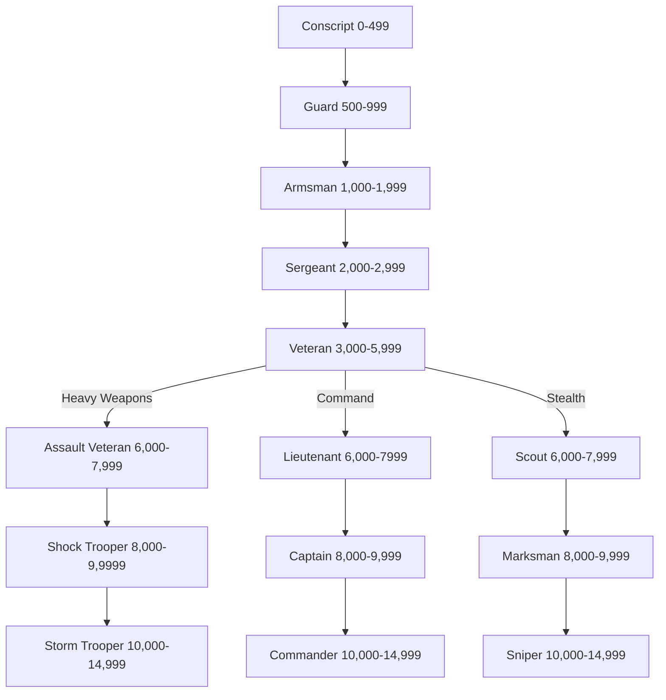

*"We go in, kill anything that moves and then blow the structure with a demo charge."*

— Eli Plex, Assault Veteran of the Secondus 21st

Soldier, fighter, man-at-arms, warrior, or heavy, those who fight for a living are all considered Guardsmen. Some may be members of a formal army, such as a Planetary Defence Force (PDF), or even the Imperial Guard itself, from which this Career Path gets its name. Just as easily, a Guardsman might be a mercenary for hire, a member of a noble’s household troops, or a even just a thug that’s thrown in with the local gangers for the simple pleasure of bashing skulls open on the rockcrete. Your typical Guardsman isn’t particularly good at navigating social intrigue or academic pursuits, but their mastery of weapons and ability to control the flow of combat (read: make things die in loud and violent ways) is second to none.
### Table: Guardsman Characteristic Advances
| **Characteristic** | **Simple** | **Intermediate** | **Trained** | **Expert** |
| ------------------ | :--------: | :--------------: | :---------: | :--------: |
| Weapon Skill       |    100     |       250        |     500     |    750     |
| Ballistic Skill    |    100     |       250        |     500     |    750     |
| Strength           |    100     |       250        |     500     |    750     |
| Toughness          |    250     |       500        |     750     |   1,000    |
| Agility            |    250     |       500        |     750     |   1,000    |
| Intelligence       |    500     |       750        |    1,000    |   2,500    |
| Perception         |    250     |       500        |     750     |   1,000    |
| Willpower          |    500     |       750        |    1,000    |   2,500    |
| Fellowship         |    500     |       750        |    1,000    |   2,500    |
# Advancement Tree

```mermaid
graph TD
A[Conscript 0-499] --> B[Guard 500-999];
B --> C[Armsman 1,000-1,999];
C --> D[Sergeant 2,000-2,999];
D --> E[Veteran 3,000-5,999]
E -- Heavy Weapons --> F[Assault Veteran 6,000-7,999]
F --> G[Shock Trooper 8,000-9,9999]
G --> H[Storm Trooper 10,000-14,999]
E -- Command --> I[Lieutenant 6,000-7999]
I --> J[Captain 8,000-9,999]
J --> K[Commander 10,000-14,999]
E -- Stealth --> L[Scout 6,000-7,999]
L --> M[Marksman 8,000-9,999]
M --> N[Sniper 10,000-14,999]
```

## **Conscript Advances**

*"If they can bleed and run, they can hold a gun."*

Conscripts learn the raw basics of combat: the charge, the way of the gun and the blade. They may be fresh from an Imperial Guard founding, pressed into service or serving a penal sentence.

| Advance                                                                     | Cost |  Type  | Prerequisites |
| --------------------------------------------------------------------------- | :--: | :----: | :------------ |
| [Awareness](Skills.md#awareness)                                            | 100  | Skill  | —             |
| [Drive (Ground Vehicle)](Skills.md#drive)                                   | 100  | Skill  | —             |
| [Swim](Skills.md#swim)                                                      | 100  | Skill  | —             |
| [Basic Weapon Training (Las)](Talents.md#basic%20weapon%20training)         | 100  | Talent | —             |
| [Basic Weapon Training (Primitive)](Talents.md#basic%20weapon%20training)   | 100  | Talent | —             |
| [Basic Weapon Training (SP)](Talents.md#basic%20weapon%20training)          | 100  | Talent | —             |
| [Melee Weapon Training (Primitive)](Talents.md#melee%20weapon%20training)   | 100  | Talent | —             |
| [Pistol Training (Las)](Talents.md#pistol%20training)                       | 100  | Talent | —             |
| [Pistol Training (Primitive)](Talents.md#pistol%20training)                 | 100  | Talent | —             |
| [Pistol Training (SP)](Talents.md#pistol%20training)                        | 100  | Talent | —             |
| [Sound Constitution](Talents.md#sound%20constitution)†                      | 100  | Talent | —             |
| [Thrown Weapon Training (Primitive)](Talents.md#thrown%20weapon%20training) | 100  | Talent | —             |
| [Drive (Walker)](Skills.md#drive)                                           | 200  | Skill  | —             |
†*You may select this Talent twice at this Rank.*
## **Guard Advances**

*"They left the drop pods as mere conscripts… they returned as men."*

Guard have survived in battle long enough to learn that survival is often a case of speed and superior tactical knowledge.

| Advance                                                                  | Cost |  Type  | Prerequisites          |
| ------------------------------------------------------------------------ | :--: | :----: | :--------------------- |
| [Dodge](Skills.md#dodge)                                                 | 100  | Skill  | —                      |
| [Drive (Ground Vehicle) +10](Skills.md#drive)                            | 100  | Skill  | Drive (Ground Vehicle) |
| [Ciphers (Acolyte)](Skills.md#ciphers)                                   | 100  | Skill  | —                      |
| [Ciphers (War Cant)](Skills.md#ciphers)                                  | 100  | Skill  | —                      |
| [Common Lore (Imperial Guard)](Skills.md#common%20lore)                  | 100  | Skill  | —                      |
| [Survival](Skills.md#survival)                                           | 100  | Skill  | —                      |
| [Swim +10](Skills.md#swim)                                               | 100  | Skill  | Swim                   |
| [Basic Weapon Training (Launcher)](Talents.md#basic%20weapon%20training) | 100  | Talent | —                      |
| [Quick Draw](Talents.md#quick%20draw)                                    | 100  | Talent | —                      |
| [Sound Constitution](Talents.md#sound%20constitution)                    | 100  | Talent | —                      |
| [Common Lore (War)](Skills.md#common%20lore)                             | 200  | Skill  | —                      |
| [Drive (Walker) +10](Skills.md#drive)                                    | 200  | Skill  | Drive (Walker)         |
| [Inquiry](Skills.md#inquiry)                                             | 200  | Skill  | —                      |
| [Heavy Weapon Training (SP)](Talents.md#heavy%20weapon%20training)       | 200  | Talent | —                      |
| [Two-Weapon Wielder (Ballistic)](Talents.md#two-weapon%20wielder)        | 200  | Talent | BS 35, Ag 35           |
## **Armsman Advances**

*"Without death, there are no heroes."*

Armsmen increase their knowledge of the weapons they might wield against enemies of the Emperor. They are stout of heart, and strong in the arm men to trust when the las bolts are flying.

| Advance                                                               | Cost |  Type  | Prerequisites              |
| --------------------------------------------------------------------- | :--: | :----: | :------------------------- |
| [Drive (Ground Vehicle) +20](Skills.md#drive)                         | 100  | Skill  | Drive (Ground Vehicle) +10 |
| [Intimidate](Skills.md#intimidate)                                    | 100  | Skill  | —                          |
| [Navigation (Surface)](Skills.md#navigation)                          | 100  | Skill  | —                          |
| [Pilot (Military Craft)](Skills.md#pilot)                             | 100  | Skill  | —                          |
| [Secret Tongue (Acolyte)](Skills.md#secret%20tongue)                  | 100  | Skill  | —                          |
| [Swim +20](Skills.md#swim)                                            | 100  | Skill  | Swim +10                   |
| [Basic Weapon Training (Flame)](Talents.md#basic%20weapon%20training) | 100  | Talent | —                          |
| [Crippling Strike](Talents.md#crippling%20strike)                     | 100  | Talent | WS 50                      |
| [Pistol Training (Flame)](Talents.md#pistol%20training)               | 100  | Talent | —                          |
| [Rapid Reload](Talents.md#rapid%20reload)                             | 100  | Talent | —                          |
| [Sound Constitution](Talents.md#sound%20constitution)                 | 100  | Talent | —                          |
| [Common Lore (Imperium)](Skills.md#common%20lore)                     | 200  | Skill  | —                          |
| [Drive (Walker) +20](Skills.md#drive)                                 | 200  | Skill  | —                          |
| [Gamble](Skills.md#gamble)                                            | 200  | Skill  | —                          |
| [Inquiry +10](Skills.md#inquiry)                                      | 200  | Skill  | Inquiry                    |
| [Ambidextrous](Talents.md#ambidextrous)                               | 200  | Talent | Ag 30                      |
| [Melee Weapon Training (Shock)](Talents.md#melee%20weapon%20training) | 200  | Talent | —                          |
| [Swift Attack](Talents.md#swift%20attack)                             | 200  | Talent | WS 35                      |
| [Literacy](Skills.md#literacy)                                        | 300  | Skill  | —                          |
## **Sergeant Advances**

*"Get up and out of that trench before I come over there and make you!"*

As proven warriors, Sergeants learn to finesse their attacks and widen their skills to encompass all manner of eventualities.

| Advance                                                                   | Cost |  Type  | Prerequisites                         |
| ------------------------------------------------------------------------- | :--: | :----: | :------------------------------------ |
| [Ciphers (War Cant) +10](Skills.md#ciphers)                               | 100  | Skill  | Ciphers (War Cant)                    |
| [Common Lore (Imperial Creed)](Skills.md#common%20lore)                   | 100  | Skill  | —                                     |
| [Common Lore (Imperial Guard) +10](Skills.md#common%20lore)               | 100  | Skill  | —                                     |
| [Demolition](Skills.md#demolition)                                        | 100  | Skill  | —                                     |
| [Intimidate +10](Skills.md#intimidate)                                    | 100  | Skill  | Intimidate                            |
| [Navigation (Surface) +10](Skills.md#navigation)                          | 100  | Skill  | Navigation (Surface)                  |
| [Pilot (Military Craft) +10](Skills.md#pilot)                             | 100  | Skill  | Pilot (Military Craft)                |
| [Secret Tongue (Military)](Skills.md#secret%20tongue)                     | 100  | Skill  | —                                     |
| [Basic Weapon Training (Bolt)](Talents.md#basic%20weapon%20training)      | 100  | Talent | S 30                                  |
| [Dual Strike](Talents.md#dual%20strike)                                   | 100  | Talent | Ag 40, Two-Weapon Wielder (Melee)     |
| [Melee Weapon Training (Chain)](Talents.md#melee%20weapon%20training)     | 100  | Talent | —                                     |
| [Pistol Training (Bolt)](Talents.md#pistol%20training)                    | 100  | Talent | —                                     |
| [Resistance (Fear)](Talents.md#resistance)                                | 100  | Talent | —                                     |
| [Sound Constitution](Talents.md#sound%20constitution)                     | 100  | Talent | —                                     |
| [Takedown](Talents.md#takedown)                                           | 100  | Talent | —                                     |
| [Carouse](Skills.md#carouse)                                              | 200  | Skill  | —                                     |
| [Interrogation](Skills.md#interrogation)                                  | 200  | Skill  | —                                     |
| [Tech-Use](Skills.md#tech-use)                                            | 200  | Skill  | —                                     |
| [Crushing Blow](Talents.md#crushing%20blow)                               | 200  | Talent | S 40                                  |
| [Dual Shot](Talents.md#dual%20shot)                                       | 200  | Talent | Ag 40, Two-Weapon Wielder (Ballistic) |
| [Heavy Weapon Training (Flame)](Talents.md#heavy%20weapon%20training)     | 200  | Talent | —                                     |
| [Heavy Weapon Training (Primitive)](Talents.md#heavy%20weapon%20training) | 200  | Talent | —                                     |
| [Hip Shooting](Talents.md#hip%20shooting)                                 | 200  | Talent | BS 40, Ag 40                          |
| [Sure Strike](Talents.md#sure%20strike)                                   | 200  | Talent | WS 30                                 |
| [Two-Weapon Wielder (Melee)](Talents.md#two-weapon%20wielder)             | 200  | Talent | WS 35, Ag 35                          |
| [Barter](Skills.md#barter)                                                | 300  | Skill  | —                                     |
## **Veteran Advances**

*"You think this is bad, kid? Just wait till the big guns start!"*

Veterans hold their own upon the battlefield, inspiring others with their prowess, fearlessness and sheer killing power. Their battle wisdom is indispensable, and their luck proven by their continuing vitality.

| Advance                                                                   | Cost |  Type  | Prerequisites                          |
| ------------------------------------------------------------------------- | :--: | :----: | :------------------------------------- |
| [Ciphers (Acolyte) +10](Skills.md#ciphers)                                | 100  | Skill  | Ciphers (Acolyte)                      |
| [Ciphers (War Cant) +20](Skills.md#ciphers)                               | 100  | Skill  | Ciphers (War Cant) +10                 |
| [Command](Skills.md#command)                                              | 100  | Skill  | —                                      |
| [Demolition +10](Skills.md#demolition)                                    | 100  | Skill  | Demolition                             |
| [Dodge +10](Skills.md#dodge)                                              | 100  | Skill  | Dodge +10                              |
| [Pilot (Military Craft) +20](Skills.md#pilot)                             | 100  | Skill  | Pilot (Military Craft) +10             |
| [Secret Tongue (Acolyte) +10](Skills.md#secret%20tongue)                  | 100  | Skill  | Secret Tongue (Acolyte)                |
| [Secret Tongue (Military) +10](Skills.md#secret%20tongue)                 | 100  | Skill  | Secret Tongue (Military)               |
| [Survival +10](Skills.md#survival)                                        | 100  | Skill  | Survival                               |
| [Arms Master](Talents.md#arms%20master)                                   | 100  | Talent | BS 30, Basic Weapon Training (any two) |
| [Basic Weapon Training (Melta)](Talents.md#basic%20weapon%20training)     | 100  | Talent | —                                      |
| [Basic Weapon Training (Plasma)](Talents.md#basic%20weapon%20training)    | 100  | Talent | —                                      |
| [Blind Fighting](Talents.md#blind%20fighting)                             | 100  | Talent | Per 30                                 |
| [Bulging Biceps](Talents.md#bulging%20biceps)                             | 100  | Talent | S 45                                   |
| [Die Hard](Talents.md#die%20hard)                                         | 100  | Talent | WP 40                                  |
| [Hard Target](Talents.md#hard%20target)                                   | 100  | Talent | Ag 40                                  |
| [Heavy Weapon Training (Bolt)](Talents.md#heavy%20weapon%20training)      | 100  | Talent | —                                      |
| [Heavy Weapons Training (Las)](Talents.md#heavy%20weapon%20training)      | 100  | Talent | —                                      |
| [Heavy Weapons Training (Launcher)](Talents.md#heavy%20weapon%20training) | 100  | Talent | —                                      |
| [Step Aside](Talents.md#step%20aside)                                     | 100  | Talent | —                                      |
| [True Grit](Talents.md#true%20grit)                                       | 100  | Talent | T 40                                   |
| [Climb](Skills.md#climb)                                                  | 200  | Skill  | —                                      |
| [Gamble +10](Skills.md#gamble)                                            | 200  | Skill  | Gamble                                 |
| [Medicae](Skills.md#medicae)                                              | 200  | Skill  | —                                      |
| [Search](Skills.md#search)                                                | 200  | Skill  | —                                      |
| [Hatred (Xeno—*choose one*)](Talents.md#hatred)                           | 200  | Talent | —                                      |
| [Iron Jaw](Talents.md#iron%20jaw)                                         | 200  | Talent | T 40                                   |
| [Sound Constitution](Talents.md#sound%20constitution)†                    | 200  | Talent | —                                      |
†*You may select this Talent twice at this Rank.*
## **Assault Veteran Advances**

*"It's going to get close and messy lads, stay close to me and don't be afraid to get it on ya…"*

Freedom is bought at the point of a blade, and Assault Veterans know this all too well. Experts at close combat, they excel at pressing the advantage of shock attacks before the enemy can effectively react.

| Advance                                                               | Cost |  Type  | Prerequisites                      |
| --------------------------------------------------------------------- | :--: | :----: | :--------------------------------- |
| [Common Lore (Imperial Creed) +10](Skills.md#common%20lore)           | 100  | Skill  | Common Lore (Imperial Creed        |
| [Demolition +20](Skills.md#demolition)                                | 100  | Skill  | Demolition +10                     |
| [Survival +20](Skills.md#survival)                                    | 100  | Skill  | Survival +10                       |
| [Blademaster](Talents.md#blademaster)                                 | 100  | Talent | WS 30, Melee Weapon Training (any) |
| [Combat Master](Talents.md#combat%20master)                           | 100  | Talent | WS 30                              |
| [Double Team](Talents.md#double%20team)                               | 100  | Talent | —                                  |
| [Frenzy](Talents.md#frenzy)                                           | 100  | Talent | —                                  |
| [Furious Assault](Talents.md#furious%20assault)                       | 100  | Talent | WS 35                              |
| [Leap Up](Talents.md#leap%20up)                                       | 100  | Talent | Ag 30                              |
| [Melee Weapon Training (Power)](Talents.md#melee%20weapon%20training) | 100  | Talent | —                                  |
| [Precise Blow](Talents.md#precise%20blow)                             | 100  | Talent | WS 40, Sure Strike                 |
| [Chem-Use](Skills.md#chem-use)                                        | 200  | Skill  | —                                  |
| [Dodge +20](Skills.md#dodge)                                          | 200  | Skill  | Dodge +10                          |
| [Counter Attack](Talents.md#counter-attack)                           | 200  | Talent | WS 40                              |
| [Sound Constitution](Talents.md#sound%20constitution)                 | 200  | Talent | —                                  |
| [Lightning Attack](Talents.md#lightning%20attack)                     | 300  | Talent | Swift Attack                       |
## **Lieutenant Advances**

*"Watch your formation and stay sharp!"*

Lieutenants lead their men into glorious battle. It falls to an officer to accept the weight of command and responsibilities for success or failure on the battlefield.

| Advance                                                               | Cost |  Type  | Prerequisites                |
| --------------------------------------------------------------------- | :--: | :----: | :--------------------------- |
| [Command +10](Skills.md#command)                                      | 100  | Skill  | Command                      |
| [Common Lore (Ecclesiarchy)](Skills.md#common%20lore)                 | 100  | Skill  | —                            |
| [Common Lore (Imperial Creed) +10](Skills.md#common%20lore)           | 100  | Skill  | Common Lore (Imperial Creed) |
| [Interrogation](Skills.md#interrogation)                              | 100  | Skill  | —                            |
| [Navigation (Surface) +20](Skills.md#navigation)                      | 100  | Skill  | Navigation (Surface) +10     |
| [Scholastic Lore (Tactica Imperialis)](Skills.md#scholastic%20lore)   | 100  | Skill  | —                            |
| [Trade (Copyist)](Skills.md#trade)                                    | 100  | Skill  | —                            |
| [Hatred (Mutants)](Talents.md#hatred)                                 | 100  | Talent | —                            |
| [Melee Weapon Training (Power)](Talents.md#melee%20weapon%20training) | 100  | Talent | —                            |
| [Chem-Use](Skills.md#chem-use)                                        | 200  | Skill  | —                            |
| [Common Lore (War)](Skills.md#common%20lore)                          | 200  | Skill  | —                            |
| [Literacy +10](Skills.md#literacy)                                    | 200  | Skill  | Literacy                     |
| [Medicae +10](Skills.md#medicae)                                      | 200  | Skill  | Medicae                      |
| [Scrutiny](Skills.md#scrutiny)                                        | 200  | Skill  | —                            |
| [Hotshot Pilot](Talents.md#hotshot%20pilot)                           | 200  | Talent | Ag 40, Pilot Skill (any)     |
| [Pistol Training (Plasma)](Talents.md#pistol%20training)              | 200  | Talent | —                            |
| [Sound Constitution](Talents.md#sound%20constitution)                 | 200  | Talent | —                            |
| [Blather](Skills.md#blather)                                          | 300  | Skill  | —                            |
| [Charm](Skills.md#charm)                                              | 300  | Skill  | —                            |
| [Deceive](Skills.md#deceive)                                          | 300  | Skill  | —                            |
| [Evaluate](Skills.md#evaluate)                                        | 300  | Skill  | —                            |
## **Scout Advances**

*"I swear dead men make more noise than that bastard."*

Scouts are adept at locating the enemy in all terrain. They are keen observers, and skilled in the art of stealth.

| Advance                                                               | Cost |  Type  | Prerequisites            |
| --------------------------------------------------------------------- | :--: | :----: | :----------------------- |
| [Awareness +10](Skills.md#awareness)                                  | 100  | Skill  | Awareness                |
| [Navigation (Surface) +20](Skills.md#navigation)                      | 100  | Skill  | Navigation (Surface) +10 |
| [Deadeye Shot](Talents.md#deadeye%20shot)                             | 100  | Talent | BS 30                    |
| [Climb +10](Skills.md#climb)                                          | 200  | Skill  | Climb                    |
| [Concealment](Skills.md#concealment)                                  | 200  | Skill  | —                        |
| [Security](Skills.md#security)                                        | 200  | Skill  | —                        |
| [Silent Move](Skills.md#silent%20move)                                | 200  | Skill  | —                        |
| [Heightened Senses (Hearing)](Talents.md#heightened%20senses)         | 200  | Talent | —                        |
| [Heightened Senses (Sight)](Talents.md#heightened%20senses)           | 200  | Talent | —                        |
| [Heightened Senses (Smell)](Talents.md#heightened%20senses)           | 200  | Talent | —                        |
| [Leap Up](Talents.md#leap%20up)                                       | 200  | Talent | Ag 30                    |
| [Melee Weapon Training (Power)](Talents.md#melee%20weapon%20training) | 200  | Talent | —                        |
| [Sound Constitution](Talents.md#sound%20constitution)                 | 200  | Talent | —                        |
## **Shock Trooper Advances**

*"The heretics were still reeling from the door charges when the shock troopers hit them."*

Shock Troopers know how to storm bunkers and lay down their life for the Emperor. They are well armed, well trained, and well feared.

| Advance                                                                | Cost | Type   | Prerequisites                 |
| ---------------------------------------------------------------------- | ---- | ------ | ----------------------------- |
| [Carouse +10](Skills.md#carouse)                                       | 200  | Skill  | Carouse                       |
| [Chem-Use +10](Skills.md#chem-use)                                     | 200  | Skill  | Chem-Use                      |
| [Concealment](Skills.md#concealment)                                   | 200  | Skill  | —                             |
| [Cleanse and Purify](Talents.md#cleanse%20and%20purify)                | 200  | Talent | Basic Weapon Training (Flame) |
| [Hardy](Talents.md#hardy)                                              | 200  | Talent | T 40                          |
| [Heavy Weapon Training (Melta)](Talents.md#heavy%20weapon%20training)  | 200  | Talent | —                             |
| [Heavy Weapon Training (Plasma)](Talents.md#heavy%20weapon%20training) | 200  | Talent | —                             |
| [Sound Constitution](Talents.md#sound%20constitution)†                 | 200  | Talent | —                             |
| [Talented (Chem-Use)](Talents.md#talented)                             | 200  | Talent | Chem-Use                      |
†*You may select this Talent twice at this Rank.*
## **Captain Advances**

*"Squad Five! I want suppressing fire on that blockhouse! Squad Seven, move into flanking positions!"*

Captains command large formations and battle groups. The skill of a bold Captain is vital to any successful attack or defence.

| Advance                                                                      | Cost |  Type  | Prerequisites                        |
| ---------------------------------------------------------------------------- | :--: | :----: | :----------------------------------- |
| [Common Lore (Imperial Guard) +20](Skills.md#common%20lore)                  | 100  | Skill  | Common Lore (Imperial Guard) +10     |
| [Interrogation +10](Skills.md#interrogation)                                 | 100  | Skill  | Interrogation                        |
| [Scholastic Lore (Imperial Creed)](Skills.md#scholastic%20lore)              | 100  | Skill  | Common Lore (Imperial Creed) +10     |
| [Scholastic Lore (Tactica Imperialis) +10](Skills.md#scholastic%20lore)      | 100  | Skill  | Scholastic Lore (Tactica Imperialis) |
| [Secret Tongue (Military) +20](Skills.md#secret%20tongue)                    | 100  | Skill  | Secret Tongue (Military) +10         |
| [Air of Authority](Talents.md#air%20of%20authority)                          | 100  | Talent | Fel 30                               |
| [Hatred (Psykers)](Talents.md#hatred)                                        | 100  | Talent | —                                    |
| [Peer (Military)](Talents.md#peer)                                           | 100  | Talent | Fel 30                               |
| [Pistol Training (Melta)](Talents.md#pistol%20training)                      | 100  | Talent | —                                    |
| [Strong-minded](Talents.md#strong%20minded)                                  | 100  | Talent | WP 30, Resistance (Psychic Powers)   |
| [Exotic Weapon Training (Web Pistol)](Talents.md#exotic%20weapon%20training) | 200  | Talent | —                                    |
| [Iron Discipline](Talents.md#iron%20discipline)                              | 200  | Talent | WP 30, Command                       |
| [Nerves of Steel](Talents.md#nerves%20of%20steel)                            | 200  | Talent | —                                    |
| [Sound Constitution](Talents.md#sound%20constitution)†                       | 200  | Talent | —                                    |
| [Talented (Blather)](Talents.md#talented)                                    | 200  | Talent | Blather                              |
| [Talented (Charm)](Talents.md#talented)                                      | 200  | Talent | Charm                                |
| [Inspire Wrath](Talents.md#inspire%20wrath)                                  | 300  | Talent | Fel 30                               |
| [Logic](Skills.md#logic)                                                     | 300  | Skill  | —                                    |
| [Lightning Attack](Talents.md#lightning%20attack)                            | 300  | Talent | Swift Attack                         |
| [Resistance (Psychic Powers)](Talents.md#resistance)                         | 300  | Talent | —                                    |
†*You may select this Talent twice at this Rank.*
## **Marksman Advances**

*"I may not look much but I can take out your left eye with this baby from a thousand yards."*

Most Imperial forces include a Marksman to support the rest of its members with accurate long-range fire support. They are adept at digging in and picking off the enemy.

| Advance                                                | Cost |  Type  | Prerequisites       |
| ------------------------------------------------------ | :--: | :----: | :------------------ |
| [Survival +20](Skills.md#survival)                     | 100  | Skill  | Survival +10        |
| [Mighty Shot](Talents.md#mighty%20shot)                | 100  | Talent | BS 40               |
| [Chem-Use](Skills.md#chem-use)                         | 200  | Skill  | —                   |
| [Concealment +10](Skills.md#concealment)               | 200  | Skill  | Concealment         |
| [Security +10](Skills.md#security)                     | 200  | Skill  | Security            |
| [Lightning Reflexes](Talents.md#lightning%20reflexes)  | 200  | Talent | —                   |
| [Marksman](Talents.md#marksman)                        | 200  | Talent | BS 35               |
| [Sharpshooter](Talents.md#sharpshooter)                | 200  | Talent | BS 40, Deadeye Shot |
| [Sound Constitution](Talents.md#sound%20constitution)† | 200  | Talent | —                   |
| [Talented (Shadowing)](Talents.md#talented)            | 200  | Talent | Shadowing           |
| [Disguise](Skills.md#disguise)                         | 300  | Skill  | —                   |
| [Shadowing](Skills.md#shadowing)                       | 300  | Skill  | —                   |
†*You may select this Talent twice at this Rank.*
## **Storm Trooper Advances**

*"Storm troopers? Them Throne-groaning glory boys get all the prime action—and all the credit, too. Don't listen to the propaganda—it's us regular Guard that does all the grit-work."*

Storm Troopers create utter destruction. Often regarded by the regular Guard as vain parade apes, they nonetheless have a well-deserved reputation for being the best of the best.

| Advance                                                                      | Cost |  Type  | Prerequisites  |
| ---------------------------------------------------------------------------- | :--: | :----: | :------------- |
| [Intimidate +20](Skills.md#intimidate)                                       | 100  | Skill  | Intimidate +10 |
| [Battle Rage](Talents.md#battle%20rage)                                      | 100  | Talent | Frenzy         |
| [Berserk Charge](Talents.md#berserk%20charge)                                | 100  | Talent | —              |
| [Deflect Shot](Talents.md#deflect%20shot)                                    | 200  | Talent | Ag 50          |
| [Exotic Weapon Training (Web Pistol)](Talents.md#exotic%20weapon%20training) | 200  | Talent | —              |
| [Exotic Weapon Training (Webber)](Talents.md#exotic%20weapon%20training)     | 200  | Talent | —              |
| [Fearless](Talents.md#fearless)                                              | 200  | Talent | —              |
| [Insanely Faithful](Talents.md#insanely%20faithful)                          | 200  | Talent | —              |
| [Pistol Training (Launcher)](Talents.md#pistol%20training)                   | 200  | Talent | —              |
| [Pistol Training (Melta)](Talents.md#pistol%20training)                      | 200  | Talent | —              |
| [Pistol Training (Plasma)](Talents.md#pistol%20training)                     | 200  | Talent | —              |
| [Duty Unto Death](Talents.md#duty%20unto%20death)                            | 300  | Talent | WP 45          |
| [Sound Constitution](Talents.md#sound%20constitution)†                       | 300  | Talent | —              |
†*You may select this Talent twice at this Rank.*
## **Commander Advances**

*"Men of the Imperium stand tall, for you are the favoured of the Emperor!"*

Commanders control the entire flow of battle, from planning to execution. Imperial Commanders have at their disposal the greatest armies in the known galaxy, and the cold, hard determination to use them.

| Advance                                                                 | Cost |  Type  | Prerequisites                            |
| ----------------------------------------------------------------------- | :--: | :----: | :--------------------------------------- |
| [Command +20](Skills.md#command)                                        | 100  | Skill  | Command +10                              |
| [Interrogation +20](Skills.md#interrogation)                            | 100  | Skill  | Interrogation +10                        |
| [Scholastic Lore (Tactica Imperialis) +20](Skills.md#scholastic%20lore) | 100  | Skill  | Scholastic Lore (Tactica Imperialis) +10 |
| [Frenzy](Talents.md#frenzy)                                             | 100  | Talent | —                                        |
| [Hatred (Cult—*choose one*)](Talents.md#hatred)                         | 100  | Talent | —                                        |
| [Talented (Deceive)](Talents.md#talented)                               | 100  | Talent | Deceive                                  |
| [Total Recall](Talents.md#total%20recall)                               | 100  | Talent | Int 30                                   |
| [Unshakeable Faith](Talents.md#unshakeable%20faith)                     | 100  | Talent | —                                        |
| [Carouse +10](Skills.md#carouse)                                        | 200  | Skill  | Carouse                                  |
| [Concealment](Skills.md#concealment)                                    | 200  | Skill  | —                                        |
| [Into the Jaws of Hell](Talents.md#into%20the%20jaws%20of%20hell)       | 200  | Talent | Iron Discipline                          |
| [Leap Up](Talents.md#leap%20up)                                         | 200  | Talent | Ag 30                                    |
| [Litany of Hate](Talents.md#litany%20of%20hate)                         | 200  | Talent | Hatred (any)                             |
| [Master Orator](Talents.md#master%20orator)                             | 200  | Talent | Fel 30                                   |
| [Sound Constitution](Talents.md#sound%20constitution)†                  | 300  | Talent | —                                        |
†*You may select this Talent twice at this Rank.*
## **Sniper Advances**

*"There's something really satisfying about making a man's head explode like a blood melon. All in the name of the Emperor, of course."*

Snipers are masters of their art, able to kill at a distance, then melt away from view. They are silent, skilled and often have a grim sense of humour. Many find them hard to understand.

| Advance                                                                        | Cost | Type   | Prerequisites   |
| ------------------------------------------------------------------------------ | ---- | ------ | --------------- |
| [Awareness +20](Skills.md#awareness)                                           | 100  | Skill  | Awareness +10   |
| [Talented (Disguise)](Talents.md#talented)                                     | 100  | Talent | Disguise        |
| [Talented (Tracking)](Talents.md#talented)                                     | 100  | Talent | Tracking        |
| [Chem-Use +10](Skills.md#chem-use)                                             | 200  | Skill  | Chem-Use        |
| [Concealment +20](Skills.md#concealment)                                       | 200  | Skill  | Concealment +10 |
| [Silent Move +10](Skills.md#silent%20move)                                     | 200  | Skill  | Silent Move     |
| [Pistol Training (Melta)](Talents.md#pistol%20training)                        | 200  | Talent | —               |
| [Pistol Training (Plasma)](Talents.md#pistol%20training)                       | 200  | Talent | —               |
| [Tracking](Skills.md#tracking)                                                 | 300  | Skill  | —               |
| [Crack Shot](Talents.md#crack%20shot)                                          | 300  | Talent | BS 40           |
| [Exotic Weapon Training (Needle Rifle)](Talents.md#exotic%20weapon%20training) | 300  | Talent | —               |
| [Lightning Attack](Talents.md#lightning%20attack)                              | 300  | Talent | Swift Attack    |
| [Sound Constitution](Talents.md#sound%20constitution)†                         | 300  | Talent | —               |
†*You may select this Talent twice at this Rank.*