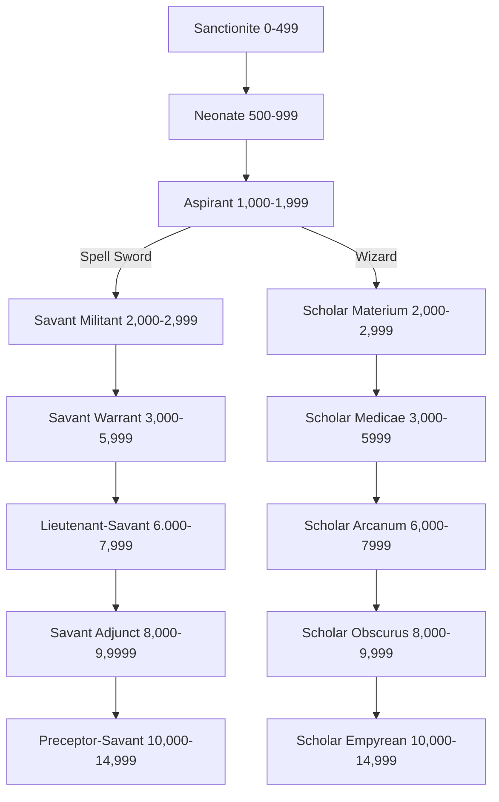

*"Imagine knowing there was a door to the realm of Daemons, and the slightest inattention on your behalf would see them batter it down and rip you to shreds. Now imagine that door is inside your head. That's what being a psyker is like."* 

— Castus Lupa, Savant Adjunct

Psykers are otherwordly individuals with supernatural powers and can possess a wide array of varied abilities, from reading minds to throwing bolts of flame. The power to bend reality to one’s will comes with a terrible price, however: each psyker’s mind is a doorway to the hellish dimension of the immaterium, the realm of Daemons, psychic predators and other indescribable horrors. Imperial psykers have undergone Sanctioning, giving them a measure of control over their psychic powers; nevertheless, one still risks his soul each time he uses his unnatural abilities.
### Table: Imperial Psyker Characteristic Advances
| **Characteristic** | **Simple** | **Intermediate** | **Trained** | **Expert** |
| ------------------ | :--------: | :--------------: | :---------: | :--------: |
| Weapon Skill       |    500     |       750        |    1,000    |   2,500    |
| Ballistic Skill    |    250     |       500        |     750     |   1,000    |
| Strength           |    250     |       500        |     750     |   1,000    |
| Toughness          |    250     |       500        |     750     |   1,000    |
| Agility            |    500     |       750        |    1,000    |   2,500    |
| Intelligence       |    100     |       250        |     500     |    750     |
| Perception         |    100     |       250        |     500     |    750     |
| Willpower          |    100     |       250        |     500     |    750     |
| Fellowship         |    500     |       750        |    1,000    |   2,500    |
# Advancement Tree

```mermaid
graph TD
A[Sanctionite 0-499] --> B[Neonate 500-999];
B --> C[Aspirant 1,000-1,999];
C -- Spell Sword --> D[Savant Militant 2,000-2,999];
D --> E[Savant Warrant 3,000-5,999];
E --> F[Lieutenant-Savant 6.000-7,999]
F --> G[Savant Adjunct 8,000-9,9999]
G --> H[Preceptor-Savant 10,000-14,999]
C -- Wizard --> I[Scholar Materium 2,000-2,999]
I --> J[Scholar Medicae 3,000-5999]
J --> K[Scholar Arcanum 6,000-7999]
K --> L[Scholar Obscurus 8,000-9,999]
L --> M[Scholar Empyrean 10,000-14,999]
```
## **Sanctionite Advances**

*"Throne knows what them sanctioneers do to 'em when they get to Earth, but I ain't never met a normal psyker yet."*

Sanctionites are bound to the Emperor's will, yet even then, they must be watched for weakness of the soul. They have been tested upon Holy Terra, and found worthy… for now.

| Advance                                                                     | Cost |  Type  | Prerequisites |
| --------------------------------------------------------------------------- | :--: | :----: | :------------ |
| [Awareness](Skills.md#awareness)                                            | 100  | Skill  | —             |
| [Common Lore (Imperial Creed)](Skills.md#common%20lore)                     | 100  | Skill  | —             |
| [Common Lore (Imperium)](Skills.md#common%20lore)                           | 100  | Skill  | —             |
| [Drive (Ground Vehicle)](Skills.md#drive)                                   | 100  | Skill  | —             |
| [Forbidden Lore (Warp)](Skills.md#forbidden%20lore)                         | 100  | Skill  | —             |
| [Invocation](Skills.md#invocation)                                          | 100  | Skill  | —             |
| [Literacy](Skills.md#literacy)                                              | 100  | Skill  | —             |
| [Psyniscience](Skills.md#psyniscience)                                      | 100  | Skill  | —             |
| [Scholastic Lore (Occult)](Skills.md#scholastic%20lore)                     | 100  | Skill  | —             |
| [Swim](Skills.md#swim)                                                      | 100  | Skill  | —             |
| [Trade (Merchant)](Skills.md#trade)                                         | 100  | Skill  | —             |
| [Trade (Soothsayer)](Skills.md#trade)                                       | 100  | Skill  | —             |
| [Chem Geld](Talents.md#chem%20geld)                                         | 100  | Talent | —             |
| [Flagellant](Talents.md#flagellant)                                         | 100  | Talent | —             |
| [Hatred (Daemons)](Talents.md#hatred)                                       | 100  | Talent | —             |
| [Meditation](Talents.md#meditation)                                         | 100  | Talent | —             |
| [Melee Weapon Training (Primitive)](Talents.md#melee%20weapon%20training)   | 100  | Talent | —             |
| [Minor Psychic Power](Talents.md#minor%20psychic%20power)                   | 100  | Talent | —             |
| [Pistol Training (Las)](Talents.md#pistol%20training)                       | 100  | Talent | —             |
| [Pistol Training (Primitive)](Talents.md#pistol%20training)                 | 100  | Talent | —             |
| [Pistol Training (SP)](Talents.md#pistol%20training)                        | 100  | Talent | —             |
| [Psy Rating 1](Talents.md#psy%20rating%201)                                 | 100  | Talent | —             |
| [Quick Draw](Talents.md#quick%20draw)                                       | 100  | Talent | —             |
| [Unremarkable](Talents.md#unremarkable)                                     | 100  | Talent | —             |
| [Thrown Weapon Training (Primitive)](Talents.md#thrown%20weapon%20training) | 100  | Talent | —             |
| [Sound Constitution](Talents.md#sound%20constitution)                       | 200  | Talent | —             |
## **Neonate Advances**

*"I always thought he was aide to the Reeve, turns out he was a psyker all along!"*

Neonates serve as apprentices, servants and bonds men to elder psykers or such bodies as the Adeptus Astra Telepathica deems suitable. During this time, they learn humility, obedience and the true price of their powers.

| Advance                                                                   | Cost |  Type  | Prerequisites |
| ------------------------------------------------------------------------- | :--: | :----: | :------------ |
| [Chem-Use](Skills.md#chem-use)                                            | 100  | Skill  | —             |
| [Ciphers (Acolyte)](Skills.md#ciphers)                                    | 100  | Skill  | —             |
| [Deceive](Skills.md#deceive)                                              | 100  | Skill  | —             |
| [Forbidden Lore (Psykers)](Skills.md#forbidden%20lore)                    | 100  | Skill  | —             |
| [Performer (Musician)](Skills.md#performer)                               | 100  | Skill  | —             |
| [Performer (Singer)](Skills.md#performer)                                 | 100  | Skill  | —             |
| [Performer (Storyteller)](Skills.md#performer)                            | 100  | Skill  | —             |
| [Pilot (Civilian Craft)](Skills.md#pilot)                                 | 100  | Skill  | —             |
| [Wrangling](Skills.md#wrangling)                                          | 100  | Skill  | —             |
| [Basic Weapon Training (Primitive)](Talents.md#basic%20weapon%20training) | 100  | Talent | —             |
| [Leap Up](Talents.md#leap%20up)                                           | 100  | Talent | Ag 30         |
| [Light Sleeper](Talents.md#light%20sleeper)                               | 100  | Talent | Per 30        |
| [Minor Psychic Power](Talents.md#minor%20psychic%20power)†                | 100  | Talent | —             |
| [Paranoia](Talents.md#paranoia)                                           | 100  | Talent | —             |
| [Peer (the Insane)](Talents.md#peer)                                      | 100  | Talent | Fel 30        |
| [Rapid Reload](Talents.md#rapid%20reload)                                 | 100  | Talent | —             |
| [Sleight of Hand](Skills.md#sleight%20of%20hand)                          | 200  | Skill  | —             |
| [Psy Rating 2](Talents.md#psy%20rating%202)                               | 200  | Talent | Psy Rating 1  |
†*You may select this Talent up to three times at this Rank.*
## **Aspirant Advances**

*"If you're to join the Savant Militant, you better get used to blood, and lots of it."*

Having proven themselves stable and humble, the Aspirant studies his future options carefully, petitioning the Adeptus Astra Telepathica for placement within the Imperial Guard, Scholastica Psykana or other such institutions.

| Advance                                                               | Cost |  Type  | Prerequisites                          |
| --------------------------------------------------------------------- | :--: | :----: | :------------------------------------- |
| [Awareness +10](Skills.md#awareness)                                  | 100  | Skill  | Awareness                              |
| [Blather](Skills.md#blather)                                          | 100  | Skill  | —                                      |
| [Dodge](Skills.md#dodge)                                              | 100  | Skill  | —                                      |
| [Inquiry](Skills.md#inquiry)                                          | 100  | Skill  | —                                      |
| [Literacy +10](Skills.md#literacy)                                    | 100  | Skill  | —                                      |
| [Scholastic Lore (Heraldry)](Skills.md#scholastic%20lore)             | 100  | Skill  | —                                      |
| [Scholastic Lore (Legend)](Skills.md#scholastic%20lore)               | 100  | Skill  | —                                      |
| [Secret Tongue (Acolyte)](Skills.md#secret%20tongue)                  | 100  | Skill  | —                                      |
| [Tech-Use](Skills.md#tech-use)                                        | 100  | Skill  | —                                      |
| [Trade (Copyist)](Skills.md#trade)                                    | 100  | Skill  | —                                      |
| [Trade (Soothsayer) +10](Skills.md#trade)                             | 100  | Skill  | Trade (Soothsayer)                     |
| [Ambidextrous](Talents.md#ambidextrous)                               | 100  | Talent | Ag 30                                  |
| [Basic Weapon Training (Las)](Talents.md#basic%20weapon%20training)   | 100  | Talent | —                                      |
| [Basic Weapon Training (SP)](Talents.md#basic%20weapon%20training)    | 100  | Talent | —                                      |
| [Blind Fighting](Talents.md#blind%20fighting)                         | 100  | Talent | Per 30                                 |
| [Die Hard](Talents.md#die%20hard)                                     | 100  | Talent | WP 40                                  |
| [Melee Weapon Training (Shock)](Talents.md#melee%20weapon%20training) | 100  | Talent | —                                      |
| [Minor Psychic Power](Talents.md#minor%20psychic%20power)†            | 100  | Talent | —                                      |
| [Peer (Academics)](Talents.md#peer)                                   | 100  | Talent | Fel 30                                 |
| [Rapid Reaction](Talents.md#rapid%20reaction)                         | 100  | Talent | Ag 40                                  |
| [Unshakeable Faith](Talents.md#unshakeable%20faith)                   | 100  | Talent | —                                      |
| [Sound Constitution](Talents.md#sound%20constitution)                 | 200  | Talent | —                                      |
| [Warp Sense](Talents.md#warp%20sense)                                 | 200  | Talent | Per 30, Psy Rating, Psyniscience Skill |
†*You may select this Talent up to four times at this Rank.*
## **Savant Militant Advances**

*"Ignore the chantin' coming from their tents—it's when they fall silent that you've got to watch."*

The Imperial Guard often use the Savants Militant, putting their destructive powers to good use upon the battlefield.

| Advance                                                               | Cost |  Type  | Prerequisites                 |
| --------------------------------------------------------------------- | :--: | :----: | :---------------------------- |
| [Barter](Skills.md#barter)                                            | 100  | Skill  | —                             |
| [Carouse](Skills.md#carouse)                                          | 100  | Skill  | —                             |
| [Chem-Use +10](Skills.md#chem-use)                                    | 100  | Skill  | Chem-Use                      |
| [Climb](Skills.md#climb)                                              | 100  | Skill  | —                             |
| [Common Lore (War)](Skills.md#common%20lore)                          | 100  | Skill  | —                             |
| [Dodge +10](Skills.md#dodge)                                          | 100  | Skill  | Dodge                         |
| [Drive (Ground Vehicle) +10](Skills.md#drive)                         | 100  | Skill  | Drive (Ground Vehicle)        |
| [Drive (Hover Vehicle)](Skills.md#drive)                              | 100  | Skill  | —                             |
| [Drive (Walker)](Skills.md#drive)                                     | 100  | Skill  | —                             |
| [Logic](Skills.md#logic)                                              | 100  | Skill  | —                             |
| [Navigation (Surface)](Skills.md#navigation)                          | 100  | Skill  | —                             |
| [Survival](Skills.md#survival)                                        | 100  | Skill  | —                             |
| [Trade (Cook)](Skills.md#trade)                                       | 100  | Skill  | —                             |
| [Basic Weapon Training (Flame)](Talents.md#basic%20weapon%20training) | 100  | Talent | —                             |
| [Cleanse and Purify](Talents.md#cleanse%20and%20purify)               | 100  | Talent | Basic Weapon Training (Flame) |
| [Corpus Conversion](Talents.md#corpus%20conversion)                   | 100  | Talent | Psy Rating 2                  |
| [Crippling Strike](Talents.md#crippling%20strike)                     | 100  | Talent | WS 50                         |
| [Crushing Blow](Talents.md#crushing%20blow)                           | 100  | Talent | S 40                          |
| [Frenzy](Talents.md#frenzy)                                           | 100  | Talent | —                             |
| [Hard Target](Talents.md#hard%20target)                               | 100  | Talent | Ag 40                         |
| [Iron Jaw](Talents.md#iron%20jaw)                                     | 100  | Talent | T 40                          |
| [Minor Psychic Power](Talents.md#minor%20psychic%20power)†            | 100  | Talent | —                             |
| [Resistance (Cold)](Talents.md#resistance)                            | 100  | Talent | —                             |
| [Resistance (Heat)](Talents.md#resistance)                            | 100  | Talent | —                             |
| [Street Fighting](Talents.md#street%20fighting)                       | 100  | Talent | —                             |
| [Power Well](Talents.md#power%20well)                                 | 200  | Talent | Psy Rating 2                  |
| [Psy Rating 3](Talents.md#psy%20rating%203)                           | 200  | Talent | Psy Rating 2                  |
| [Psychic Power](Talents.md#psychic%20power)                           | 200  | Talent | —                             |
| [Sound Constitution](Talents.md#sound%20constitution)                 | 200  | Talent | —                             |
†*You may select this Talent twice at this Rank.*
## **Scholar Materium Advances**

*"'E said sommat about levers an' movin' the universe, sire. Don't see that there's anythin' wrong with it where it is, but that's scholars for you, ain't it sir?"*

As a full initiate of the Scholastica Psykana, the Scholar Materium studies the foundations of being, essence and immutable form.

| Advance                                                     | Cost | Type   | Prerequisites            |
| ----------------------------------------------------------- | ---- | ------ | ------------------------ |
| [Chem-Use +10](Skills.md#chem-use)                          | 100  | Skill  | Chem-Use                 |
| [Ciphers (Occult)](Skills.md#ciphers)                       | 100  | Skill  | —                        |
| [Common Lore (Tech)](Skills.md#common%20lore)               | 100  | Skill  | —                        |
| [Evaluate](Skills.md#evaluate)                              | 100  | Skill  | —                        |
| [Forbidden Lore (Psykers) +10](Skills.md#forbidden%20lore)  | 100  | Skill  | Forbidden Lore (Psykers) |
| [Invocation +10](Skills.md#invocation)                      | 100  | Skill  | Invocation               |
| [Logic](Skills.md#logic)                                    | 100  | Skill  | —                        |
| [Medicae](Skills.md#medicae)                                | 100  | Skill  | —                        |
| [Psyniscience +10](Skills.md#psyniscience)                  | 100  | Skill  | Psyniscience             |
| [Scholastic Lore (Astromancy)](Skills.md#scholastic%20lore) | 100  | Skill  | —                        |
| [Scholastic Lore (Chymistry)](Skills.md#scholastic%20lore)  | 100  | Skill  | —                        |
| [Secret Tongue (Acolyte) +10](Skills.md#secret%20tongue)    | 100  | Skill  | Secret Tongue (Acolyte)  |
| [Speak Language (High Gothic)](Skills.md#speak%20language)  | 100  | Skill  | —                        |
| [Tech-Use +10](Skills.md#tech-use)                          | 100  | Skill  | Tech-Use                 |
| [Trade (Prospector)](Skills.md#trade)                       | 100  | Skill  | —                        |
| [Trade (Wright)](Skills.md#trade)                           | 100  | Skill  | —                        |
| [Binary Chatter](Talents.md#binary%20chatter)               | 100  | Talent | —                        |
| [Catfall](Talents.md#catfall)                               | 100  | Talent | Ag 30                    |
| [Deadeye Shot](Talents.md#deadeye%20shot)                   | 100  | Talent | BS 30                    |
| [Iron Jaw](Talents.md#iron%20jaw)                           | 100  | Talent | T 40                     |
| [Minor Psychic Power](Talents.md#minor%20psychic%20power)†  | 100  | Talent | —                        |
| [Peer (Astropaths)](Talents.md#peer)                        | 100  | Talent | Fel 30                   |
| [Sprint](Talents.md#sprint)                                 | 100  | Talent | —                        |
| [Technical Knock](Talents.md#technical%20knock)             | 100  | Talent | Int 30                   |
| [Common Lore (Machine Cult)](Skills.md#common%20lore)       | 200  | Skill  | —                        |
| [Power Well](Talents.md#power%20well)                       | 200  | Talent | Psy Rating 2             |
| [Psy Rating 3](Talents.md#psy%20rating%203)                 | 200  | Talent | Psy Rating 2             |
| [Psychic Power](Talents.md#psychic%20power)                 | 200  | Talent | —                        |
†*You may select this Talent twice at this Rank.*
## **Savant-Warrant Advances**

*"I've seen some terrifying things in my time but none quite so chilling as the way a battle psyker kills his foes."*

The Savant-Warrant has proved themselves reliable in the face of fire, and is duly trained for a greater role.

| Advance                                                               | Cost |  Type  | Prerequisites         |
| --------------------------------------------------------------------- | :--: | :----: | :-------------------- |
| [Carouse +10](Skills.md#carouse)                                      | 100  | Skill  | Carouse               |
| [Ciphers (War Cant)](Skills.md#ciphers)                               | 100  | Skill  | —                     |
| [Common Lore (Imperial Guard)](Skills.md#common%20lore)               | 100  | Skill  | —                     |
| [Common Lore (Tech)](Skills.md#common%20lore)                         | 100  | Skill  | —                     |
| [Common Lore (War) +10](Skills.md#common%20lore)                      | 100  | Skill  | Common Lore (War)     |
| [Drive (Hover Vehicle) +10](Skills.md#drive)                          | 100  | Skill  | Drive (Hover Vehicle) |
| [Drive (Walker) +10](Skills.md#drive)                                 | 100  | Skill  | Drive (Walker)        |
| [Gamble](Skills.md#gamble)                                            | 100  | Skill  | —                     |
| [Inquiry +10](Skills.md#inquiry)                                      | 100  | Skill  | Inquiry               |
| [Pilot (Military Craft)](Skills.md#pilot)                             | 100  | Skill  | —                     |
| [Search](Skills.md#search)                                            | 100  | Skill  | —                     |
| [Secret Tongue (Military)](Skills.md#secret%20tongue)                 | 100  | Skill  | —                     |
| [Tech-Use +10](Skills.md#tech-use)                                    | 100  | Skill  | Tech-Use              |
| [Trade (Cook) +10](Skills.md#trade)                                   | 100  | Skill  | Trade (Cook)          |
| [Trade (Technomat)](Skills.md#trade)                                  | 100  | Skill  | —                     |
| [Basic Weapon Training (Bolt)](Talents.md#basic%20weapon%20training)  | 100  | Talent | —                     |
| [Battle Rage](Talents.md#battle%20rage)                               | 100  | Talent | Frenzy                |
| [Crack Shot](Talents.md#crack%20shot)                                 | 100  | Talent | BS 40                 |
| [Deadeye Shot](Talents.md#deadeye%20shot)                             | 100  | Talent | BS 30                 |
| [Hip Shooter](Talents.md#hip%20shooting)                              | 100  | Talent | BS 40, Ag 40          |
| [Melee Weapon Training (Chain)](Talents.md#melee%20weapon%20training) | 100  | Talent | —                     |
| [Mental Rage](Talents.md#mental%20rage)                               | 100  | Talent | Frenzy                |
| [Minor Psychic Power](Talents.md#minor%20psychic%20power)             | 100  | Talent | —                     |
| [Nerves of Steel](Talents.md#nerves%20of%20steel)                     | 100  | Talent | —                     |
| [Technical Knock](Talents.md#technical%20knock)                       | 100  | Talent | Int 30                |
| [Two-Weapon Wielder (Ballistic)](Talents.md#two-weapon%20wielder)     | 100  | Talent | —                     |
| [Two-Weapon Wielder (Melee)](Talents.md#two-weapon%20wielder)         | 100  | Talent | —                     |
| [Demolition](Skills.md#demolition)                                    | 200  | Skill  | —                     |
| [Security](Skills.md#security)                                        | 200  | Skill  | —                     |
| [Pistol Training (Bolt)](Talents.md#pistol%20training)                | 200  | Talent | —                     |
| [Pistol Training (Flame)](Talents.md#pistol%20training)               | 200  | Talent | —                     |
| [Psychic Power](Talents.md#psychic%20power)                           | 200  | Talent | —                     |
| [Swift Attack](Talents.md#swift%20attack)                             | 300  | Talent | WS 35                 |
## **Scholar Medicae Advances**

*"He says he's solved the riddle of steel, sire, an' now he keeps muckin' about with lightning an' dead animals. Bloody messy it is too."*

The Scholar Medicae has learnt well the lessons of base matter, and now turns his powers to understanding the mysteries of flesh, bone and the living being.

| Advance                                                           | Cost |  Type  | Prerequisites               |
| ----------------------------------------------------------------- | :--: | :----: | :-------------------------- |
| [Awareness +20](Skills.md#awareness)                              | 100  | Skill  | Awareness +10               |
| [Barter](Skills.md#barter)                                        | 100  | Skill  | —                           |
| [Carouse](Skills.md#carouse)                                      | 100  | Skill  | —                           |
| [Chem-Use +20](Skills.md#chem-use)                                | 100  | Skill  | Chem-Use +10                |
| [Forbidden Lore (Mutants)](Skills.md#forbidden%20lore)            | 100  | Skill  | —                           |
| [Inquiry +10](Skills.md#inquiry)                                  | 100  | Skill  | Inquiry                     |
| [Literacy +20](Skills.md#literacy)                                | 100  | Skill  | Literacy +10                |
| [Medicae +10](Skills.md#medicae)                                  | 100  | Skill  | Medicae                     |
| [Scholastic Lore (Archaic)](Skills.md#scholastic%20lore)          | 100  | Skill  | —                           |
| [Scholastic Lore (Chymistry) +10](Skills.md#scholastic%20lore)    | 100  | Skill  | Scholastic Lore (Chymistry) |
| [Scholastic Lore (Imperial Creed)](Skills.md#scholastic%20lore)   | 100  | Skill  | —                           |
| [Scrutiny](Skills.md#scrutiny)                                    | 100  | Skill  | —                           |
| [Trade (Agri)](Skills.md#trade)                                   | 100  | Skill  | —                           |
| [Trade (Apothecary)](Skills.md#trade)                             | 100  | Skill  | —                           |
| [Trade (Embalmer)](Skills.md#trade)                               | 100  | Skill  | —                           |
| [Crippling Strike](Talents.md#crippling%20strike)                 | 100  | Talent | WS 50                       |
| [Crushing Blow](Talents.md#crushing%20blow)                       | 100  | Talent | S 40                        |
| [Decadence](Talents.md#decadence)                                 | 100  | Talent | T 30                        |
| [Jaded](Talents.md#jaded)                                         | 100  | Talent | WP 30                       |
| [Master Chirurgeon](Talents.md#master%20chirurgeon)               | 100  | Talent | Medicae +10                 |
| [Minor Psychic Power](Talents.md#minor%20psychic%20power)†        | 100  | Talent | —                           |
| [Psychic Power](Talents.md#psychic%20power)†                      | 100  | Talent | —                           |
| [Street Fighting](Talents.md#street%20fighting)                   | 100  | Talent | —                           |
| [Two-Weapon Wielder (Ballistic)](Talents.md#two-weapon%20wielder) | 100  | Talent | —                           |
| [Two-Weapon Wielder (Melee)](Talents.md#two-weapon%20wielder)     | 100  | Talent | —                           |
| [Corpus Conversion](Talents.md#corpus%20conversion)               | 200  | Talent | Psy Rating 2                |
| [Discipline Focus](Talents.md#discipline%20focus)                 | 200  | Talent | Psy Rating 3                |
| [Psy Rating 4](Talents.md#psy%20rating%204)                       | 200  | Talent | Psy Rating 3                |
| [Sound Constitution](Talents.md#sound%20constitution)             | 200  | Talent | —                           |
†*You may select this Talent twice at this Rank.*
## **Lieutenant-Savant Advances**

*"They call them officers, but I'll be damned if I ever take an order from one."*

The Lieutenant-Savant enjoys an officer's rank and privilege, yet is under constant surveillance nonetheless.

| Advance                                                                         | Cost |  Type  | Prerequisites                      |
| ------------------------------------------------------------------------------- | :--: | :----: | :--------------------------------- |
| [Barter +10](Skills.md#barter)                                                  | 100  | Skill  | Barter                             |
| [Blather +10](Skills.md#blather)                                                | 100  | Skill  | Blather                            |
| [Charm](Skills.md#charm)                                                        | 100  | Skill  | —                                  |
| [Chem-Use +20](Skills.md#chem-use)                                              | 100  | Skill  | Chem-Use +10                       |
| [Ciphers (War Cant) +10](Skills.md#ciphers)                                     | 100  | Skill  | Ciphers (War Cant)                 |
| [Command](Skills.md#command)                                                    | 100  | Skill  | —                                  |
| [Common Lore (Administratum)](Skills.md#common%20lore)                          | 100  | Skill  | —                                  |
| [Common Lore (Imperial Guard) +10](Skills.md#common%20lore)                     | 100  | Skill  | Common Lore (Imperial Guard)       |
| [Common Lore (War) +20](Skills.md#common%20lore)                                | 100  | Skill  | Common Lore (War) +10              |
| [Deceive +10](Skills.md#deceive)                                                | 100  | Skill  | Deceive                            |
| [Demolition +10](Skills.md#demolition)                                          | 100  | Skill  | Demolition                         |
| [Logic](Skills.md#logic)                                                        | 100  | Skill  | —                                  |
| [Navigation (Surface) +10](Skills.md#navigation)                                | 100  | Skill  | Navigation (Surface)               |
| [Pilot (Military Craft) +10](Skills.md#pilot)                                   | 100  | Skill  | Pilot (Military Craft)             |
| [Scholastic Lore (Tactica Imperialis)](Skills.md#scholastic%20lore)             | 100  | Skill  | —                                  |
| [Scrutiny](Skills.md#scrutiny)                                                  | 100  | Skill  | —                                  |
| [Secret Tongue (Military) +10](Skills.md#secret%20tongue)                       | 100  | Skill  | Secret Tongue (Military)           |
| [Berserk Charge](Talents.md#berserk%20charge)                                   | 100  | Talent | —                                  |
| [Blademaster](Talents.md#blademaster)                                           | 100  | Talent | WS 30, Melee Weapon Training (any) |
| [Disarm](Talents.md#disarm)                                                     | 100  | Talent | Ag 30                              |
| [Furious Assault](Talents.md#furious%20assault)                                 | 100  | Talent | WS 35                              |
| [Jaded](Talents.md#jaded)                                                       | 100  | Talent | WP 30                              |
| [Melee Weapon Training (Power)](Talents.md#melee%20weapon%20training)           | 100  | Talent | —                                  |
| [Minor Psychic Power](Talents.md#minor%20psychic%20power)†                      | 100  | Talent | —                                  |
| [Precise Blow](Talents.md#precise%20blow)                                       | 100  | Talent | WS 30, Sure Strike                 |
| [Resistance (Fear)](Talents.md#resistance)                                      | 100  | Talent | —                                  |
| [Sure Strike](Talents.md#sure%20strike)                                         | 100  | Talent | WS 30                              |
| [True Grit](Talents.md#true%20grit)                                             | 100  | Talent | T 40                               |
| [Interrogation](Skills.md#interrogation)                                        | 200  | Skill  | —                                  |
| [Discipline Focus (*choose one*)](Talents.md#discipline%20focus)                | 200  | Talent | Psy Rating 3                       |
| [Exotic Weapon Training (Needle Pistol)](Talents.md#exotic%20weapon%20training) | 200  | Talent | —                                  |
| [Hotshot Pilot](Talents.md#hotshot%20pilot)                                     | 200  | Talent | Ag 40, Pilot Skill                 |
| [Peer (Military)](Talents.md#peer)                                              | 200  | Talent | Fel 30                             |
| [Psy Rating 4](Talents.md#psy%20rating%204)                                     | 200  | Talent | Psy Rating 3                       |
| [Sound Constitution](Talents.md#sound%20constitution)                           | 200  | Talent | —                                  |
†*You may select this Talent twice at this Rank.*
## **Scholar Arcanum Advances**

*"I ain't never seen so many books, whatever can he be doin'? All that paper ain't good for yer health. Still, least he ain't cuttin' up no dead Grox no more, sir."*

Versed in the ways of matter and flesh, the Scholar Arcanum studies the sphere of the mind, the realm of theory, academic learning and philosophical conjecture.

| Advance                                                             | Cost |  Type  | Prerequisites                      |
| ------------------------------------------------------------------- | :--: | :----: | :--------------------------------- |
| [Blather +10](Skills.md#blather)                                    | 100  | Skill  | Blather                            |
| [Ciphers (Occult) +10](Skills.md#ciphers)                           | 100  | Skill  | Ciphers (Occult)                   |
| [Dodge +10](Skills.md#dodge)                                        | 100  | Skill  | Dodge                              |
| [Forbidden Lore (Psykers) +20](Skills.md#forbidden%20lore)          | 100  | Skill  | Forbidden Lore (Psykers) +10       |
| [Forbidden Lore (Warp) +10](Skills.md#forbidden%20lore)             | 100  | Skill  | Forbidden Lore (Warp)              |
| [Forbidden Lore (Xenos)](Skills.md#forbidden%20lore)                | 100  | Skill  | —                                  |
| [Interrogation](Skills.md#interrogation)                            | 100  | Skill  | —                                  |
| [Invocation +20](Skills.md#invocation)                              | 100  | Skill  | Invocation +10                     |
| [Scholastic Lore (Astromancy) +10](Skills.md#scholastic%20lore)     | 100  | Skill  | Scholastic Lore (Astromancy)       |
| [Scholastic Lore (Cryptology)](Skills.md#scholastic%20lore)         | 100  | Skill  | —                                  |
| [Scholastic Lore (Imperial Creed) +10](Skills.md#scholastic%20lore) | 100  | Skill  | Scholastic Lore (Imperial Creed)   |
| [Scholastic Lore (Legend) +10](Skills.md#scholastic%20lore)         | 100  | Skill  | Scholastic Lore (Legend)           |
| [Secret Tongue (Acolyte) +20](Skills.md#secret%20tongue)            | 100  | Skill  | Secret Tongue (Acolyte) +10        |
| [Speak Language (High Gothic) +10](Skills.md#speak%20language)      | 100  | Skill  | Speak Language (High Gothic)       |
| [Tech-Use +20](Skills.md#tech-use)                                  | 100  | Skill  | Tech-Use +10                       |
| [Trade (Cartographer)](Skills.md#trade)                             | 100  | Skill  | —                                  |
| [Trade (Copyist) +10](Skills.md#trade)                              | 100  | Skill  | Trade (Copyist)                    |
| [Crack Shot](Talents.md#crack%20shot)                               | 100  | Talent | BS 40                              |
| [Foresight](Talents.md#foresight)                                   | 100  | Talent | Int 30                             |
| [Hard Target](Talents.md#hard%20target)                             | 100  | Talent | Ag 40                              |
| [Mimic](Talents.md#mimic)                                           | 100  | Talent | —                                  |
| [Minor Psychic Power](Talents.md#minor%20psychic%20power)†          | 100  | Talent | —                                  |
| [Peer (Void Born)](Talents.md#peer)                                 | 100  | Talent | Fel 30                             |
| [Psychic Power](Talents.md#psychic%20power)‡                        | 100  | Talent | —                                  |
| [Resistance (Psychic Powers)](Talents.md#resistance)                | 100  | Talent | —                                  |
| [Strong Minded](Talents.md#strong%20minded)                         | 100  | Talent | WP 30, Resistance (Psychic Powers) |
| [Discipline Focus (*choose one*)](Talents.md#discipline%20focus)    | 200  | Talent | Psy Rating 3                       |
| [Favoured by the Warp](Talents.md#favoured%20by%20the%20warp)       | 200  | Talent | WP 35                              |
| [Power Well](Talents.md#power%20well)                               | 200  | Talent | Psy Rating 2                       |
| [Forbidden Lore (Heresy)](Skills.md#forbidden%20lore)               | 300  | Skill  | —                                  |
†*You may select this Talent up to three times at this Rank.*
‡*You may select this Talent twice at this Rank.*
## **Savant Adjunct Advances**

*"Watch the pale cove in the officer's gear. When he whispers in the commander's ear, that's it, we'll be sent over the top."*

The Savant Adjunct has the power to bend flesh and metal, to send his mind forth amongst the enemy forces and to ken the nature of unnatural opponents. He is valued for his powers, yet greatly feared by those who command him.

| Advance                                                                 | Cost |  Type  | Prerequisites                        |
| ----------------------------------------------------------------------- | :--: | :----: | :----------------------------------- |
| [Awareness +20](Skills.md#awareness)                                    | 100  | Skill  | Awareness +10                        |
| [Common Lore (Adeptes Arbites)](Skills.md#common%20lore)                | 100  | Skill  | —                                    |
| [Common Lore (Ecclesiarchy)](Skills.md#common%20lore)                   | 100  | Skill  | —                                    |
| [Common Lore (Imperial Guard) +20](Skills.md#common%20lore)             | 100  | Skill  | Common Lore (Imperial Guard) +10     |
| [Common Lore (Tech) +10](Skills.md#common%20lore)                       | 100  | Skill  | Common Lore (Tech)                   |
| [Concealment](Skills.md#concealment)                                    | 100  | Skill  | —                                    |
| [Dodge +20](Skills.md#dodge)                                            | 100  | Skill  | Dodge +10                            |
| [Evaluate](Skills.md#evaluate)                                          | 100  | Skill  | —                                    |
| [Intimidate](Skills.md#intimidate)                                      | 100  | Skill  | —                                    |
| [Logic +10](Skills.md#logic)                                            | 100  | Skill  | Logic                                |
| [Medicae](Skills.md#medicae)                                            | 100  | Skill  | —                                    |
| [Scholastic Lore (Judgement)](Skills.md#scholastic%20lore)              | 100  | Skill  | —                                    |
| [Scholastic Lore (Legend) +10](Skills.md#scholastic%20lore)             | 100  | Skill  | Scholastic Lore (Legend)             |
| [Scholastic Lore (Tactica Imperialis) +10](Skills.md#scholastic%20lore) | 100  | Skill  | Scholastic Lore (Tactica Imperialis) |
| [Secret Tongue (Military) +20](Skills.md#secret%20tongue)               | 100  | Skill  | Secret Tongue (Military) +10         |
| [Speak Language (High Gothic)](Skills.md#speak%20language)              | 100  | Skill  | —                                    |
| [Trade (Valet)](Skills.md#trade)                                        | 100  | Skill  | —                                    |
| [Charm +10](Skills.md#charm)                                            | 200  | Skill  | Charm                                |
| [Forbidden Lore (Psykers) +10](Skills.md#forbidden%20lore)              | 200  | Skill  | Forbidden Lore (Psykers)             |
| [Invocation +10](Skills.md#invocation)                                  | 200  | Skill  | Invocation                           |
| [Sound Constitution](Talents.md#sound%20constitution)                   | 200  | Talent | —                                    |
| [Command +10](Skills.md#command)                                        | 300  | Skill  | Command                              |
| [Scrutiny +10](Skills.md#scrutiny)                                      | 300  | Skill  | Scrutiny                             |
| [Pistol Training (Plasma)](Talents.md#pistol%20training)                | 300  | Talent | —                                    |
| [Power Well](Talents.md#power%20well)                                   | 200  | Talent | Psy Rating 2                         |
## **Scholar Obscurus Advances**

*"You talk to him, but he don't answer. You can feel him rummagin' in your thoughts right enough though. Put me off my gruel, it can."*

Abandoning the petty realm of human knowledge, the Scholar Obscurus studies the wisdom and folly of the human spirit. Steeped in forgotten lore and constantly muttering catechisms and charms against the creatures of the warp, these psykers grow strange and distant.

| Advance                                                               | Cost |  Type  | Prerequisites                           |
| --------------------------------------------------------------------- | :--: | :----: | :-------------------------------------- |
| [Ciphers (Occult) +20](Skills.md#ciphers)                             | 100  | Skill  | Ciphers (Occult) +10                    |
| [Common Lore (Tech) +10](Skills.md#common%20lore)                     | 100  | Skill  | Common Lore (Tech)                      |
| [Forbidden Lore (Mutants) +10](Skills.md#forbidden%20lore)            | 100  | Skill  | Forbidden Lore (Mutants)                |
| [Inquiry +20](Skills.md#inquiry)                                      | 100  | Skill  | Inquiry +10                             |
| [Lip Reading](Skills.md#lip%20reading)                                | 100  | Skill  | —                                       |
| [Psyniscience +20](Skills.md#psyniscience)                            | 100  | Skill  | Psyniscience +10                        |
| [Scholastic Lore (Archaic) +10](Skills.md#scholastic%20lore)          | 100  | Skill  | Scholastic Lore (Archaic)               |
| [Scholastic Lore (Heraldry) +10](Skills.md#scholastic%20lore)         | 100  | Skill  | Scholastic Lore (Heraldry)              |
| [Scholastic Lore (Legend) +20](Skills.md#scholastic%20lore)           | 100  | Skill  | Scholastic Lore (Legend) +10            |
| [Scholastic Lore (Philosophy)](Skills.md#scholastic%20lore)           | 100  | Skill  | —                                       |
| [Scrutiny +10](Skills.md#scrutiny)                                    | 100  | Skill  | Scrutiny                                |
| [Trade (Soothsayer) +20](Skills.md#trade)                             | 100  | Skill  | Trade (Soothsayer) +10                  |
| [Mental Fortress](Talents.md#mental%20fortress)                       | 100  | Talent | WP 50, Strong Minded                    |
| [Minor Psychic Power](Talents.md#minor%20psychic%20power)†            | 100  | Talent | —                                       |
| [Psychic Power](Talents.md#psychic%20power)‡                          | 100  | Talent | —                                       |
| [Resistance (Fear)](Talents.md#resistance)                            | 100  | Talent | —                                       |
| [Forbidden Lore (Cults)](Skills.md#forbidden%20lore)                  | 200  | Skill  | —                                       |
| [Forbidden Lore (Inquisition)](Skills.md#forbidden%20lore)            | 200  | Skill  | —                                       |
| [Dark Soul](Talents.md#dark%20soul)                                   | 200  | Talent | —                                       |
| [Discipline Focus (*choose one*)](Talents.md#discipline%20focus)      | 200  | Talent | Psy Rating 3                            |
| [Melee Weapon Training (Chain)](Talents.md#melee%20weapon%20training) | 200  | Talent | —                                       |
| [Melee Weapon Training (Power)](Talents.md#melee%20weapon%20training) | 200  | Talent | —                                       |
| [Peer (Inquisition)](Talents.md#peer)                                 | 200  | Talent | Fel 30                                  |
| [Psy Rating 5](Talents.md#psy%20rating%205)                           | 200  | Talent | Psy Rating 4                            |
| [Sound Constitution](Talents.md#sound%20constitution)                 | 200  | Talent | —                                       |
| [Warp Conduit](Talents.md#warp%20conduit)                             | 200  | Talent | WP 40, Psy Rating, Favoured of the Warp |
| [Forbidden Lore (Daemonology)](Skills.md#forbidden%20lore)            | 300  | Skill  | —                                       |
| [Forbidden Lore (Heresy) +10](Skills.md#forbidden%20lore)             | 300  | Skill  | Forbidden Lore (Heresy)                 |
†*You may select this Talent up to three times at this Rank.*
‡*You may select this Talent twice at this Rank.*
## **Preceptor-Savant Advances**

*"You know how Commissars are strict? Well that ain't nothing to a Preceptor. Shoot his men as soon as blink—and a good job too."*

The Preceptor-Savant is a psyker charged with manifold duties—to lead the Savant Militant, to protect key command staff and to instruct officers in the best deployment of psychic forces.

| Advance                                                                 | Cost |  Type  | Prerequisites                            |
| ----------------------------------------------------------------------- | :--: | :----: | :--------------------------------------- |
| [Ciphers (War Cant) +20](Skills.md#ciphers)                             | 100  | Skill  | Ciphers (War Cant) +10                   |
| [Command +20](Skills.md#command)                                        | 100  | Skill  | Command +10                              |
| [Deceive +20](Skills.md#deceive)                                        | 100  | Skill  | Deceive +10                              |
| [Demolition +20](Skills.md#demolition)                                  | 100  | Skill  | Demolition +10                           |
| [Forbidden Lore (Psykers) +20](Skills.md#forbidden%20lore)              | 100  | Skill  | Forbidden Lore (Psykers) +10             |
| [Lip Reading](Skills.md#lip%20reading)                                  | 100  | Skill  | —                                        |
| [Logic +20](Skills.md#logic)                                            | 100  | Skill  | Logic +10                                |
| [Medicae +10](Skills.md#medicae)                                        | 100  | Skill  | Medicae                                  |
| [Navigation (Stellar)](Skills.md#navigation)                            | 100  | Skill  | —                                        |
| [Navigation (Surface) +20](Skills.md#navigation)                        | 100  | Skill  | Navigation (Surface) +10                 |
| [Pilot (Spacecraft)](Skills.md#pilot)                                   | 100  | Skill  | —                                        |
| [Psyniscience +10](Skills.md#psyniscience)                              | 100  | Skill  | Psyniscience                             |
| [Scholastic Lore (Heraldry) +10](Skills.md#scholastic%20lore)           | 100  | Skill  | Scholastic Lore (Heraldry)               |
| [Scholastic Lore (Judgement) +10](Skills.md#scholastic%20lore)          | 100  | Skill  | Scholastic Lore (Judgement)              |
| [Scholastic Lore (Philosophy)](Skills.md#scholastic%20lore)             | 100  | Skill  | —                                        |
| [Scholastic Lore (Tactica Imperialis) +20](Skills.md#scholastic%20lore) | 100  | Skill  | Scholastic Lore (Tactica Imperialis) +10 |
| [Scrutiny +20](Skills.md#scrutiny)                                      | 100  | Skill  | Scrutiny +10                             |
| [Air of Authority](Talents.md#air%20of%20authority)                     | 100  | Talent | Fel 30                                   |
| [Armour of Contempt](Talents.md#armour%20of%20contempt)                 | 100  | Talent | WP 40                                    |
| [Binary Chatter](Talents.md#binary%20chatter)                           | 100  | Talent | —                                        |
| [Foresight](Talents.md#foresight)                                       | 100  | Talent | Int 30                                   |
| [Good Reputation (Imperial Guard)](Talents.md#good%20reputation)        | 100  | Talent | Fel 50, Peer (Imperial Guard)            |
| [Into the Jaws of Hell](Talents.md#into%20the%20jaws%20of%20hell)       | 100  | Talent | Iron Discipline                          |
| [Iron Discipline](Talents.md#iron%20discipline)                         | 100  | Talent | WP 30, Command                           |
| [Litany of Hate](Talents.md#litany%20of%20hate)                         | 100  | Talent | Hatred (any)                             |
| [Mental Fortress](Talents.md#mental%20fortress)                         | 100  | Talent | WP 50, Strong Minded                     |
| [Minor Psychic Power](Talents.md#minor%20psychic%20power)†              | 100  | Talent | —                                        |
| [Peer (Government)](Talents.md#peer)                                    | 100  | Talent | Fel 30                                   |
| [Psychic Power](Talents.md#psychic%20power)                             | 100  | Talent | —                                        |
| [Strong Minded](Talents.md#strong%20minded)                             | 100  | Talent | WP 30, Resistance (Psychic Powers)       |
| [Total Recall](Talents.md#total%20recall)                               | 100  | Talent | Int 30                                   |
| [Forbidden Lore (Cults)](Skills.md#forbidden%20lore)                    | 200  | Skill  | —                                        |
| [Forbidden Lore (Heresy)](Skills.md#forbidden%20lore)                   | 200  | Skill  | —                                        |
| [Forbidden Lore (Inquisition)](Skills.md#forbidden%20lore)              | 200  | Skill  | —                                        |
| [Discipline Focus (*choose one*)](Talents.md#discipline%20focus)        | 200  | Talent | Psy Rating 3                             |
| [Favoured by the Warp](Talents.md#favoured%20by%20the%20warp)           | 200  | Talent | WP 35                                    |
| [Pistol Training (Melta)](Talents.md#pistol%20training)                 | 200  | Talent | —                                        |
| [Psy Rating 5](Talents.md#psy%20rating%205)                             | 200  | Talent | Psy Rating 4                             |
| [Sound Constitution](Talents.md#sound%20constitution)                   | 200  | Talent | —                                        |
†*You may select this Talent up to three times at this Rank.*
## **Scholar Empyrean Advances**

*"Sire, success! He made three pounds of gold yesterday! Funny fish though, didn't look happy or nothing, just wanted be left to his proper studies—whatever that means."*

The mind of the Scholar Empyrean ranges free, even whilst their will is securely chained to the immeasurable protection of the Emperor's own soul. Studying the deepest mysteries of psychic ability, the Scholar Empyrean care little for worldly goods or the petty demands of the corpus.

| Advance                                                             | Cost |  Type  | Prerequisites                        |
| ------------------------------------------------------------------- | :--: | :----: | :----------------------------------- |
| [Blather +20](Skills.md#blather)                                    | 100  | Skill  | Blather +10                          |
| [Common Lore (Tech) +20](Skills.md#common%20lore)                   | 100  | Skill  | Common Lore (Tech) +10               |
| [Deceive +10](Skills.md#deceive)                                    | 100  | Skill  | Deceive                              |
| [Evaluate +10](Skills.md#evaluate)                                  | 100  | Skill  | Evaluate                             |
| [Forbidden Lore (Archeotech)](Skills.md#forbidden%20lore)           | 100  | Skill  | —                                    |
| [Forbidden Lore (Mutants) +20](Skills.md#forbidden%20lore)          | 100  | Skill  | Forbidden Lore (Mutants) +10         |
| [Forbidden Lore (Warp) +20](Skills.md#forbidden%20lore)             | 100  | Skill  | Forbidden Lore (Warp) +10            |
| [Forbidden Lore (Xenos) +10](Skills.md#forbidden%20lore)            | 100  | Skill  | Forbidden Lore (Xenos)               |
| [Logic +10](Skills.md#logic)                                        | 100  | Skill  | Logic                                |
| [Medicae +20](Skills.md#medicae)                                    | 100  | Skill  | Medicae +10                          |
| [Scholastic Lore (Astromancy) +20](Skills.md#scholastic%20lore)     | 100  | Skill  | Scholastic Lore (Astromancy) +10     |
| [Scholastic Lore (Chymistry) +20](Skills.md#scholastic%20lore)      | 100  | Skill  | Scholastic Lore (Chymistry) +10      |
| [Scholastic Lore (Heraldry) +20](Skills.md#scholastic%20lore)       | 100  | Skill  | Scholastic Lore (Heraldry) +10       |
| [Scholastic Lore (Imperial Creed) +20](Skills.md#scholastic%20lore) | 100  | Skill  | Scholastic Lore (Imperial Creed) +10 |
| [Scholastic Lore (Judgement)](Skills.md#scholastic%20lore)          | 100  | Skill  | —                                    |
| [Scrutiny +20](Skills.md#scrutiny)                                  | 100  | Skill  | Scrutiny +10                         |
| [Trade (Artist)](Skills.md#trade)                                   | 100  | Skill  | —                                    |
| [Air of Authority](Talents.md#air%20of%20authority)                 | 100  | Talent | Fel 30                               |
| [Armour of Contempt](Talents.md#armour%20of%20contempt)             | 100  | Talent | WP 40                                |
| [Discipline Focus (*choose one*)](Talents.md#discipline%20focus)    | 100  | Talent | Psy Rating 3                         |
| [Fearless](Talents.md#fearless)                                     | 100  | Talent | —                                    |
| [Logis Implant](Talents.md#logis%20implant)                         | 100  | Talent | —                                    |
| [Master Orator](Talents.md#master%20orator)                         | 100  | Talent | Fel 30                               |
| [Minor Psychic Power](Talents.md#minor%20psychic%20power)‡†         | 100  | Talent | —                                    |
| [Nerves of Steel](Talents.md#nerves%20of%20steel)                   | 100  | Talent | —                                    |
| [Peer (Government)](Talents.md#peer)                                | 100  | Talent | Fel 30                               |
| [Psychic Power](Talents.md#psychic%20power)‡                        | 100  | Talent | —                                    |
| [Forbidden Lore (Cults) +10](Skills.md#forbidden%20lore)            | 200  | Skill  | Forbidden Lore (Cults)               |
| [Forbidden Lore (Inquisition) +10](Skills.md#forbidden%20lore)      | 200  | Skill  | Forbidden Lore (Inquisition)         |
| [Psy Rating 6](Talents.md#psy%20rating%206)                         | 200  | Talent | Psy Rating 5                         |
| [Good Reputation (Inquistion)](Talents.md#good%20reputation)        | 200  | Talent | Fel 50, Peer (Inquisition)           |
| [Sound Constitution](Talents.md#sound%20constitution)               | 200  | Talent | —                                    |
| [Forbidden Lore (Daemonology) +10](Skills.md#forbidden%20lore)      | 300  | Skill  | Forbidden Lore (Daemonology)         |
| [Forbidden Lore (The Black Library)](Skills.md#forbidden%20lore)    | 300  | Skill  | —                                    |
| [Inspire Wrath](Talents.md#inspire%20wrath)                         | 300  | Talent | Fel 30                               |
†*You may select this Talent up to three times at this Rank.*
‡*You may select this Talent twice at this Rank.*
