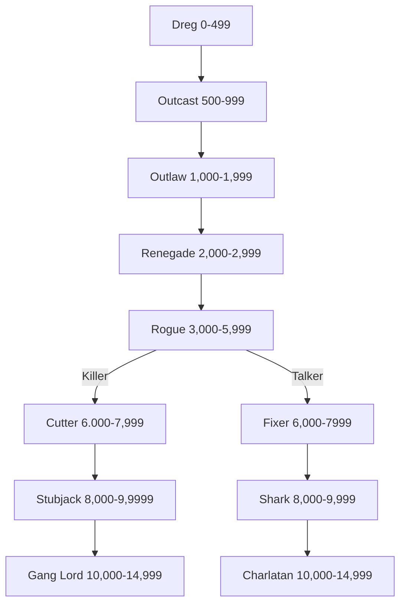

*"You see, you've won again. I told you I was no good at cards. I'll play one more round, but only because you insist."* 

— Reetheus Orl, Barking Saint, Hive Sibellius

Scum are the criminals, outcasts, conmen, gangers, thieves, and desperadoes of the Imperium. It is easy to generalise scum as the hardened recidivist that terrorises honest citizens in less-affluent parts of hive cities, or the destitute beggar stinking up the porch of the local refectory – mankind’s misbegotten flotsam and jetsam. Truthfully, though, scum includes just about anyone that exists outside or on the fringes of Imperial society. Born survivors that, by nature, must be both skilful and secretive, scum can lend a hand to almost any situation. Of course, scum are perfectly capable of using violence to get what they desire, although most are somewhat “glass-jawed” and would rather connive than shoot their way out of perilous situations.
### Table: Scum Characteristic Advances
| **Characteristic** | **Simple** | **Intermediate** | **Trained** | **Expert** |
| ------------------ | :--------: | :--------------: | :---------: | :--------: |
| Weapon Skill       |    250     |       500        |     750     |   1,000    |
| Ballistic Skill    |    100     |       250        |     500     |    750     |
| Strength           |    500     |       750        |    1,000    |   2,500    |
| Toughness          |    500     |       750        |    1,000    |   2,500    |
| Agility            |    100     |       250        |     500     |    750     |
| Intelligence       |    250     |       500        |     750     |   1,000    |
| Perception         |    250     |       500        |     750     |   1,000    |
| Willpower          |    250     |       500        |     750     |   1,000    |
| Fellowship         |    100     |       250        |     500     |    750     |
# Advancement Tree

```mermaid
graph TD
A[Dreg 0-499] --> B[Outcast 500-999];
B --> C[Outlaw 1,000-1,999];
C --> D[Renegade 2,000-2,999];
D --> E[Rogue 3,000-5,999]
E -- Killer --> F[Cutter 6.000-7,999]
F --> G[Stubjack 8,000-9,9999]
G --> H[Gang Lord 10,000-14,999]
E -- Talker --> I[Fixer 6,000-7999]
I --> J[Shark 8,000-9,999]
J --> K[Charlatan 10,000-14,999]
```
## **Dreg Advances**

*"Don't look at the dreg, Tarquis, you'll only encourage them."*

Beggars, thieves and base born scum: the dregs of society are nevertheless hardy and surprisingly capable.

| Advance                                                                     | Cost |  Type  | Prerequisites |
| --------------------------------------------------------------------------- | :--: | :----: | :------------ |
| [Awareness](Skills.md#awareness)                                            | 100  | Skill  | —             |
| [Awareness +10](Skills.md#awareness)                                        | 100  | Skill  | Awareness     |
| [Barter](Skills.md#barter)                                                  | 100  | Skill  | —             |
| [Blather](Skills.md#blather)                                                | 100  | Skill  | —             |
| [Charm](Skills.md#charm)                                                    | 100  | Skill  | —             |
| [Common Lore (Imperium)](Skills.md#common%20lore)                           | 100  | Skill  | —             |
| [Deceive](Skills.md#deceive)                                                | 100  | Skill  | —             |
| [Dodge](Skills.md#dodge)                                                    | 100  | Skill  | —             |
| [Drive (Ground Vehicle)](Skills.md#dodge)                                   | 100  | Skill  | —             |
| [Navigation (Surface)](Skills.md#navigation)                                | 100  | Skill  | —             |
| [Swim](Skills.md#swim)                                                      | 100  | Skill  | —             |
| [Basic Weapon Training (Primitive)](Talents.md#basic%20weapon%20training)   | 100  | Talent | —             |
| [Basic Weapon Training (SP)](Talents.md#basic%20weapon%20training)          | 100  | Talent | —             |
| [Melee Weapon Training (Primitive)](Talents.md#melee%20weapon%20training)   | 100  | Talent | —             |
| [Pistol Training (Las)](Talents.md#pistol%20training)                       | 100  | Talent | —             |
| [Pistol Training (Primitive)](Talents.md#pistol%20training)                 | 100  | Talent | —             |
| [Pistol Training (SP)](Talents.md#pistol%20training)                        | 100  | Talent | —             |
| [Ambidextrous](Talents.md#ambidextrous)                                     | 100  | Talent | Ag 30         |
| [Unremarkable](Talents.md#unremarkable)                                     | 100  | Talent | —             |
| [Sound Constitution](Talents.md#sound%20constitution)†                      | 100  | Talent | —             |
| [Thrown Weapon Training (Primitive)](Talents.md#thrown%20weapon%20training) | 100  | Talent | —             |
†*You may select this Talent twice at this Rank.*
## **Outcast Advances**

*"Them cretescreevin Outcast scum would swipe the chronometer off yer wrist as soon as look at yer."*

An Outcast has survived long enough outside the bounds of society to develop a certain rapport with the seedier side of life—as well as an ability to slink into the background when trouble comes their way.

| Advance                                                             | Cost |  Type  | Prerequisites |
| ------------------------------------------------------------------- | :--: | :----: | :------------ |
| [Ciphers (Acolyte)](Skills.md#ciphers)                              | 100  | Skill  | —             |
| [Ciphers (Underworld)](Skills.md#ciphers)                           | 100  | Skill  | —             |
| [Common Lore (Underworld)](Skills.md#common%20lore)                 | 100  | Skill  | —             |
| [Concealment](Skills.md#concealment)                                | 100  | Skill  | —             |
| [Inquiry](Skills.md#inquiry)                                        | 100  | Skill  | —             |
| [Secret Tongue (Gutter)](Skills.md#secret%20tongue)                 | 100  | Skill  | —             |
| [Security](Skills.md#security)                                      | 100  | Skill  | —             |
| [Sleight of Hand](Skills.md#sleight%20of%20hand)                    | 100  | Skill  | —             |
| [Swim +10](Skills.md#swim)                                          | 100  | Skill  | Swim          |
| [Light Sleeper](Talents.md#light%20sleeper)                         | 100  | Talent | Per 30        |
| [Peer (Workers)](Talents.md#peer)                                   | 100  | Talent | Fel 30        |
| [Peer (Underworld)](Talents.md#peer)                                | 100  | Talent | Fel 30        |
| [Quick Draw](Talents.md#quick%20draw)                               | 100  | Talent | —             |
| [Sound Constitution](Talents.md#sound%20constitution)               | 100  | Talent | —             |
| [Deceive +10](Skills.md#deceive)                                    | 200  | Skill  | Deceive       |
| [Medicae](Skills.md#medicae)                                        | 200  | Skill  | —             |
| [Wrangling](Skills.md#wrangling)                                    | 200  | Skill  | —             |
| [Basic Weapon Training (Las)](Talents.md#basic%20weapon%20training) | 200  | Talent | —             |
| [Literacy](Skills.md#literacy)                                      | 300  | Skill  | —             |
## **Outlaw Advances**

*"Hanging's too good fer 'em. Thrown him to the razehounds! See how he steals with his fingers bit off!"*

A wary creature of questionable, if any, morals, the Outlaw has learnt to fight and run away, to better thieve another day. If society will not provide for them, they are happy to take what they need to survive and law be damned.

| Advance                                                       | Cost |  Type  | Prerequisites     |
| ------------------------------------------------------------- | :--: | :----: | :---------------- |
| [Ciphers (Acolyte) +10](Skills.md#ciphers)                    | 100  | Skill  | Ciphers (Acolyte) |
| [Ciphers (Underworld)](Skills.md#ciphers)                     | 100  | Skill  | —                 |
| [Common Lore (Adeptus Arbites)](Skills.md#common%20lore)      | 100  | Skill  | —                 |
| [Evaluate](Skills.md#evaluate)                                | 100  | Skill  | —                 |
| [Gamble](Skills.md#gamble)                                    | 100  | Skill  | —                 |
| [Pilot (Civilian Craft)](Skills.md#pilot)                     | 100  | Skill  | —                 |
| [Search](Skills.md#search)                                    | 100  | Skill  | —                 |
| [Secret Tongue (Acolyte)](Skills.md#secret%20tongue)          | 100  | Skill  | —                 |
| [Blind Fighting](Talents.md#blind%20fighting)                 | 100  | Talent | Per 30            |
| [Hard Target](Talents.md#hard%20target)                       | 100  | Talent | Ag 40             |
| [Hardy](Talents.md#hardy)                                     | 100  | Talent | T 40              |
| [Heightened Senses (Hearing)](Talents.md#heightened%20senses) | 100  | Talent | —                 |
| [Heightened Sense (Sight)](Talents.md#heightened%20senses)    | 100  | Talent | —                 |
| [Resistance (Poisons)](Talents.md#**resistance**)             | 100  | Talent | —                 |
| [Sound Constitution](Talents.md#sound%20constitution)         | 100  | Talent | —                 |
| [Double Team](Talents.md#double%20team)                       | 200  | Talent | —                 |
| [Rapid Reload](Talents.md#rapid%20reload)                     | 200  | Talent | —                 |
| [Sprint](Talents.md#sprint)                                   | 200  | Talent | —                 |
## **Renegade Advances**

*"Don't wanna be messing with Renegades m'boy, that's knockin' on trouble's door so as hell an' all will answer."*

Slick, fast and violent, the Renegade knows the basics of the thieving trade, alongside all manner of other dirty tactics. Whether alone or with ganger friends, the Renegade is a dangerous piece of scum.

| Advance                                                                  | Cost |  Type  | Prerequisites          |
| ------------------------------------------------------------------------ | :--: | :----: | :--------------------- |
| [Carouse](Skills.md#carouse)                                             | 100  | Skill  | —                      |
| [Ciphers (Underworld) +10](Skills.md#ciphers)                            | 100  | Skill  | Ciphers (Underworld)   |
| [Dodge +10](Skills.md#dodge)                                             | 100  | Skill  | Dodge                  |
| [Drive (Ground Vehicle) +10](Skills.md#dodge)                            | 100  | Skill  | Drive (Ground Vehicle) |
| [Secret Tongue (Gutter) +10](Skills.md#secret%20tongue)                  | 100  | Skill  | Secret Tongue (Gutter) |
| [Silent Move](Skills.md#silent%20move)                                   | 100  | Skill  | —                      |
| [Catfall](Talents.md#catfall)                                            | 100  | Talent | Ag 30                  |
| [Counter Attack](Talents.md#counter-attack)                              | 100  | Talent | WS 40                  |
| [Deadeye Shot](Talents.md#deadeye%20shot)                                | 100  | Talent | Ballistic Skill 30     |
| [Leap Up](Talents.md#leap%20up)                                          | 100  | Talent | Ag 30                  |
| [Rapid Reaction](Talents.md#rapid%20reaction)                            | 100  | Talent | Ag 40                  |
| [Sound Constitution](Talents.md#sound%20constitution)                    | 100  | Talent | —                      |
| [Street Fighting](Talents.md#street%20fighting)                          | 100  | Talent | —                      |
| [Chem-Use](Skills.md#chem-use)                                           | 200  | Skill  | —                      |
| [Basic Weapon Training (Flame)](Talents.md#basic%20weapon%20training)    | 200  | Talent | —                      |
| [Basic Weapon Training (Launcher)](Talents.md#basic%20weapon%20training) | 200  | Talent | —                      |
| [Disarm](Talents.md#disarm)                                              | 200  | Talent | Ag 30                  |
| [Heavy Weapon Training (SP)](Talents.md#heavy%20weapon%20training)       | 200  | Talent | —                      |
| [Nerves of Steel](Talents.md#nerves%20of%20steel)                        | 200  | Talent | —                      |
| [Pistol Training (Flame)](Talents.md#pistol%20training)                  | 200  | Talent | —                      |
| [Sure Strike](Talents.md#sure%20strike)                                  | 200  | Talent | WS 30                  |
| [Melee Weapon Training (Shock)](Talents.md#melee%20weapon%20training)    | 300  | Talent | —                      |
## **Rogue Advances**

*"There's some as is destined fer greatness… and some fer infamy. Either way, yer get yer face on the pict caster an' pretty young things will be wantin' ta make yer acquaintance."*

Toughened by all that life can throw at him, the Rogue is a smart, skilled and dangerous foe, never to be underestimated, and always to be watched carefully.

| Advance                                                               | Cost |  Type  | Prerequisites                          |
| --------------------------------------------------------------------- | :--: | :----: | :------------------------------------- |
| [Awareness +20](Skills.md#awareness)                                  | 100  | Skill  | Awareness +10                          |
| [Barter +10](Skills.md#barter)                                        | 100  | Skill  | Barter                                 |
| [Ciphers (Underworld) +20](Skills.md#ciphers)                         | 100  | Skill  | Ciphers (Underworld) +10               |
| [Common Lore (Imperium) +10](Skills.md#common%20lore)                 | 100  | Skill  | Common Lore (Imperium)                 |
| [Common Lore (Underworld) +10](Skills.md#common%20lore)               | 100  | Skill  | Common Lore (Underworld)               |
| [Drive (Ground Vehicle) +20](Skills.md#dodge)                         | 100  | Skill  | Drive (Ground Vehicle) +10             |
| [Evaluate +10](Skills.md#evaluate)                                    | 100  | Skill  | Evaluate                               |
| [Secret Tongue (Acolyte) +10](Skills.md#secret%20tongue)              | 100  | Skill  | Secret Tongue (Acolyte)                |
| [Arms Master](Talents.md#arms%20master)                               | 100  | Talent | BS 30, Basic Weapon Training (any two) |
| [Basic Weapon Training (Bolt)](Talents.md#basic%20weapon%20training)  | 100  | Talent | —                                      |
| [Marksman](Talents.md#marksman)                                       | 100  | Talent | BS 35                                  |
| [Pistol Training (Bolt)](Talents.md#pistol%20training)                | 100  | Talent | —                                      |
| [Sharpshooter](Talents.md#sharpshooter)                               | 100  | Talent | BS 40, Deadeye Shot                    |
| [Intimidate](Skills.md#intimidate)                                    | 200  | Skill  | —                                      |
| [Scrutiny](Skills.md#scrutiny)                                        | 200  | Skill  | —                                      |
| [Scholastic Lore (Judgement)](Skills.md#scholastic%20lore)            | 200  | Skill  | —                                      |
| [Tech-Use](Skills.md#tech-use)                                        | 200  | Skill  | —                                      |
| [Tracking](Skills.md#tracking)                                        | 200  | Skill  | —                                      |
| [Melee Weapon Training (Chain)](Talents.md#melee%20weapon%20training) | 200  | Talent | —                                      |
| [Sound Constitution](Talents.md#sound%20constitution)                 | 200  | Talent | —                                      |
| [Takedown](Talents.md#takedown)                                       | 200  | Talent | —                                      |
| [Two-Weapon Wielder (Ballistic)](Talents.md#two-weapon%20wielder)     | 200  | Talent | BS 35, Ag 35                           |
## **Cutter Advances**

*"Mark my muzzle, you go there and beg for forgiveness. If Lex sends a Cutter on you, there ain't a place in this hive or the next that'll take you in or save you."*

A bladesman, enforcer and bounty hunter, a Cutter is a dangerous person to have at your heels.

| Advance                                                                  | Cost |  Type  | Prerequisites                |
| ------------------------------------------------------------------------ | :--: | :----: | :--------------------------- |
| [Acrobatics](Skills.md#acrobatics)                                       | 100  | Skill  | —                            |
| [Ciphers (Underworld) +10](Skills.md#ciphers)                            | 100  | Skill  | Ciphers (Underworld)         |
| [Climb](Skills.md#climb)                                                 | 100  | Skill  | —                            |
| [Command](Skills.md#command)                                             | 100  | Skill  | —                            |
| [Contortionist](Skills.md#contortionist)                                 | 100  | Skill  | —                            |
| [Common Lore (Underworld) +20](Skills.md#common%20lore)                  | 100  | Skill  | Common Lore (Underworld) +10 |
| [Demolition](Skills.md#demolition)                                       | 100  | Skill  | —                            |
| [Dodge +20](Skills.md#dodge)                                             | 100  | Skill  | Dodge +10                    |
| [Sleight of Hand +10](Skills.md#sleight%20of%20hand)                     | 100  | Skill  | Sleight of Hand              |
| [Swim +20](Skills.md#swim)                                               | 100  | Skill  | Swim +10                     |
| [Die Hard](Talents.md#die%20hard)                                        | 100  | Talent | WP 40                        |
| [Resistance (Cold)](Talents.md#resistance)                               | 100  | Talent | —                            |
| [Resistance (Fear)](Talents.md#resistance)                               | 100  | Talent | —                            |
| [Resistance (Heat)](Talents.md#resistance)                               | 100  | Talent | —                            |
| [Two-Weapon Wielder (Melee)](Talents.md#two-weapon%20wielder)            | 100  | Talent | WS 35, Ag 35                 |
| [Interrogation](Skills.md#interrogation)                                 | 200  | Skill  | —                            |
| [Intimidate +10](Skills.md#intimidate)                                   | 200  | Skill  | Intimidation                 |
| [Medicae +10](Skills.md#medicae)                                         | 200  | Skill  | Medicae                      |
| [Iron Jaw](Talents.md#iron%20jaw)                                        | 200  | Talent | T 40                         |
| [Melee Weapon Training (Power)](Talents.md#melee%20weapon%20training)    | 200  | Talent | —                            |
| [Step Aside](Talents.md#step%20aside)                                    | 200  | Talent | Ag 40, Dodge                 |
| [Sound Constitution](Talents.md#sound%20constitution)                    | 200  | Talent | —                            |
| [Heavy Weapon Training (Bolt)](Talents.md#heavy%20weapon%20training)     | 300  | Talent | —                            |
| [Heavy Weapon Training (Launcher)](Talents.md#heavy%20weapon%20training) | 300  | Talent | —                            |
| [Swift Attack](Talents.md#swift%20attack)                                | 300  | Talent | WS 35                        |
## **Stubjack Advances**

*"They took everything, even my mother's deathring. Attacked my Grav-Sedan bold as blood! One of the Stubjacks even had the gall to wink and call me 'Lady'! Percivas, I demand you have the entire block eradicated."*

Savvy and brutal, Stubjacks specialise in ambush, robbery and turf war. Some lead gangs, others operate alone, but in all cases Stubjacks use strength, cunning and intimidating weapons to get what they want.

| Advance                                                               | Cost |  Type  | Prerequisites                 |
| --------------------------------------------------------------------- | :--: | :----: | :---------------------------- |
| [Acrobatics +10](Skills.md#acrobatics)                                | 100  | Skill  | Acrobatics                    |
| [Ciphers (Acolyte) +20](Skills.md#ciphers)                            | 100  | Skill  | Ciphers (Acolyte) +10         |
| [Climb +10](Skills.md#climb)                                          | 100  | Skill  | Climb                         |
| [Command +10](Skills.md#command)                                      | 100  | Skill  | Command                       |
| [Common Lore (Adeptus Arbites) +10](Skills.md#common%20lore)          | 100  | Skill  | Common Lore (Adeptus Arbites) |
| [Concealment +10](Skills.md#concealment)                              | 100  | Skill  | Concealment                   |
| [Contortionist +10](Skills.md#contortionist)                          | 100  | Skill  | Contortionist                 |
| [Demolition +10](Skills.md#demolition)                                | 100  | Skill  | Demolition                    |
| [Evaluate +20](Skills.md#evaluate)                                    | 100  | Skill  | Evaluate +10                  |
| [Interrogation +20](Skills.md#interrogation)                          | 100  | Skill  | Interrogation                 |
| [Navigation (Surface) +10](Skills.md#navigation)                      | 100  | Skill  | Navigation (Surface)          |
| [Search +10](Skills.md#search)                                        | 100  | Skill  | Search                        |
| [Security +10](Skills.md#security)                                    | 100  | Skill  | Security                      |
| [Shadowing](Skills.md#shadowing)                                      | 100  | Skill  | —                             |
| [Silent Move +10](Skills.md#silent%20move)                            | 100  | Skill  | Silent Move                   |
| [Furious Assault](Talents.md#furious%20assault)                       | 100  | Talent | WS 35                         |
| [True Grit](Talents.md#true%20grit)                                   | 100  | Talent | T 40                          |
| [Ciphers (War Cant)](Skills.md#ciphers)                               | 200  | Skill  | —                             |
| [Scholastic Lore (Tactica Imperialis)](Skills.md#scholastic%20lore)   | 200  | Skill  | —                             |
| [Tracking +10](Skills.md#tracking)                                    | 200  | Skill  | Tracking                      |
| [Decadence](Talents.md#decadence)                                     | 200  | Talent | T 30                          |
| [Jaded](Talents.md#jaded)                                             | 200  | Talent | WP 30                         |
| [Heavy Weapon Training (Flame)](Talents.md#heavy%20weapon%20training) | 300  | Talent | —                             |
| [Sound Constitution](Talents.md#sound%20constitution)                 | 300  | Talent | —                             |
## **Gang Lord Advances**

*"The Robber-Monk they calls him, sleek as silver, twice as quick. Could steal your shadow while you're blinking, so they say. The Spire nobs are quaking in their boots. You mark my muzzle, there's more than one family safe that'll be cracked tonight!"*

The Gang Lord is skilled in high-stakes operations, from assassination to cat burglary and data-heists. He can put together a crew, or simply awe the local underworld with his low cunning and high returns.

| Advance                                                                         | Cost |  Type  | Prerequisites                      |
| ------------------------------------------------------------------------------- | :--: | :----: | :--------------------------------- |
| [Acrobatics +20](Skills.md#acrobatics)                                          | 100  | Skill  | Acrobatics +10                     |
| [Ciphers (Underworld) +20](Skills.md#ciphers)                                   | 100  | Skill  | Ciphers (Underworld) +10           |
| [Climb +20](Skills.md#climb)                                                    | 100  | Skill  | Climb +10                          |
| [Command +20](Skills.md#command)                                                | 100  | Skill  | Command +10                        |
| [Concealment +20](Skills.md#concealment)                                        | 100  | Skill  | Concealment +10                    |
| [Contortionist +20](Skills.md#contortionist)                                    | 100  | Skill  | Contortionist +10                  |
| [Demolition +20](Skills.md#demolition)                                          | 100  | Skill  | Demolition +10                     |
| [Interrogation +20](Skills.md#interrogation)                                    | 100  | Skill  | Interrogation +10                  |
| [Inquiry +10](Skills.md#inquiry)                                                | 100  | Skill  | Inquiry                            |
| [Navigation (Surface) +20](Skills.md#navigation)                                | 100  | Skill  | Navigation (Surface) +10           |
| [Pilot (Civilian Craft) +10](Skills.md#pilot)                                   | 100  | Skill  | Pilot (Civilian Craft)             |
| [Scholastic Lore (Cryptology)](Skills.md#scholastic%20lore)                     | 100  | Skill  | —                                  |
| [Search +20](Skills.md#search)                                                  | 100  | Skill  | Search +10                         |
| [Security +20](Skills.md#security)                                              | 100  | Skill  | Security +10                       |
| [Shadowing +10](Skills.md#shadowing)                                            | 100  | Skill  | Shadowing                          |
| [Silent Move +20](Skills.md#silent%20move)                                      | 100  | Skill  | Silent Move +10                    |
| [Sleight of Hand +20](Skills.md#sleight%20of%20hand)                            | 100  | Skill  | Sleight of Hand +10                |
| [Tech-Use +10](Skills.md#tech-use)                                              | 100  | Skill  | Tech-Use                           |
| [Air of Authority](Talents.md#air%20of%20authority)                             | 100  | Skill  | Fel 30                             |
| [Blademaster](Talents.md#blademaster)                                           | 100  | Talent | WS 30, Melee Weapon Training (any) |
| [Combat Master](Talents.md#combat%20master)                                     | 100  | Talent | WS 30                              |
| [Crippling Strike](Talents.md#crippling%20strike)                               | 100  | Talent | WS 50                              |
| [Dual Strike](Talents.md#dual%20strike)                                         | 100  | Talent | Ag 40, Two-Weapon Wielder (Melee)  |
| [Exotic Weapon Training (Needle Pistol)](Talents.md#exotic%20weapon%20training) | 100  | Talent | —                                  |
| [Good Reputation (Underworld)](Talents.md#good%20reputation)                    | 100  | Talent | Fel 50, Peer (Underworld)          |
| [Melee Weapon Training (Power)](Talents.md#melee%20weapon%20training)           | 100  | Talent | —                                  |
| [Wall of Steel](Talents.md#wall%20of%20steel)                                   | 100  | Talent | Ag 35                              |
| [Logic](Skills.md#logic)                                                        | 200  | Skill  | —                                  |
| [Lightning Reflexes](Talents.md#lightning%20reflexes)                           | 200  | Talent | —                                  |
| [Forbidden Lore (Archaeotech)](Skills.md#forbidden%20lore)                      | 300  | Skill  | —                                  |
| [Last Man Standing](Talents.md#last%20man%20standing)                           | 300  | Talent | Nerves of Steel                    |
| [Peer (Inquisition)](Talents.md#peer)                                           | 300  | Talent | Fel 30                             |
| [Sound Constitution](Talents.md#sound%20constitution)                           | 300  | Talent | —                                  |
## **Fixer Advances**

*"I know a fella… he could… sort you out. Course, he's mighty pricy, but you ain't in no place to bargain right now, are you?"*

The Fixer knows the art of finding things, and people, no matter how illegal, hidden or dangerous. A skilled fence, and deadly shot, the Fixer prowls the hiveways and city streets with the easy grace of a predator.

| Advance                                                                      | Cost |  Type  | Prerequisites                         |
| ---------------------------------------------------------------------------- | :--: | :----: | :------------------------------------ |
| [Carouse +10](Skills.md#carouse)                                             | 100  | Skill  | Carouse                               |
| [Charm +10](Skills.md#charm)                                                 | 100  | Skill  | Charm                                 |
| [Ciphers (Acolyte) +20](Skills.md#ciphers)                                   | 100  | Skill  | Ciphers (Acolyte) +10                 |
| [Common Lore (Imperial Creed)](Skills.md#common%20lore)                      | 100  | Skill  | —                                     |
| [Common Lore (Imperium) +20](Skills.md#common%20lore)                        | 100  | Skill  | Common Lore (Imperium) +10            |
| [Common Lore (War)](Skills.md#common%20lore)                                 | 100  | Skill  | —                                     |
| [Disguise](Skills.md#disguise)                                               | 100  | Skill  | —                                     |
| [Gamble +10](Skills.md#gamble)                                               | 100  | Skill  | Gamble                                |
| [Inquiry +10](Skills.md#inquiry)                                             | 100  | Skill  | Inquiry                               |
| [Secret Tongue (Gutter) +20](Skills.md#secret%20tongue)                      | 100  | Skill  | Secret Tongue (Gutter) +10            |
| [Decadence](Talents.md#decadence)                                            | 100  | Talent | T 30                                  |
| [Exotic Weapon Training (Web Pistol)](Talents.md#exotic%20weapon%20training) | 100  | Talent | —                                     |
| [Mighty Shot](Talents.md#mighty%20shot)                                      | 100  | Talent | BS 40                                 |
| [Total Recall](Talents.md#total%20recall)                                    | 100  | Talent | Int 30                                |
| [Performer (Dancer)](Skills.md#performer)                                    | 200  | Skill  | —                                     |
| [Performer (Musician)](Skills.md#performer)                                  | 200  | Skill  | —                                     |
| [Performer (Singer)](Skills.md#performer)                                    | 200  | Skill  | —                                     |
| [Trade (Technomat)](Skills.md#trade)                                         | 200  | Skill  | —                                     |
| [Wrangling +10](Skills.md#wrangling)                                         | 200  | Skill  | Wrangling                             |
| [Gunslinger](Talents.md#gunslinger)                                          | 200  | Talent | BS 40, Two-Weapon Wielder (Ballistic) |
| [Hip Shooting](Talents.md#hip%20shooting)                                    | 200  | Talent | BS 40, Ag 40                          |
| [Peer (Military)](Talents.md#peer)                                           | 200  | Talent | Fel 30                                |
| [Sound Constitution](Talents.md#sound%20constitution)                        | 200  | Talent | —                                     |
## **Shark Advances**

*"Father, I write to beg you reconsider. If I were to invest the full sum of my inheritance, Mr Curzon could guarantee a full one hundred per cent return in the first year alone! These are not the claims of a fraud—I have inspected the mine with my own eyes!"*

Be it cards, cons or codes, Sharks prey on the foolish, proud and gullible. Masters of lies and misdirection, they fleece their targets with a smile.

| Advance                                                   | Cost |  Type  | Prerequisites                      |
| --------------------------------------------------------- | :--: | :----: | :--------------------------------- |
| [Barter +20](Skills.md#barter)                            | 100  | Skill  | Barter +10                         |
| [Blather +10](Skills.md#blather)                          | 100  | Skill  | Blather                            |
| [Charm +20](Skills.md#charm)                              | 100  | Skill  | Charm +10                          |
| [Common Lore (Administratum)](Skills.md#common%20lore)    | 100  | Skill  | —                                  |
| [Common Lore (Ecclesiarchy)](Skills.md#common%20lore)     | 100  | Skill  | —                                  |
| [Deceive +10](Skills.md#deceive)                          | 100  | Skill  | Deceive                            |
| [Disguise +10](Skills.md#disguise)                        | 100  | Skill  | Disguise                           |
| [Gamble +20](Skills.md#gamble)                            | 100  | Skill  | Gamble +10                         |
| [Inquiry +20](Skills.md#inquiry)                          | 100  | Skill  | Inquiry +10                        |
| [Lip Reading](Skills.md#lip%20reading)                    | 100  | Skill  | —                                  |
| [Pilot (Civilian Craft) +10](Skills.md#pilot)             | 100  | Skill  | Pilot (Civilian Craft)             |
| [Scholastic Lore (Heraldry)](Skills.md#scholastic%20lore) | 100  | Skill  | —                                  |
| [Sleight of Hand +10](Skills.md#sleight%20of%20hand)      | 100  | Skill  | Sleight of Hand                    |
| [Trade (Copyist)](Skills.md#trade)                        | 100  | Skill  | —                                  |
| [Blademaster](Talents.md#blademaster)                     | 100  | Talent | WS 30, Melee Weapon Training (any) |
| [Pistol Training (Melta)](Talents.md#pistol%20training)   | 100  | Talent | —                                  |
| [Pistol Training (Plasma)](Talents.md#pistol%20training)  | 100  | Talent | —                                  |
| [Step Aside](Talents.md#step%20aside)                     | 200  | Talent | Ag 40, Dodge                       |
| [Sound Constitution](Talents.md#sound%20constitution)     | 200  | Talent | —                                  |
| [Peer (Administratum)](Talents.md#peer)                   | 300  | Talent | Fel 30                             |
| [Peer (Ecclesiarchy)](Talents.md#peer)                    | 300  | Talent | Fel 30                             |
| [Peer (Middle Classes)](Talents.md#peer)                  | 300  | Talent | Fel 30                             |
## **Charlatan Advances**

*"He seemed like such a nice young man…"*

The Charlatan is a master thief, who can bind even planetary governors to their web of elaborate deceit. Using sophisticated and long-term plans, they are architects of cunning subterfuges that put even the sharpest of lawmen on the back foot.

| Advance                                                               | Cost |  Type  | Prerequisites                     |
| --------------------------------------------------------------------- | :--: | :----: | :-------------------------------- |
| [Blather +20](Skills.md#blather)                                      | 100  | Skill  | Blather +10                       |
| [Carouse +20](Skills.md#carouse)                                      | 100  | Skill  | Carouse +10                       |
| [Common Lore (Machine Cult)](Skills.md#common%20lore)                 | 100  | Skill  | —                                 |
| [Deceive +20](Skills.md#deceive)                                      | 100  | Skill  | Deceive +10                       |
| [Disguise +20](Skills.md#disguise)                                    | 100  | Skill  | Disguise +10                      |
| [Dodge +20](Skills.md#dodge)                                          | 100  | Skill  | Dodge +10                         |
| [Intimidate +10](Skills.md#intimidate)                                | 100  | Skill  | Intimidation                      |
| [Lip Reading +10](Skills.md#lip%20reading)                            | 100  | Skill  | Lip Reading                       |
| [Pilot (Civilian Craft) +20](Skills.md#pilot)                         | 100  | Skill  | Pilot (Civilian Craft) +10        |
| [Scholastic Lore (Cryptology)](Skills.md#scholastic%20lore)           | 100  | Skill  | —                                 |
| [Scholastic Lore (Legend)](Skills.md#scholastic%20lore)               | 100  | Skill  | —                                 |
| [Search +10](Skills.md#search)                                        | 100  | Skill  | Search                            |
| [Security +10](Skills.md#security)                                    | 100  | Skill  | Security                          |
| [Speak Language (High Gothic)](Skills.md#speak%20language)            | 100  | Skill  | —                                 |
| [Air of Authority](Talents.md#air%20of%20authority)                   | 100  | Talent | Fel 30                            |
| [Melee Weapon Training (Power)](Talents.md#melee%20weapon%20training) | 100  | Talent | —                                 |
| [Medicae +10](Skills.md#medicae)                                      | 200  | Skill  | Medicae                           |
| [Scholastic Lore (Judgement) +10](Skills.md#scholastic%20lore)        | 200  | Skill  | Scholastic Lore (Judgement)       |
| [Tech-Use +10](Skills.md#tech-use)                                    | 200  | Skill  | Tech-Use                          |
| [Die Hard](Talents.md#die%20hard)                                     | 200  | Talent | WP 40                             |
| [Dual Shot](Talents.md#dual%20shot)                                   | 200  | Talent | Ag 40, Two-Weapon Wielder (Melee) |
| [Furious Assault](Talents.md#furious%20assault)                       | 200  | Talent | WS 35                             |
| [Hotshot Pilot](Talents.md#hotshot%20pilot)                           | 200  | Talent | Ag 40, Pilot Skill                |
| [Independent Targeting](Talents.md#independent%20targeting)           | 200  | Talent | BS 40                             |
| [Inspire Wrath](Talents.md#inspire%20wrath)                           | 200  | Talent | Fel 30                            |
| [Master Orator](Talents.md#master%20orator)                           | 200  | Talent | Fel 30                            |
| [Peer (Inquisition)](Talents.md#peer)                                 | 200  | Talent | Fel 30                            |
| [Peer (Government)](Talents.md#peer)                                  | 300  | Talent | Fel 30                            |
| [Peer (Nobility)](Talents.md#peer)                                    | 300  | Talent | Fel 30                            |
| [Sound Constitution](Talents.md#sound%20constitution)                 | 300  | Talent | —                                 |
