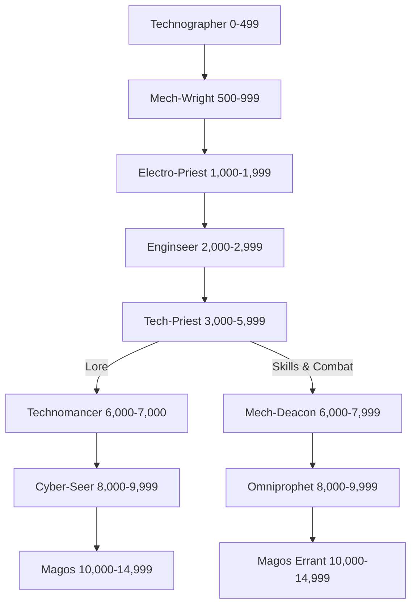

*"Bzzttt… our alliance must terminate here—your objectives are no longer compatible with mine."*

— Quintass Delta III, Mech-Wright of The Lathes

Tech-Priests are the clergy of the Adeptus Mechanicus, the secretive and all-powerful organisation that builds and maintains the Imperium’s great works of technology. Masters of arcane mechanical knowledge and communing with the machine spirits themselves, Tech-Priests are invaluable members of any organisation that makes use of large or complex machinery. Blessed by their Machine God with gleaming augmetics and divine insight, Tech-Priests are equally capable on the battlefield as in the maintenance bay, the forge, and the data-vault. Perhaps unsurprisingly, their typically cold and calculating nature does tend to present as a brutally logical demeanour and absolutely minimal sociability.
### Tech-Priest Abilities In Game Terms

Whilst the abilities of Tech-Priests are a complicated blend of technology, mummery and religion, it is sometimes useful to know how to translate these seemingly miraculous powers into game terms.

As far as Player Characters are concerned, Tech-Priest powers are expressed in a very simple way. In Dark Heresy, each character in the Tech-Priest career starts play with the Mechanicus Implants trait. This represents the various augmentations that have been fitted inside the character. (See below for the full details on each of these implants.) By spending Experience Points on various Talents, the character learns to use these implants to generate all sorts of effects, from bolts of bio-electrical energy to powerful magnetic fields.

The augmentations described in the Mechanicus Implants Trait are so closely intertwined with the Tech-Priest's body they are not considered to be equipment. They are indistinguishable from his mortal flesh. These implants are such an integral part of a Tech-Priest that he would not survive their wholesale removal—or even want to. For an adherent of the Machine God, life without them is no life at all. To all intents and purposes, a Tech-Priest's Wounds represent damage to both his soft tissue and these trait-specific augmentations. As a Tech-Priest heals damage, he is considered to be repairing any damage to this machinery as well as to his body.

In addition to these "free" augmentations, Tech-Priest Player Characters can also purchase other cybernetic implants, such as auger arrays, mechadendrites and bionic limbs. Unlike the augmentations granted by the Mechanicus Implants trait, these are treated just like any other cybernetic implant. They can be targeted, damaged, removed, or improved—see **Augmetics** for more details.

As ever, questions about the damage or removal of implants, and what this does to a Tech-Priest's Talents, should be adjudicated by the Game Master. No doubt this wise and august person will provide a common-sense answer, agreeable to all.
#### TRAIT: MECHANICUS IMPLANTS
During the lengthy process of your ordination as a Tech-Priest you were judged to be a suitable vessel for a range of blessed implants. While augmetics are far from uncommon in the Imperium, most of these implants are unique to the followers of the Mechanicus and will immediately identify you as a member of that organisation. These will serve as the framework for your journey towards enlightenment and singularity with the Omnissiah:
* **Electro-Graft**: This data-port is grafted to your nervous system and, in conjunction with the Electro Graft Use Talent, allows you to interface with many common machines and certain types of data- and info-nets. Electro-grafts can take many forms depending on the Tech-Priest’s preferences, such as electoos, skull shunts, finger probes or spine jacks.
* **Electoo Inductors:** These palm-sized thin metal plates are inserted under the skin and at first glance resemble tattoos. The electoos are wired into your nervous system and draw power from the bio-electrical emanations of your flesh. These can be used to emit or siphon power in many ways and are necessary for many tasks related to the servicing of machines as well as the maintenance of your own implants.
* **Respirator Unit:** This eclectic array of tubes and wires are implanted in the neck and lower half of the face, possibly replacing the lower jaw entirely. The implant purifies the air you breathe, granting a +20 bonus to any Tests made to resist airborne toxins and poisons, including gas weapons. Importantly, the respirator unit contains a vox-synthesiser capable of transmitting your voice in a variety of ways that are impossible for unaugmented human flesh. A bulkier example might completely replace the Tech-Priest’s mouth with a vox emitter, likely compelling the bearer to sustain themselves on a largely liquid diet.
* **Cyber-Mantle:** An elaborate articulated framework of metal, wires, and impulse transmitters, this wondrous construct is permanently attached to your spine and lower rib cage. Possessing a cyber mantle is what truly sets Tech-Priests apart from other augmetically-enhanced humans, allowing them to make use of increasingly powerful cybernetics and implants as they advanced in rank and influence within the Mechanicus. Among followers of the Omnissiah the cyber-mantle is often referred to as “the true flesh.”
* **Potentia Coil:** This incredibly powerful and efficient power unit is a sub-component of the Tech-Priest’s cyber mantle. A potentia coil stores and amplifies bio-electrical energy from the Tech-Priest’s body, providing the motive force for some of their greater augmetics. Furthermore, with some practice a Tech- Priest can use their potentia coil to energize all sorts of machinery, or even act as a weapon in and of itself.
* **Cranial Circuitry:** This series of micro-cogitators and cortical circuits augments your mental capabilities and is of vital importance to controlling some of your implants. The larger components sit in an alloy housing that is contoured to the back of your head and neck, from which a spider web of fine filaments snake out under your skin and into your brain. As your devotion to the Machine God grows this implant provides a foundation to further augment your mind, cutting away centres of emotion and intuition to enable even greater feats of calculation.
### Table: Tech-Priest Characteristic Advances
| **Characteristic** | **Simple** | **Intermediate** | **Trained** | **Expert** |
| ------------------ | :--------: | :--------------: | :---------: | :--------: |
| Weapon Skill       |    250     |       500        |     750     |   1,000    |
| Ballistic Skill    |    250     |       500        |     750     |   1,000    |
| Strength           |    100     |       250        |     500     |    750     |
| Toughness          |    100     |       250        |     500     |    750     |
| Agility            |    500     |       750        |    1,000    |   2,500    |
| Intelligence       |    100     |       250        |     500     |    750     |
| Perception         |    250     |       500        |     750     |   1,000    |
| Willpower          |    100     |       250        |     500     |    750     |
| Fellowship†        |     —      |        —         |      —      |     —      |
†*You may not improve this Characteristic by spending xp the way other careers do.*
# Advancement Tree

## **Technographer Advance Scheme**

*"If yer find owt with mystech properties, like, tek it t' Technographers. They'll diagnosticatearise it alright."*

Technographers learn the many patterns of manufacture and formation that they might better comprehend the many mysteries of the Omnissiah. They can identify and catalogue technology with ease.

| Advance                                                                     | Cost |  Type  | Prerequisites |
| --------------------------------------------------------------------------- | :--: | :----: | :------------ |
| [Common Lore (Machine Cult)](Skills.md#common%20lore)                       | 100  | Skill  | —             |
| [Common Lore (Tech)](Skills.md#common%20lore)                               | 100  | Skill  | —             |
| [Drive (Ground Vehicle)](Skills.md#drive)                                   | 100  | Skill  | —             |
| [Evaluate](Skills.md#evaluate)                                              | 100  | Skill  | —             |
| [Forbidden Lore (Adeptus Mechanicus)](Skills.md#forbidden%20lore)           | 100  | Skill  | —             |
| [Literacy](Skills.md#literacy)                                              | 100  | Skill  | —             |
| [Literacy +10](Skills.md#literacy)                                          | 100  | Skill  | Literacy      |
| [Logic](Skills.md#logic)                                                    | 100  | Skill  | —             |
| [Pilot (Civilian Craft)](Skills.md#pilot)                                   | 100  | Skill  | —             |
| [Secret Tongue (Tech)](Skills.md#secret%20tongue)                           | 100  | Skill  | —             |
| [Tech-Use](Skills.md#tech-use)                                              | 100  | Skill  | —             |
| [Trade (Copyist)](Skills.md#trade)                                          | 100  | Skill  | —             |
| [Trade (Scrimshawer)](Skills.md#trade)                                      | 100  | Skill  | —             |
| [Basic Weapon Training (Las)](Talents.md#basic%20weapon%20training)         | 100  | Skill  | —             |
| [Basic Weapon Training (Primitive)](Talents.md#basic%20weapon%20training)   | 100  | Talent | —             |
| [Basic Weapon Training (SP)](Talents.md#basic%20weapon%20training)          | 100  | Talent | —             |
| [Binary Chatter](Talents.md#binary%20chatter)                               | 100  | Talent | —             |
| [Chem Geld](Talents.md#chem%20geld)                                         | 100  | Talent | —             |
| [Electro Graft Use](Talents.md#electro%20graft%20use)                       | 100  | Talent | —             |
| [Feedback Screech](Talents.md#feedback%20screech)                           | 100  | Talent | Tech-Priest   |
| [Light Sleeper](Talents.md#light%20sleeper)                                 | 100  | Talent | Per 30        |
| [Melee Weapon Training (Primitive)](Talents.md#melee%20weapon%20training)   | 100  | Talent | —             |
| [Pistol Training (Las)](Talents.md#pistol%20training)                       | 100  | Talent | —             |
| [Pistol Training (Primitive)](Talents.md#pistol%20training)                 | 100  | Talent | —             |
| [Pistol Training (SP)](Talents.md#pistol%20training)                        | 100  | Talent | —             |
| [Rapid Reload](Talents.md#rapid%20reload)                                   | 100  | Talent | —             |
| [Sound Constitution](Talents.md#sound%20constitution)†                      | 100  | Talent | —             |
| [Technical Knock](Talents.md#technical%20knock)                             | 100  | Talent | Int 30        |
| [Thrown Weapon Training (Primitive)](Talents.md#thrown%20weapon%20training) | 300  | Talent | —             |
†*You may select this Talent twice at this Rank.*
## **Mech-Wright Advance Scheme**

*"Explosive breech… bzztttt… shell gantry five… gzzkkkkttt… plete macro cannon failure… zzztkkkk… mechwright team immediately!"*

Mech-Wrights learn the properties of metal, plasteel and many other materials. They conduct heavy repairs and tend dangerous manufactorum processes.

| Advance                                                     | Cost |  Type  | Prerequisites                          |
| ----------------------------------------------------------- | :--: | :----: | :------------------------------------- |
| [Ciphers (Acolyte)](Skills.md#ciphers)                      | 100  | Skill  | —                                      |
| [Common Lore (Tech) +10](Skills.md#common%20lore)           | 100  | Skill  | Common Lore (Tech)                     |
| [Demolition](Skills.md#demolition)                          | 100  | Skill  | —                                      |
| [Drive (Ground Vehicle) +10](Skills.md#drive)               | 100  | Skill  | Drive (Ground Vehicle)                 |
| [Drive (Walker)](Skills.md#drive)                           | 100  | Skill  | —                                      |
| [Medicae](Skills.md#medicae)                                | 100  | Skill  | —                                      |
| [Scholastic Lore (Chymistry)](Skills.md#scholastic%20lore)  | 100  | Skill  | —                                      |
| [Security](Skills.md#security)                              | 100  | Skill  | —                                      |
| [Tech-Use +10](Skills.md#tech-use)                          | 100  | Skill  | Tech-Use                               |
| [Trade (Armourer)](Skills.md#trade)                         | 100  | Skill  | —                                      |
| [Trade (Miner)](Skills.md#trade)                            | 100  | Skill  | —                                      |
| [Trade (Smith)](Skills.md#trade)                            | 100  | Skill  | —                                      |
| [Trade (Technomat)](Skills.md#trade)                        | 100  | Skill  | —                                      |
| [Arms Master](Talents.md#arms%20master)                     | 100  | Talent | BS 30, Basic Weapon Training (any two) |
| [Deadeye Shot](Talents.md#deadeye%20shot)                   | 100  | Talent | BS 30                                  |
| [Heightened Senses (Sight)](Talents.md#heightened%20senses) | 100  | Talent | —                                      |
| [Iron Jaw](Talents.md#iron%20jaw)                           | 100  | Talent | T 40                                   |
| [Luminen Charge](Talents.md#luminen%20charge)               | 100  | Talent | Tech-Priest                            |
| [Mimic](Talents.md#mimic)                                   | 100  | Talent | —                                      |
| [Peer (Adeptus Mechanicus)](Talents.md#peer)                | 100  | Talent | Fel 30                                 |
| [Quick Draw](Talents.md#quick%20draw)                       | 100  | Talent | —                                      |
| [Sound Constitution](Talents.md#sound%20constitution)       | 100  | Talent | —                                      |
| [Blind Fighting](Talents.md#blind%20fighting)               | 200  | Talent | Per 30                                 |
| [Luminen Shock](Talents.md#luminen%20shock)                 | 200  | Talent | Tech-Priest                            |
## **Electro-Priest Advance Scheme**

*"Dunno what he said but this red light started blinking under the electro-priest's hood, then it touched him, and Throne blind me if he didn't fly back across the room with an almighty thump! I knew there was a reason they guarded the generator-temple!"*

Having mastered form and material components, Electro-Priests apply themselves to the sacred study of energy. Thence they learn the animating principles of machine spirits, and the means by which they may be propitiated.

| Advance                                                                  | Cost |  Type  | Prerequisites                       |
| ------------------------------------------------------------------------ | :--: | :----: | :---------------------------------- |
| [Common Lore (Machine Cult) +10](Skills.md#common%20lore)                | 100  | Skill  | Common Lore (Machine Cult)          |
| [Common Lore (Imperial Creed)](Skills.md#common%20lore)                  | 100  | Skill  | —                                   |
| [Common Lore (Imperium)](Skills.md#common%20lore)                        | 100  | Skill  | —                                   |
| [Drive (Ground Vehicle) +20](Skills.md#drive)                            | 100  | Skill  | Drive (Ground Vehicle) +10          |
| [Drive (Hover Vehicle)](Skills.md#drive)                                 | 100  | Skill  | —                                   |
| [Drive (Walker) +10](Skills.md#drive)                                    | 100  | Skill  | Drive (Walker)                      |
| [Forbidden Lore (Adeptus Mechanicus) +10](Skills.md#forbidden%20lore)    | 100  | Skill  | Forbidden Lore (Adeptus Mechanicus) |
| [Literacy +20](Skills.md#literacy)                                       | 100  | Skill  | Literacy +10                        |
| [Logic +10](Skills.md#logic)                                             | 100  | Skill  | Logic                               |
| [Scholastic Lore (Numerology)](Skills.md#scholastic%20lore)              | 100  | Skill  | —                                   |
| [Secret Tongue (Tech) +10](Skills.md#secret%20tongue)                    | 100  | Skill  | Secret Tongue (Tech)                |
| [Speak Language (High Gothic)](Skills.md#speak%20language)               | 100  | Skill  | —                                   |
| [Speak Language (Techna-Lingua)](Skills.md#speak%20language)             | 100  | Skill  | —                                   |
| [Trade (Wright)](Skills.md#trade)                                        | 100  | Skill  | —                                   |
| [Crack Shot](Talents.md#crack%20shot)                                    | 100  | Talent | BS 40                               |
| [Electrical Succour](Talents.md#electrical%20succour)                    | 100  | Talent | Tech-Priest                         |
| [Heightened Senses (Hearing)](Talents.md#heightened%20senses)            | 100  | Talent | —                                   |
| [Heightened Senses (Touch)](Talents.md#heightened%20senses)              | 100  | Talent | —                                   |
| [Leap Up](Talents.md#leap%20up)                                          | 100  | Talent | Ag 30                               |
| [Mechadendrite Use (Utility)](Talents.md#mechadendrite%20use)            | 100  | Talent | Tech-Priest                         |
| [Nerves of Steel](Talents.md#nerves%20of%20steel)                        | 100  | Talent | —                                   |
| [Sound Constitution](Talents.md#sound%20constitution)                    | 100  | Talent | —                                   |
| [Secret Tongue (Acolyte)](Skills.md#secret%20tongue)                     | 200  | Skill  | —                                   |
| [Basic Weapon Training (Bolt)](Talents.md#basic%20weapon%20training)     | 200  | Talent | —                                   |
| [Basic Weapon Training (Launcher)](Talents.md#basic%20weapon%20training) | 200  | Talent | —                                   |
| [Logis Implant](Talents.md#logis%20implant)                              | 200  | Talent | —                                   |
| [Luminen Blast](Talents.md#luminen%20blast)                              | 200  | Talent | Tech-Priest                         |
| [Mechadendrite Use (Medicae)](Talents.md#mechadendrite%20use)            | 200  | Talent | Tech-Priest                         |
| [Melee Weapon Training (Shock)](Talents.md#melee%20weapon%20training)    | 200  | Talent | —                                   |
| [Pistol Training (Bolt)](Talents.md#pistol%20training)                   | 200  | Talent | —                                   |
## **Enginseer**

*"Yes, sir, I know the enginseer is annoyed, but we had to open the machine casing… yes, but we would have lost the Chimera if we didn't jury rig it… what? … demands penance? Front line you say? Throne… Well, if the Emperor commands…* "

Enginseers draw together their knowledge of form, energy and material components into the art of tending complicated machines. Using the alchemy of prayer and ritual, they cajole machine spirits into life, finding faults and removing error from all manner of technology.

| Advance                                                               | Cost |  Type  | Prerequisites                  |
| --------------------------------------------------------------------- | :--: | :----: | :----------------------------- |
| [Chem-Use](Skills.md#chem%20use)                                      | 100  | Skill  | —                              |
| [Common Lore (Machine Cult) +20](Skills.md#common%20lore)             | 100  | Skill  | Common Lore (Machine Cult) +10 |
| [Common Lore (War)](Skills.md#common%20lore)                          | 100  | Skill  | —                              |
| [Demolition +10](Skills.md#demolition)                                | 100  | Skill  | Demolition                     |
| [Drive (Hover Vehicle) +10](Skills.md#drive)                          | 100  | Skill  | Drive (Hover Vehicle)          |
| [Drive (Walker) +20](Skills.md#drive)                                 | 100  | Skill  | Drive (Walker) +10             |
| [Evaluate +10](Skills.md#evaluate)                                    | 100  | Skill  | Evaluate                       |
| [Navigation (Stellar)](Skills.md#navigation)                          | 100  | Skill  | —                              |
| [Navigation (Surface)](Skills.md#navigation)                          | 100  | Skill  | —                              |
| [Pilot (Military Craft)](Skills.md#pilot)                             | 100  | Skill  | —                              |
| [Scholastic Lore (Astromancy)](Skills.md#scholastic%20lore)           | 100  | Skill  | —                              |
| [Scholastic Lore (Chymistry) +10](Skills.md#scholastic%20lore)        | 100  | Skill  | Scholastic Lore (Chymistry)    |
| [Scholastic Lore (Numerology) +10](Skills.md#scholastic%20lore)       | 100  | Skill  | Scholastic Lore (Numerology)   |
| [Security +10](Skills.md#security)                                    | 100  | Skill  | Security                       |
| [Speak Language (Techna-Lingua) +10](Skills.md#speak%20language)      | 100  | Skill  | Speak Language (Techna-Lingua) |
| [Trade (Armourer) +10](Skills.md#trade)                               | 100  | Skill  | Trade (Armourer)               |
| [Trade (Technomat) +10](Skills.md#trade)                              | 100  | Skill  | Trade (Technomat)              |
| [Trade (Wright) +10](Skills.md#trade)                                 | 100  | Skill  | Trade (Wright)                 |
| [Ambidextrous](Talents.md#ambidextrous)                               | 100  | Talent | Ag 30                          |
| [Basic Weapon Training (Flame)](Talents.md#basic%20weapon%20training) | 100  | Talent | —                              |
| [Concealed Cavity](Talents.md#concealed%20cavity)                     | 100  | Talent | —                              |
| [Crippling Strike](Talents.md#crippling%20strike)                     | 100  | Talent | WS 50                          |
| [Ferric Lure](Talents.md#ferric%20lure)                               | 100  | Talent | —                              |
| [Heavy Weapons Training (SP)](Talents.md#heavy%20weapon%20training)   | 100  | Talent | —                              |
| [Heightened Senses (Smell)](Talents.md#heightened%20senses)           | 100  | Talent | —                              |
| [Mechadendrite Use (Manipulator)](Talents.md#mechadendrite%20use)     | 100  | Talent | Tech-Priest                    |
| [Mechadendrite Use (Optical)](Talents.md#mechadendrite%20use)         | 100  | Talent | Tech-Priest                    |
| [Pistol Training (Flame)](Talents.md#pistol%20training)               | 100  | Talent | —                              |
| [Resistance (Poisons)](Talents.md#resistance)                         | 100  | Talent | —                              |
| [Total Recall](Talents.md#total%20recall)                             | 100  | Talent | Int 30                         |
| [Two-Weapon Wielder (Ballistic)](Talents.md#two-weapon%20wielder)     | 100  | Talent | BS 35, Ag 35                   |
| [Two-Weapon Wielder (Melee)](Talents.md#two-weapon%20wielder)         | 100  | Talent | WS 35, Ag 35                   |
| [Awareness](Skills.md#awareness)                                      | 200  | Skill  | —                              |
| [Common Lore (Imperial Guard)](Skills.md#common%20lore)               | 200  | Skill  | —                              |
| [Secret Tongue (Acolyte) +10](Skills.md#secret%20tongue)              | 200  | Skill  | Secret Tongue (Acolyte)        |
| [Luminen Shield](Talents.md#luminen%20shield)                         | 200  | Talent | Tech-Priest                    |
| [Luminen Surge](Talents.md#luminen%20surge)                           | 200  | Talent | Luminen Shock, Tech-Priest     |
| [Melee Weapon Training (Chain)](Talents.md#melee%20weapon%20training) | 200  | Talent | —                              |
| [Resistance (Fear)](Talents.md#resistance)                            | 200  | Talent | —                              |
| [Sound Constitution](Talents.md#sound%20constitution)                 | 200  | Talent | —                              |
## **Tech-Priest**

*"He stood before the fan cyclers barefoot and humble. In the language of the Tech-Priests he bid the engines start, that the hive breathe easy. He struck the sacred rune, donned his boots once more, and lo! The fans began."*

Tech-Priests are initiated into the deeper mysteries of technology, and know many rites of maintenance, ignition and restarting. From simple door mechanisms to ancient tech dug from mouldering ruins, Tech-Priests seek out the many forms of the Omnissiah, to add yet more knowledge to the data crypts of the Adeptus Mechanicus.

| Advance                                                                | Cost |  Type  | Prerequisites                           |
| ---------------------------------------------------------------------- | :--: | :----: | :-------------------------------------- |
| [Common Lore (Administratum)](Skills.md#common%20lore)                 | 100  | Skill  | —                                       |
| [Common Lore (Imperial Creed) +10](Skills.md#common%20lore)            | 100  | Skill  | Common Lore (Imperial Creed)            |
| [Common Lore (Imperium) +10](Skills.md#common%20lore)                  | 100  | Skill  | Common Lore (Imperium)                  |
| [Common Lore (Tech) +20](Skills.md#common%20lore)                      | 100  | Skill  | Common Lore (Tech) +10                  |
| [Drive (Hover Vehicle) +20](Skills.md#drive)                           | 100  | Skill  | Drive (Hover Vehicle) +10               |
| [Forbidden Lore (Archeotech)](Skills.md#forbidden%20lore)              | 100  | Skill  | —                                       |
| [Forbidden Lore (Adeptus Mechanicus) +20](Skills.md#forbidden%20lore)  | 100  | Skill  | Forbidden Lore (Adeptus Mechanicus) +10 |
| [Logic +20](Skills.md#logic)                                           | 100  | Skill  | Logic +10                               |
| [Scholastic Lore (Archaic)](Skills.md#scholastic%20lore)               | 100  | Skill  | —                                       |
| [Scholastic Lore (Chymistry) +20](Skills.md#scholastic%20lore)         | 100  | Skill  | Scholastic Lore (Chymistry) +10         |
| [Scholastic Lore (Imperial Creed)](Skills.md#scholastic%20lore)        | 100  | Skill  | —                                       |
| [Scholastic Lore (Tactica Imperialis)](Skills.md#scholastic%20lore)    | 100  | Skill  | —                                       |
| [Security +20](Skills.md#security)                                     | 100  | Skill  | Security +10                            |
| [Speak Language (High Gothic) +10](Skills.md#speak%20language)         | 100  | Skill  | Speak Language (High Gothic)            |
| [Secret Tongue (Tech) +20](Skills.md#secret%20tongue)                  | 100  | Skill  | Secret Tongue (Tech) +10                |
| [Tech-Use +20](Skills.md#tech-use)                                     | 100  | Skill  | Tech-Use +10                            |
| [Trade (Armourer) +20](Skills.md#trade)                                | 100  | Skill  | Trade (Armourer) +20                    |
| [Trade (Technomat) +20](Skills.md#trade)                               | 100  | Skill  | Trade (Technomat) +10                   |
| [Trade (Wright) +20](Skills.md#trade)                                  | 100  | Skill  | Trade (Wright) +10                      |
| [Blademaster](Talents.md#blademaster)                                  | 100  | Talent | WS 30, Melee Weapon Training (any)      |
| [Combat Master](Talents.md#combat%20master)                            | 100  | Talent | WS 30                                   |
| [Disturbing Voice](Talents.md#disturbing%20voice)                      | 100  | Talent | —                                       |
| [Energy Cache](Talents.md#energy%20cache)                              | 100  | Talent | Tech-Priest                             |
| [Independent Targeting](Talents.md#independent%20targeting)            | 100  | Talent | BS 40                                   |
| [Rite of Awe](Talents.md#rite%20of%20awe)                              | 100  | Talent | Tech-Priest                             |
| [Sound Constitution](Talents.md#sound%20constitution)                  | 100  | Talent | —                                       |
| [Swift Attack](Talents.md#swift%20attack)                              | 100  | Talent | WS 35                                   |
| [Pilot (Spacecraft)](Skills.md#pilot)                                  | 200  | Skill  | —                                       |
| [Basic Weapon Training (Melta)](Talents.md#basic%20weapon%20training)  | 200  | Talent | —                                       |
| [Basic Weapon Training (Plasma)](Talents.md#basic%20weapon%20training) | 200  | Talent | —                                       |
| [Heavy Weapon Training (Bolt)](Talents.md#heavy%20weapon%20training)   | 200  | Talent | —                                       |
| [Maglev Grace](Talents.md#maglev%20grace)                              | 200  | Talent | Tech-Priest                             |
| [Melee Weapon Training (Power)](Talents.md#melee%20weapon%20training)  | 200  | Talent | —                                       |
| [Mechadendrite Use (Ballistic)](Talents.md#mechadendrite%20use)        | 200  | Talent | Tech-Priest                             |
| [Dodge](Skills.md#dodge)                                               | 300  | Skill  | —                                       |
| [Command](Skills.md#command)                                           | 300  | Skill  | —                                       |
| [Inquiry](Skills.md#inquiry)                                           | 300  | Skill  | —                                       |
| [Intimidate](Skills.md#intimidate)                                     | 300  | Skill  | —                                       |
| [Luminen Flare](Talents.md#luminen%20flare)                            | 300  | Talent | Luminen Blast, Tech-Priest              |
## **Technomancer**

*"Minds sharp as knives, and know their way round the Administratum too. Don't cross a technomancer, especially if you work on a spaceship. You'll be reassigned to a leaky rig before you can sign the aquila."*

Technomancers apply all their considerable mental powers to extracting information that may be of use to the Machine Cult. Be it currying favour with the Ecclesiarchy to interrogation of xenos prisoners, Technomancers conjure answers with ruthless logical efficiency.

| Advance                                                                         | Cost |  Type  | Prerequisites                      |
| ------------------------------------------------------------------------------- | :--: | :----: | :--------------------------------- |
| [Ciphers (Secret Society—Adeptus Mechanicus)](Skills.md#ciphers)                | 100  | Skill  | —                                  |
| [Common Lore (Adeptus Arbites)](Skills.md#common%20lore)                        | 100  | Skill  | —                                  |
| [Common Lore (Ecclesiarchy)](Skills.md#common%20lore)                           | 100  | Skill  | —                                  |
| [Common Lore (Imperial Creed) +20](Skills.md#common%20lore)                     | 100  | Skill  | Common Lore (Imperial Creed) +10   |
| [Common Lore (Imperium) +20](Skills.md#common%20lore)                           | 100  | Skill  | Common Lore (Imperium) +10         |
| [Evaluate +20](Skills.md#evaluate)                                              | 100  | Skill  | Evaluate +10                       |
| [Interrogation](Skills.md#interrogation)                                        | 100  | Skill  | —                                  |
| [Medicae +10](Skills.md#medicae)                                                | 100  | Skill  | Medicae                            |
| [Scholastic Lore (Bureaucracy)](Skills.md#scholastic%20lore)                    | 100  | Skill  | —                                  |
| [Scholastic Lore (Judgement)](Skills.md#scholastic%20lore)                      | 100  | Skill  | —                                  |
| [Search](Skills.md#search)                                                      | 100  | Skill  | —                                  |
| [Speak Language (High Gothic) +20](Skills.md#speak%20language)                  | 100  | Skill  | Speak Language (High Gothic) +10   |
| [Speak Language (Techna-Lingua) +20](Skills.md#speak%20language)                | 100  | Skill  | Speak Language (Techna-Lingua) +10 |
| [Armour of Contempt](Talents.md#armour%20of%20contempt)                         | 100  | Talent | WP 40                              |
| [Autosanguine](Talents.md#autosanguine)                                         | 100  | Talent | —                                  |
| [Fearless](Talents.md#fearless)                                                 | 100  | Talent | —                                  |
| [Gun Blessing](Talents.md#gun%20blessing)                                       | 100  | Talent | Tech-Priest                        |
| [Jaded](Talents.md#jaded)                                                       | 100  | Talent | WP 30                              |
| [Master Chirurgeon](Talents.md#master%20chirurgeon)                             | 100  | Talent | Medicae +10                        |
| [Master Enginseer](Talents.md#master%20enginseer)                               | 100  | Talent | Tech-Priest, Tech-Use +20          |
| [Orthoproxy](Talents.md#orthoproxy)                                             | 100  | Talent | —                                  |
| [Pistol Training (Plasma)](Talents.md#pistol%20training)                        | 100  | Talent | —                                  |
| [Deceive](Skills.md#deceive)                                                    | 200  | Skill  | —                                  |
| [Exotic Weapon Training (Needle Pistol)](Talents.md#exotic%20weapon%20training) | 200  | Talent | —                                  |
| [Hotshot Pilot](Talents.md#hotshot%20pilot)                                     | 200  | Talent | Ag 40, Pilot Skill                 |
| [Sound Constitution](Talents.md#sound%20constitution)                           | 200  | Talent | —                                  |
| [Thrown Weapon Training (Shock)](Talents.md#thrown%20weapon%20training)         | 300  | Talent | —                                  |
## **Cyber Seer**

*"They ain't quite human no more. I mean, more than yer average Tech-Priest. No one could keep all that… you know… dangerous stuff in their skull an' stay normal."*

Cyber Seers delve into the forbidden and occult matters of machinery with frightening zeal. From unnatural geometries to warp-touched autonoma, Cyber Seers do not shirk or sway from looking upon the damning and heretical in their quest for knowledge.

| Advance                                                                 | Cost |  Type  | Prerequisites                         |
| ----------------------------------------------------------------------- | :--: | :----: | :------------------------------------ |
| [Common Lore (Adeptus Arbites) +10](Skills.md#common%20lore)            | 100  | Skill  | Common Lore (Adeptus Arbites)         |
| [Common Lore (Ecclesiarchy) +10](Skills.md#common%20lore)               | 100  | Skill  | Common Lore (Ecclesiarchy)            |
| [Forbidden Lore (Archeotech) +10](Skills.md#forbidden%20lore)           | 100  | Skill  | Forbidden Lore (Archeotech)           |
| [Forbidden Lore (Warp)](Skills.md#forbidden%20lore)                     | 100  | Skill  | —                                     |
| [Scholastic Lore (Bureaucracy) +10](Skills.md#scholastic%20lore)        | 100  | Skill  | Scholastic Lore (Bureaucracy)         |
| [Scholastic Lore (Judgement) +10](Skills.md#scholastic%20lore)          | 100  | Skill  | Scholastic Lore (Judgement)           |
| [Scholastic Lore (Legend)](Skills.md#scholastic%20lore)                 | 100  | Skill  | —                                     |
| [Scholastic Lore (Occult)](Skills.md#scholastic%20lore)                 | 100  | Skill  | —                                     |
| [Search +10](Skills.md#search)                                          | 100  | Skill  | —                                     |
| [Dual Shot](Talents.md#dual%20shot)                                     | 100  | Talent | Ag 40, Two-Weapon Wielder (Ballistic) |
| [Foresight](Talents.md#foresight)                                       | 100  | Talent | Int 30                                |
| [Lightning Reflexes](Talents.md#lightning%20reflexes)                   | 100  | Talent | —                                     |
| [Marksman](Talents.md#marksman)                                         | 100  | Talent | BS 35                                 |
| [Mental Fortress](Talents.md#mental%20fortress)                         | 100  | Talent | WP 50, Strong Minded                  |
| [Rapid Reaction](Talents.md#rapid%20reaction)                           | 100  | Talent | Ag 40                                 |
| [Resistance (Psychic Powers)](Talents.md#resistance)                    | 100  | Talent | —                                     |
| [Step Aside](Talents.md#step%20aside)                                   | 100  | Talent | Ag 40, Dodge                          |
| [Strong Minded](Talents.md#strong%20minded)                             | 100  | Talent | WP 30, Resistance (Psychic Powers)    |
| [Deceive +10](Skills.md#deceive)                                        | 200  | Skill  | Deceive                               |
| [Interrogation +10](Skills.md#interrogation)                            | 200  | Skill  | Interrogation                         |
| [Scholastic Lore (Numerology) +20](Skills.md#scholastic%20lore)         | 200  | Skill  | Scholastic Lore (Numerology) +10      |
| [Dark Soul](Talents.md#dark%20soul)                                     | 200  | Talent | —                                     |
| [Ferric Summons](Talents.md#ferric%20summons)                           | 200  | Talent | Ferric Lure, Tech-Priest              |
| [Maglev Transcendence](Talents.md#maglev%20transcendence)               | 200  | Talent | Tech-Priest, Maglev Grace             |
| [Peer (Administratum)](Talents.md#peer)                                 | 200  | Talent | Fel 30                                |
| [Prosanguine](Talents.md#prosanguine)                                   | 200  | Talent | —                                     |
| [Sound Constitution](Talents.md#sound%20constitution)                   | 200  | Talent | —                                     |
| [Thrown Weapon Training (Chain)](Talents.md#thrown%20weapon%20training) | 300  | Talent | —                                     |
| [Luminen Barrier](Talents.md#luminen%20barrier)                         | 400  | Talent | Luminen Shield, Tech-Priest           |
## **Magos**

*"An Adeptus Mechanicus Magos is a creature of narrow, but exceedingly deep vision. Each chooses a realm of dominion, and sets about learning all there is to know about said subject. Be wary of them, of their cunning and their obsessions."*

A Magos has perfected and refined his field of expertise to render him the master of a certain study. From the fleshwise magos biologis to the alien hunting magos xenologis, these sage individuals serve the Adeptus Mechanicus with their enormous accumulated knowledge.

| Advance                                                                 | Cost |  Type  | Prerequisites                     |
| ----------------------------------------------------------------------- | :--: | :----: | :-------------------------------- |
| [Forbidden Lore (Archeotech) +20](Skills.md#forbidden%20lore)           | 100  | Skill  | Forbidden Lore (Archeotech) +10   |
| [Forbidden Lore (Daemonology)](Skills.md#forbidden%20lore)              | 100  | Skill  | —                                 |
| [Forbidden Lore (Heresy)](Skills.md#forbidden%20lore)                   | 100  | Skill  | —                                 |
| [Forbidden Lore (Inquisition)](Skills.md#forbidden%20lore)              | 100  | Skill  | —                                 |
| [Forbidden Lore (Psykers)](Skills.md#forbidden%20lore)                  | 100  | Skill  | —                                 |
| [Forbidden Lore (Warp) +10](Skills.md#forbidden%20lore)                 | 100  | Skill  | Forbidden Lore (Warp)             |
| [Scholastic Lore (Bureaucracy) +20](Skills.md#scholastic%20lore)        | 100  | Skill  | Scholastic Lore (Bureaucracy) +10 |
| [Scholastic Lore (Judgement) +20](Skills.md#scholastic%20lore)          | 100  | Skill  | Scholastic Lore (Judgement) +10   |
| [Scholastic Lore (Legend) +10](Skills.md#scholastic%20lore)             | 100  | Skill  | Scholastic Lore (Legend)          |
| [Scholastic Lore (Occult) +10](Skills.md#scholastic%20lore)             | 100  | Skill  | Scholastic Lore (Occult)          |
| [Scholastic Lore (Philosophy)](Skills.md#scholastic%20lore)             | 100  | Skill  | —                                 |
| [Dual Strike](Talents.md#dual%20strike)                                 | 100  | Talent | Ag 40, Two-Weapon Wielder (Melee) |
| [Hard Target](Talents.md#hard%20target)                                 | 100  | Talent | Ag 40                             |
| [Iron Discipline](Talents.md#iron%20discipline)                         | 100  | Talent | WP 30, Command                    |
| [Lightning Attack](Talents.md#lightning%20attack)                       | 100  | Talent | Swift Attack                      |
| [Interrogation +20](Skills.md#interrogation)                            | 200  | Skill  | Interrogation +10                 |
| [Medicae +20](Skills.md#medicae)                                        | 200  | Skill  | Medicae +10                       |
| [Search +20](Skills.md#search)                                          | 200  | Skill  | Search +10                        |
| [Peer (Ecclesiarchy)](Talents.md#peer)                                  | 200  | Talent | Fel 30                            |
| [Peer (Inquisition)](Talents.md#peer)                                   | 200  | Talent | Fel 30                            |
| [Rite of Pure Thought](Talents.md#rite%20of%20pure%20thought)           | 200  | Talent | Tech-Priest                       |
| [Sound Constitution](Talents.md#sound%20constitution)                   | 200  | Talent | —                                 |
| [Pistol Training (Melta)](Talents.md#pistol%20training)                 | 300  | Talent | —                                 |
| [Thrown Weapon Training (Power)](Talents.md#thrown%20weapon%20training) | 400  | Talent | —                                 |
## **Mech-Deacon**

*"T'were Mech-Deacon Abnightus that changed the forge-customs, an' the millingengines, an' the distillation plant. We makes twice what we did back then. T'aint nothin' he don't know, I reckon."*

The Mech-Deacon treads a broad path of knowledge, learning many ways of dealing with those ignorant of the Omnissiah. The Mech-Deacon also studies the art of self defence, to guard him in his wanderings.

| Advance                                                                   | Cost |  Type  | Prerequisites                         |
| ------------------------------------------------------------------------- | :--: | :----: | :------------------------------------ |
| [Common Lore (Underworld)](Skills.md#common%20lore)                       | 100  | Skill  | —                                     |
| [Demolition +20](Skills.md#demolition)                                    | 100  | Skill  | Demolition +10                        |
| [Evaluate +20](Skills.md#evaluate)                                        | 100  | Skill  | Evaluate +10                          |
| [Scholastic Lore (Archaic) +10](Skills.md#scholastic%20lore)              | 100  | Skill  | Scholastic Lore (Archaic)             |
| [Search](Skills.md#search)                                                | 100  | Skill  | —                                     |
| [Secret Tongue (Military)](Skills.md#secret%20tongue)                     | 100  | Skill  | —                                     |
| [Sleight of Hand](Skills.md#sleight%20of%20hand)                          | 100  | Skill  | —                                     |
| [Trade (Apothecary)](Skills.md#trade)                                     | 100  | Skill  | —                                     |
| [Trade (Embalmer)](Skills.md#trade)                                       | 100  | Skill  | —                                     |
| [Trade (Mason)](Skills.md#trade)                                          | 100  | Skill  | —                                     |
| [Trade (Tanner)](Skills.md#trade)                                         | 100  | Skill  | —                                     |
| [Autosanguine](Talents.md#autosanguine)                                   | 100  | Talent | —                                     |
| [Bulging Biceps](Talents.md#bulging%20biceps)                             | 100  | Talent | S 45                                  |
| [Cleanse and Purify](Talents.md#cleanse%20and%20purify)                   | 100  | Talent | Basic Weapon Training (Flame)         |
| [Dual Shot](Talents.md#dual%20shot)                                       | 100  | Talent | Ag 40, Two-Weapon Wielder (Ballistic) |
| [Dual Strike](Talents.md#dual%20strike)                                   | 100  | Talent | Ag 40, Two-Weapon Wielder (Melee)     |
| [Gun Blessing](Talents.md#gun%20blessing)                                 | 100  | Talent | Tech-Priest                           |
| [Hard Target](Talents.md#hard%20target)                                   | 100  | Talent | Ag 40                                 |
| [Deceive](Skills.md#deceive)                                              | 200  | Skill  | —                                     |
| [Inquiry +10](Skills.md#inquiry)                                          | 200  | Skill  | Inquiry                               |
| [Medicae +10](Skills.md#medicae)                                          | 200  | Skill  | Medicae                               |
| [Scrutiny](Skills.md#scrutiny)                                            | 200  | Skill  | —                                     |
| [Heavy Weapon Training (Las)](Talents.md#heavy%20weapon%20training)       | 200  | Talent | —                                     |
| [Heavy Weapon Training (Launcher)](Talents.md#heavy%20weapon%20training)  | 200  | Talent | —                                     |
| [Heavy Weapon Training (Primitive)](Talents.md#heavy%20weapon%20training) | 200  | Talent | —                                     |
| [Iron Discipline](Talents.md#iron%20discipline)                           | 200  | Talent | WP 30, Command                        |
| [Sound Constitution](Talents.md#sound%20constitution)                     | 200  | Talent | —                                     |
| [Luminen Barrier](Talents.md#luminen%20barrier)                           | 400  | Talent | Luminen Shield, Tech-Priest           |
## **Omniprophet**

*"Hark unto the omniprophet! Get down on your knees and thank the air-recyks for their benediction. The very breath in your lungs is his blessing upon you! Pray, lest we cast you from the mine as a heretic!"*

The Omniprophet speaks with all manner of Imperial subjects, from bejewelled merchant princes to ragged colonists. He spreads the ways of the Cult Mechanicus, and also watches for any items or matters of interest to the Tech-Priests of Mars.

| Advance                                                                 | Cost |  Type  | Prerequisites                        |
| ----------------------------------------------------------------------- | :--: | :----: | :----------------------------------- |
| [Ciphers (War Cant)](Skills.md#ciphers)                                 | 100  | Skill  | —                                    |
| [Common Lore (Ecclesiarchy)](Skills.md#common%20lore)                   | 100  | Skill  | —                                    |
| [Scholastic Lore (Heraldry)](Skills.md#scholastic%20lore)               | 100  | Skill  | —                                    |
| [Scholastic Lore (Tactica Imperialis) +10](Skills.md#scholastic%20lore) | 100  | Skill  | Scholastic Lore (Tactica Imperialis) |
| [Secret Tongue (Administratum)](Skills.md#secret%20tongue)              | 100  | Skill  | —                                    |
| [Secret Tongue (Ecclesiarchy)](Skills.md#secret%20tongue)               | 100  | Skill  | —                                    |
| [Sleight of Hand +10](Skills.md#sleight%20of%20hand)                    | 100  | Skill  | Sleight of Hand                      |
| [Tracking](Skills.md#tracking)                                          | 100  | Skill  | —                                    |
| [Trade (Prospector)](Skills.md#trade)                                   | 100  | Skill  | —                                    |
| [Armour of Contempt](Talents.md#armour%20of%20contempt)                 | 100  | Talent | WP 40                                |
| [Decadence](Talents.md#decadence)                                       | 100  | Talent | T 30                                 |
| [Furious Assault](Talents.md#furious%20assault)                         | 100  | Talent | WS 35                                |
| [Jaded](Talents.md#jaded)                                               | 100  | Talent | WP 30                                |
| [Marksman](Talents.md#marksman)                                         | 100  | Talent | BS 35                                |
| [Master Enginseer](Talents.md#master%20enginseer)                       | 100  | Talent | Tech-Priest, Tech-Use +20            |
| [Step Aside](Talents.md#step%20aside)                                   | 100  | Talent | Ag 40, Dodge                         |
| [Barter](Skills.md#barter)                                              | 200  | Skill  | —                                    |
| [Deceive +10](Skills.md#deceive)                                        | 200  | Skill  | Deceive                              |
| [Trade (Merchant)](Skills.md#trade)                                     | 200  | Skill  | —                                    |
| [Ferric Summons](Talents.md#ferric%20summons)                           | 200  | Talent | Tech-Priest, Ferric Lure             |
| [Heavy Weapon Training (Melta)](Talents.md#heavy%20weapon%20training)   | 200  | Talent | —                                    |
| [Heavy Weapon Training (Plasma)](Talents.md#heavy%20weapon%20training)  | 200  | Talent | —                                    |
| [Maglev Transcendence](Talents.md#maglev%20transcendence)               | 200  | Talent | Tech-Priest, Maglev Grace            |
| [Peer (Imperial Navy)](Talents.md#peer)                                 | 200  | Talent | Fel 30                               |
| [Sound Constitution](Talents.md#sound%20constitution)                   | 200  | Talent | —                                    |
## **Magos Errant**

*"What we know of the Adranti Blood-Lighters is from the work of Abnightus, a magos errant attached to the Rogue Trader vessel, Luminol. The scroll is expunged of Adeptus Mechanicus matters, but still, we can infer much from what remains."*

The master of many trades, the Magos Errant is expected to go forth on behalf of the Adeptus Mechanicus, to explore new frontiers, worlds and technologies. Privy to all manner of secret knowledge, the Magos Errant is prepared for all eventualities.

| Advance                                                           | Cost |  Type  | Prerequisites                      |
| ----------------------------------------------------------------- | :--: | :----: | :--------------------------------- |
| [Ciphers (Underworld)](Skills.md#ciphers)                         | 100  | Skill  | —                                  |
| [Common Lore (Adeptus Arbites)](Skills.md#common%20lore)          | 100  | Skill  | —                                  |
| [Forbidden Lore (Archaeotech) +10](Skills.md#forbidden%20lore)    | 100  | Skill  | Forbidden Lore (Archeotech)        |
| [Forbidden Lore (Xenos)](Skills.md#forbidden%20lore)              | 100  | Skill  | —                                  |
| [Gamble](Skills.md#gamble)                                        | 100  | Skill  | —                                  |
| [Interrogation](Skills.md#interrogation)                          | 100  | Skill  | —                                  |
| [Scholastic Lore (Archaic) +20](Skills.md#scholastic%20lore)      | 100  | Skill  | Scholastic Lore (Archaic) +10      |
| [Scholastic Lore (Beasts)](Skills.md#scholastic%20lore)           | 100  | Skill  | —                                  |
| [Scholastic Lore (Legend)](Skills.md#scholastic%20lore)           | 100  | Skill  | —                                  |
| [Scholastic Lore (Occult)](Skills.md#scholastic%20lore)           | 100  | Skill  | —                                  |
| [Deflect Shot](Talents.md#deflect%20shot)                         | 100  | Talent | Ag 50                              |
| [Die Hard](Talents.md#die%20hard)                                 | 100  | Talent | WP 40                              |
| [Fearless](Talents.md#fearless)                                   | 100  | Talent | —                                  |
| [Master Chirurgeon](Talents.md#master%20chirurgeon)               | 100  | Talent | Medicae +10                        |
| [Orthoproxy](Talents.md#orthoproxy)                               | 100  | Talent | —                                  |
| [Resistance (Psychic Powers)](Talents.md#resistance)              | 100  | Talent | —                                  |
| [Strong Minded](Talents.md#strong%20minded)                       | 100  | Talent | WP 30, Resistance (Psychic Powers) |
| [Trade (Soothsayer)](Skills.md#trade)                             | 200  | Skill  | —                                  |
| [Into the Jaws of Hell](Talents.md#into%20the%20jaws%20of%20hell) | 200  | Talent | Iron Discipline                    |
| [Hotshot Pilot](Talents.md#hotshot%20pilot)                       | 200  | Talent | Ag 40, Pilot Skill                 |
| [Peer (Underworld)](Talents.md#peer)                              | 200  | Talent | Fel 30                             |
| [Prosanguine](Talents.md#prosanguine)                             | 200  | Talent | —                                  |
| [Rite of Fear](Talents.md#rite%20of%20fear)                       | 200  | Talent | Tech-Priest                        |
| [Sound Constitution](Talents.md#sound%20constitution)             | 200  | Talent | —                                  |
| [Barter +10](Skills.md#barter)                                    | 300  | Skill  | Barter                             |
| [Deceive +20](Skills.md#deceive)                                  | 300  | Skill  | Deceive +10                        |
| [Performer (Musician)](Skills.md#performer)                       | 300  | Skill  | —                                  |
