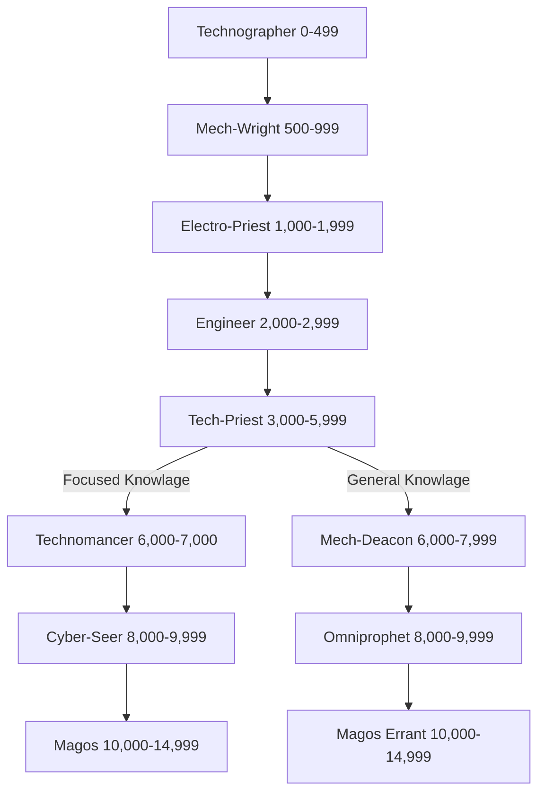

*"Bzzttt… our alliance must terminate here—your objectives are no longer compatible with mine."*

— Quintass Delta III, Mech-Wright, The Lathes.

T The Cult Mechanicus holds a virtual monopoly on technology. Its tenets and beliefs permeate through their rituals into the common superstition of Imperial citizens. The Adeptus Mechanicus is run by the Tech-Priests of Mars, an insular priesthood that worship the Machine God and whose goal is to harvest all the lost technology that has been missing since before the Age of Strife. The lowest ranks of Tech-Priests have mainly maintenance and construction duties, but as a Tech-adept progresses and acquires greater knowledge, he is relieved from the more trivial day-to-day tasks and allowed to study and learn of the greater mysterious and missing techniques that have prevented any kind of progressive development in the Imperium's technological base.

All Tech-Priests have an advanced grasp of how to maintain most of the standard technologies that are used throughout the Imperium. There are also many specialities a Tech-Priest can study, such as the biologius, xenology and the use of rediscovered weaponry to name but a few.

Tech-Priests are not confined to Mars or the numerous Forge Worlds that are scattered throughout the galaxy. Many are given leave to seek out lost technologies or investigate rumoured sightings of STC templates. It is on these missions Tech-Priests most likely come into contact with an Inquisitor or a cell.

The relationship between the Inquisition and the Priesthood of Mars has been a stormy one, ranging from outright hostility to merely strained in less tumultuous times. Nevertheless, the two powerful organisations have worked together many times especially when it is perceived to be in the common interest. In these situations a Tech-Priest may be present in a cell. His knowledge of Imperial, and even xenos, technology will always prove useful. A Tech-Priest may even have the means, via a neural plug, to communicate directly with the machine spirit of certain technologies, making him a very desirable ally. However, the Tech-Priests are fiercely independent and distrustful of others who do not worship the Machine God; they will be cold, methodical and terse. A Tech-Priest Acolyte rarely fits in well with a team of non-Mechanicus personnel.

The appearance of Tech-Priests can be frightening, even terrorinducing, to those who have never had contact with such beings before. As much as fifty to sixty per cent of a Tech-Priest's body may have been replaced with bionics and even the addition of extra limbs like mechadendrites or in-built weaponry. This proportion of organic to machine parts increases as the Tech-Priest gets older. The Tech-Priests themselves explain that these changes bring them ever closer to their Machine God, the Omnissiah, and away from the weak frailties of the flesh. It is not uncommon for the most senior Tech-Priests, known as Magos, to be almost entirely machine, the last piece of withered organic material losing what was left of its humanity centuries ago. An Inquisitor is always wary when allying with a Magos as chances are they are following their own agenda, which is often quite separate from that of the other Acolytes.

# **Tech-Priest Abilities In Game Terms**

Whilst the abilities of Tech-Priests are a complicated blend of technology, mummery and religion, it is sometimes useful to know how to translate these seemingly miraculous powers into game terms.

As far as Player Characters are concerned, Tech-Priest powers are expressed in a very simple way. In Dark Heresy, each character in the Tech-Priest career starts play with the Mechanicus Implants trait. This represents the various augmentations that have been fitted inside the character. (See **[page 27](#page-27-0)** for the full details on each of these implants.) By spending Experience Points on various Talents, the character learns to use these implants to generate all sorts of effects, from bolts of bio-electrical energy to powerful magnetic fields.

The augmentations described in the Mechanicus Implants trait are so closely intertwined with the Tech-Priest's body they are not considered to be equipment. They are indistinguishable from his mortal flesh. These implants are such an integral part of a Tech-Priest that he would not survive their wholesale removal—or even want to. Life without them is no life at all. To all intents and purposes, a Tech-Priest's Wounds represent damage to both his soft tissue and these trait-specific augmentations. As a Tech-Priest heals damage, he is considered to be repairing any damage to this machinery as well as to his body.

In addition to these "free" augmentations, Tech-Priest Player Characters can also purchase other cybernetic implants, such as auger arrays, mechadendrites and bionic limbs. Unlike the augmentations granted by the Mechanicus Implants trait, these are treated just like any other cybernetic implant. They can be targeted, damaged, removed, or improved—see **Bionic Replacement Limbs & Body Parts** on **[page 153](#page-153-0)** for more details.

As ever, questions about the damage or removal of implants, and what this does to a Tech-Priest's Talents, should be adjudicated by the Game Master. No doubt this wise and august person will provide a common-sense answer, agreeable to all.

| Table 2-9: Tech-Priest Characteristic Advances |        |              |         |        |
|------------------------------------------------|--------|--------------|---------|--------|
| Characteristic                                 | Simple | Intermediate | Trained | Expert |
| Weapon Skill                                   | 250    | 500          | 750     | 1,000  |
| Ballistic Skill                                | 250    | 500          | 750     | 1,000  |
| Strength                                       | 500    | 750          | 1,000   | 2,500  |
| Toughness                                      | 100    | 250          | 500     | 750    |
| Agility                                        | 500    | 750          | 1,000   | 2,500  |
| Intelligence                                   | 100    | 250          | 500     | 750    |
| Perception                                     | 250    | 500          | 750     | 1,000  |
| Willpower                                      | 100    | 250          | 500     | 750    |
| Fellowship                                     | N/A    | N/A          | N/A     | N/A    |
|                                                |        |              |         |        |
# Advancement Tree

# **Technographer Advance Scheme**

*"If yer find owt with mystech properties, like, tek it t' Technographers. They'll diagnosticatearise it alright."*

Technographers learn the many patterns of manufacture and formation that they might better comprehend the many mysteries of the Omnissiah. They can identify and catalogue technology with ease.

| Advance                                                 | Cost | Type | Prerequisites |
| ------------------------------------------------------- | ---- | ---- | ------------- |
| Common Lore (Machine Cult)                              | 100  | S    | —             |
| Common Lore (Tech)                                      | 100  | S    | —             |
| Drive (Ground Vehicle)                                  | 100  | S    | —             |
| Evaluate                                                | 100  | S    | —             |
| Literacy +10                                            | 100  | S    | Literacy      |
| Logic                                                   | 100  | S    | —             |
| Pilot (Civilian Craft)                                  | 100  | S    | —             |
| Trade (Copyist)                                         | 100  | S    | —             |
| Trade (Scrimshawer)                                     | 100  | S    | —             |
| Basic Weapon Training (Primitive)                       | 100  | T    | —             |
| Basic Weapon Training (SP)                              | 100  | T    | —             |
| Binary Chatter                                          | 100  | T    | —             |
| Chem Geld                                               | 100  | T    |               |
| Feedback Screech                                        | 100  | T    | Tech-Priest   |
| Light Sleeper                                           | 100  | T    | Per 30        |
| Pistol Training (Primitive)                             | 100  | T    | —             |
| Pistol Training (SP)                                    | 100  | T    | —             |
| Rapid Reload                                            | 100  | T    | —             |
| Sound Constitution†                                     | 100  | T    | —             |
| Technical Knock                                         | 100  | T    | Int 30        |
| Thrown Weapon Training (Primitive)                      | 300  | T    | —             |
| †You may take this Talent up to two times at this Rank. |      |      |               |

# **Mech-Wright Advance Scheme**

*"Explosive breech… bzztttt… shell gantry five… gzzkkkkttt… plete macro cannon failure… zzztkkkk… mechwright team immediately!"*

Mech-Wrights learn the properties of metal, plasteel and many other materials. They conduct heavy repairs and tend dangerous manufactorum processes.

| Advance                     | Cost | Type | Prerequisites                          |
|-----------------------------|------|------|----------------------------------------|
| Common Lore (Tech) +10      | 100  | S    | Common Lore (Tech)                     |
| Demolition                  | 100  | S    | —                                      |
| Drive (Ground Vehicle) +10  | 100  | S    | Drive (Ground Vehicle)                 |
| Drive (Walker)              | 100  | S    | —                                      |
| Medicae                     | 100  | S    | —                                      |
| Scholastic Lore (Chymistry) | 100  | S    | —                                      |
| Security                    | 100  | S    | —                                      |
| Tech-Use +10                | 100  | S    | Tech-Use                               |
| Trade (Miner)               | 100  | S    | —                                      |
| Trade (Smith)               | 100  | S    | —                                      |
| Trade (Technomat)           | 100  | S    | —                                      |
| Arms Master                 | 100  | T    | BS 30, Basic Weapon Training (any two) |
| Deadeye Shot                | 100  | T    | BS 30                                  |
| Heightened Senses (Sight)   | 100  | T    | —                                      |
| Iron Jaw                    | 100  | T    | T 40                                   |
| Luminen Charge              | 100  | T    | Tech-Priest                            |
| Mimic                       | 100  | T    | —                                      |
| Peer (Adeptus Mechanicus)   | 100  | T    | Fel 30                                 |
| Quick Draw                  | 100  | T    | —                                      |
| Sound Constitution          | 100  | T    | —                                      |
| Blind Fighting              | 200  | T    | Per 30                                 |
| Luminen Shock               | 200  | T    | Tech-Priest                            |

# **Electro-Priest Advance Scheme**

*"Dunno what he said but this red light started blinking under the electro-priest's hood, then it touched him, and Throne blind me if he didn't fly back across the room with an almighty thump! I knew there was a reason they guarded the generator-temple!"*

Having mastered form and material components, Electro-Priests apply themselves to the sacred study of energy. Thence they learn the animating principles of machine spirits, and the means by which they may be propitiated.

| Advance                          | Cost | Type | Prerequisites              |
| -------------------------------- | ---- | ---- | -------------------------- |
| Common Lore (Machine Cult) +10   | 100  | S    | Common Lore (Machine Cult) |
| Common Lore (Imperial Creed)     | 100  | S    | —                          |
| Common Lore (Imperium)           | 100  | S    | —                          |
| Drive (Ground Vehicle) +20       | 100  | S    | Drive (Ground Vehicle) +10 |
| Drive (Hover Vehicle)            | 100  | S    | —                          |
| Drive (Walker) +10               | 100  | S    | Drive (Walker)             |
| Literacy +20                     | 100  | S    | Literacy +10               |
| Logic +10                        | 100  | S    | Logic                      |
| Scholastic Lore (Numerology)     | 100  | S    | —                          |
| Secret Tongue (Tech) +10         | 100  | S    | Secret Tongue (Tech)       |
| Speak Language (High Gothic)     | 100  | S    | —                          |
| Trade (Wright)                   | 100  | S    |                            |
| Crack Shot                       | 100  | T    | BS 40                      |
| Electrical Succour               | 100  | T    | Tech-Priest                |
| Heightened Senses (Hearing)      | 100  | T    | —                          |
| Heightened Senses (Touch)        | 100  | T    | —                          |
| Leap Up                          | 100  | T    | Ag 30                      |
| Mechadendrite Use (Utility)      | 100  | T    | Tech-Priest                |
| Nerves of Steel                  | 100  | T    | —                          |
| Sound Constitution               | 100  | T    | —                          |
| Secret Tongue (Acolyte)          | 200  | S    | —                          |
| Basic Weapon Training (Bolt)     | 200  | T    | —                          |
| Basic Weapon Training (Launcher) | 200  | T    | —                          |
| Luminen Blast                    | 200  | T    | Tech-Priest                |
| Mechadendrite Use (Medicae)      | 200  | T    | Tech-Priest                |
| Melee Weapon Training (Shock)    | 200  | T    | —                          |
| Pistol Training (Bolt)           | 200  | T    | —                          |

# **Enginseer**

*"Yes, sir, I know the enginseer is annoyed, but we had to open the machine casing… yes, but we would have lost the Chimera if we didn't jury rig it… what? … demands penance? Front line you say? Throne… Well, if the Emperor commands…* "

Enginseers draw together their knowledge of form, energy and material compo nents into the art of tending complicated machines. Using the alchemy of prayer and ritual, they cajole machine spirits into life, finding faults and removing error from all manner of technology.

| Advance                          | Cost     | Type     | Prerequisites                  |
|----------------------------------|----------|----------|--------------------------------|
| Chem-Use                         | 100      | S        | —                              |
| Common Lore (Machine Cult) +20   | 100      | S        | Common Lore (Machine Cult) +10 |
| Common Lore (War)                | 100      | S        | —                              |
| Demolition +10                   | 100      | S        | Demolition                     |
| Drive (Hover Vehicle) +10        | 100      | S        | Drive (Hover Vehicle)          |
| Drive (Walker) +20               | 100      | S        | Drive (Walker) +10             |
| Evaluate +10                     | 100      | S        | Evaluate                       |
| Navigation (Stellar)             | 100      | S        | —                              |
| Navigation (Surface)             | 100      | S        | —                              |
| Pilot (Military Craft)           | 100      | S        | —                              |
| Scholastic Lore (Astromancy)     | 100      | S        | —                              |
| Scholastic Lore (Chymistry) +10  | 100      | S        | Scholastic Lore (Chymistry)    |
| Scholastic Lore (Numerology) +10 | 100      | S        | Scholastic Lore (Numerology)   |
| Trade (Technomat) +10            | 100      | S        | Trade (Technomat)              |
| Trade (Wright) +10               | 100      | S        | Trade (Wright)                 |
| Ambidextrous                     | 100      | T        | Ag 30                          |
| Basic Weapon Training (Flame)    | 100      | T        | —                              |
| Concealed Cavity                 | 100      | T        | —                              |
| Crippling Strike                 | 100      | T        | WS 50                          |
| Ferric Lure                      | 100      | T        | —                              |
| Heavy Weapons Training (SP)      | 100      | T        | —                              |
| Heightened Senses (Smell)        | 100      | T        | —                              |
| Mechadendrite Use (Manipulator)  | 100      | T        | Tech-Priest                    |
| Mechadendrite Use (Optical)      | 100      | T        | Tech-Priest                    |
| Pistol Training (Flame)          | 100      | T        | —                              |
| Resistance (Poisons)             | 100      | T        | —                              |
| Total Recall                     | 100      | T        | Int 30                     |
| Two-Weapon Wielder (Ballistic)   | 100      | T        | BS 35, Ag 35                   |
| Two-Weapon Wielder (Melee)       | 100      | T        | WS 35, Ag 35                   |
| Awareness                        | 200      | S        | —                              |
| Common Lore (Imperial Guard)     | 200      | S        | —                              |
| Secret Tongue (Acolyte) +10      | 200      | S        | Secret Tongue (Acolyte)        |
| Melee Weapon Training (Chain)    | 200      | T        | —                              |
| Resistance (Fear)                | 200      | T        | —                              |
| Sound Constitution               | 200      | T        | —                              |

# **Tech-Priest**

*"He stood before the fan cyclers barefoot and humble. In the language of the Tech-Priests he bid the engines start, that the hive breathe easy. He struck the sacred rune, donned his boots once more, and lo! The fans began."*

Tech-Priests are initiated into the deeper mysteries of technology, and know many rites of maintenance, ignition and restarting. From simple door mechanisms to ancient tech dug from mouldering ruins, Tech-Priests seek out the many forms of the Omnissiah, to add yet more knowledge to the data crypts of the Adeptus Mechanicus.

| Advance                              | Cost     | Type     | Prerequisites                      |
|--------------------------------------|----------|----------|------------------------------------|
| Common Lore (Administratum)          | 100      | S        | —                                  |
| Common Lore (Imperial Creed) +10     | 100      | S        | Common Lore (Imperial Creed)       |
| Common Lore (Imperium) +10           | 100      | S        | Common Lore (Imperium)             |
| Drive (Hover Vehicle) +20            | 100      | S        | Drive (Hover Vehicle) +10          |
| Forbidden Lore (Archeotech)          | 100      | S        | —                                  |
| Logic +20                            | 100      | S        | Logic +10                          |
| Scholastic Lore (Archaic)            | 100      | S        | —                                  |
| Scholastic Lore (Chymistry) +20      | 100      | S        | Scholastic Lore (Chymistry) +10    |
| Scholastic Lore (Imperial Creed)     | 100      | S        | —                                  |
| Scholastic Lore (Tactica Imperialis) | 100      | S        | —                                  |
| Security +20                         | 100      | S        | Security +10                       |
| Speak Language (High Gothic) +10     | 100      | S        | Speak Language (High Gothic)       |
| Secret Tongue (Tech) +20             | 100      | S        | Secret Tongue (Tech) +10           |
| Tech-Use +20                         | 100      | S        | Tech-Use +10                       |
| Trade (Technomat) +20                | 100      | S        | Trade (Technomat) +10              |
| Trade (Wright) +20                   | 100      | S        | Trade (Wright) +10                 |
| Blademaster                          | 100      | T        | WS 30, Melee Weapon Training (any) |
| Combat Master                        | 100      | T        | WS 30                              |
| Disturbing Voice                     | 100      | T        | —                                  |
| Energy Cache                         | 100      | T        | Tech-Priest                        |
| Independent Targeting                | 100      | T        | BS 40                              |
| Rite of Awe                          | 100      | T        | Tech-Priest                        |
| Sound Constitution                   | 100      | T        | —                                  |
| Swift Attack                         | 100      | T        | WS 35                              |
| Pilot (Spacecraft)                   | 200      | S        | —                                  |
| Basic Weapon Training (Melta)        | 200      | T        | —                                  |
| Basic Weapon Training (Plasma)       | 200      | T        | —                                  |
| Heavy Weapon Training (Bolt)         | 200      | T        | —                                  |
| Maglev Grace                         | 200      | T        | Tech-Priest                        |
| Melee Weapon Training (Power)        | 200      | T        | —                                  |
| Mechadendrite Use (Gun)              | 200      | T        | Tech-Priest                        |
| Dodge                                | 300      | S        | —                                  |
| Command                              | 300      | S        | —                                  |
| Inquiry                              | 300      | S        | —                                  |
| Intimidate                           | 300      | S        | —                                  |

# **Technomancer**

*"Minds sharp as knives, and know their way round the Administratum too. Don't cross a technomancer, especially if you work on a spaceship. You'll be reassigned to a leaky rig before you can sign the aquila."*

Technomancers apply all their considerable mental powers to extracting information that may be of use to the Machine Cult. Be it currying favour with the Ecclesiarchy to interrogation of xenos prisoners, Technomancers conjure answers with ruthless logical efficiency.

# **Cyber Seer**

*"They ain't quite human no more. I mean, more than yer average Tech-Priest. No one could keep all that… you know… dangerous stuff in their skull an' stay normal."*

Cyber Seers delve into the forbidden and occult matters of machinery with frightening zeal. From unnatural geometries to warp-touched autonoma, Cyber Seers do not shirk or sway from looking upon the damning and heretical in their quest for knowledge.

| Advance                                | Cost | Type | Prerequisites                    |
|----------------------------------------|------|------|----------------------------------|
| Ciphers (Secret Society)               | 100  | S    | —                                |
| Common Lore (Adeptus Arbites)          | 100  | S    | —                                |
| Common Lore (Ecclesiarchy)             | 100  | S    | —                                |
| Common Lore (Imperial Creed) +20       | 100  | S    | Common Lore (Imperial Creed) +10 |
| Common Lore (Imperium) +20             | 100  | S    | Common Lore (Imperium) +10       |
| Evaluate +20                           | 100  | S    | Evaluate +10                     |
| Interrogation                          | 100  | S    | —                                |
| Medicae +10                            | 100  | S    | Medicae                          |
| Scholastic Lore (Bureaucracy)          | 100  | S    | —                                |
| Scholastic Lore (Judgement)            | 100  | S    | —                                |
| Search                                 | 100  | S    | —                                |
| Speak Language (High Gothic) +20       | 100  | S    | Speak Language (High Gothic) +10 |
| armor of Contempt                      | 100  | T    | WP 40                            |
| Autosanguine                           | 100  | T    | —                                |
| Fearless                               | 100  | T    | —                                |
| Gun Blessing                           | 100  | T    | Tech-Priest                      |
| Jaded                                  | 100  | T    | WP 30                            |
| Master Chirurgeon                      | 100  | T    | Medicae +10                      |
| Orthoproxy                             | 100  | T    | —                                |
| Pistol Training (Plasma)               | 100  | T    | —                                |
| Deceive                                | 200  | S    | —                                |
| Exotic Weapon Training (Needle Pistol) | 200  | T    | —                                |
| Sound Constitution                     | 200  | T    | —                                |
| Thrown Weapon Training (Shock)         | 300  | T    | —                                |

| Advance                           | Cost | Type | Prerequisites                         |
|-----------------------------------|------|------|---------------------------------------|
| Common Lore (Adeptus Arbites) +10 | 100  | S    | Common Lore (Adeptus Arbites)         |
| Common Lore (Ecclesiarchy) +10    | 100  | S    | Common Lore (Ecclesiarchy)            |
| Forbidden Lore (Archeotech) +10   | 100  | S    | Forbidden Lore (Archeotech)           |
| Forbidden Lore (Warp)             | 100  | S    | —                                     |
| Scholastic Lore (Bureaucracy) +10 | 100  | S    | Scholastic Lore (Bureaucracy)         |
| Scholastic Lore (Judgement) +10   | 100  | S    | Scholastic Lore (Judgement)           |
| Scholastic Lore (Legend)          | 100  | S    | —                                     |
| Scholastic Lore (Occult)          | 100  | S    | —                                     |
| Search +10                        | 100  | S    | —                                     |
| Dual Shot                         | 100  | T    | Ag 40, Two-Weapon Wielder (Ballistic) |
| Foresight                         | 100  | T    | Int 30                                |
| Lightning Reflexes                | 100  | T    | —                                     |
| Marksman                          | 100  | T    | BS 35                                 |
| Mental Fortress                   | 100  | T    | WP 50, Strong Minded                  |
| Rapid Reaction                    | 100  | T    | Ag 40                                 |
| Resistance (Psychic Powers)       | 100  | T    | —                                     |
| Step Aside                        | 100  | T    | Ag 40, Dodge                          |
| Strong Minded                     | 100  | T    | WP 30, Resistance (Psychic Powers)    |
| Deceive +10                       | 200  | S    | Deceive                               |
| Interrogation +10                 | 200  | S    | Interrogation                         |
| Scholastic Lore (Numerology) +20  | 200  | S    | Scholastic Lore (Numerology) +10      |
| Dark Soul                         | 200  | T    | —                                     |
| Ferric Summons                    | 200  | T    | Ferric Lure, Tech-Priest              |
| Maglev Transcendence              | 200  | T    | Tech-Priest, Maglev Grace             |
| Peer (Administratum)              | 200  | T    | Fel 30                                |
| Prosanguine                       | 200  | T    | —                                     |
| Sound Constitution                | 200  | T    | —                                     |
| Thrown Weapon Training (Chain)    | 300  | T    | —                                     |

# **Magos**

*"An Adeptus Mechanicus Magos is a creature of narrow, but exceedingly deep vision. Each chooses a realm of dominion, and sets about learning all there is to know about said subject. Be wary of them, of their cunning and their obsessions."*

A Magos has perfected and refined his field of expertise to render him the master of a certain study. From the fleshwise magos biologis to the alien hunting magos xenologis, these sage individuals serve the Adeptus Mechanicus with their enormous accumulated knowledge.

| Advance                           | Cost     | Type     | Prerequisites                     |
|-----------------------------------|----------|----------|-----------------------------------|
| Forbidden Lore (Archeotech) +20   | 100      | S        | Forbidden Lore (Archeotech) +10   |
| Forbidden Lore (Daemonology)      | 100      | S        | —                                 |
| Forbidden Lore (Heresy)           | 100      | S        | —                                 |
| Forbidden Lore (Inquisition)      | 100      | S        | —                                 |
| Forbidden Lore (Psykers)          | 100      | S        | —                                 |
| Forbidden Lore (Warp) +10         | 100      | S        | Forbidden Lore (Warp)             |
| Scholastic Lore (Bureaucracy) +20 | 100      | S        | Scholastic Lore (Bureaucracy) +10 |
| Scholastic Lore (Judgement) +20   | 100      | S        | Scholastic Lore (Judgement) +10   |
| Scholastic Lore (Legend) +10      | 100      | S        | Scholastic Lore (Legend)          |
| Scholastic Lore (Occult) +10      | 100      | S        | Scholastic Lore (Occult)          |
| Scholastic Lore (Philosophy)      | 100      | S        | —                                 |
| Dual Strike                       | 100      | T        | Ag 40, Two-Weapon Wielder (Melee) |
| Hard Target                       | 100      | T        | Ag 40                             |
| Iron Discipline                   | 100      | T        | WP 30, Command                    |
| Lightning Attack                  | 100      | T        | Swift Attack                      |
| Interrogation +20                 | 200      | S        | Interrogation +10                 |
| Medicae +20                       | 200      | S        | Medicae +10                       |
| Search +20                        | 200      | S        | Search +10                        |
| Peer (Ecclesiarchy)               | 200      | T        | Fel 30                        |
| Peer (Inquisition)                | 200      | T        | Fel 30                        |
| Rite of Pure Thought              | 200      | T        | Tech-Priest                       |
| Sound Constitution                | 200      | T        | —                                 |
| Pistol Training (Melta)           | 300      | T        | —                                 |
| Thrown Weapon Training (Power)    | 400      | T        | —                                 |

# **Mech-Deacon**

*"T'were Mech-Deacon Abnightus that changed the forge-customs, an' the millingengines, an' the distillation plant. We makes twice what we did back then. T'aint nothin' he don't know, I reckon."*

The Mech-Deacon treads a broad path of knowl edge, learning many ways of dealing with those ig norant of the Omnissiah. The Mech-Deacon also studies the art of self de fence, to guard him in his wanderings.

| Advance                           | Cost     | Type     | Prerequisites                 |
|-----------------------------------|----------|----------|-------------------------------|
| Common Lore (Underworld)          | 100      | S        | —                             |
| Demolition +20                    | 100      | S        | Demolition +10                |
| Evaluate +20                      | 100      | S        | Evaluate +10                  |
| Scholastic Lore (Archaic) +10     | 100      | S        | Scholastic Lore (Archaic)     |
| Search                            | 100      | S        | —                             |
| Secret Tongue (Military)          | 100      | S        | —                             |
| Sleight of Hand                   | 100      | S        | —                             |
| Trade (Apothecary)                | 100      | S        | —                             |
| Trade (Embalmer)                  | 100      | S        | —                             |
| Trade (Mason)                     | 100      | S        | —                             |
| Trade (Tanner)                    | 100      | S        | —                             |
| Autosanguine                      | 100      | T        | —                             |
| Bulging Biceps                    | 100      | T        | S 45                          |
| Cleanse and Purify                | 100      | T        | Basic Weapon Training (Flame) |
| Dual Shot                         | 100      | T        | Ag 40, Two-Weapon Wielder     |
| (Ballistic)                       |          |          |                               |
| Dual Strike                       | 100      | T        | Ag 40, Two-Weapon Wielder     |
| (Melee)                           |          |          |                               |
| Gun Blessing                      | 100      | T        | Tech-Priest                   |
| Hard Target                       | 100      | T        | Ag 40                         |
| Deceive                           | 200      | S        | —                             |
| Inquiry +10                       | 200      | S        | Inquiry                       |
| Medicae +10                       | 200      | S        | Medicae                       |
| Scrutiny                          | 200      | S        | —                             |
| Heavy Weapon Training (Las)       | 200      | T        | —                             |
| Heavy Weapon Training (Launcher)  | 200      | T        | —                             |
| Heavy Weapon Training (Primitive) | 200      | T        | —                             |
| Iron Discipline                   | 200      | T        | WP 30, Command                |
| Sound Constitution                | 200      | T        | —                             |

# **Omniprophet**

*"Hark unto the omniprophet! Get down on your knees and thank the air-recyks for their benediction. The very breath in your lungs is his blessing upon you! Pray, lest we cast you from the mine as a heretic!"*

The Omniprophet speaks with all manner of Imperial subjects, from bejewelled merchant princes to ragged colonists. He spreads the ways of the Cult Mechanicus, and also watches for any items or matters of interest to the Tech-Priests of Mars.

# **Magos Errant**

*"What we know of the Adranti Blood-Lighters is from the work of Abnightus, a magos errant attached to the Rogue Trader vessel, Luminol. The scroll is expunged of Adeptus Mechanicus matters, but still, we can infer much from what remains."*

The master of many trades, the Magos Errant is expected to go forth on behalf of the Adeptus Mechanicus, to explore new frontiers, worlds and technologies. Privy to all manner of secret knowledge, the Magos Errant is prepared for all eventualities.

| Advance                                  | Cost | Type | Prerequisites                        |
|------------------------------------------|------|------|--------------------------------------|
| Ciphers (War Cant)                       | 100  | S    | —                                    |
| Common Lore (Ecclesiarchy)               | 100  | S    | —                                    |
| Scholastic Lore (Heraldry)               | 100  | S    | —                                    |
| Scholastic Lore (Tactica Imperialis) +10 | 100  | S    | Scholastic Lore (Tactica Imperialis) |
| Secret Tongue (Administratum)            | 100  | S    | —                                    |
| Secret Tongue (Ecclesiarchy)             | 100  | S    | —                                    |
| Sleight of Hand +10                      | 100  | S    | Sleight of Hand                      |
| Tracking                                 | 100  | S    | —                                    |
| Trade (Prospector)                       | 100  | S    | —                                    |
| armor of Contempt                        | 100  | T    | WP 40                                |
| Decadence                                | 100  | T    | T 30                                 |
| Furious Assault                          | 100  | T    | WS 35                                |
| Jaded                                    | 100  | T    | WP 30                                |
| Marksman                                 | 100  | T    | BS 35                                |
| Step Aside                               | 100  | T    | Ag 40, Dodge                         |
| Barter                                   | 200  | S    | —                                    |
| Deceive +10                              | 200  | S    | Deceive                              |
| Trade (Merchant)                         | 200  | S    | —                                    |
| Ferric Summons                           | 200  | T    | Tech-Priest, Ferric Lure             |
| Heavy Weapon Training (Melta)            | 200  | T    | —                                    |
| Heavy Weapon Training (Plasma)           | 200  | T    | —                                    |
| Maglev Transcendence                     | 200  | T    | Tech-Priest, Maglev Grace            |
| Peer (Imperial Navy)                     | 200  | T    | Fel 30                               |
| Sound Constitution                       | 200  | T    | —                                    |

| Advance                          | Cost | Type | Prerequisites                      |
|----------------------------------|------|------|------------------------------------|
| Ciphers (Underworld)             | 100  | S    | —                                  |
| Common Lore (Adeptus Arbites)    | 100  | S    | —                                  |
| Forbidden Lore (Archaeotech) +10 | 100  | S    | Forbidden Lore (Archeotech)        |
| Forbidden Lore (Xenos)           | 100  | S    | —                                  |
| Gamble                           | 100  | S    | —                                  |
| Interrogation                    | 100  | S    | —                                  |
| Scholastic Lore (Archaic) +20    | 100  | S    | Scholastic Lore (Archaic) +10      |
| Scholastic Lore (Beasts)         | 100  | S    | —                                  |
| Scholastic Lore (Legend)         | 100  | S    | —                                  |
| Scholastic Lore (Occult)         | 100  | S    | —                                  |
| Deflect Shot                     | 100  | T    | Ag 50                              |
| Die Hard                         | 100  | T    | WP 40                              |
| Fearless                         | 100  | T    | —                                  |
| Master Chirurgeon                | 100  | T    | Medicae +10                        |
| Orthoproxy                       | 100  | T    | —                                  |
| Resistance (Psychic Powers)      | 100  | T    | —                                  |
| Strong Minded                    | 100  | T    | WP 30, Resistance (Psychic Powers) |
| Trade (Soothsayer)               | 200  | S    | —                                  |
| Into the Jaws of Hell            | 200  | T    | Iron Discipline                    |
| Peer (Underworld)                | 200  | T    | Fel 30                             |
| Prosanguine                      | 200  | T    | —                                  |
| Rite of Fear                     | 200  | T    | Tech-Priest                        |
| Sound Constitution               | 200  | T    | —                                  |
| Barter +10                       | 300  | S    | Barter                             |
| Deceive +20                      | 300  | S    | Deceive +10                        |
| Performer (Musician)             | 300  | S    | —                                  |
